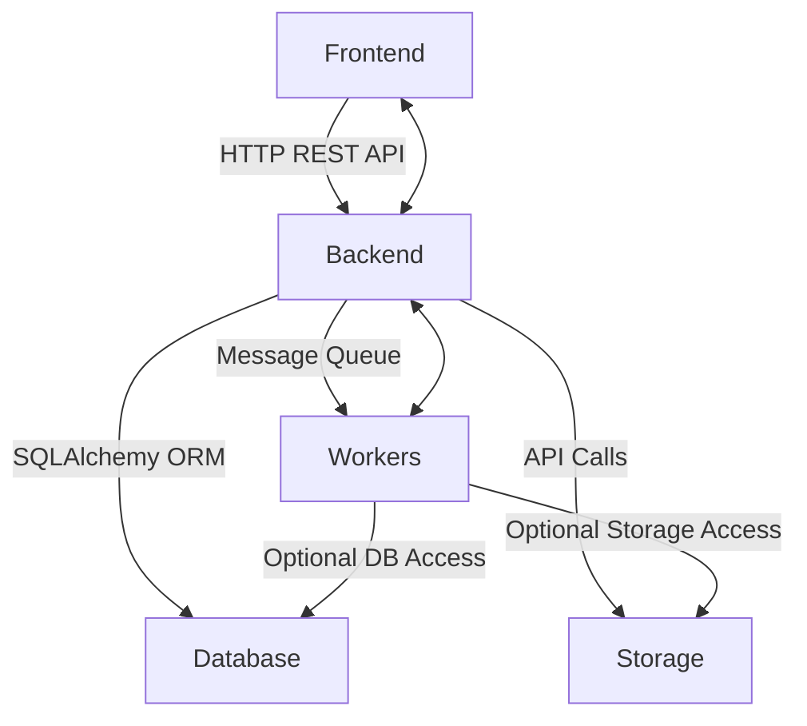
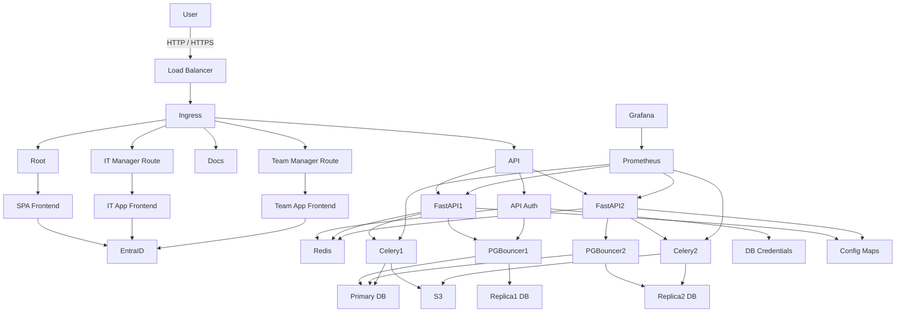

# Subsystem Map

- Basic communication between component



- Detailed mermaid graph



The system follows a layered architecture pattern with clear separation of concerns between different subsystems.

## Layer Dependencies

```
Frontend ↔ Backend ↔ Workers ↔ DB
                ↕
            Storage
```

Each layer communicates with adjacent layers through well-defined interfaces:

- Frontend communicates with Backend via HTTP REST APIs
- Backend communicates with Workers via message queues
- Backend communicates with Database via SQLAlchemy ORM
- Backend communicates with Storage via direct API calls
- Workers may communicate with Database and Storage as needed

For implementation details, see:

- [Frontend Documentation](../frontend/index.md)
- [Backend Documentation](../backend/index.md)
- [Database Documentation](../database/index.md)
- [Storage Documentation](../backend/architecture.md)
