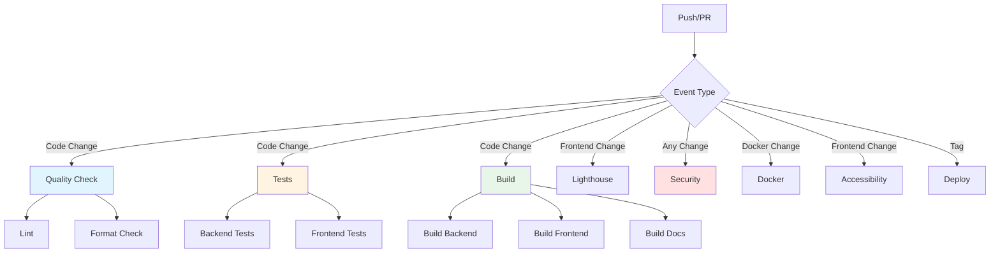

# CI/CD Workflows

This document describes the comprehensive CI/CD pipeline for the CO2 Calculator project.

## Workflow Overview



## Workflows

### 1. Quality Check (`quality-check.yml`)

**Trigger:** Push/PR to main or dev  
**Purpose:** Code quality enforcement

- ✅ ESLint for JavaScript/TypeScript
- ✅ Prettier format checking
- ✅ Ruff for Python
- ✅ Runs lefthook pre-commit hooks

**Commands:**

```bash
make lint
make format-check
```

### 2. Tests (`test.yml`)

**Trigger:** Push/PR to main or dev  
**Purpose:** Unit and integration testing

**Backend:**

- Python tests with pytest
- Coverage reports to Codecov

**Frontend:**

- JavaScript/TypeScript tests
- Coverage reports to Codecov

**Commands:**

```bash
make test
make test-backend
make test-frontend
```

### 3. Build (`build.yml`)

**Trigger:** Push/PR to main or dev  
**Purpose:** Verify builds succeed

- Backend build verification
- Frontend production build
- Documentation build
- Artifacts uploaded for 7 days

**Commands:**

```bash
make build
make build-backend
make build-frontend
make build-docs
```

### 4. Security (`security.yml`)

**Trigger:** Push/PR to main or dev + Weekly schedule  
**Purpose:** Security vulnerability scanning

**Checks:**

- 🔒 Dependency Review (PRs only)
- 🔒 NPM Audit (root + frontend)
- 🔒 Python Security (Safety + Bandit)
- 🔒 CodeQL Analysis (JS + Python)
- 🔒 Secrets Scanning (TruffleHog)

**Setup Required:**

```bash
# Add to pyproject.toml [tool.uv.dev-dependencies]
safety = ">=3.0.0"
bandit = ">=1.7.0"
```

### 5. Lighthouse CI (`lighthouse.yml`)

**Trigger:** PR with frontend changes  
**Purpose:** Performance, accessibility, SEO audits

**Metrics:**

- ⚡ Performance (min 80%)
- ♿ Accessibility (min 90%)
- ✅ Best Practices (min 90%)
- 🔍 SEO (min 90%)

**Configuration:** `.lighthouserc.json`

### 6. Docker (`docker.yml`)

**Trigger:** Push/PR with Docker changes + tags  
**Purpose:** Container image building and testing

- Builds backend and frontend images
- Pushes to GitHub Container Registry
- Tests docker-compose configuration

**Commands:**

```bash
make up
make down
make ps
```

### 7. Accessibility (`accessibility.yml`)

**Trigger:** PR with frontend changes  
**Purpose:** WCAG compliance testing

- Pa11y automated tests
- Axe accessibility checks
- Ensures compliance with accessibility standards

### 8. Deploy (`deploy.yml`)

**Trigger:** Push to dev or tags  
**Purpose:** Automated deployment

Uses EPFL-ENAC deployment action for:

- Dev environment (push to dev)
- Production (tags v*.*.\*)

### 9. Deploy MkDocs (`deploy-mkdocs.yml`)

**Trigger:** Push to main  
**Purpose:** Documentation deployment

Builds and deploys documentation to GitHub Pages.

### 10. Release Please (`release-please.yml`)

**Trigger:** Push to main  
**Purpose:** Automated release management

- Creates/updates release PR
- Generates changelogs
- Creates GitHub releases

## Workflow Status Badges

Add these to your README.md:

```markdown
[](https://github.com/EPFL-ENAC/epfl-calculator-co2/actions/workflows/quality-check.yml)
[](https://github.com/EPFL-ENAC/epfl-calculator-co2/actions/workflows/test.yml)
[](https://github.com/EPFL-ENAC/epfl-calculator-co2/actions/workflows/security.yml)
[](https://github.com/EPFL-ENAC/epfl-calculator-co2/actions/workflows/build.yml)
```

## Required Secrets

### GitHub Secrets

- `MY_RELEASE_PLEASE_TOKEN` - For release-please workflow
- `CD_TOKEN` - For deployment workflow
- `GITHUB_TOKEN` - Auto-provided by GitHub Actions

### Optional Integrations

- **Codecov**: Add `CODECOV_TOKEN` for private repos
- **Lighthouse CI Server**: Configure LHCI server URL

## Manual Setup Tasks

1. **Enable CodeQL**

   - Go to Settings → Code security and analysis
   - Enable "CodeQL analysis"

2. **Configure Branch Protection**

   - Require status checks to pass
   - Require review before merging
   - Include:
     - Quality Check
     - Tests
     - Build
     - Security

3. **Install Python Security Tools**

   ```bash
   cd backend
   uv add --dev safety bandit pytest-cov
   ```

4. **Configure Codecov** (optional)

   - Sign up at codecov.io
   - Add repository
   - Copy token to GitHub secrets

5. **Configure Lighthouse CI Server** (optional)
   - Self-host or use managed service
   - Update `.lighthouserc.json`

## Workflow Optimization

### Parallel Execution

Most workflows run in parallel to minimize CI time:

- Quality checks and tests run simultaneously
- Backend and frontend builds are independent
- Security scans run in parallel

### Caching Strategy

- NPM dependencies cached by Node.js action
- Docker layers cached with GitHub Actions cache
- Python packages managed by uv

### Cost Optimization

- Use `paths` filters to avoid unnecessary runs
- Schedule security scans weekly instead of on every push
- Use `continue-on-error` for non-blocking checks

## Local Testing

Before pushing, run the same checks locally:

```bash
# Quality checks
make lint
make format-check

# Tests
make test

# Build
make build

# Full CI simulation
make ci
```

## Troubleshooting

### Common Issues

1. **NPM audit failures**: Review and fix or add exceptions
2. **Lighthouse timeouts**: Increase timeout in config
3. **CodeQL errors**: Check language matrix configuration
4. **Docker build failures**: Verify Dockerfile paths

### Debug Mode

Enable workflow debugging:

```bash
# Set these secrets in repository settings
ACTIONS_RUNNER_DEBUG = true
ACTIONS_STEP_DEBUG = true
```

## Future Enhancements

Potential additions:

- 🎯 E2E tests with Playwright/Cypress
- 📊 Bundle size tracking
- 🔄 Visual regression testing
- 🌐 Cross-browser testing
- 📱 Mobile app testing (if applicable)
- 🐳 Container vulnerability scanning (Trivy)
- 📈 Performance regression detection
