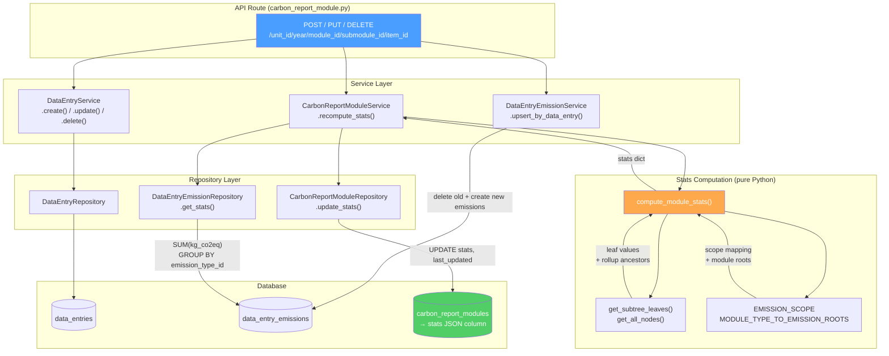

# Carbon Report Module — Stats Column Population

## Context

The `carbon_report_modules` table has a `stats` JSON column that was never populated. Every time the frontend needs emission breakdowns or scope totals for a module, it triggers live aggregation queries across `data_entry_emissions` → `data_entries` → `carbon_report_modules`. As data grows, these queries become expensive.

**Goal:** Populate the `stats` column automatically whenever a data entry is created, updated, or deleted. The stats contain scope totals, a full emission-type breakdown (leaves + rollup ancestors), and data quality signals — making frontend reads a single `SELECT stats FROM carbon_report_modules WHERE id = ?`.

---

## Stats Shape

```json
{
  "scope1": 150.0,
  "scope2": 5678.9,
  "scope3": 9012.3,
  "total": 14841.2,
  "by_emission_type": {
    "60000": 6498.1,
    "60100": 1469.1,
    "60101": 123.4,
    "60102": 456.7,
    "60104": 789.0,
    "60105": 100.0,
    "60200": 50.0
  },
  "computed_at": "2026-03-01T12:00:00Z",
  "entry_count": 42
}
```

- `by_emission_type` includes **all nodes** in the module's EmissionType subtree — both leaves (actual DB values) and rollup ancestors (computed in Python).
- Zero values are omitted.
- Scope totals are derived from leaf values using the existing `EMISSION_SCOPE` mapping.
- `entry_count` is the number of `data_entries` under this module.

---

## Architecture

### Key Insight

The `EmissionType` enum already encodes a tree structure via its 6-digit positional scheme (`XX YY ZZ`). The existing `parent`, `level`, and `children()` helpers make rollup computation trivial in Python — no extra DB queries needed.

### Data Flow



---

## Implementation

### Phase 1 — Pure helpers (no DB)

**File:** `app/models/data_entry_emission.py`

Added two module-level functions:

- `get_subtree_leaves(root: EmissionType) -> list[int]` — recursively collects only leaf `value`s under a node.
- `get_all_nodes(root: EmissionType) -> list[EmissionType]` — collects all nodes (root + intermediates + leaves) under a node.

**File:** `app/models/module_type.py`

Added `MODULE_TYPE_TO_EMISSION_ROOTS: dict[ModuleTypeEnum, list[EmissionType]]` mapping each module type to its EmissionType root(s):

| Module Type                    | Emission Roots                                          |
| ------------------------------ | ------------------------------------------------------- |
| headcount                      | `[food, waste, commuting, grey_energy]` (4 flat leaves) |
| professional_travel            | `[professional_travel]`                                 |
| buildings                      | `[buildings]`                                           |
| equipment_electric_consumption | `[equipment]`                                           |
| purchase                       | `[purchases]`                                           |
| process_emissions              | `[process_emissions]`                                   |
| external_cloud_and_ai          | `[external]`                                            |

`global_energy` and `internal_services` have no emission type mapping and are skipped.

### Phase 2 — Stats computation

**File:** `app/services/carbon_report_module_service.py`

Added `compute_module_stats(leaf_emissions, emission_roots, entry_count) -> dict` — a pure function that:

1. Takes leaf-level emissions from the existing `DataEntryEmissionRepository.get_stats()` query.
2. Populates `by_emission_type` with leaf values.
3. Computes rollup values for every non-leaf node by summing its subtree leaves.
4. Computes scope totals using the existing `EMISSION_SCOPE` dict.
5. Returns the full stats dict with `scope1/2/3`, `total`, `by_emission_type`, `computed_at`, `entry_count`.

### Phase 3 — Repository & Service

**File:** `app/repositories/carbon_report_module_repo.py`

Added `update_stats(carbon_report_module_id: int, stats: dict) -> None` — persists the stats JSON on the module row.

**File:** `app/services/carbon_report_module_service.py`

Added `recompute_stats(carbon_report_module_id: int) -> None`:

1. Fetches the module to get `module_type_id`.
2. Looks up emission roots from `MODULE_TYPE_TO_EMISSION_ROOTS`; skips if no mapping.
3. Fetches leaf emissions via existing `DataEntryEmissionRepository.get_stats()`.
4. Counts data entries for this module.
5. Calls `compute_module_stats()` → `repo.update_stats()`.

### Phase 4 — Route hooks

**File:** `app/api/v1/carbon_report_module.py`

Hooked `CarbonReportModuleService(db).recompute_stats(carbon_report_module_id)` into three routes, after emission upsert and before `db.commit()`:

- **Create** (~L443): after `DataEntryEmissionService.upsert_by_data_entry()`.
- **Update** (~L613): after `DataEntryEmissionService.upsert_by_data_entry()`.
- **Delete** (~L670): after `DataEntryService.delete()`. Resolves `carbon_report_module_id` from route params before deletion (emissions cascade-delete with the entry).

---

## Verification

Smoke-tested with mock data:

| Module    | Input                                                                                                        | Result                                                                         |
| --------- | ------------------------------------------------------------------------------------------------------------ | ------------------------------------------------------------------------------ |
| Buildings | 5 leaf emissions (lighting 123.4, cooling 456.7, heating_elec 789.0, heating_thermal 100.0, combustion 50.0) | scope1=150.0, scope2=1369.1, total=1519.1, rollups: 60100=1469.1, 60000=1519.1 |
| Headcount | 4 flat leaves (food 336.0, waste 50.0, commuting 200.0, grey_energy 100.0)                                   | scope3=686.0, total=686.0, 4 entries in by_emission_type                       |

All 653 existing unit tests pass with no regressions.

---

## Future Work

- **Bulk ingestion hooks**: CSV imports bypass the route layer. `recompute_stats` should be called once per module after bulk operations in ingestion tasks.
- **`formula_version`**: Could be sourced from the most recent emission's `formula_version` field or from a build config. Omitted for v1.
- **`missing_factors`**: Count of data entries with no emission rows (LEFT JOIN query). Omitted for v1.
- **Frontend consumption**: Replace live aggregation calls with reads from `stats` column where applicable.
