# Backend Architecture Overview

## Complete System Architecture

```mermaid
graph TB
    subgraph Client["Client Layer"]
        FE[Vue 3 Application]
        Browser[Web Browser]
    end

    subgraph Gateway["API Gateway / Reverse Proxy"]
        NGINX[Nginx]
    end

    subgraph Backend["Backend Services"]
        subgraph FastAPI["FastAPI Application"]
            subgraph Middleware["Middleware Layer"]
                CORS[CORS Handler]
                LOG[Request Logging]
                ERR[Error Handling]
            end

            subgraph Auth["Authentication & Authorization"]
                JWT[JWT Token Validator]
                OAUTH[OAuth2/OIDC Provider]
                POLICY[Policy Engine]
            end

            subgraph API["API Routes v1"]
                AUTH_R[auth.py]
                CR_R[carbon_report.py]
                CM_R[carbon_report_module.py]
                BACK_R[backoffice.py]
                FACT_R[factors.py]
                AUDIT_R[audit.py]
                SYNC_R[data_sync.py]
                FILES_R[files.py]
                LOC_R[locations.py]
                TAX_R[taxonomies.py]
                USER_R[users.py]
                UNIT_R[units.py]
            end

            subgraph Services["Business Logic Layer"]
                AUTH_S[AuthService]
                CR_S[CarbonReportService]
                CM_S[ModuleService]
                BACK_S[BackofficeService]
                FACT_S[FactorService]
                AUDIT_S[AuditService]
                SYNC_S[DataIngestionService]
                FILES_S[FileService]
                LOC_S[LocationService]
                DATA_S[DataEntryService]
                MODULE_H[ModuleHandlerService]
            end

            subgraph Handlers["Module Handlers"]
                HC[HeadcountHandler]
                HT[TravelHandler]
                HE[EquipmentHandler]
                HB[BuildingHandler]
                HP[PurchaseHandler]
                HCLOUD[CloudHandler]
                HAI[AIHandler]
                HPROC[ProcessHandler]
                HRES[ResearchHandler]
            end

            subgraph Repositories["Data Access Layer"]
                USER_REPO[UserRepository]
                UNIT_REPO[UnitRepository]
                CR_REPO[CarbonReportRepo]
                CM_REPO[CarbonReportModuleRepo]
                DATA_REPO[DataEntryRepo]
                FACT_REPO[FactorRepo]
                AUDIT_REPO[AuditRepo]
                INGEST_REPO[IngestionJobRepo]
                LOC_REPO[LocationRepo]
            end

            subgraph Providers["External Providers"]
                S3[S3 Storage Provider]
                OAUTH_P[OAuth Provider]
                FACTOR_P[Factor Data Provider]
            end
        end

        subgraph Tasks["Background Tasks"]
            CELERY[Celery Worker]
            INGEST_TASK[Ingestion Tasks]
            AUDIT_TASK[Audit Sync Tasks]
        end
    end

    subgraph Storage["Data Storage"]
        PG[(PostgreSQL Database)]
        S3_STORE[(S3 File Storage)]
        REDIS[(Redis Cache)]
    end

    subgraph Observability["Observability"]
        OTLP[OpenTelemetry Collector]
        LOKI[Loki Logging]
        PROM[Prometheus Metrics]
        GRAF[Grafana Dashboard]
    end

    Browser --> FE
    FE --> NGINX
    NGINX --> FastAPI

    Middleware --> Auth
    Auth --> API
    API --> Services
    Services --> Handlers
    Services --> Repositories
    Repositories --> PG
    Services --> Providers
    Providers --> S3_STORE

    Services --> Tasks
    Tasks --> PG
    Tasks --> S3_STORE

    FastAPI --> Observability
    Observability --> OTLP
    OTLP --> LOKI
    OTLP --> PROM
    PROM --> GRAF

    style Client fill:#e3f2fd
    style Gateway fill:#fff3e0
    style Backend fill:#f3e5f5
    style Storage fill:#e8f5e9
    style Observability fill:#fce4ec
    style FastAPI fill:#e1f5fe
    style API fill:#bbdefb
    style Services fill:#c8e6c9
    style Repositories fill:#ffe0b2
    style Handlers fill:#f0f4c3
```

## Data Flow by Feature

### 1. User Authentication Flow

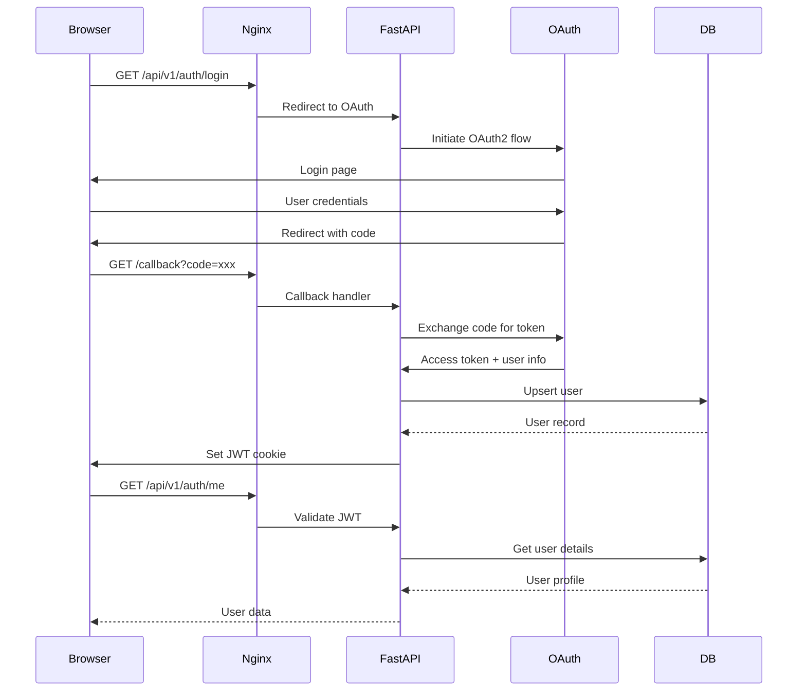

### 2. Carbon Report Creation Flow

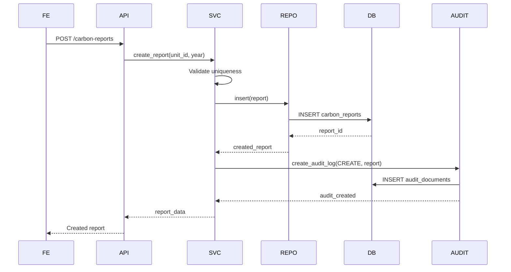

### 3. Module Data Entry Flow

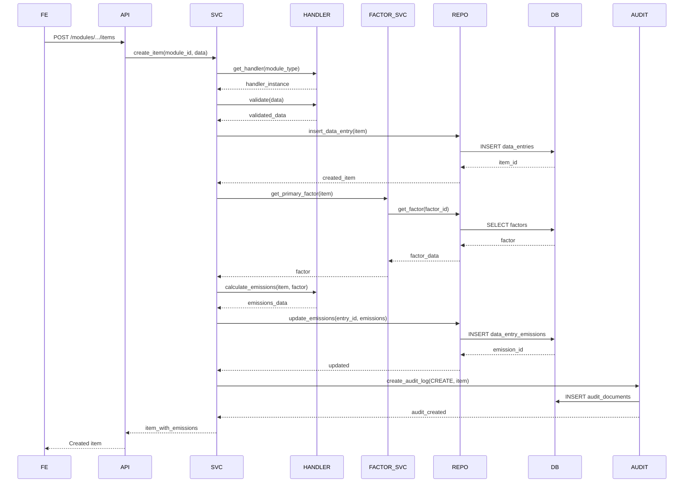

### 4. Factor Lookup Flow

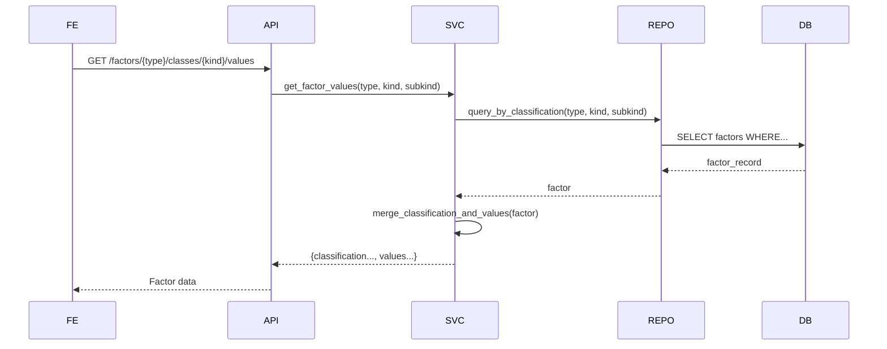

### 5. Backoffice Reporting Flow

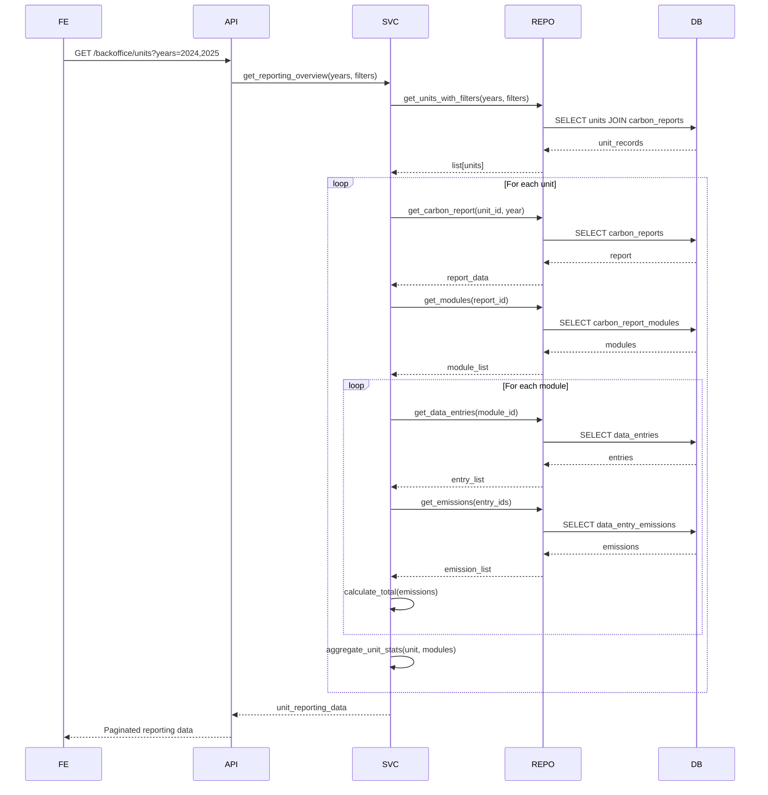

### 6. Data Ingestion Flow

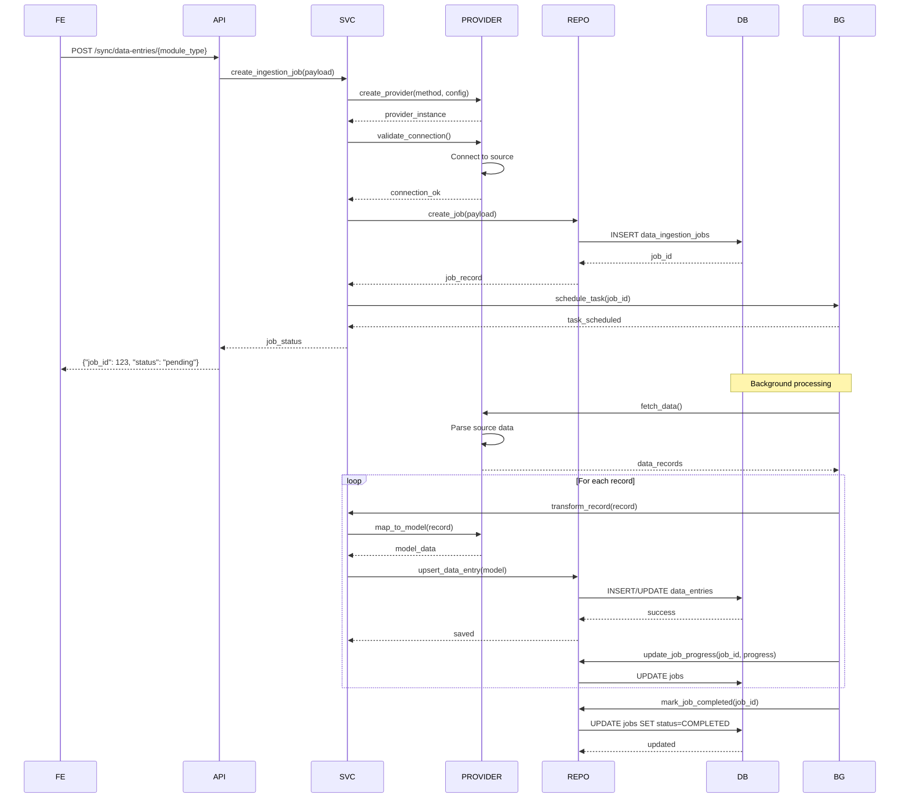

## Component Interaction Map

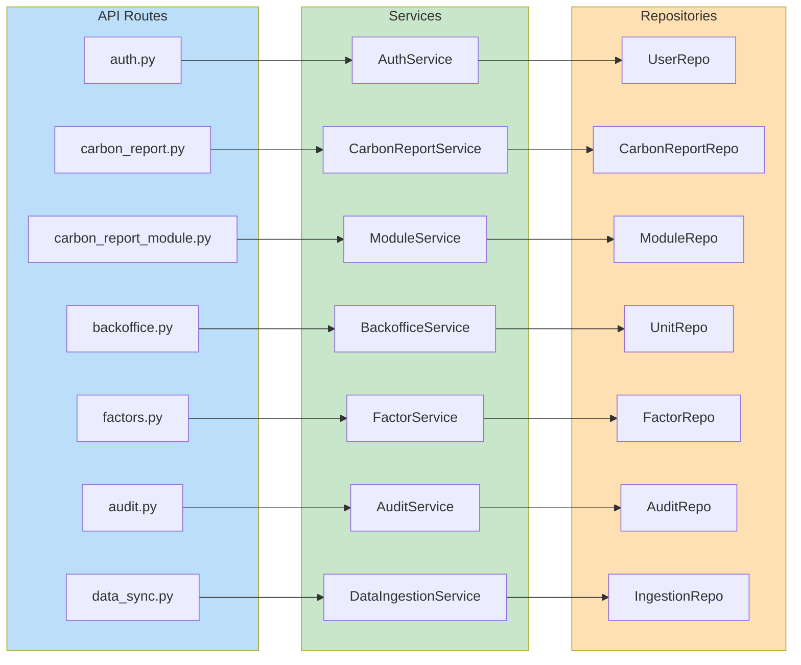

## Technology Stack

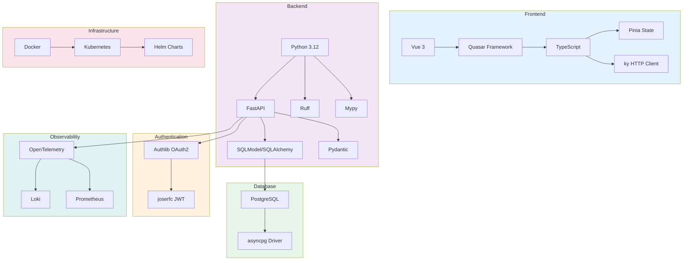

## Deployment Architecture

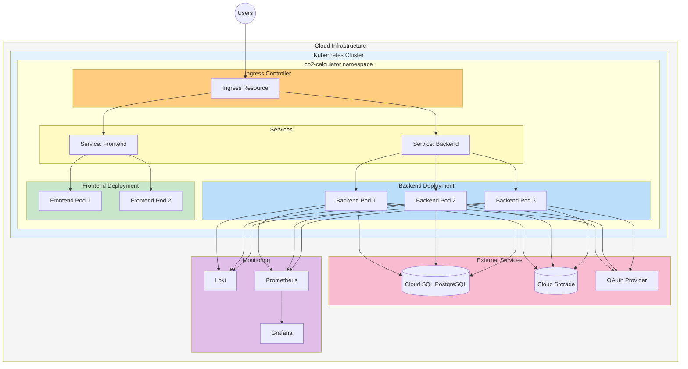

## Security Architecture

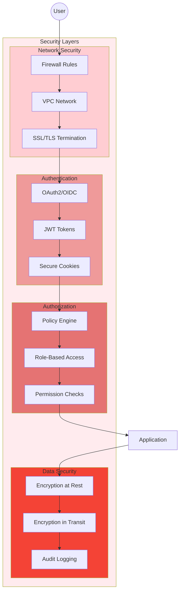
