# Backend Request Flow Diagrams

This document contains Mermaid diagrams illustrating the request flow from frontend to backend for major endpoint categories.

## 1. Authentication Flow

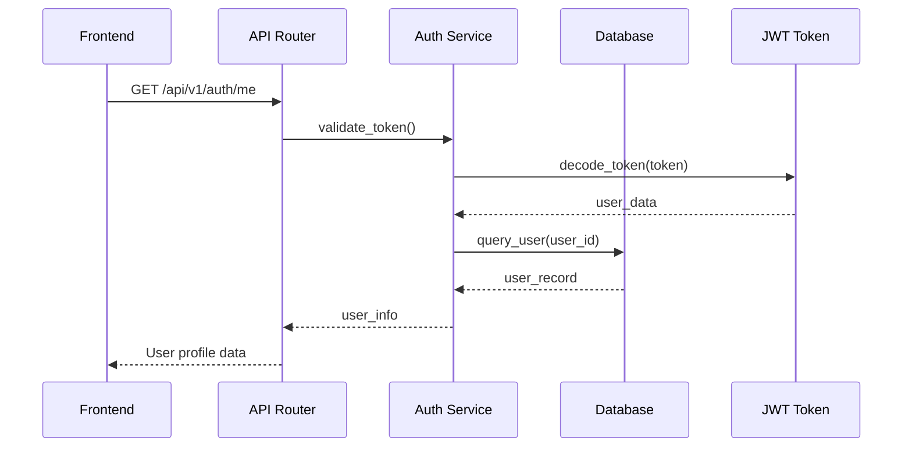

## 2. Carbon Reports Flow

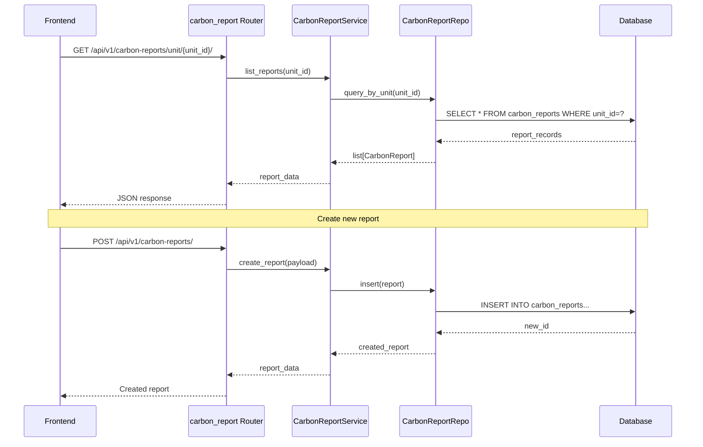

## 3. Modules Data Flow

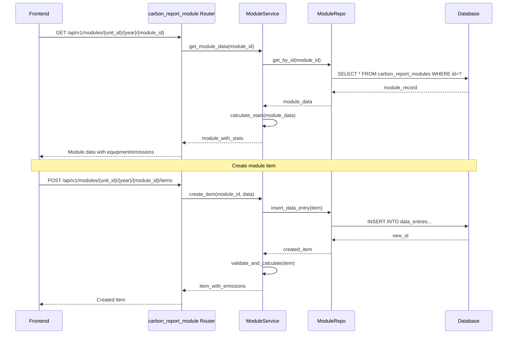

## 4. Factors Flow

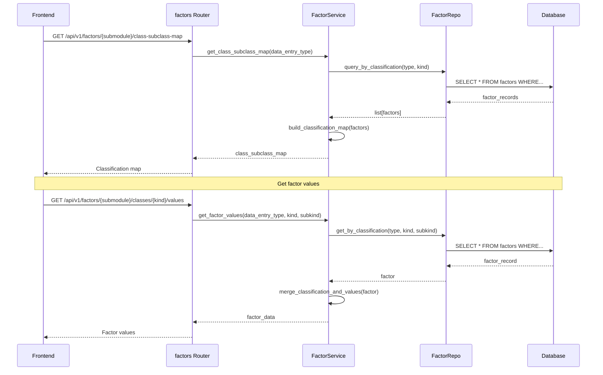

## 5. Backoffice Flow

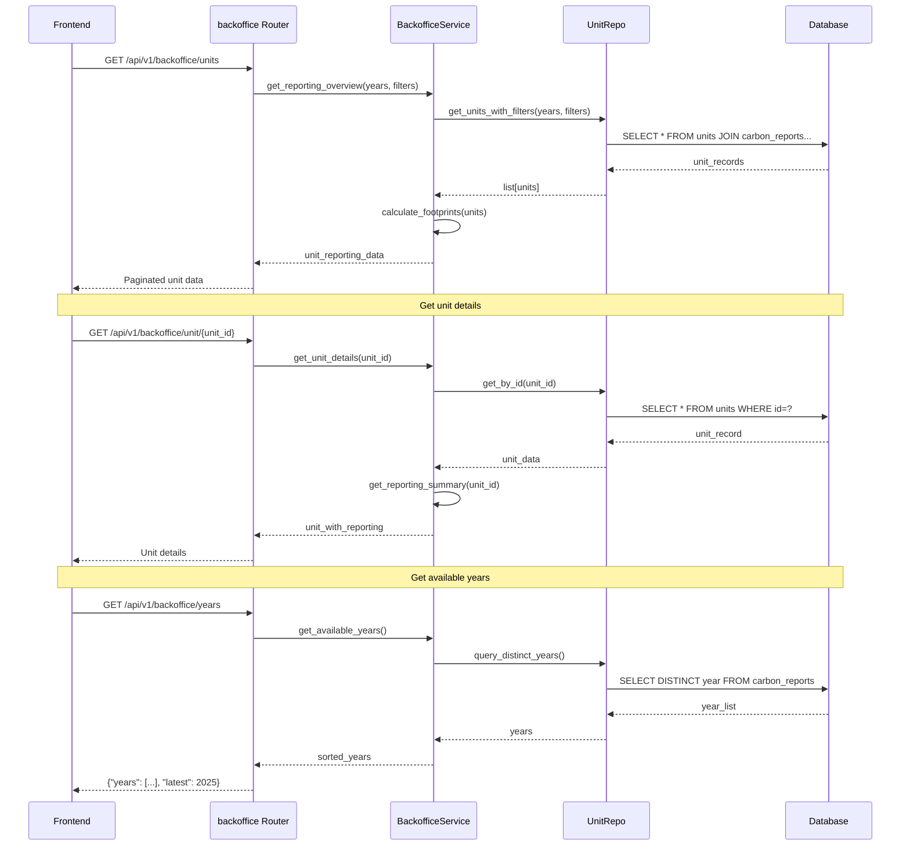

## 6. Audit Flow

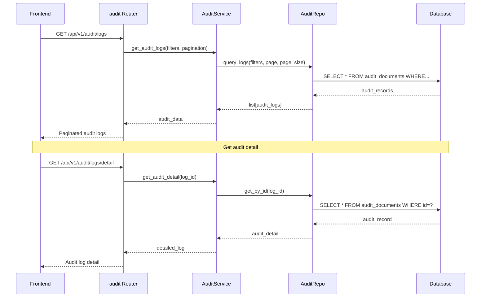

## 7. Data Sync Flow

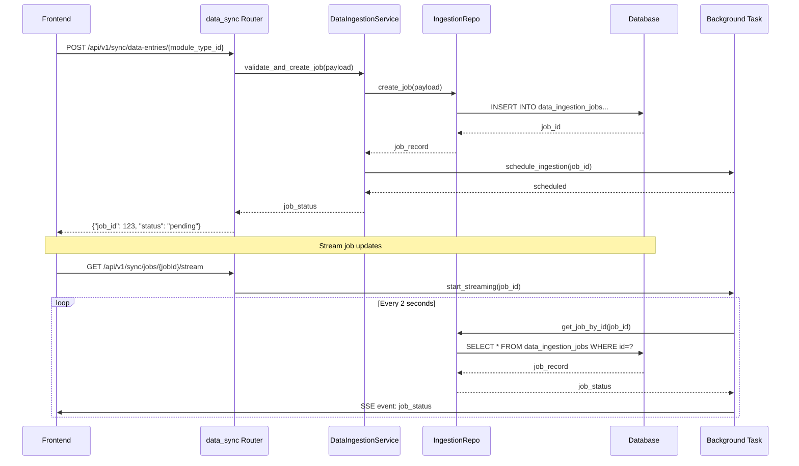

## 8. Files Flow

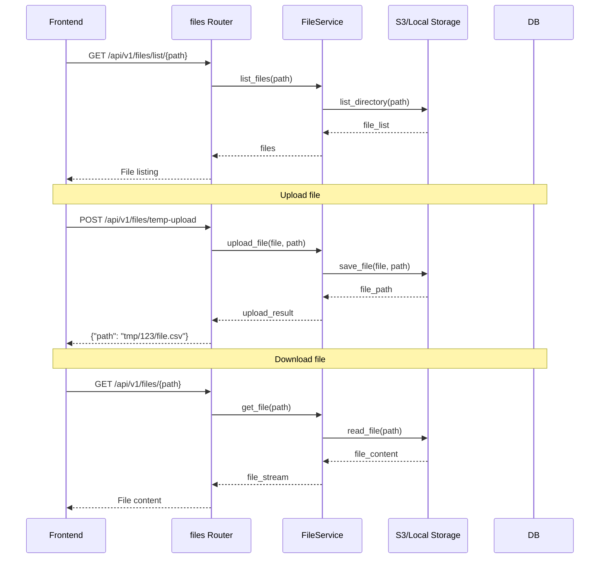

## 9. Architecture Layer Diagram

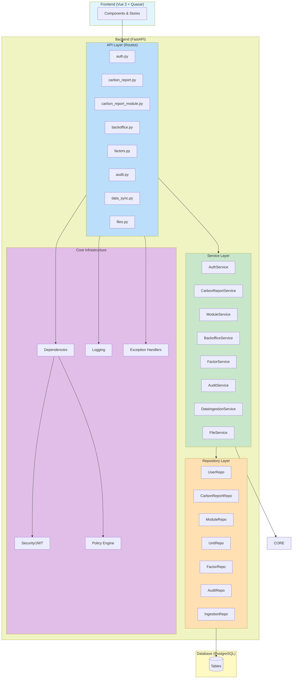

## 10. Request Processing Flow

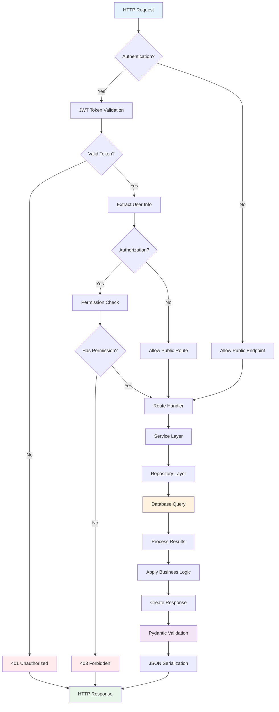

## 11. Module Data Flow (Detailed)

```mermaid
sequenceDiagram
    participant FE as Frontend
    participant API as Module Router
    participant SVC as ModuleHandlerService
    participant FACTOR_SVC as FactorService
    participant REPO as DataEntryRepo
    participant DB as Database

    Note over FE,DB: Get module items
    FE->>API: GET /api/v1/modules/{unit_id}/{year}/{module_id}/items
    API->>SVC: get_module_items(module_id, filters)
    SVC->>REPO: query_by_module(module_id, filters)
    REPO->>DB: SELECT * FROM data_entries WHERE module_id=?
    DB-->>REPO: item_records
    REPO-->>SVC: list[items]
    SVC->>SVC: enrich_with_factors(items)
    loop For each item
        SVC->>FACTOR_SVC: get_factor(factor_id)
        FACTOR_SVC->>REPO: get_factor_by_id(factor_id)
        REPO->>DB: SELECT * FROM factors WHERE id=?
        DB-->>REPO: factor
        REPO-->>FACTOR_SVC: factor_data
        FACTOR_SVC-->>SVC: factor
        SVC->>SVC: calculate_emissions(item, factor)
    end
    SVC-->>API: items_with_emissions
    API-->>FE: Module items

    Note over FE,DB: Update item
    FE->>API: PATCH /api/v1/modules/{unit_id}/{year}/{module_id}/items/{item_id}
    API->>SVC: update_item(item_id, payload)
    SVC->>SVC: validate_update(payload)
    SVC->>REPO: update(item_id, data)
    REPO->>DB: UPDATE data_entries SET...
    DB-->>REPO: updated
    REPO-->>SVC: updated_item
    SVC->>SVC: recalculate_emissions(item)
    SVC->>FACTOR_SVC: get_primary_factor(item)
    FACTOR_SVC-->>SVC: factor
    SVC->>SVC: compute_new_emissions(item, factor)
    SVC-->>API: updated_item_with_emissions
    API-->>FE: Updated item
```

## 12. Audit Trail Creation Flow

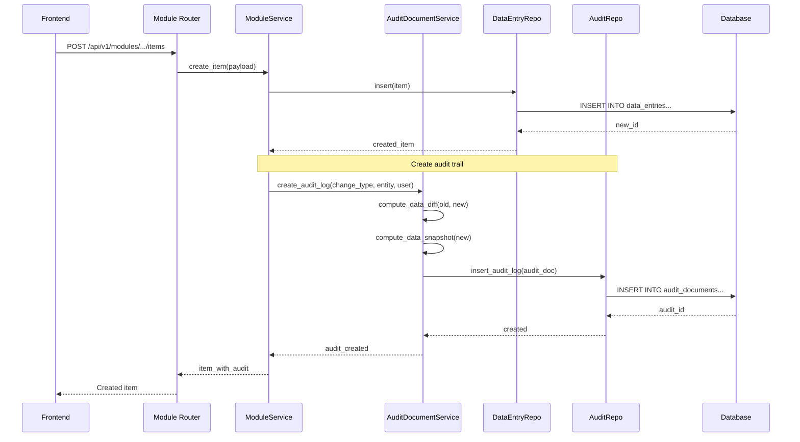

## Notes

### Legend

- **FE**: Frontend (Vue 3 + Quasar)
- **API**: FastAPI Route Handler
- **SVC**: Service Layer (Business Logic)
- **REPO**: Repository Layer (Data Access)
- **DB**: PostgreSQL Database
- **BG**: Background Task Processor
- **STORAGE**: S3 or Local File Storage

### Key Patterns

1. **Three-Layer Architecture**: Routes → Services → Repositories
2. **Dependency Injection**: All dependencies injected via FastAPI Depends
3. **Async/Await**: All database operations are asynchronous
4. **Audit Trail**: All mutations create audit documents
5. **Permission-Based Authorization**: Checked before route handler execution
6. **Pydantic Validation**: Request/response validation at API boundary

### Frontend API Client

- **Library**: `ky` (HTTP client)
- **Base URL**: `/api/v1/`
- **Authentication**: JWT tokens in cookies
- **Error Handling**: Automatic refresh on 401, redirect on session expiry
