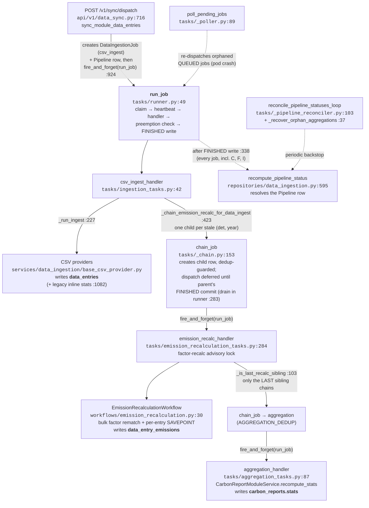
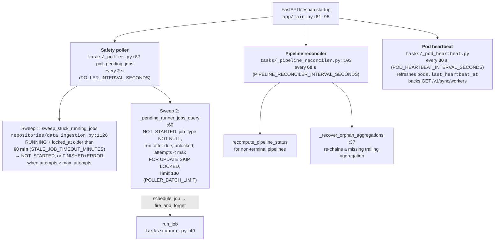
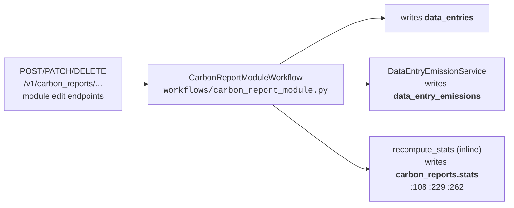

# ADR-016: Two-Path Pipeline Principle (Interactive vs Bulk)

**Status**: Accepted (principle); ownership split delivered except one legacy inline stats writer — see "Current state" below
**Date**: 2026-05-05
**Deciders**: Backend Team
**Related**: [ADR-010: Background Job Processing](./010-background-job-processing.md); plan `docs/src/implementation-plans/310-d-pipeline-responsibility-split.md`

## Context

The CO2 calculator serves two user paths with fundamentally
different latency expectations:

- **Path 1 — Interactive UI**: standard and principal users edit
  modules through `POST/PATCH/DELETE /v1/carbon_reports/...`. Users
  expect instant visual feedback (<200ms typical).
- **Path 2 — Bulk operator**: principal users and backoffice métier
  upload CSVs, sync factors, sync units. Operators expect minutes,
  not milliseconds; SSE streams progress.

Earlier code mixed both paths through the same write functions.
Bulk CSV ingest computed emissions inside the ingest transaction;
factor recalculation also wrote `data_entry_emissions`; both called
`recompute_stats` writing `carbon_reports`. Two concurrent bulk
pipelines for different modules raced on the same tables.

## Decision

Codify a **two-path principle** with distinct write strategies per
path:

| Path               | Trigger                       | Write strategy      |
| ------------------ | ----------------------------- | ------------------- |
| 1 — Interactive UI | UI module edit endpoints      | Inline, synchronous |
| 2 — Bulk operator  | `/sync/dispatch`, `/sync/...` | Async chained jobs  |

Each table should have **exactly one writer per path**. The target
ownership map:

| Table                  | Path 2 writer (target)           | Path 1 writer (unchanged)    |
| ---------------------- | -------------------------------- | ---------------------------- |
| `data_entries`         | `csv_ingest` / `api_ingest` jobs | `CarbonReportModuleWorkflow` |
| `data_entry_emissions` | `emission_recalc` job            | `CarbonReportModuleWorkflow` |
| `carbon_reports.stats` | `aggregation` job                | `CarbonReportModuleWorkflow` |

Path 2 chain (per module), once fully delivered:

```
csv_ingest  →  emission_recalc  →  aggregation
```

Aggregation jobs dedupe per `(module_type_id, year)` so N parallel
recalcs collapse to one stats refresh.

Path 1 keeps inline writes. Single-row request scope serializes its
writes naturally; this is a deliberate UX choice, not a violation.

See `docs/src/implementation-plans/310-d-pipeline-responsibility-split.md`.

### Current state

The single-writer split is **delivered for the recalc chain, with one
legacy inline writer left in CSV ingest**:

- The dedicated `aggregation` job exists
  (`backend/app/tasks/aggregation_tasks.py:87`,
  `@register("aggregation")`) and is the bulk-path writer of
  `carbon_reports.stats`. Both recalc handlers chain it
  (coalesced to one trailing job per pipeline — see the code-flow
  diagram below); `EmissionRecalculationWorkflow` no longer calls
  `recompute_stats` itself.
- `backend/app/services/data_ingestion/base_csv_provider.py:1279` —
  bulk CSV ingest still invokes `_recompute_module_stats()` inline
  before the recalc chain takes over. This is the remaining
  second writer on `carbon_reports.stats` in Path 2; harmless
  (the trailing aggregation overwrites it) but redundant work.

Aggregation jobs are identified by `job_type="aggregation"` (runner
registry), not a `TargetType` value — `TargetType` has no
`AGGREGATION` member and doesn't need one.

## Code flow

### Path 2 — CSV upload, file by file



Every job — ingest, recalc, aggregation — runs through the same
`run_job` runner; handlers are looked up via `@register("<job_type>")`
in `tasks/registry.py`. The runner, not the handlers, answers "who
resolves the pipeline": after each FINISHED write it calls
`recompute_pipeline_status`, so the pipeline flips to done when its
last child (normally the trailing aggregation) finishes. The
reconciler loop and the poller are crash/race backstops only.

Progress reaches the UI via SSE: `GET /v1/sync/jobs/{job_id}/stream`
(`api/v1/data_sync.py:1318`) streams job state; per-pipeline progress
is derived read-side by `compute_pipeline_progress`
(`services/pipeline_progress.py:120`) from the job rows.

### Background loops — poller, reconciler, heartbeat

Path 2's primary dispatch is in-process `fire_and_forget(run_job)` —
no loop involved. Three lifespan-managed loops (started in
`main.py`'s lifespan context, each gated by a `RUN_*` setting) cover
the failure modes:



Intervals and limits (defaults from `app/core/config.py`):

| Loop                | Interval                                | Limit / threshold                                                  | Off switch                |
| ------------------- | --------------------------------------- | ------------------------------------------------------------------ | ------------------------- |
| Safety poller       | 2 s (`POLLER_INTERVAL_SECONDS`, `ge=1`) | 100 jobs per sweep (`POLLER_BATCH_LIMIT`); stale-RUNNING at 60 min | `RUN_BACKGROUND_POLLER`   |
| Pipeline reconciler | 60 s (`ge=10`)                          | commits per pipeline                                               | `RUN_PIPELINE_RECONCILER` |
| Pod heartbeat       | 30 s (`ge=5`)                           | pod counts live within 2× interval                                 | `RUN_POD_HEARTBEAT`       |

Why a 2 s cadence is safe: each sweep is one `SELECT … FOR UPDATE
SKIP LOCKED LIMIT 100` — multi-pod deployments don't double-dispatch
(skip-locked) and an idle system costs one cheap indexed query per
pod per interval. The 60-min stale threshold must stay above the
longest plausible job runtime; below it, the sweep would preempt a
still-working pod and duplicate processing.

The poller never drives the happy path. A healthy upload flows
entirely through endpoint → `fire_and_forget` → `run_job` →
`chain_job` deferred dispatches; the poller only catches jobs whose
in-process Task died between the row commit and the runner claim
(pod crash, restart mid-deploy).

### Path 1 — interactive module edit



One request, one transaction, all three tables written synchronously —
no jobs, no pipeline row, no SSE. The user's spinner _is_ the
progress indicator.

## Consequences

**Positive**:

- Bulk-path race conditions on `data_entry_emissions` and
  `carbon_reports.stats` are eliminated by ownership, not locking.
- Long-running emission compute no longer holds ingest transaction
  locks; ingest commits fast and chains the recalc.
- Frontend UX explicit: per-module "Recalculating..." badge while
  Path 2 chains run.

**Negative**:

- Two write paths to maintain. Tests must cover both.
- New contributors must learn which path their change belongs to;
  the rule "is the user staring at a spinner?" decides — yes is
  Path 1, no is Path 2.

**Future work**: batched ingest (1k–5k rows) is deferred until
Path 2's job-split lands and lock duration becomes the bottleneck.

## References

- `docs/src/implementation-plans/310-d-pipeline-responsibility-split.md`
- `docs/src/implementation-plans/310-overview.md`
