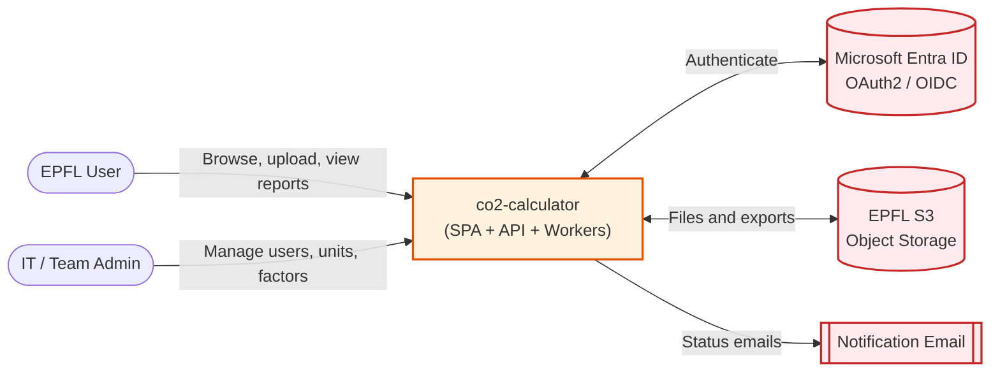
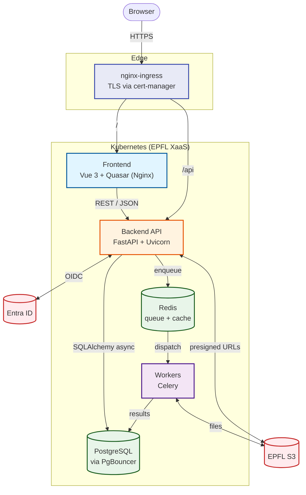
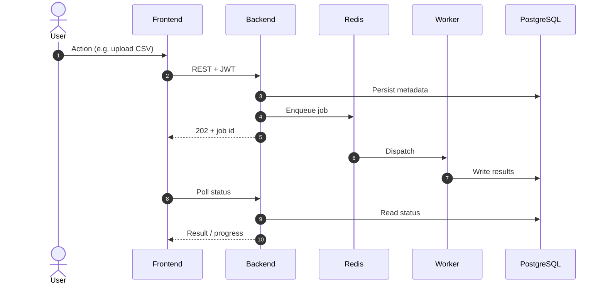

# System Overview

This page gives a C4-style **context** and **container** view of the
co2-calculator. It answers: *who uses it, what it depends on, and which
deployable units make it up.*

For deeper detail, jump to:

- [Subsystem Map](./03-subsystem-map.md) — internal component graph
- [Data Flow](./10-data-flow.md) — request and upload sequences
- [Tech Stack](./08-tech-stack.md) — frameworks and versions
- [Deployment Topology](./11-deployment-topology.md) — Kubernetes layout

---

## System Context

Actors and external dependencies surrounding the system.

```mermaid
flowchart LR
    User([EPFL User])
    Admin([IT / Team Admin])
    System["co2-calculator<br/>(SPA + API + Workers)"]
    Entra[(Microsoft Entra ID<br/>OAuth2 / OIDC)]
    S3[(EPFL S3<br/>Object Storage)]
    Mail[[Notification Email]]

    User -->|Browse, upload, view reports| System
    Admin -->|Manage users, units, factors| System
    System <-->|Authenticate| Entra
    System <-->|Files and exports| S3
    System -->|Status emails| Mail

    classDef system fill:#fff3e0,stroke:#e65100,stroke-width:2px
    classDef ext fill:#ffebee,stroke:#c62828,stroke-width:2px
    class System system
    class Entra,S3,Mail ext
```

**Boundaries.** The system owns its data (PostgreSQL) and queues
(Redis). Identity is delegated to Entra ID. File blobs live in EPFL S3.
Everything else is internal.

---

## Containers

Deployable units inside the Kubernetes cluster and their main
collaborators.

```mermaid
flowchart TB
    Browser([Browser])

    subgraph Edge["Edge"]
        Ingress[nginx-ingress<br/>TLS via cert-manager]
    end

    subgraph K8s["Kubernetes (EPFL XaaS)"]
        FE["Frontend<br/>Vue 3 + Quasar (Nginx)"]
        BE["Backend API<br/>FastAPI + Uvicorn"]
        WK["Workers<br/>Celery"]
        Redis[(Redis<br/>queue + cache)]
        PG[(PostgreSQL<br/>via PgBouncer)]
    end

    Entra[(Entra ID)]
    S3[(EPFL S3)]

    Browser -->|HTTPS| Ingress
    Ingress -->|/| FE
    Ingress -->|/api| BE
    FE -->|REST / JSON| BE
    BE <-->|OIDC| Entra
    BE -->|SQLAlchemy async| PG
    BE -->|enqueue| Redis
    BE <-->|presigned URLs| S3
    Redis -->|dispatch| WK
    WK -->|results| PG
    WK <-->|files| S3

    classDef fe fill:#e1f5ff,stroke:#01579b,stroke-width:2px
    classDef be fill:#fff3e0,stroke:#e65100,stroke-width:2px
    classDef wk fill:#f3e5f5,stroke:#4a148c,stroke-width:2px
    classDef data fill:#e8f5e9,stroke:#1b5e20,stroke-width:2px
    classDef ext fill:#ffebee,stroke:#c62828,stroke-width:2px
    classDef edge fill:#e8eaf6,stroke:#3949ab,stroke-width:2px

    class FE fe
    class BE be
    class WK wk
    class Redis,PG data
    class Entra,S3 ext
    class Ingress edge
```

### Container responsibilities

| Container       | Role                                                     |
| --------------- | -------------------------------------------------------- |
| **Frontend**    | Static SPA bundle, Quasar UI, calls Backend over REST.   |
| **Backend API** | Auth, business logic, persistence, presigned-URL broker. |
| **Workers**     | CPU-bound jobs: factor recalc, CSV ingest, exports.      |
| **Redis**       | Celery broker + short-lived caches.                      |
| **PostgreSQL**  | System of record, accessed via PgBouncer.                |

Stack and versions live in [Tech Stack](./08-tech-stack.md).

---

## Request Lifecycle (high level)

```mermaid
sequenceDiagram
    autonumber
    actor U as User
    participant FE as Frontend
    participant BE as Backend
    participant Q as Redis
    participant W as Worker
    participant DB as PostgreSQL

    U->>FE: Action (e.g. upload CSV)
    FE->>BE: REST + JWT
    BE->>DB: Persist metadata
    BE->>Q: Enqueue job
    BE-->>FE: 202 + job id
    Q->>W: Dispatch
    W->>DB: Write results
    FE->>BE: Poll status
    BE->>DB: Read status
    BE-->>FE: Result / progress
```

Detailed sequences (uploads, exports, auth) are in
[Data Flow](./10-data-flow.md) and [Auth Flow](./04-auth-flow.md).

---

## Cross-cutting

- **Identity.** JWT issued after Entra ID OIDC handshake — see
  [Auth Flow](./04-auth-flow.md).
- **Observability.** Prometheus scrapes Backend + PgBouncer; Grafana
  dashboards in cluster.
- **Config.** ConfigMaps + Secrets per environment — see
  [Environments](./05-environments.md).
- **Scaling.** Stateless API + workers scale via HPA — see
  [Scalability](./12-scalability.md).
