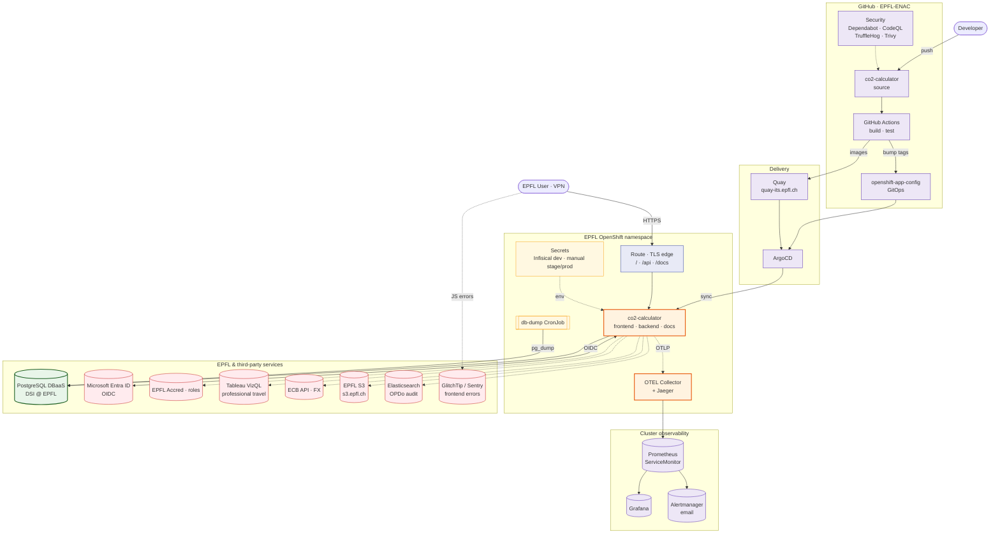
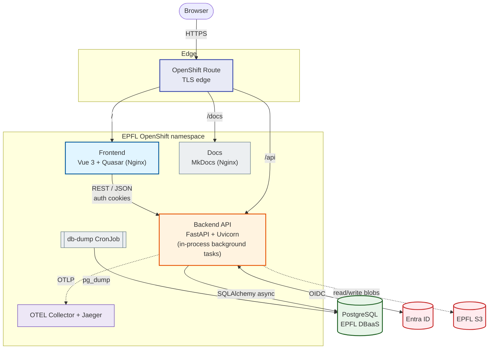
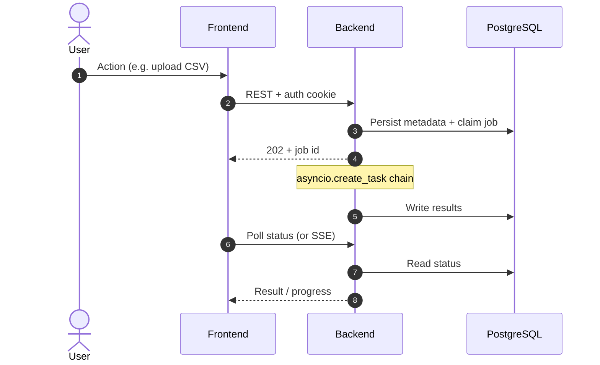

# System Overview

This page gives a C4-style **context** and **container** view of the
co2-calculator: _who uses it, what it depends on, how it is built and
shipped, and which deployable units make it up._

For deeper detail, jump to:

- [Subsystem Map](./03-subsystem-map.md) — internal component graph
- [Data Flow](./10-data-flow.md) — request and upload sequences
- [Tech Stack](./08-tech-stack.md) — frameworks and versions
- [Deployment Topology](./11-deployment-topology.md) — OpenShift layout

---

## System context & platform

Everything we use: source and CI/CD on GitHub, images to Quay, delivery
to EPFL OpenShift via ArgoCD, the in-cluster observability stack, and the
external services the app talks to at runtime.

```mermaid
flowchart TB
    Dev([Developer])
    User([EPFL User · VPN])

    subgraph GH["GitHub · EPFL-ENAC"]
        Src[co2-calculator<br/>source]
        Actions[GitHub Actions<br/>build · test]
        Sec[Security<br/>Dependabot · CodeQL<br/>TruffleHog · Trivy]
        GitOps[openshift-app-config<br/>GitOps]
    end

    subgraph CD["Delivery"]
        Quay[Quay<br/>quay-its.epfl.ch]
        Argo[ArgoCD]
    end

    subgraph OCP["EPFL OpenShift namespace"]
        Route[Route · TLS edge<br/>/ · /api · /docs]
        App[co2-calculator<br/>frontend · backend · docs]
        Otel[OTEL Collector<br/>+ Jaeger]
        DBDump[[db-dump CronJob]]
        Secrets[Secrets<br/>Infisical dev · manual stage/prod]
    end

    subgraph MON["Cluster observability"]
        Prom[(Prometheus<br/>ServiceMonitor)]
        Graf[(Grafana)]
        Alert[(Alertmanager<br/>email)]
    end

    subgraph SVC["EPFL & third-party services"]
        PG[(PostgreSQL DBaaS<br/>DSI @ EPFL)]
        Entra[(Microsoft Entra ID<br/>OIDC)]
        Accred[(EPFL Accred · roles)]
        Tableau[(Tableau VizQL<br/>professional travel)]
        ECB[(ECB API · FX)]
        S3[(EPFL S3<br/>s3.epfl.ch)]
        ES[(Elasticsearch<br/>OPDo audit)]
        Sentry[(GlitchTip / Sentry<br/>frontend errors)]
    end

    Dev -->|push| Src --> Actions
    Sec -.-> Src
    Actions -->|images| Quay
    Actions -->|bump tags| GitOps
    GitOps --> Argo
    Quay --> Argo
    Argo -->|sync| App

    User -->|HTTPS| Route --> App
    User -.->|JS errors| Sentry
    Secrets -.->|env| App

    App --> PG
    App <-->|OIDC| Entra
    App -.-> Accred
    App -.-> Tableau
    App -.-> ECB
    App -.-> S3
    App -.-> ES
    App -.->|OTLP| Otel
    Otel --> Prom
    Prom --> Graf
    Prom --> Alert
    DBDump -->|pg_dump| PG

    classDef ci fill:#ede7f6,stroke:#5e35b1,stroke-width:1px
    classDef system fill:#fff3e0,stroke:#e65100,stroke-width:2px
    classDef edge fill:#e8eaf6,stroke:#3949ab,stroke-width:1px
    classDef cfg fill:#fff8e1,stroke:#f9a825,stroke-width:1px
    classDef mon fill:#ede7f6,stroke:#5e35b1,stroke-width:1px
    classDef data fill:#e8f5e9,stroke:#1b5e20,stroke-width:2px
    classDef ext fill:#ffebee,stroke:#c62828,stroke-width:1px
    class Src,Actions,Sec,GitOps,Quay,Argo ci
    class App,Otel system
    class Route edge
    class Secrets,DBDump cfg
    class Prom,Graf,Alert mon
    class PG data
    class Entra,Accred,Tableau,ECB,S3,ES,Sentry ext
```

Solid arrows are always-on dependencies (managed PostgreSQL, Entra ID);
dotted arrows are integrations enabled per-environment through injected
secrets. The app is **not** publicly reachable — access is over the EPFL
network/VPN.

**Boundaries.** The system owns its data in a managed PostgreSQL (EPFL
DBaaS), which also holds the background-job queue table; a `db-dump`
CronJob backs it up to a PVC. Identity is delegated to Entra ID (OIDC).
File blobs live in EPFL S3 when configured. It is built by GitHub
Actions, published to Quay, and reconciled onto OpenShift by ArgoCD from
the `openshift-app-config` GitOps repo. The OTEL Collector, Jaeger and
the monitoring stack are also deployed via that GitOps repo.

> **Not in the stack** (despite older docs): PgBouncer, PostgreSQL
> replicas, Azure Blob Storage, Redis/Celery, a service mesh. Connection
> pooling and background jobs run in-process; see [ADR-010](../architecture-decision-records/010-background-job-processing.md).

---

## Containers

Deployable units inside the OpenShift namespace and their main
collaborators.

```mermaid
flowchart TB
    Browser([Browser])

    subgraph Edge["Edge"]
        Route[OpenShift Route<br/>TLS edge]
    end

    subgraph OCP["EPFL OpenShift namespace"]
        FE["Frontend<br/>Vue 3 + Quasar (Nginx)"]
        BE["Backend API<br/>FastAPI + Uvicorn<br/>(in-process background tasks)"]
        Docs["Docs<br/>MkDocs (Nginx)"]
        Otel["OTEL Collector + Jaeger"]
        DBDump[[db-dump CronJob]]
    end

    PG[(PostgreSQL<br/>EPFL DBaaS)]
    Entra[(Entra ID)]
    S3[(EPFL S3)]

    Browser -->|HTTPS| Route
    Route -->|/| FE
    Route -->|/api| BE
    Route -->|/docs| Docs
    FE -->|REST / JSON<br/>auth cookies| BE
    BE <-->|OIDC| Entra
    BE -->|SQLAlchemy async| PG
    BE -.->|read/write blobs| S3
    BE -.->|OTLP| Otel
    DBDump -->|pg_dump| PG

    classDef fe fill:#e1f5ff,stroke:#01579b,stroke-width:2px
    classDef be fill:#fff3e0,stroke:#e65100,stroke-width:2px
    classDef data fill:#e8f5e9,stroke:#1b5e20,stroke-width:2px
    classDef ext fill:#ffebee,stroke:#c62828,stroke-width:2px
    classDef edge fill:#e8eaf6,stroke:#3949ab,stroke-width:2px
    classDef docs fill:#eceff1,stroke:#546e7a,stroke-width:1px
    classDef mon fill:#ede7f6,stroke:#5e35b1,stroke-width:1px
    class FE fe
    class BE be
    class Docs docs
    class Otel mon
    class DBDump docs
    class PG data
    class Entra,S3 ext
    class Route edge
```

### Container responsibilities

| Container        | Role                                                                                                              |
| ---------------- | ---------------------------------------------------------------------------------------------------------------- |
| **Frontend**     | Static Quasar SPA, calls Backend over REST with HTTP-only auth cookies.                                           |
| **Backend API**  | Auth, business logic, persistence, file uploads, data ingestion, background jobs.                                |
| **Docs**         | This MkDocs site, served as static files.                                                                        |
| **PostgreSQL**   | System of record (also holds the background-job queue table); managed EPFL DBaaS, reached directly via SQLAlchemy async — **no PgBouncer**. |

Stack and versions live in [Tech Stack](./08-tech-stack.md). The backend's
internal subsystems are in the [Subsystem Map](./03-subsystem-map.md).

---

## Request Lifecycle (high level)

```mermaid
sequenceDiagram
    autonumber
    actor U as User
    participant FE as Frontend
    participant BE as Backend
    participant DB as PostgreSQL

    U->>FE: Action (e.g. upload CSV)
    FE->>BE: REST + auth cookie
    BE->>DB: Persist metadata + claim job
    BE-->>FE: 202 + job id
    Note over BE: asyncio.create_task chain
    BE->>DB: Write results
    FE->>BE: Poll status (or SSE)
    BE->>DB: Read status
    BE-->>FE: Result / progress
```

Detailed sequences (uploads, exports, auth) are in
[Data Flow](./10-data-flow.md) and [Auth Flow](./04-auth-flow.md).

---

## Cross-cutting

- **Identity.** Entra ID OIDC handshake exchanged for HTTP-only
  `auth_token` / `refresh_token` cookies — see [Auth Flow](./04-auth-flow.md).
- **Secrets.** ConfigMaps + Kubernetes Secrets per environment: the
  Infisical Operator generates them on dev; stage and prod use
  manually-managed credentials until OpenShift is wired to Infisical
  (Azure Key Vault planned for production). See [Environments](./05-environments.md).
- **Observability.** The backend is OpenTelemetry-instrumented and
  exports OTLP to an in-namespace OTEL Collector: traces go to **Jaeger**,
  metrics are scraped by **Prometheus** (via a `ServiceMonitor`) and shown
  in **Grafana**, with **Alertmanager** email alerts. All deployed via
  GitOps. Frontend JS errors go to GlitchTip/Sentry when `APP_SENTRY_DSN`
  is set. (Loki log-shipping is supported in code but not currently enabled.)
- **Backups.** A `db-dump` CronJob periodically `pg_dump`s the database to
  the `db-dumps` PVC.
- **Scaling.** Stateless API (and its in-process tasks) scales via HPA —
  see [Scalability](./12-scalability.md).
