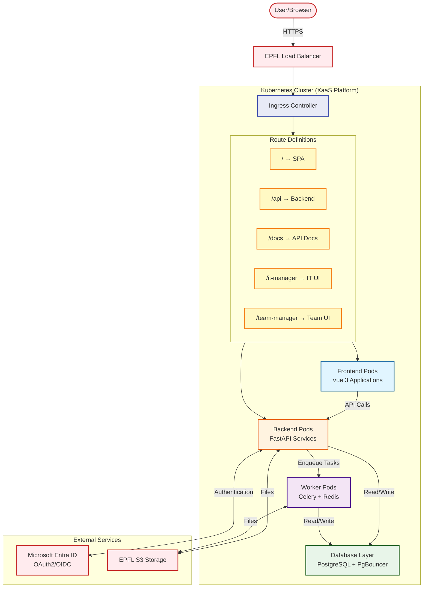
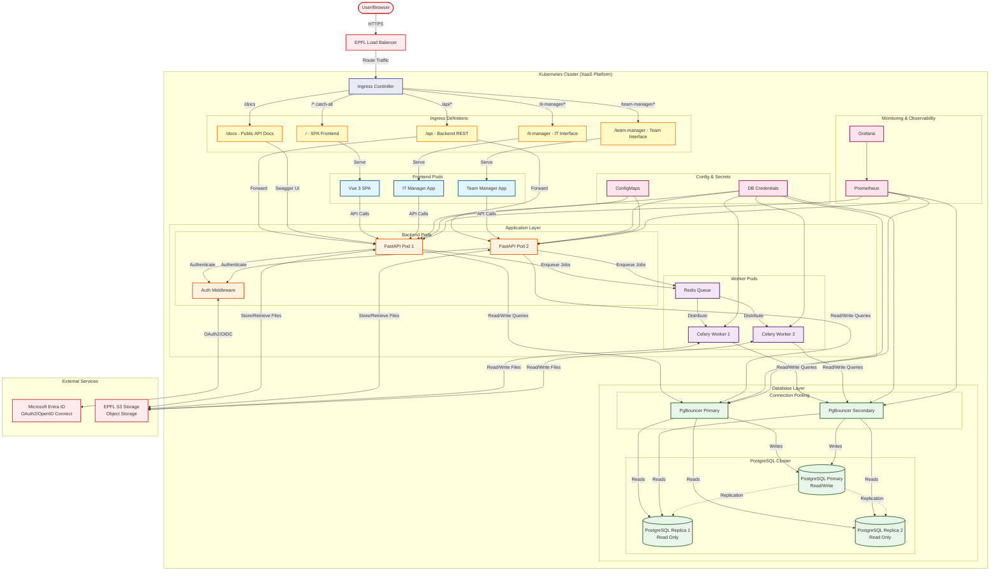
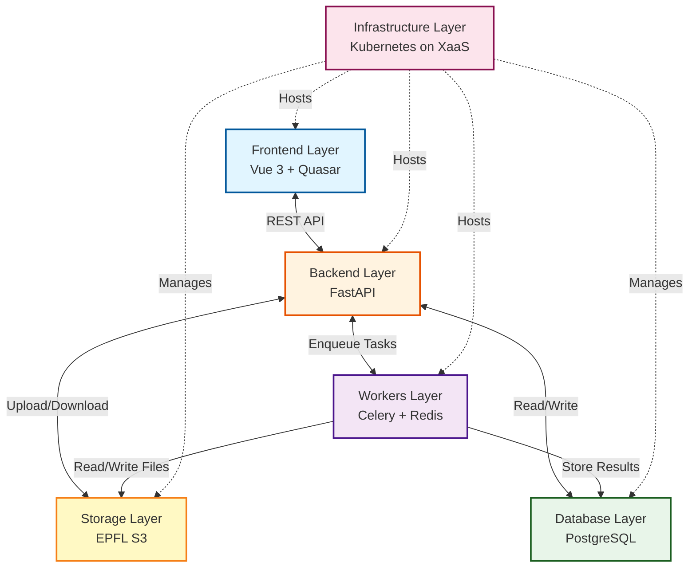
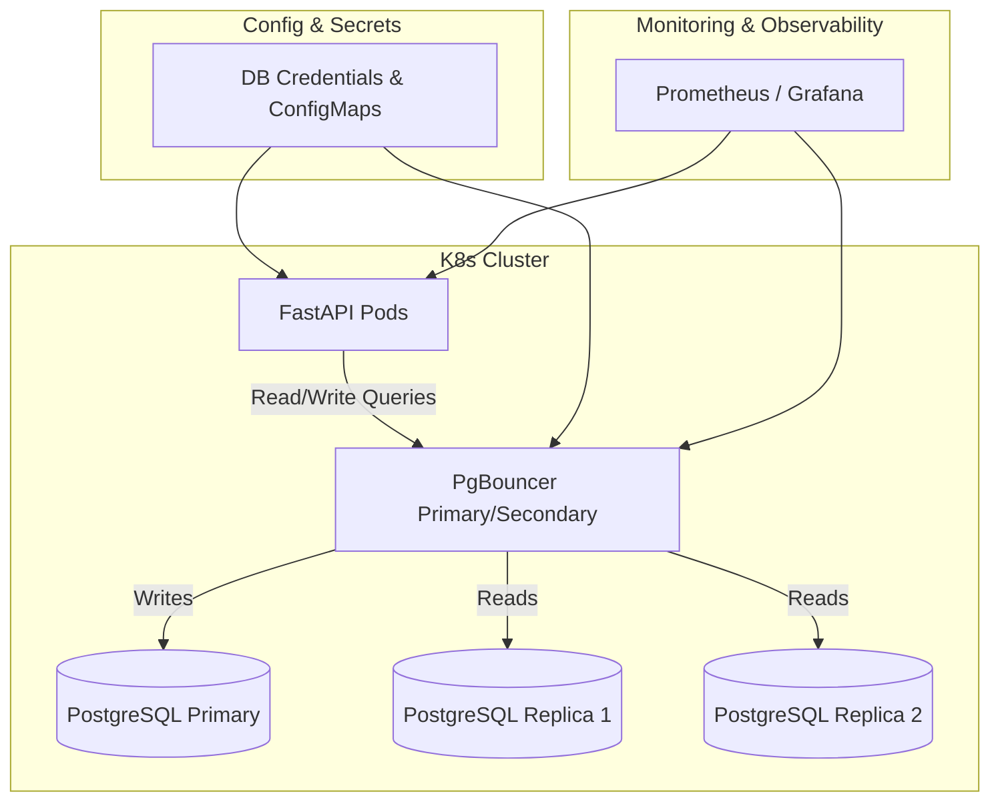
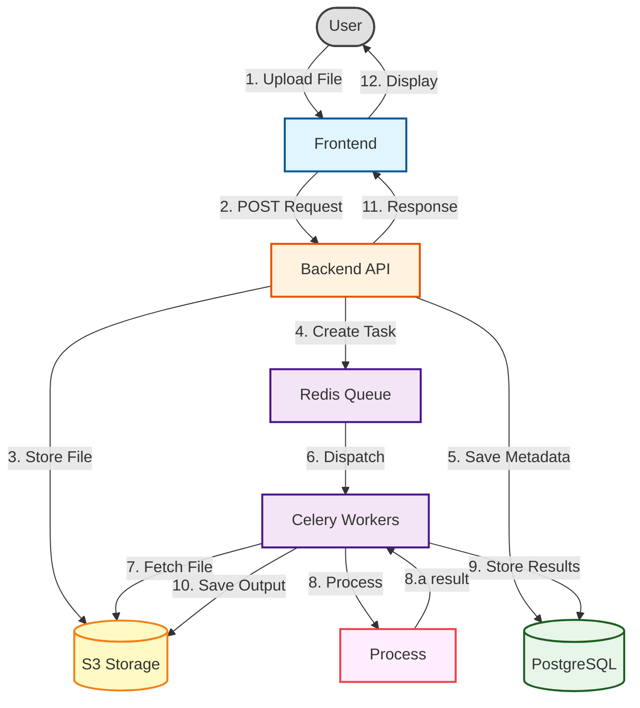

# System Overview Diagram

- Interaction component Basic

- Interaction component detailed

- Interaction component less detailed

- Overview of database query system

- Dataflow

The system consists of several interconnected layers that work together to provide the complete functionality. The diagram above shows the high-level components and their interactions.

## High-Level Components

1. **Frontend Layer** - User interface implemented with Vue 3 and Quasar
2. **Backend Layer** - RESTful API implemented with FastAPI
3. **Workers Layer** - Asynchronous processing with Celery and Redis
4. **Database Layer** - Data persistence with PostgreSQL
5. **Storage Layer** - Object storage for file uploads
6. **Infrastructure Layer** - Hosting and operational components

For detailed information about each component, see the Component Breakdown section below and the specific documentation in the corresponding folders under `docs/`.
