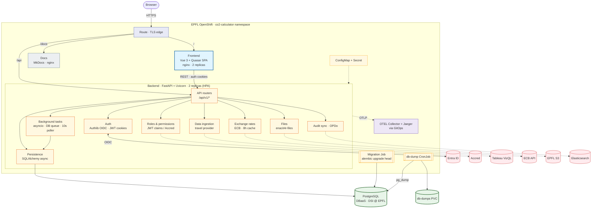

# Subsystem Map

The in-cluster view of **our app only**: the deployable units and the
backend's internal subsystems, reconciled against the Helm chart, the
backend code and the live OpenShift namespace. For the wider platform and
supply chain (GitHub, registry, ArgoCD, external services, observability)
see [System Overview](./02-system-overview.md).

Solid arrows are always-on; dotted arrows are integrations enabled
per-environment through injected secrets (otherwise inert — files fall
back to local disk, audit sync is skipped). The OTEL Collector, Jaeger
and the `db-dump` CronJob are deployed into the namespace via GitOps, not
by the app Helm chart.

## Deployable units

| Unit              | What it is                                                                                                                          |
| ----------------- | --------------------------------------------------------------------------------------------------------------------------------- |
| **Frontend**      | Vue 3 + Quasar SPA served by unprivileged Nginx. One app with in-app sections `/app`, `/back-office`, `/system`. 2 replicas.        |
| **Backend**       | FastAPI + Uvicorn (Python 3.12). Auth, business logic, persistence and background jobs in a single process. 2 replicas (HPA 2–10). |
| **Docs**          | This MkDocs site, static, served by Nginx. 1 replica.                                                                              |
| **Migration Job** | Helm hook running `alembic upgrade head` before each release (with a `wait-for-postgres` init).                                     |
| **db-dump CronJob** | Scheduled `pg_dump` of the database to the `db-dumps` PVC (deployed via GitOps).                                                  |

## Backend subsystems

- **API routers** (`/api/v1/*`) — REST surface; HTTP-only auth cookies.
- **Auth** — Authlib OIDC handshake with Entra ID; mints and validates JWT cookies in-process (no separate auth service). See [Auth Flow](./04-auth-flow.md).
- **Roles & permissions** — from JWT claims, or the EPFL Accred API when `PROVIDER_PLUGIN=accred`.
- **Data ingestion** — pluggable providers; the professional-travel provider reads flights from Tableau VizQL.
- **Exchange rates** — pulls FX rates from the ECB API (8-hour in-memory cache).
- **Files** — `enacit4r-files` abstraction; writes to EPFL S3 when configured, otherwise the local filesystem.
- **Audit sync** — ships OPDo audit records to Elasticsearch when configured.
- **Background tasks** — in-process `asyncio` chained via `BackgroundTasks`, backed by a DB job table with a 10-second safety-net poller. No Redis/Celery. See [ADR-010](../architecture-decision-records/010-background-job-processing.md).
- **Persistence** — SQLAlchemy async (psycopg) to a single managed PostgreSQL (EPFL DBaaS); connection pooling is in-process, **no PgBouncer**.
- **Telemetry** — the whole app is OpenTelemetry-instrumented and exports OTLP to the in-namespace OTEL Collector (traces → Jaeger, metrics → Prometheus). See [System Overview](./02-system-overview.md#cross-cutting).

For implementation detail see [Frontend](../frontend/01-overview.md),
[Backend](../backend/01-overview.md) and [Database](../database/01-overview.md).
