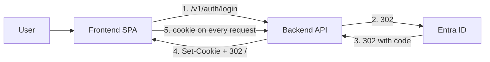
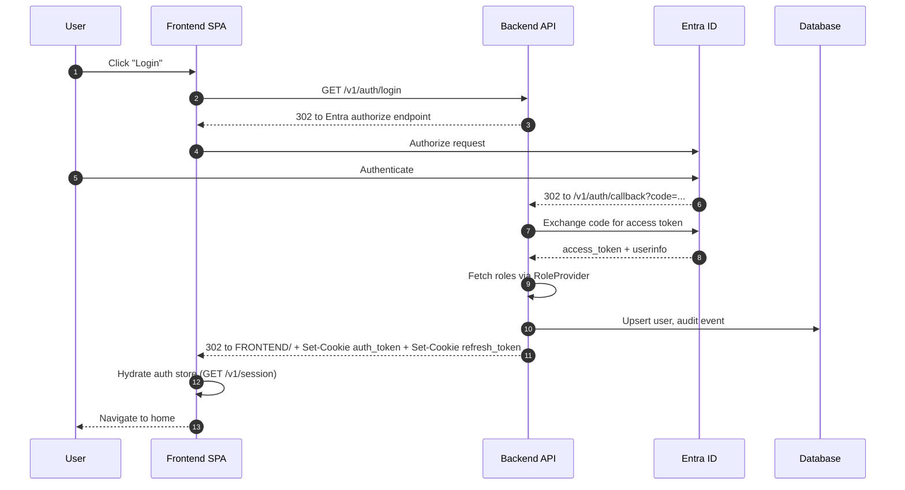
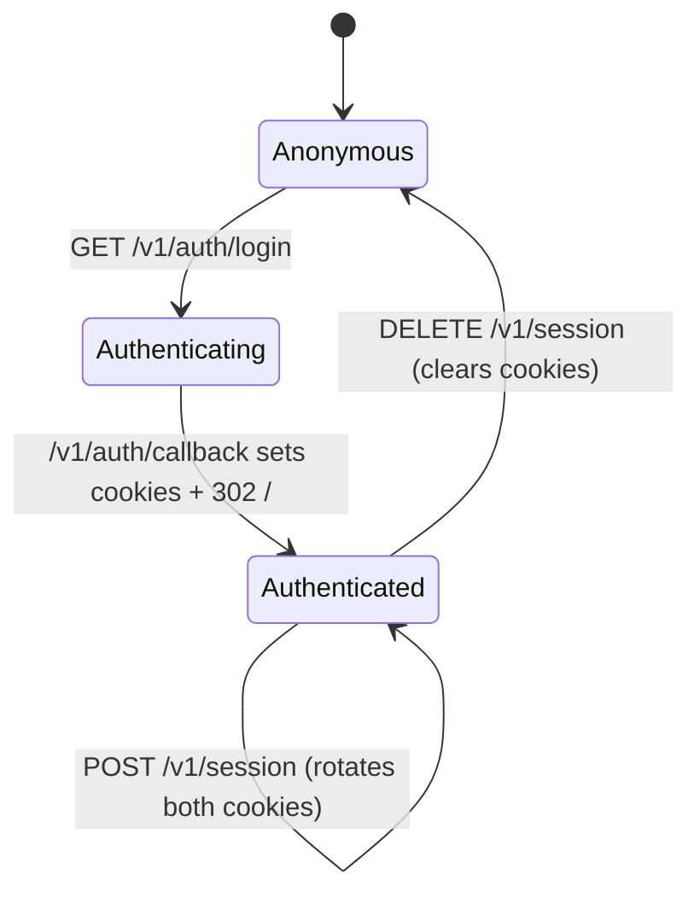

# Auth Flow Across Layers

## 1. Overview

The auth system binds every session to a real EPFL identity via Microsoft
Entra OAuth, holds that identity in a signed JWT in an `httpOnly` cookie,
and enforces role-scoped permissions through **in-code RBAC** at every request
(`app/core/policy.py`, `app/core/security.py`; the module borrows OPA-style
naming but runs no policy engine — see
[ADR-005](../architecture-decision-records/005-authorization-strategy.md)).

```mermaid
flowchart LR
    U[User] --> SPA[Frontend SPA]
    SPA -->|1. /v1/auth/login| API[Backend API]
    API -->|2. 302| Entra[Entra ID]
    Entra -->|3. 302 with code| API
    API -->|4. Set-Cookie + 302 /| SPA
    SPA -->|5. cookie on every request| API
```

## 2. Trust boundaries

Three boundaries pinned by tests. The module docstring at
`backend/app/api/v1/auth.py` is the canonical source.

| Boundary         | Trusted artefact                                                            | Untrusted artefact                                              | Test that pins it                                                   |
| ---------------- | --------------------------------------------------------------------------- | --------------------------------------------------------------- | ------------------------------------------------------------------- |
| IdP → backend    | `userinfo` claims from `authorize_access_token` (signed by IdP)             | Query params, headers, request body on `/callback`              | `test_callback_binds_session_to_idp_institutional_id`               |
| Backend → cookie | JWTs minted by `_set_auth_cookies`, signed with `settings.SECRET_KEY`       | Anything else the client could return as evidence of identity   | `test_auth_cookies_secure_when_cookie_secure_true`                  |
| Cookie → backend | `decode_jwt(cookie)` payload after signature + algorithm + `exp` validation | Cookie body in transit, query params, headers carrying identity | `test_jwt_expired_rejected`, `test_jwt_tampered_signature_rejected` |

`/auth/login-test` deliberately bypasses boundary 1; its only safeguard
is `settings.DEBUG`, pinned by `test_login_test_registration_matches_debug_flag`.

## 3. OAuth Authorization Code flow

```mermaid
sequenceDiagram
    autonumber
    participant U as User
    participant SPA as Frontend SPA
    participant API as Backend API
    participant Entra as Entra ID
    participant DB as Database

    U->>SPA: Click "Login"
    SPA->>API: GET /v1/auth/login
    API-->>SPA: 302 to Entra authorize endpoint
    SPA->>Entra: Authorize request
    U->>Entra: Authenticate
    Entra-->>API: 302 to /v1/auth/callback?code=...
    API->>Entra: Exchange code for access token
    Entra-->>API: access_token + userinfo
    API->>API: Fetch roles via RoleProvider
    API->>DB: Upsert user, audit event
    API-->>SPA: 302 to FRONTEND/ + Set-Cookie auth_token + Set-Cookie refresh_token
    SPA->>SPA: Hydrate auth store (GET /v1/session)
    SPA-->>U: Navigate to home
```

> **Why Set-Cookie on the callback redirect?** Frontend and backend share
> the same domain in all deployments (`/api` prefix in production,
> `localhost` on both sides in dev). A cookie set on a same-domain `302`
> is accepted by all browsers without ITP interference. See
> [ADR-019](../architecture-decision-records/019-bff-cookie-exchange.md)
> for the original BFF exchange design that was superseded by this approach.

## 4. Session lifecycle

```mermaid
stateDiagram-v2
    [*] --> Anonymous
    Anonymous --> Authenticating: GET /v1/auth/login
    Authenticating --> Authenticated: /v1/auth/callback sets cookies + 302 /
    Authenticated --> Authenticated: POST /v1/session (rotates both cookies)
    Authenticated --> Anonymous: DELETE /v1/session (clears cookies)
```

Refresh (`POST /v1/session`) rotates **both** access and refresh cookies
via `_set_auth_cookies`. Logout (`DELETE /v1/session`) clears them
client-side but does not invalidate the JWT server-side: a leaked cookie
remains valid until `exp`. F6 (server-side denylist) is deferred — see
[issue #458 follow-up comment](https://github.com/EPFL-ENAC/co2-calculator/issues/458#issuecomment-4560788251).

## 5. JWT structure

Claims minted by `_set_auth_cookies` in `backend/app/api/v1/auth.py`:

| Claim              | Purpose                                                                              |
| ------------------ | ------------------------------------------------------------------------------------ |
| `sub`              | IdP sub claim (Entra object UUID); fallback to `str(user.id)` if IdP omits it        |
| `institutional_id` | Stable EPFL identifier — the primary trust-boundary key                              |
| `provider`         | `UserProvider` enum value (`1=DEFAULT`, `2=TEST`, `3=ACCRED`)                        |
| `type`             | `"access"` or `"refresh"` — see `TOKEN_TYPE_ACCESS` / `TOKEN_TYPE_REFRESH` constants |
| `exp`              | UTC expiry                                                                           |

Algorithm: `HS256`. Key: `settings.SECRET_KEY` (single shared symmetric
secret — see [ADR-012](../architecture-decision-records/012-jwt-authentication-strategy.md)).

Validation path in `backend/app/core/security.py`:

1. `decode_jwt(token)` — `jwt.decode(...)` runs signature + algorithm check.
2. `_CLAIMS_REGISTRY.validate(payload.claims)` — explicit `exp` check.
   Before F10 this call was missing; expired tokens silently passed.
3. `resolve_user_by_jwt_payload(payload, db, expected_token_type=...)`
   — the centralized identity-resolution helper shared by `/me`,
   refresh, and `get_current_user`.

## 6. Role provider plugin

`backend/app/providers/role_provider.py` defines three providers:

- **`DefaultRoleProvider`** — reads roles from JWT claims. Used in
  development and synthetic-data flows.
- **`AccredRoleProvider`** — fetches from the EPFL Accred API. Production.
- **`TestRoleProvider`** — synthetic roles for `/auth/login-test`
  (DEBUG-only route).

Selection is driven by `settings.PROVIDER_PLUGIN` through the factory
`get_role_provider(provider_type)`. F9 hardened the factory: an unknown
`PROVIDER_PLUGIN` value now raises `ValueError` instead of silently
falling back to `DefaultRoleProvider`. F11/F12 hardened claim parsing:
malformed `RoleName` entries and unknown scope types are skipped with a
warning rather than aborting the login.

## 7. Security gotchas

- **`COOKIE_SECURE` env var** — defaults to `True` (correct for prod
  HTTPS). It **must** be `False` in `backend/.env` for HTTP localhost
  dev; Safari and `httpx` clients silently drop `Secure` cookies on the
  return trip over `http://`. This decoupling from `DEBUG` was the F2
  regression caught during PR #1310 review.
- **`/auth/login-test` is registered only in DEBUG builds** — not a
  runtime gate. The route literally does not exist in production
  `app.routes`. Pinned by `test_login_test_registration_matches_debug_flag`.
- **F6 deferred** — logout does not denylist the JWT. A leaked cookie
  remains valid until `exp`. A JTI denylist is the planned
  remediation; see
  [issue #458 follow-up](https://github.com/EPFL-ENAC/co2-calculator/issues/458#issuecomment-4560788251).
- **`JWTClaimsRegistry` default `leeway=0`** — no clock-skew tolerance.
  Brief NTP drift across pods can cause spurious 401s on tokens near
  expiry. A 30 s leeway is on the future-work list.

## 8. Tests — what's pinned where

Mapping each Tier-1 finding (F1–F12) to its regression test. Source of
truth: the implementation plan
`docs/src/implementation-plans/458-security-authentication-integration-hardening.md`
(landed with PR #1310 — [issue #458](https://github.com/EPFL-ENAC/co2-calculator/issues/458)).

| Finding | Test file                                            | Test name                                                                                                                                    |
| ------- | ---------------------------------------------------- | -------------------------------------------------------------------------------------------------------------------------------------------- |
| F1      | `backend/tests/integration/v1/test_auth_security.py` | `test_callback_binds_session_to_idp_institutional_id`                                                                                        |
| F2      | `backend/tests/integration/v1/test_auth_security.py` | `test_auth_cookies_secure_when_cookie_secure_true`, `test_auth_cookies_not_secure_when_cookie_secure_false`                                  |
| F3      | `backend/tests/integration/v1/test_auth_security.py` | `test_login_test_registration_matches_debug_flag`, `test_login_test_returns_404_in_prod_build`                                               |
| F4      | `backend/tests/integration/v1/test_auth_security.py` | `test_jwt_alg_none_rejected`, `test_jwt_wrong_alg_rejected`, `test_jwt_tampered_signature_rejected`                                          |
| F5      | `backend/tests/integration/v1/test_auth_security.py` | `test_refresh_rotates_both_auth_and_refresh_cookies`                                                                                         |
| F6      | _deferred_                                           | _server-side JTI denylist — see follow-up comment_                                                                                           |
| F7      | `backend/tests/integration/v1/test_auth_security.py` | `test_audit_event_failure_logs_error_with_marker`, `test_audit_event_must_succeed_propagates_failure`                                        |
| F8      | `backend/tests/integration/v1/test_auth_security.py` | `test_me_rejects_legacy_user_id_only_token`, `test_refresh_rejects_legacy_user_id_only_token`                                                |
| F9      | `backend/tests/unit/providers/test_role_provider.py` | `test_get_unknown_role_provider_raises` (in `TestGetRoleProvider`)                                                                           |
| F10     | `backend/tests/integration/v1/test_auth_security.py` | `test_jwt_expired_rejected`                                                                                                                  |
| F11     | `backend/tests/unit/providers/test_role_provider.py` | `test_unknown_role_name_is_skipped_not_raised`, `test_empty_role_name_is_skipped_not_raised` (in `TestDefaultRoleProviderClaimCombinations`) |
| F12     | `backend/tests/unit/providers/test_role_provider.py` | `test_unknown_scope_type_warns_when_skipped` (in `TestDefaultRoleProviderClaimCombinations`)                                                 |

Additional pinning tests:

- `test_callback_sets_cookies_and_redirects_to_frontend` — pins the direct cookie-on-callback behaviour (PR #1687).
- `test_e2e_callback_session_refresh_logout_happy_path` — end-to-end happy path.
- `test_secure_cookie_is_dropped_over_http_breaking_followup_calls` —
  F2 regression guard; demonstrates the cookie-drop symptom.
- `TestDefaultRoleProviderClaimCombinations::*` — claim-combination
  matrix for the role provider.
- `backend/tests/unit/core/test_security_gates.py::*` — permission gate unit
  tests covering `is_permitted` / `check_permission` / `require_permission`.

## 9. Design choices and trade-offs

### Why direct cookies on the callback (not a BFF exchange step)

Frontend and backend share the same domain in all deployments (production:
`/api` path prefix on the same host; localhost dev: same `localhost` host,
different ports that are treated as same-site). A `Set-Cookie` header on the
OAuth-callback `302` is a same-site response; browsers accept it without ITP
interference. The previous BFF exchange design (ADR-019) was motivated by a
Safari ITP regression that only reproduced on localhost when the two processes
ran on different ports — not a production concern. Removing it eliminates one
DB table, one endpoint, one SPA page, and one round-trip on every login.

### Why HS256 with a shared secret, not RS256 with a key pair

Single-tenant deployment; the backend is the only verifier. A symmetric
secret is simpler to operate (no JWKS endpoint, no key-pair rotation
choreography). The cost — no public verifiability — does not apply here.
See [ADR-012](../architecture-decision-records/012-jwt-authentication-strategy.md).

### Why `httpOnly` session cookies, not bearer tokens in localStorage

Bearer tokens in JS-readable storage are the OWASP cheat-sheet
anti-pattern for SPAs: any XSS sink lifts the token. `httpOnly` cookies
are out of reach of JavaScript and ride CSRF mitigations via `SameSite`
and the standard `Origin`/`Referer` checks already in place.

## 10. Future work

- **F6** — Logout JWT denylist (server-side JTI store). Pairs with
  refresh-token reuse detection to convert F5 from hygiene into actual
  stolen-token mitigation.
- **`JWTClaimsRegistry` leeway tuning** — currently default `0` seconds;
  30 s is the candidate value to absorb pod-to-pod NTP drift.
- **Narrow the role-provider boundary** — F11/F12 are delivered, but the
  provider surface deserves its own scope-narrowing pass in a future
  tier (typed schema for IdP role payloads, strict mode for production).
- **Ingress rate limiting on `/v1/auth/callback`** — no app-level throttle
  exists on the callback endpoint; a `nginx.ingress.kubernetes.io/limit-rps`
  annotation on the ingress is the recommended mitigation.

## Related docs

- [Backend overview](../backend/01-overview.md)
- [Frontend overview](../frontend/01-overview.md)
- [Backend permission system](../backend/06-PERMISSION-SYSTEM.md)
- [ADR-005 Authorization strategy](../architecture-decision-records/005-authorization-strategy.md)
- [ADR-012 JWT authentication](../architecture-decision-records/012-jwt-authentication-strategy.md)
- [ADR-019 BFF cookie exchange (superseded)](../architecture-decision-records/019-bff-cookie-exchange.md)
- [Issue #458 — security: authentication & integration hardening](https://github.com/EPFL-ENAC/co2-calculator/issues/458)
