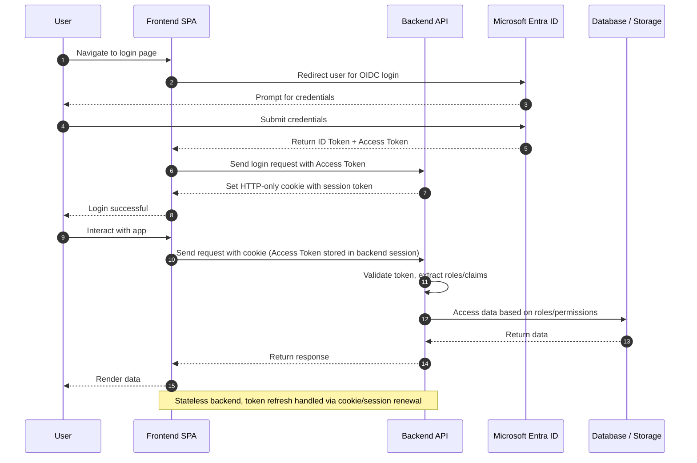

# Auth Flow Across Layers

- Sequence diagram showing login --> token usage

The authentication and authorization system spans multiple layers of the application, ensuring secure access to resources.

## User Authentication & Authorization Model

The system implements a centralized authentication model using Microsoft Entra ID (formerly Azure AD) as the identity provider. All authentication requests are handled through OpenID Connect (OIDC) protocol.

## Token Propagation Strategy

The system uses JWT tokens for stateless authentication:

- ID Tokens for user identification
- Access Tokens for API authorization
- Refresh Tokens for session continuity (optional)

Tokens are propagated through the system as HTTP headers, with each layer validating token authenticity and extracting user claims as needed.

## Role-Based Access Control (RBAC) Implementation

Access control is implemented using role-based permissions:

- Roles are defined in Microsoft Entra ID
- Permissions are mapped to API endpoints and resources
- Authorization is enforced at both the API gateway and individual service levels

For detailed implementation information, see:

- [Backend Security Documentation](../backend/architecture.md)
- [Frontend Auth Documentation](../frontend/architecture.md)
