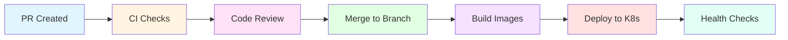
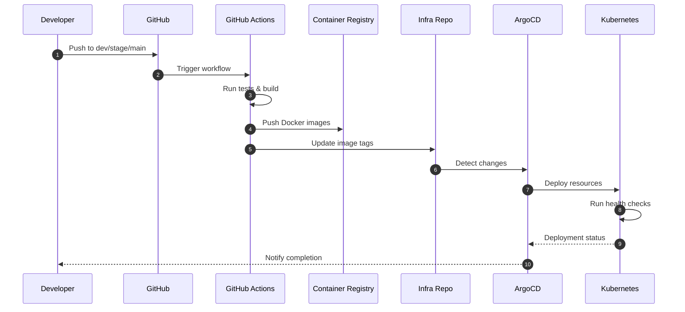

# CI/CD Pipeline Architecture

Automated pipeline for build, test, security, and deployment across
all environments. This document provides architectural overview and
integration patterns.

**Related documentation:**

- [CI/CD Workflows](cicd-workflows.md) - GitHub Actions details
- [Workflow Guide](workflow-guide.md) - Developer daily workflow
- [Release Management](release-management.md) - Versioning and releases
- [Tech Stack](08-tech-stack.md) - Technologies and tools

## Pipeline Overview

Pull requests trigger validation workflows. Merges deploy to target
environments automatically.



## Automated Checks

### Linting and Formatting

Code style is enforced automatically:

**Python:**

- `ruff` - Fast linting for style violations + Formatting
- `mypy` - Static type checking

**JavaScript/TypeScript:**

- `eslint` - Linting with project rules
- `prettier` - Formatting verification
- `typescript` - Type checking

All checks must pass before merge is allowed.

### Testing

Full test suite runs on every PR:

**Backend tests:**

- Unit tests with `pytest`
- Integration tests for API endpoints
- Test coverage minimum: 60%

**Frontend tests:**

- Component tests with Vitest
- E2E tests with Playwright (critical flows)
- Test coverage if possible: optional

Run locally before pushing: `make test`

### Security Scanning

Multiple security checks protect the codebase:

**Dependency scanning:**

- `uv pip audit` - Python vulnerability scan
- `npm audit` - Node.js vulnerability scan
- Dependabot alerts for both ecosystems

**Code scanning:**

- CodeQL analysis for security vulnerabilities
- Secret scanning to prevent credential leaks
- SAST (Static Application Security Testing for backend only)

**Container scanning:**

- Docker image vulnerability scan
- Base image updates via Dependabot

Critical vulnerabilities block merge until resolved.

### Build Validation

Verify builds succeed before deployment:

**Backend:**

```bash
cd backend && make build
# Creates Docker image
```

**Frontend:**

```bash
cd frontend && make build
# Creates production bundle with Vite
```

Build failures prevent deployment to any environment.

## Merge Requirements

Pull requests must meet these criteria before merge:

- [ ] All CI checks passing (green status)
- [ ] Code review approved by team member
- [ ] Test coverage at 60% minimum
- [ ] No critical security vulnerabilities
- [ ] Dependabot alerts resolved or acknowledged
- [ ] Conventional commit messages

Merge is blocked automatically if requirements are not met.

## Deployment Pipeline

### Build Process per Subsystem

Each component builds independently:

**Frontend:**

- Node.js build with Vite bundler
- Static assets optimized and compressed
- Source maps generated for debugging
- Environment variables injected

**Backend:**

- Python package with uv dependencies
- Docker image with multi-stage build
- Health check endpoint verified in helm chart
- Database migrations included in helm chart

**Infrastructure:**

- Kubernetes manifests generated
- Helm charts validated
- Deploy helm to ghcr.io
- Update gitops/argocd

### Deployment Flow

Automated deployment follows this sequence:



**Deployment steps:**

1. **Trigger** - Merge to `dev`, `stage`, or `main` branch
2. **Build** - GitHub Actions builds Docker images
3. **Push** - Images pushed to ghcr.io registry
4. **Update** - Infrastructure repo receives new image tags
5. **Sync** - ArgoCD detects changes and deploys to Kubernetes
6. **Verify** - Health checks confirm successful deployment

**Environment deployment rules:**

| Branch  | Environment   | Trigger            | Validation          |
| ------- | ------------- | ------------------ | ------------------- |
| `dev`   | Development   | Automatic on merge | Smoke tests         |
| `stage` | Staging       | Manual PR approval | Full regression     |
| `main`  | Pre-prod/Prod | Manual with tag    | Complete validation |

For detailed environment promotion workflow, see
[Release Management](release-management.md).

### Deployment Artifacts

Artifacts are versioned and stored:

- Docker images: `ghcr.io/epfl-enac/co2-calculator-backend:v0.1.0`
- Frontend bundles: `ghcr.io/epfl-enac/co2-calculator-frontend:v0.1.0`
- Helm charts: Tagged in git with version
- Database migrations: Included in backend image

Artifacts are immutable and tagged with version. For versioning
strategy, see [Release Management](release-management.md).

## Performance Monitoring

### LighthouseCI

Frontend performance is tracked automatically:

- Performance score > 90
- Accessibility score > 90
- Best practices score > 90
- SEO score > 90

Reports generated on each deployment.

### EcoConception
Monitored throughout the project using the [Green IT best practices](https://rweb.greenit.fr/en). We selected the most relevant practices and their associated impact levels for this project; below is a summary of the actions we apply:

#### Front-End
- Minimize resource usage: reduce animations, CSS files and HTTP requests; externalize and minify CSS/JS; keep page weight under 1 MB.
- Efficient loading: lazy-load SPA routes; memory-cache frequently used data; avoid redundant API calls.
- Optimized visuals: prefer CSS over images; use SVG/glyphs; optimize images before integration; no client-side raster resizing.
- Performance practices: minimize reflows; avoid blocking JS; run Lighthouse checks.

#### Back-End
- Reduce data volume: return only essential fields; cache selected data; minimize payload size.
- Favor simplicity: use a custom backend; no CMS layer.

#### Implementation
- Efficient codebase (Implementation): enforce linters; externalize, minify and combine CSS/JS; let build tooling optimize bundles.
- Optimized DOM operations: reduce DOM updates via Vue component structure; avoid redundant traversals.
- Efficient CSS: use logical structure, optimized selectors and @layer; reduce selector complexity.
- Smart loading: load data and code on demand; cache JS objects when useful.
- Browser features: enable native lazy loading; no Service Worker.

#### Optimisations
- Caching strategy: serve static assets via CDN with cache-control headers; avoid app-level caching or CMS caching when possible.
- Compression & minification: minify and compress all text and static assets; minimize HTTP requests.
- Clean infrastructure: avoid unnecessary overrides; keep sitemaps current; apply data expiration policies.

#### Environmental Metrics
These metrics are tracked with [Green IT tools](https://github.com/cnumr):
- Energy efficiency: track energy usage.
- Carbon footprint: estimate carbon impact.

### Backend Performance

Optional load testing for backend:

- Response time < 500ms (p95)
- Throughput > 100 req/s
- Error rate < 0.1%

Run with k6 or locust when needed.

## Rollback Mechanisms

If deployment issues occur, rollback is automated:

**Kubernetes rollback:**

```bash
argocd app rollback co2-calculator
```

ArgoCD maintains deployment history using git-ops pattern.

**Database rollback:**

```bash
cd backend && make migration-down
```

Alembic migrations include downgrade scripts.

**Manual rollback:**

```bash
# Revert to previous version tag
git checkout v0.2.0
kubectl set image deployment/backend backend=ghcr.io/...:v0.2.0
```

Always test rollback procedures in staging first.

## CI/CD Workflows

### Workflow Files

GitHub Actions workflows in `.github/workflows/`:

- `quality-check.yml` - Code quality enforcement
- `test.yml` - Unit and integration testing
- `build.yml` - Build verification
- `security.yml` - Security vulnerability scanning
- `lighthouse.yml` - Performance and accessibility audits
- `deploy.yml` - Automated deployment
- `deploy-mkdocs.yml` - Documentation deployment
- `release-please.yml` - Automated release management

For complete workflow details, triggers, and configuration, see
[CI/CD Workflows](cicd-workflows.md).

### Local CI Validation

Run full CI suite locally before pushing:

```bash
make ci  # Runs lint, type-check, test, build
```

This matches GitHub Actions checks exactly. For troubleshooting, see
[CI/CD Workflows](cicd-workflows.md#troubleshooting).

## Monitoring and Alerts

Post-deployment monitoring:

**Application metrics:**

- Error rates in logs
- Response times
- Request volumes
- Resource usage

**Infrastructure metrics:**

- Pod health status
- Container restarts
- Resource limits
- Network traffic

**Alerting rules:**

- Error rate > 1%
- Response time > 2s
- Pod crashes
- Failed deployments

Alerts sent to team via configured channels.

## DevSecOps Integration

Security is integrated throughout the pipeline:

**Shift-left security:**

- Pre-commit hooks run basic checks
- IDE extensions show issues in real-time
- PR checks catch problems early

**Continuous scanning:**

- Daily dependency scans
- Weekly container scans
- Code scanning on every commit

**Vulnerability response:**

- Critical: Fix within 24 hours
- High: Fix within 7 days
- Medium: Fix within 30 days
- Low: Fix at next sprint

See [Code Standards](code-standards.md) for security policies.

## Continuous Improvement

Pipeline metrics tracked:

- Build success rate
- Average build time
- Deployment frequency
- Mean time to recovery
- Change failure rate

Review monthly to optimize processes.
