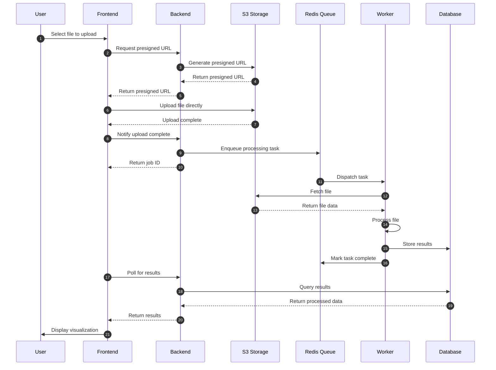
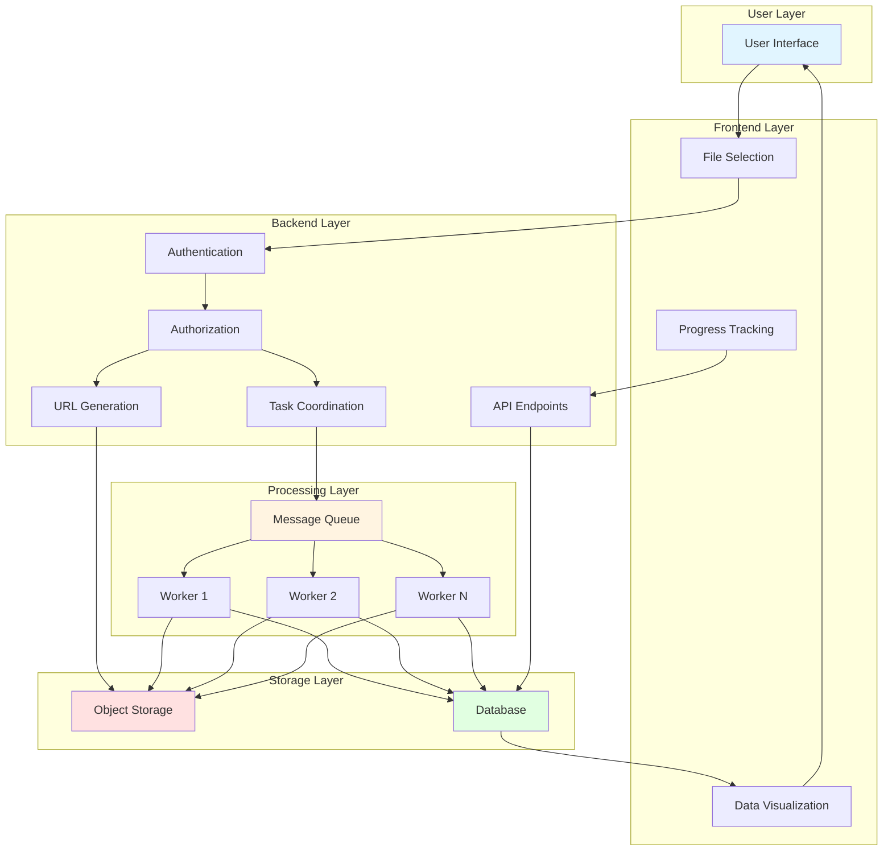

# Data Flow Diagram

This document visualizes how data moves through the system from user
interaction to storage and back.

## File Upload Journey

The diagram above illustrates a typical data flow through the system.

## Example Journey: File Upload → Processing → Visualization

1. User uploads file through frontend
2. Frontend requests presigned URL from backend
3. File uploaded directly to storage
4. Backend enqueues processing task
5. Worker processes file and stores results
6. Frontend retrieves processed data for visualization

## Key Systems Involved at Each Step

- **Frontend**: User interface and file selection
- **Backend**: Authentication, authorization, and task coordination
- **Storage**: File persistence and retrieval
- **Workers**: Asynchronous processing
- **Database**: Metadata and processed data storage
