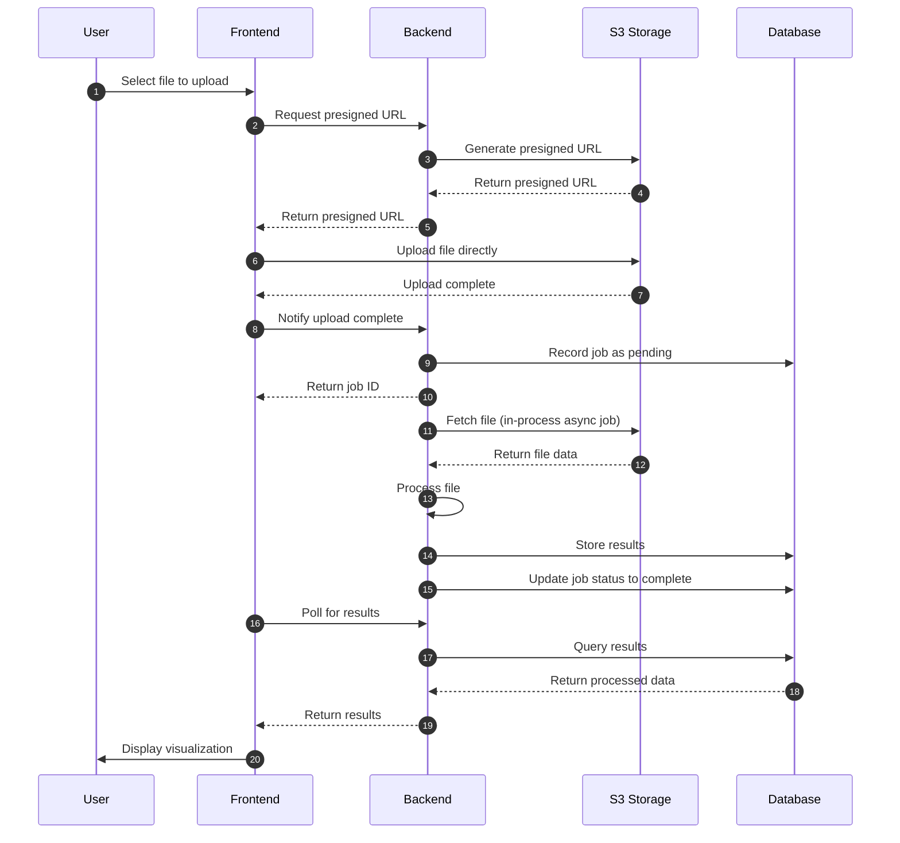
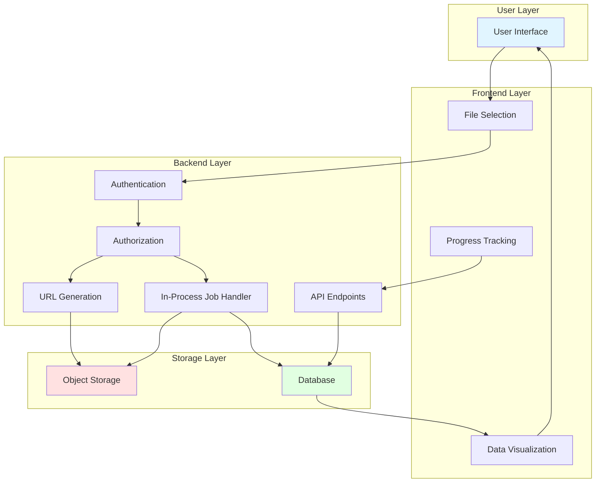

# Data Flow Diagram

This document visualizes how data moves through the system from user
interaction to storage and back.

## File Upload Journey

```mermaid
sequenceDiagram
    autonumber
    participant User
    participant Frontend
    participant Backend
    participant Storage as S3 Storage
    participant DB as Database

    User->>Frontend: Select file to upload
    Frontend->>Backend: Request presigned URL
    Backend->>Storage: Generate presigned URL
    Storage-->>Backend: Return presigned URL
    Backend-->>Frontend: Return presigned URL
    Frontend->>Storage: Upload file directly
    Storage-->>Frontend: Upload complete
    Frontend->>Backend: Notify upload complete
    Backend->>DB: Record job as pending
    Backend-->>Frontend: Return job ID

    Backend->>Storage: Fetch file (in-process async job)
    Storage-->>Backend: Return file data
    Backend->>Backend: Process file
    Backend->>DB: Store results
    Backend->>DB: Update job status to complete

    Frontend->>Backend: Poll for results
    Backend->>DB: Query results
    DB-->>Backend: Return processed data
    Backend-->>Frontend: Return results
    Frontend->>User: Display visualization
```

The diagram above illustrates a typical data flow through the system.

## Example Journey: File Upload → Processing → Visualization

1. User uploads file through frontend
2. Frontend requests presigned URL from backend
3. File uploaded directly to storage
4. Backend records job and triggers in-process async processing (asyncio)
5. Backend processes file and stores results in-process
6. Frontend retrieves processed data for visualization

## Key Systems Involved at Each Step

```mermaid
graph TB
    subgraph "User Layer"
        U[User Interface]
    end

    subgraph "Frontend Layer"
        F1[File Selection]
        F2[Progress Tracking]
        F3[Data Visualization]
    end

    subgraph "Backend Layer"
        B1[Authentication]
        B2[Authorization]
        B3[URL Generation]
        B4[In-Process Job Handler]
        B5[API Endpoints]
    end

    subgraph "Storage Layer"
        S[Object Storage]
        D[Database]
    end

    U --> F1
    F1 --> B1
    B1 --> B2
    B2 --> B3
    B3 --> S
    B2 --> B4
    B4 --> S
    B4 --> D
    F2 --> B5
    B5 --> D
    D --> F3
    F3 --> U

    style U fill:#e1f5ff
    style S fill:#ffe1e1
    style D fill:#e1ffe1
```

- **Frontend**: User interface and file selection
- **Backend**: Authentication, authorization, task coordination, and in-process async job execution (asyncio — no external task queue)
- **Storage**: File persistence and retrieval
- **Database**: Metadata and processed data storage
