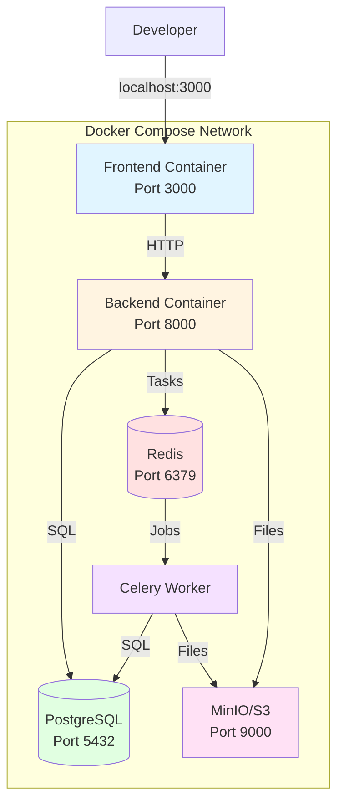
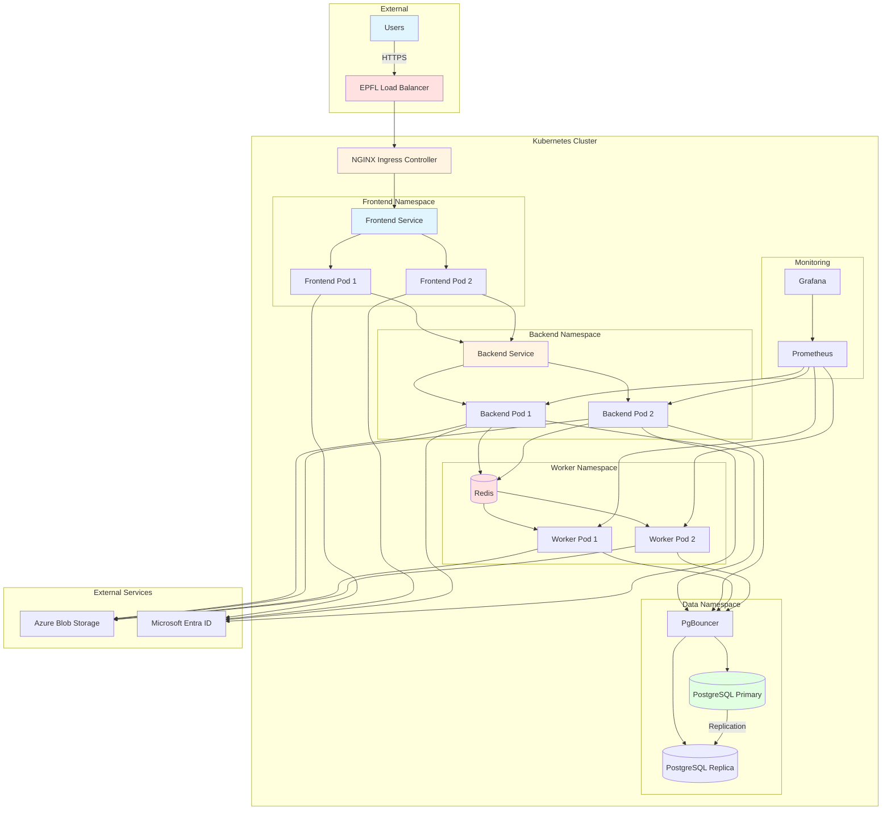

# Deployment Topology

This document describes the infrastructure topology for local, staging,
and production environments.

## Docker Compose (Local/Staging)

Local development uses Docker Compose for simplified service
orchestration.



**Key characteristics:**

- Single docker-compose.yml file
- Shared network for service communication
- Volume mounts for data persistence
- Hot reload for development

## Kubernetes Cluster (Production)

Production deployments use Kubernetes for scalability and reliability.



**Key characteristics:**

- Helm charts for service deployment
- ArgoCD for GitOps deployment management
- Ingress controllers for external access
- Horizontal pod autoscaling
- Rolling updates with zero downtime

### Service Mesh Overview

Currently not using a service mesh, but may adopt Istio in the future for:

- Enhanced observability
- Traffic management
- Security policies

### Ingress and Networking Patterns

```mermaid
graph LR
    subgraph "External Traffic"
        Internet[Internet]
        EPFLLB[EPFL Load Balancer]
    end

    subgraph "Kubernetes Ingress"
        Ingress[NGINX Ingress<br/>TLS Termination]
    end

    subgraph "Application Routes"
        Root[/ → Frontend SPA]
        API[/api → Backend]
        Docs[/docs → Documentation]
        ITMgr[/it-manager → IT App]
        TeamMgr[/team-manager → Team App]
    end

    Internet -->|HTTPS| EPFLLB
    EPFLLB -->|HTTPS| Ingress
    Ingress --> Root
    Ingress --> API
    Ingress --> Docs
    Ingress --> ITMgr
    Ingress --> TeamMgr

    style Internet fill:#e1f5ff
    style EPFLLB fill:#ffe1e1
    style Ingress fill:#fff4e1
    style Root fill:#e1f5ff
    style API fill:#e1ffe1
```

**Networking features:**

- EPFL load balancer for external access
- NGINX ingress controller for HTTP routing
- TLS termination at ingress level
- Network policies for service isolation
- Path-based routing to services

For detailed deployment information, see [Infrastructure Documentation](../infra/01-overview.md).
