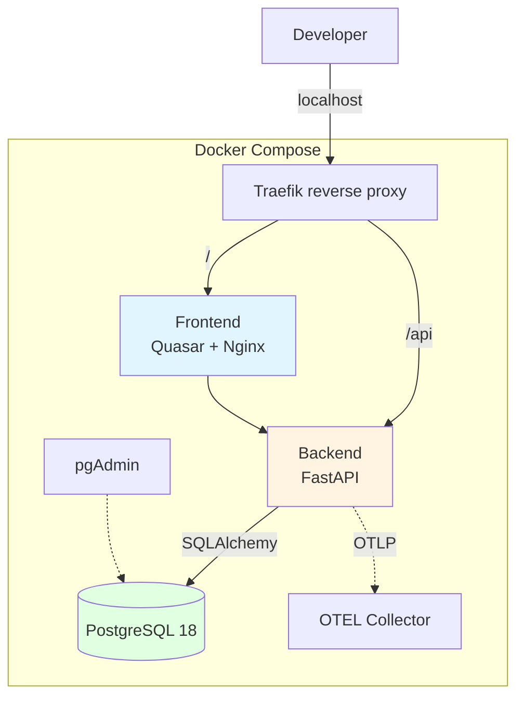
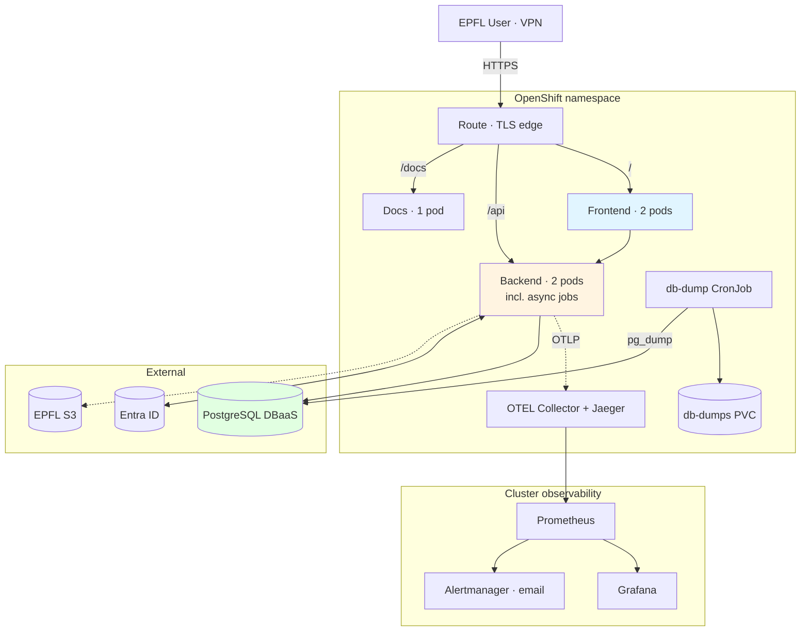
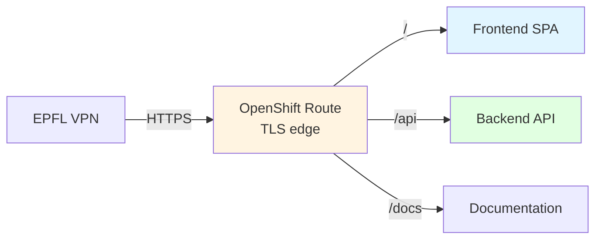

# Deployment Topology

How the system runs locally and on EPFL OpenShift. For the full platform
and supply chain see [System Overview](./02-system-overview.md); for the
app's internal components see [Subsystem Map](./03-subsystem-map.md).

## Local (Docker Compose)

Local development uses Docker Compose. Traefik fronts the app, storage is
the local filesystem (no MinIO), and telemetry goes to a local OTEL
Collector.

```mermaid
graph TB
    Dev[Developer] -->|localhost| Traefik

    subgraph "Docker Compose"
        Traefik[Traefik reverse proxy]
        FE[Frontend<br/>Quasar + Nginx]
        BE[Backend<br/>FastAPI]
        DB[(PostgreSQL 18)]
        PGA[pgAdmin]
        OTEL[OTEL Collector]

        Traefik -->|/| FE
        Traefik -->|/api| BE
        FE --> BE
        BE -->|SQLAlchemy| DB
        BE -.->|OTLP| OTEL
        PGA -.-> DB
    end

    style FE fill:#e1f5ff
    style BE fill:#fff4e1
    style DB fill:#e1ffe1
```

**Key characteristics:**

- Single `docker-compose.yml`; Traefik routes by path prefix
- File storage on local disk (S3 is opt-in via `S3_*` env)
- Hot reload for development

## EPFL OpenShift (dev / stage / prod)

Production-like environments run on EPFL OpenShift, delivered by ArgoCD
from the `openshift-app-config` GitOps repo.

```mermaid
graph TB
    User[EPFL User · VPN] -->|HTTPS| Route

    subgraph "OpenShift namespace"
        Route[Route · TLS edge]
        FE[Frontend · 2 pods]
        BE[Backend · 2 pods<br/>incl. async jobs]
        Docs[Docs · 1 pod]
        Otel[OTEL Collector + Jaeger]
        DBDump[db-dump CronJob]
        PVC[(db-dumps PVC)]

        Route -->|/| FE
        Route -->|/api| BE
        Route -->|/docs| Docs
        FE --> BE
        BE -.->|OTLP| Otel
        DBDump --> PVC
    end

    subgraph "Cluster observability"
        Prom[Prometheus]
        Graf[Grafana]
        Alert[Alertmanager · email]
        Otel --> Prom
        Prom --> Graf
        Prom --> Alert
    end

    subgraph "External"
        PG[(PostgreSQL DBaaS)]
        Entra[(Entra ID)]
        S3[(EPFL S3)]
    end

    BE --> PG
    BE <--> Entra
    BE -.-> S3
    DBDump -->|pg_dump| PG

    style FE fill:#e1f5ff
    style BE fill:#fff4e1
    style PG fill:#e1ffe1
```

**Key characteristics:**

- App Helm chart: backend / frontend / docs Deployments, Routes, Services, HPA, PDB, migration Job
- Deployed via GitOps (not the app chart): OTEL Collector, Jaeger, `ServiceMonitor`, Grafana dashboards, `PrometheusRule`, `AlertmanagerConfig`, and the `db-dump` CronJob
- ArgoCD reconciliation; HPA autoscaling; rolling updates
- TLS terminated at the OpenShift Route (edge); access over EPFL VPN only
- No service mesh (no Istio/Linkerd)

### Routing

Path-based routing at the Route:

```mermaid
graph LR
    Internet[EPFL VPN] -->|HTTPS| Route[OpenShift Route<br/>TLS edge]
    Route -->|/| FE[Frontend SPA]
    Route -->|/api| API[Backend API]
    Route -->|/docs| Docs[Documentation]

    style Route fill:#fff4e1
    style FE fill:#e1f5ff
    style API fill:#e1ffe1
```

For detailed infrastructure information, see [Infrastructure Documentation](../infra/01-overview.md).
