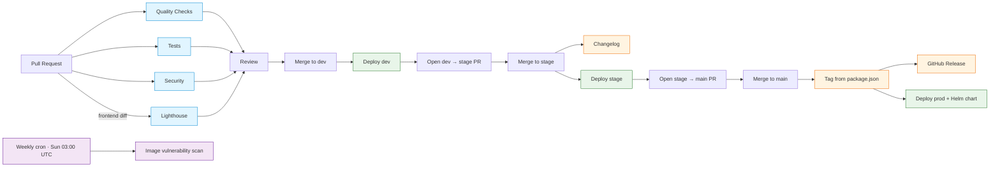

# CI/CD Workflows

GitHub Actions pipelines that gate pull requests, scan for
vulnerabilities, and promote artefacts through `dev` → `stage` →
`main` (tagged) environments.

**Related:**

- [CI/CD Pipeline](06-cicd-pipeline.md) — architecture overview
- [Release Management](release-management.md) — versioning &
  promotion
- [Workflow Guide](workflow-guide.md) — developer day-to-day

## Pipeline Flow



The `Cron → Scan` branch runs independently of the deploy chain
(scheduled trigger only); it is drawn separately to avoid implying
production deploys cause the scan.

## Workflows

The repository ships twelve workflows under `.github/workflows/`.

### `quality-check.yml` — Quality Checks

**Trigger:** PR / push to `main`, `dev`, `stage`, `ci-test/**`.
**Jobs:** `frontent-quality` runs `make lint` then `tsc`/`vue-tsc`;
`backend-quality` runs `make lint` (Ruff + Prettier) followed by a
separate `make type-check` step (mypy). Both jobs run in parallel;
failure blocks merge.

### `test.yml` — Tests

**Trigger:** PR / push to `main`, `dev`, `stage`, `ci-test/**`.
**Jobs:** `test-backend` (pytest + Codecov), `test-frontend` (Vitest +
Codecov). Coverage uploads target the same Codecov project; tokens
are required only for private forks.

### `integration-tests.yml` — Backend Integration Tests

**Trigger:** daily cron (03:30 UTC), `workflow_dispatch`, push to
`ci-test/**`. **Job:** `test-backend-integration` runs
`make test-cov-xml-integration` and uploads the report to Codecov
under the `backend-integration` flag.

### `security.yml` — Security Checks

**Trigger:** PR to `main`/`dev`/`stage`, push to `main`, weekly cron
(Mon 00:00 UTC). **Jobs:** `npm-audit` (root + frontend),
`python-security` (`uvx uv-audit` + Bandit), `codeql` (JavaScript +
Python matrix), `secrets-scan` (TruffleHog).

### `lighthouse.yml` — Lighthouse CI

**Trigger:** PR touching `frontend/**` or its config. **Job:**
`lighthouse` audits 5 critical routes via
`frontend/.lighthouserc.ci.json`. The build injects
`window.__LIGHTHOUSE_BYPASS__ = true` into the served `index.html`
so navigation guards skip auth in CI; the flag never reaches
production builds. Full 24-route sweep stays local
(`make lighthouse`).

### `deploy.yml` — App Deploy

**Trigger:** push to `dev`, `stage`, `ci-test/**`, or tags
`v*.*.*`. **Jobs:** `publish-chart` (delegated to
`publish_chart.yaml`) then `deploy` (EPFL-ENAC build-push-deploy
action). A single `deploy` job pushes images to **both**
`ghcr.io` and the EPFL Quay registry `quay-its.epfl.ch` (path
`svc1751`); manifests update Argo CD repos
`EPFL-ENAC/enack8s-app-config` and
`EPFL-ENAC/openshift-app-config` respectively. Tags promote to
production; branches map to the matching environment URL.

### `publish_chart.yaml` — Helm Chart Packager

**Trigger:** `workflow_call` only (reused by `deploy.yml`).
**Job:** `build-image` packages the Helm chart and exposes
`chart_version` as an output for the downstream deploy step.

### `deploy-storybook.yml` — Storybook Image + Manifest Dispatch

**Trigger:** push to `dev`, `main`, `stage`, or the storybook
feature branch. **Job:** `build-and-push` builds the Storybook
container from `frontend/Dockerfile.storybook`, pushes it to
`ghcr.io/epfl-enac/co2-calculator-storybook`, then POSTs a
`repository_dispatch` (`event_type: update-manifest`) to
`EPFL-ENAC/enack8s-app-config` so Argo CD picks up the new image.
It does not publish a static Storybook site — the artifact is the
container image plus the dispatch event.

### `deploy-mkdocs.yml` — Docs (GitHub Pages, deprecated)

**Trigger:** push/PR to `main`, push to `stage`/`ci-test/**`. Kept
as a fallback for the `main` GitHub Pages mirror. Per-environment
docs (`/docs` path) ship with `deploy.yml`.

### `changelog.yml` — Changelog on dev → stage

**Trigger:** PR closed against `stage`. **Job:** `changelog` runs
only when the merged PR came from `dev`, regenerating
`CHANGELOG.md` ahead of the next release.

### `release-please.yml` — Tag and Release

**Trigger:** PR closed against `main`. **Job:** `release` runs
only when the merged PR came from `stage`. Despite the workflow
filename, **it does not invoke the release-please action**: it
reads the version from `package.json`, creates an annotated git
tag `v<version>` directly, extracts the matching section from
`CHANGELOG.md`, and publishes a GitHub Release via
`softprops/action-gh-release`. See
[Release Management](release-management.md) for the full
promotion flow.

### `image-vulnerability-scan.yml` — Registry Vulnerability Scan

**Trigger:** weekly cron (Sun 03:00 UTC) + `workflow_dispatch`.
**Job:** `scan-images` pulls published container images and runs a
vulnerability scan, opening issues for newly discovered CVEs.

## Release Management

Versioning, environment promotion (`dev` → `stage` → `main`), and
hotfix procedure live in
[Release Management](release-management.md). The
`release-please.yml` workflow is the automation entry point for
that flow.

## Required Secrets

| Secret | Used by | Notes |
| --- | --- | --- |
| `GITHUB_TOKEN` | all | auto-provided |
| `MY_RELEASE_PLEASE_TOKEN` | `release-please.yml` | PAT with `contents: write` to push tags + create releases |
| `CD_TOKEN` | `deploy.yml` | EPFL-ENAC build-push-deploy action token |
| `QUAY_TOKEN` | `deploy.yml` | passed as `registry_token` for `quay-its.epfl.ch` push |
| `token` | `deploy-storybook.yml` | bearer token for the `repository_dispatch` POST to `EPFL-ENAC/enack8s-app-config`; the workflow references `secrets.token` literally — the secret name is generic and currently undocumented |
| `CODECOV_TOKEN` | `test.yml`, `integration-tests.yml` | optional, required for private forks |

## Status Badges

```markdown
[](https://github.com/EPFL-ENAC/co2-calculator/actions/workflows/quality-check.yml)
[](https://github.com/EPFL-ENAC/co2-calculator/actions/workflows/test.yml)
[](https://github.com/EPFL-ENAC/co2-calculator/actions/workflows/security.yml)
```

## Local Pre-flight

Reproduce CI locally before pushing:

```bash
make lint     # quality-check.yml
make test     # test.yml
make ci       # full simulation
```

## Troubleshooting

- **CodeQL fails on Python:** confirm `language: [javascript, python]`
  matrix and that `pyproject.toml` is detected.
- **Lighthouse times out:** raise the per-run budget in
  `frontend/.lighthouserc.ci.json` or trim the URL list.
- **Deploy step missing chart version:** check that
  `publish_chart.yaml` ran first; the `deploy` job consumes its
  `chart_version` output.
- **Tag not created on main merge:** `release-please.yml` only
  fires when the merged PR's head ref is `stage`; merges from any
  other branch are skipped by design. The tag name comes from
  `package.json` — bump it on the `stage` branch before merging.

Enable verbose logs by setting repo secrets
`ACTIONS_RUNNER_DEBUG=true` and `ACTIONS_STEP_DEBUG=true`.
