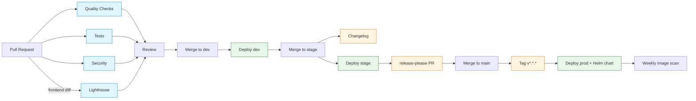

# CI/CD Workflows

GitHub Actions pipelines that gate pull requests, scan for
vulnerabilities, and promote artefacts through `dev` → `stage` →
`main` (tagged) environments.

**Related:**

- [CI/CD Pipeline](06-cicd-pipeline.md) — architecture overview
- [Release Management](release-management.md) — versioning &
  promotion
- [Workflow Guide](workflow-guide.md) — developer day-to-day

## Pipeline Flow



## Workflows

The repository ships twelve workflows under `.github/workflows/`.

### `quality-check.yml` — Quality Checks

**Trigger:** PR / push to `main`, `dev`, `stage`, `ci-test/**`.
**Jobs:** `frontent-quality` (ESLint + Vue type-check), `backend-quality`
(Ruff + mypy via `make lint`). Both jobs run in parallel; failure
blocks merge.

### `test.yml` — Tests

**Trigger:** PR / push to `main`, `dev`, `stage`, `ci-test/**`.
**Jobs:** `test-backend` (pytest + Codecov), `test-frontend` (Vitest +
Codecov). Coverage uploads target the same Codecov project; tokens
are required only for private forks.

### `security.yml` — Security Checks

**Trigger:** PR to `main`/`dev`/`stage`, push to `main`, weekly cron
(Mon 00:00 UTC). **Jobs:** `npm-audit`, `python-security`
(Safety + Bandit), `codeql` (JS + Python), `secrets-scan`
(TruffleHog). Dependency Review runs only on PR events.

### `lighthouse.yml` — Lighthouse CI

**Trigger:** PR touching `frontend/**` or its config. **Job:**
`lighthouse` audits 5 critical routes via
`frontend/.lighthouserc.ci.json`. The build injects
`window.__LIGHTHOUSE_BYPASS__ = true` into the served `index.html`
so navigation guards skip auth in CI; the flag never reaches
production builds. Full 24-route sweep stays local
(`make lighthouse`).

### `deploy.yml` & `deploy-quay.yml` — App Deploy

**Trigger:** push to `dev`, `stage`, `ci-test/**`, or tags
`v*.*.*`. **Jobs:** `publish-chart` (delegated to
`publish_chart.yaml`) then `deploy` (EPFL-ENAC build-push-deploy
action). `deploy.yml` targets the GHCR registry; `deploy-quay.yml`
targets quay.io. Tags promote to production; branches map to the
matching environment URL.

### `publish_chart.yaml` — Helm Chart Packager

**Trigger:** `workflow_call` only (reused by both deploy
workflows). **Job:** `build-image` packages the Helm chart and
exposes `chart_version` as an output for downstream deploy steps.

### `deploy-storybook.yml` — Storybook Deploy

**Trigger:** push to `dev`, `main`, `stage`, or the storybook
feature branch. **Job:** `build-and-push` builds Storybook and
publishes the static site so designers can preview components per
environment.

### `deploy-mkdocs.yml` — Docs (GitHub Pages, deprecated)

**Trigger:** push/PR to `main`, push to `stage`/`ci-test/**`. Kept
as a fallback for the `main` GitHub Pages mirror. Per-environment
docs (`/docs` path) ship with `deploy.yml` and `deploy-quay.yml`.

### `changelog.yml` — Changelog on dev → stage

**Trigger:** PR closed against `stage`. **Job:** `changelog` runs
only when the merged PR came from `dev`, regenerating
`CHANGELOG.md` ahead of the next release-please cut.

### `release-please.yml` — Tag and Release

**Trigger:** PR closed against `main`. **Job:** `release` runs only
on merges from `stage`, opening or updating the release-please PR,
bumping the version, and creating the GitHub release + tag once
merged. See [Release Management](release-management.md) for the
full promotion flow.

### `image-vulnerability-scan.yml` — Registry Vulnerability Scan

**Trigger:** weekly cron (Sun 03:00 UTC) + `workflow_dispatch`.
**Job:** `scan-images` pulls published container images and runs a
vulnerability scan, opening issues for newly discovered CVEs.

## Release Management

Versioning, environment promotion (`dev` → `stage` → `main`), and
hotfix procedure live in
[Release Management](release-management.md). The
`release-please.yml` workflow is the automation entry point for
that flow.

## Required Secrets

| Secret | Used by | Notes |
| --- | --- | --- |
| `GITHUB_TOKEN` | all | auto-provided |
| `MY_RELEASE_PLEASE_TOKEN` | `release-please.yml` | needs `contents: write` PAT |
| `CD_TOKEN` | `deploy*.yml` | EPFL-ENAC deploy action |
| `CODECOV_TOKEN` | `test.yml` | optional, private forks only |

## Status Badges

```markdown
[](https://github.com/EPFL-ENAC/co2-calculator/actions/workflows/quality-check.yml)
[](https://github.com/EPFL-ENAC/co2-calculator/actions/workflows/test.yml)
[](https://github.com/EPFL-ENAC/co2-calculator/actions/workflows/security.yml)
```

## Local Pre-flight

Reproduce CI locally before pushing:

```bash
make lint     # quality-check.yml
make test     # test.yml
make ci       # full simulation
```

## Troubleshooting

- **CodeQL fails on Python:** confirm `language: [javascript, python]`
  matrix and that `pyproject.toml` is detected.
- **Lighthouse times out:** raise the per-run budget in
  `frontend/.lighthouserc.ci.json` or trim the URL list.
- **Deploy step missing chart version:** check that
  `publish_chart.yaml` ran first; both deploy workflows depend on
  its `chart_version` output.
- **Release PR not opening:** the PR must merge from `stage` into
  `main`; merges from any other branch are skipped by design.

Enable verbose logs by setting repo secrets
`ACTIONS_RUNNER_DEBUG=true` and `ACTIONS_STEP_DEBUG=true`.
