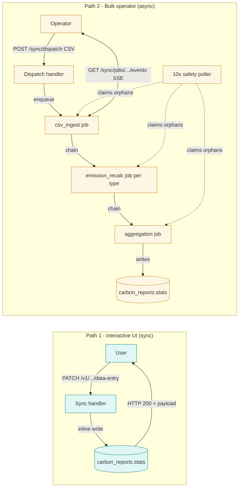
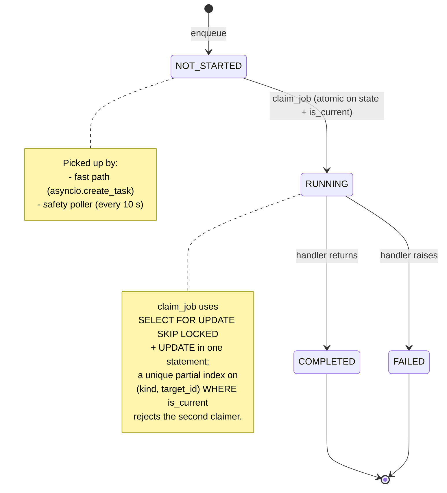

# Data pipeline: the two-path principle

The CO2 calculator handles two very different write workloads, and they need
two very different runtime shapes. **Path 1 — Interactive UI** serves end users
editing a single module: latency below 200 ms, instant feedback, one row touched.
**Path 2 — Bulk operator** serves principal users and backoffice staff uploading
CSVs, syncing factors, and recomputing emissions: minutes of work, thousands of
rows, multiple stages chained together. Forcing both into one model breaks
either UX (sync work blocks request handlers) or operator scale (async chains
add latency to a single-row edit).

The two-path principle keeps them separate. Path 1 stays inline and synchronous.
Path 2 runs as a chain of async jobs claimed atomically by web pods and watched
by an in-process safety-net poller.

## Both paths at a glance

Path 1 returns the result on the same HTTP response. Path 2 returns a job id;
operators stream progress over SSE until the chain settles.

## Job lifecycle on Path 2

A Path 2 job moves through four states. The transition from `NOT_STARTED` to
`RUNNING` is the load-bearing one: it must be atomic so that two pods racing to
claim the same job cannot both win.

Once a job reaches `COMPLETED`, the handler may chain the next job in the same
event loop (fast path) or rely on the poller to pick it up (safety net).

## When to use which path

Use **Path 1 (sync)** when:

- A user is waiting on the response in the browser.
- The work touches one row (or a small bounded set).
- The result must appear in the next render.
- Examples: editing a `DataEntry`, toggling a module setting, deleting a row.

Use **Path 2 (async)** when:

- A whole CSV, factor set, or module-wide recalculation is involved.
- The work fans out across thousands of rows or multiple data-entry types.
- The caller is an operator who can wait minutes and watch SSE progress.
- Examples: `POST /sync/dispatch`, `POST /sync/factors/...`, `POST /sync/units`,
  `POST /sync/recalculate-emissions/...`.

If a request feels like Path 1 but starts to time out under realistic data,
move it to Path 2 rather than letting the sync handler bloat. If a request
feels like Path 2 but the data set is always tiny, keep it on Path 1 — a job
chain for one row is pure overhead.

## Cross-references

- ADR-010 — [Background Job Processing](../architecture-decision-records/010-background-job-processing.md):
  why jobs run in-process on web pods with a safety-net poller, and the
  trade-off vs. a dedicated worker fleet.
- Implementation plan — [310-overview](https://github.com/epfl-enac/co2-calculator/blob/main/docs/implementation-plans/310-overview.md):
  the canonical statement of the two-path principle, plus Plans A–D that codify
  it for the bulk path (pod safety, factor pipeline, DAG handler registry, and
  the responsibility split that makes Path 2 pure async).

Future ADRs on the two-path principle and the `claim_job` atomic transition
will be linked here once they land.
