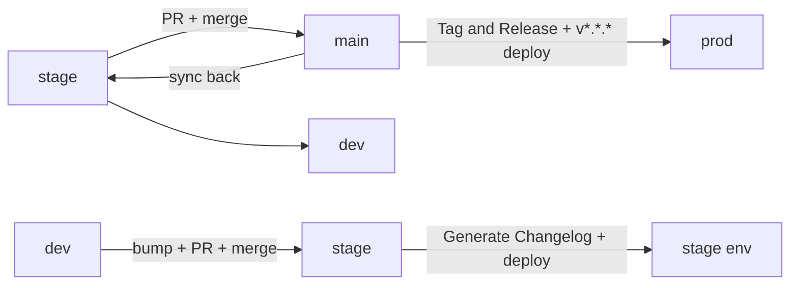

# Dev Release Runbook

Step-by-step commands for the lead developer, or a temporary stand-in, to cut a release. This covers the _how_; for the _why_ — versioning, environments, calendar, approvals — see [Release Management](release-management.md). Use it to promote `stage → main` (the real release) or `dev → stage` (end of sprint).

**Related:** [Release Management](release-management.md) · [CI/CD Pipeline](06-cicd-pipeline.md) · [CI/CD Workflows](cicd-workflows.md)

**Before you start:** write access to `dev`, `stage`, `main`; the `gh` CLI (or the GitHub UI); access to the OpenShift / ArgoCD console to verify deployments.

## Overview

A release is two ordered promotions — do the real release first, then the end-of-sprint promotion. After each, verify the deployment in ArgoCD ([Troubleshooting](#troubleshooting-deployment)).



## 1. Real release: stage to main

Cuts the versioned GitHub release. The custom workflow `release-please.yml` ("Tag and Release") fires when a PR **from `stage`** merges into `main`, and releases the root `package.json` version. (The `release-please` name is legacy — it no longer uses that tool; read the file to see what it does.)

1. **Check changelog and version.** `CHANGELOG.md` is already generated (section 2); confirm its top entry, and that root `package.json` `version` is the version to release — "Tag and Release" tags from this value.
2. **Open the PR** `stage → main` and get external review per [Release Management](release-management.md#release-process). The workflow only fires for `head.ref == 'stage'`, so head **must** be `stage`:
   ```bash
   gh pr create --base main --head stage --title "chore(release): vX.Y.Z"
   ```
3. **Merge the PR.** "Tag and Release" creates the git tag + GitHub release; the `v*.*.*` tag also triggers `deploy` to **prod**. Verify: GitHub → Releases shows `vX.Y.Z`; Actions → "Tag and Release" and "deploy" green.
4. **Re-sync branches** so they don't diverge (no PR needed; use the GitHub UI if not comfortable on the CLI). Verify convergence with `git log --graph --oneline -15`:
   ```bash
   git checkout stage && git pull && git merge origin/main && git push
   git checkout dev   && git pull && git merge origin/stage && git push
   ```
5. **Verify in ArgoCD** that **prod** is healthy on the new version. If not, fix before continuing — see [Troubleshooting](#troubleshooting-deployment).

## 2. End-of-sprint promotion: dev to stage

Ships the sprint to stage and generates the changelog. `changelog.yml` ("Generate Changelog") fires when a PR **from `dev`** merges into `stage` (trigger: `pull_request: closed` into `stage`, `head.ref == 'dev'`).

> **⚠️ Bump the version first.** Edit root `package.json` `version` (e.g. `0.10.0`) and commit on `dev` **before** opening the PR — otherwise the changelog is not generated with the right version.

1. **Open the PR** `dev → stage`. Head **must** be `dev`. Example title: `chore: promote dev to stage (end of sprint 7) (#770)`:
   ```bash
   gh pr create --base stage --head dev --title "chore: promote dev to stage (end of sprint N) (#<issue>)"
   ```
2. **Merge the PR.** `deploy.yml` deploys to **stage**; "Generate Changelog" commits `CHANGELOG.md` to `stage`. Verify: Actions → "deploy" and "Generate Changelog" green; `CHANGELOG.md` updated on `stage`.
3. **Verify in ArgoCD** that stage is healthy; fix any issues — see [Troubleshooting](#troubleshooting-deployment).
4. **Re-sync:** merge `stage` back into `dev` (brings back the changelog commit and any stage fixes):
   ```bash
   git checkout dev && git pull && git merge origin/stage && git push
   ```

> **Optional — human-readable changelog.** The `CHANGELOG.md` generated at step 2 is raw commit messages. Feed the new version's entry to an LLM to rewrite it under three headings — `## Key Changes`, `## Bug Fixes`, `## Technical Improvements (Non-functional)` — then commit it to `stage` before the step 4 re-sync.

Done. The only remaining step is to **communicate the release**.

## Troubleshooting: deployment

If ArgoCD shows the environment unhealthy or on the wrong version, the usual suspects:

| Symptom                            | Cause                                      | Fix                          |
| ---------------------------------- | ------------------------------------------ | ---------------------------- |
| App errors / missing config        | `openshift-app-config` missing env vars    | Add the missing env vars     |
| Auth failures / stale creds        | OpenShift secrets not updated              | Update the OpenShift secrets |
| Schema present, data wrong/missing | Migrations don't migrate data (pre-v1.0.0) | Rebuild the DB (below)       |

### Database rebuild (pre-v1.0.0 only)

> **🚨 Destructive.** `make db-drop` deletes the target database. First open `backend/.env` and confirm `DB_URL` points to the environment you intend — the wrong target on prod is unrecoverable.

Until v1.0.0, migrations don't migrate data, so rebuild and reseed. Get the target `DB_URL` from the secrets manager, set it in `backend/.env`, then from `backend/`:

```bash
make db-drop && make db-create && make db-migrate && make seed-data
```

`make seed-data` loads the reference data (required up to 0.9.0; from 0.10.0 no longer needed). Re-check ArgoCD afterwards.

## Hotfix and rollback

No fixed script — follow standard practice and common sense. For policy and procedure see [Release Management → Emergency Hotfix Process](release-management.md#emergency-hotfix-process), [Release Management → Rollback Procedures](release-management.md#rollback-procedures), and [CI/CD Pipeline → Rollback Mechanisms](06-cicd-pipeline.md#rollback-mechanisms).
