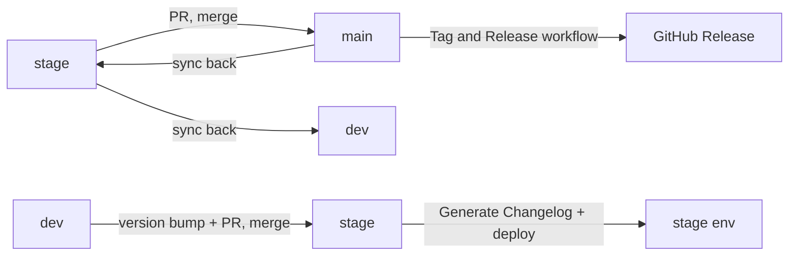

# Dev Release Runbook

Step-by-step operational runbook for the **lead developer** (or a
**temporary lead developer** standing in) to cut a release. This is the
copy-paste command sequence; for the _why_ — versioning rules,
environment model, release calendar, approvals — see
[Release Management](release-management.md).

> Use this when you are the person promoting `stage → main` (the real
> release) and `dev → stage` (end-of-sprint), and you want exact
> commands in order, not policy.

**Related documentation:**

- [Release Management](release-management.md) — policy: versioning, environment model, calendar, approvals
- [CI/CD Pipeline](06-cicd-pipeline.md) — pipeline & deployment architecture
- [CI/CD Workflows](cicd-workflows.md) — GitHub Actions details
- [Workflow Guide](workflow-guide.md) — daily developer workflow

## Prerequisites

- Write access to `dev`, `stage`, and `main`.
- `gh` CLI authenticated **or** willingness to use the GitHub UI for PRs/merges.
- Access to the project's **OpenShift / ArgoCD** console (to verify deployment).
- Access to the **secrets manager** — only if a DB rebuild is needed (see [Database rebuild](#database-rebuild-pre-v100-only)).
- Know who to notify once the release is out (the final manual step is communication).

## Overview

A full release is **two distinct promotions**, done in this order:



1. [**The real release** — `stage → main`](#1-the-real-release-promote-stage-main): cuts the versioned GitHub release, then re-sync branches.
2. [**End-of-sprint promotion** — `dev → stage`](#2-end-of-sprint-promotion-dev-stage): ships the sprint to the stage environment and generates the changelog.

After **each** promotion, verify the deployment in ArgoCD
([Troubleshooting](#troubleshooting-stage-deployment)).

## 1. The real release: promote `stage` → `main`

This creates the versioned GitHub release. The custom workflow
`.github/workflows/release-please.yml` (display name **"Tag and
Release"**) runs when a PR **from `stage`** is **merged into `main`**.

> The `release-please` filename is legacy — it no longer uses the
> release-please tool. It is now a custom workflow that creates a GitHub
> release based on the **root `package.json`** `version`. Read the file
> to see exactly what it does.

### Step 1 — Verify `CHANGELOG.md`

`CHANGELOG.md` should already be up to date — it is generated
automatically by the changelog workflow on each `dev → stage`
promotion (see [section 2](#2-end-of-sprint-promotion-dev-stage)).

- Open `CHANGELOG.md`; confirm the entry for the version you are releasing exists and reads correctly.
- Verify root `package.json` `version` matches the release you intend to cut — **"Tag and Release" tags and releases from this value.**

### Step 2 — Open the `stage → main` PR

```bash
gh pr create --base main --head stage \
  --title "chore(release): vX.Y.Z" \
  --body "Promote stage to main — release vX.Y.Z"
```

- Get external code review per [Release Management → Release Process](release-management.md#release-process).
- Verify the PR head is `stage` and base is `main` — "Tag and Release" only fires for `head.ref == 'stage'`.

### Step 3 — Merge the PR → release is created

- Merge the PR.
- The **"Tag and Release"** workflow runs on merge: creates the git tag and the GitHub release from root `package.json` `version`.
- Verify: GitHub → **Releases** shows the new `vX.Y.Z`; **Actions → Tag and Release** is green.

> **Note — how `main`/prod deploys:** `deploy.yml` triggers on pushes
> to `dev`/`stage` **and** on `v*.*.*` tag pushes (`tags: ["v*.*.*"]`).
> Creating the `vX.Y.Z` tag in this step therefore also triggers the
> **"deploy"** workflow for prod/main automatically — no extra action
> needed. Just verify it landed in ArgoCD (Step 5).

### Step 4 — Re-sync branches (prevent divergence)

Merge `main` back into `stage`, then `stage` back into `dev`, so the
three branches don't diverge. No PR is strictly required — **if you are
not comfortable on the command line, do these merges in the GitHub UI.**

```bash
# main → stage
git checkout stage && git pull && git merge origin/main && git push

# stage → dev
git checkout dev && git pull && git merge origin/stage && git push
```

- Verify: `git log --graph --oneline -15` shows the branches converged.

### Step 5 — Verify the deployment (OpenShift / ArgoCD)

- Open the project's ArgoCD; confirm the release deployed correctly.
- If it is not healthy, fix it before proceeding — see [Troubleshooting](#troubleshooting-stage-deployment).

## 2. End-of-sprint promotion: `dev` → `stage`

This ships the sprint's work to the **stage** environment and generates
the changelog. The workflow `.github/workflows/changelog.yml` (display
name **"Generate Changelog"**) runs when a PR **from `dev`** is
**merged into `stage`**, and reads the next version from root
`package.json`.

### Step 1 — Bump the version in root `package.json`

> **⚠️ Bump first:** If you skip this, the automatic changelog will
> **not** be generated with the right version. Do this **before**
> opening the PR.

- Edit root `package.json` → set `version` to the next sprint version (e.g. `0.10.0`).
- Commit it on `dev` and push.

### Step 2 — Open the `dev → stage` promotion PR

```bash
gh pr create --base stage --head dev \
  --title "chore: promote dev to stage (end of sprint N) (#<issue>)" \
  --body "Promote dev to stage — end of sprint N"
```

- Example title: `chore: promote dev to stage (end of sprint 7) (#770)`.
- The PR is what triggers the changelog workflow (on `pull_request: closed` into `stage`). The PR head **must** be `dev`:

  ```yaml
  on:
    pull_request:
      types: [closed]
      branches:
        - stage
  ```

- Verify: base `stage`, head `dev`.

### Step 3 — Merge & watch the `deploy` workflow

- Merge the PR.
- On merge (push to `stage`), `.github/workflows/deploy.yml` (**"deploy"**) runs and deploys to the stage environment.
- The **"Generate Changelog"** workflow also runs and commits the updated `CHANGELOG.md` to `stage`.
- Verify: **Actions → deploy** green; **Actions → Generate Changelog** green; `CHANGELOG.md` updated on `stage`.

### Step 4 — Verify on OpenShift / ArgoCD

- Confirm the release deployed to the stage environment.
- If there are issues, fix them — see [Troubleshooting](#troubleshooting-stage-deployment).

### Step 5 — Re-sync: merge `stage` back into `dev`

Once stage is healthy and any fixes are in, merge `stage` back into
`dev` so they stay in sync (this also brings the changelog commit and
any stage-only fixes back into `dev`).

```bash
git checkout dev && git pull && git merge origin/stage && git push
```

- Verify: `dev` contains the changelog commit and any stage fixes.

**And voilà — it's done.** The only remaining step is to **communicate**
the release.

## Troubleshooting: stage deployment

If ArgoCD shows the stage environment unhealthy or not on the new
version, the usual suspects:

| Symptom                               | Cause                                                   | Fix                                        |
| ------------------------------------- | ------------------------------------------------------- | ------------------------------------------ |
| App errors / missing config           | `openshift-app-config` missing env variables            | Add the missing env vars to the app config |
| Auth failures / stale credentials     | OpenShift secrets not updated                           | Update the OpenShift secrets               |
| Schema present but data wrong/missing | Alembic migrations do not _migrate data_ (until v1.0.0) | Rebuild the DB — see below                 |

### Database rebuild (pre-v1.0.0 only)

> **🚨 Destructive — drops the entire database.** `make db-drop`
> **deletes the target database**. Until **v1.0.0**, migrations do not
> migrate data, so a full rebuild + reseed is the sanctioned recovery.
> **Before running anything**, open `backend/.env` and confirm `DB_URL`
> points to the environment you intend (stage or prod). Getting this
> wrong on **prod** is unrecoverable.

1. Get the target DB URL from the **secrets manager** (stage or prod).
2. Set `DB_URL` in `backend/.env` to that URL. **Re-read it and confirm the host and database name are the ones you intend.**
3. From `backend/`:

   ```bash
   make db-drop
   make db-create
   make db-migrate
   make seed-data
   ```

4. **Reference data:** for release **0.9.0** you must additionally
   upload reference data. <!-- TODO: document the exact reference-data upload procedure for ≤0.9.0 (UI flow / script / the reference-upload feature, PR #1189). --> From sprint **0.10.0**
   onward this is no longer needed (a priori).
5. Re-check ArgoCD: the stage environment is healthy and on the new version.

## Hotfix & rollback

Command sequences for these are not duplicated here. For the policy and
procedure, see:

- [Release Management → Emergency Hotfix Process](release-management.md#emergency-hotfix-process)
- [Release Management → Rollback Procedures](release-management.md#rollback-procedures)
- [CI/CD Pipeline → Rollback Mechanisms](06-cicd-pipeline.md#rollback-mechanisms)
