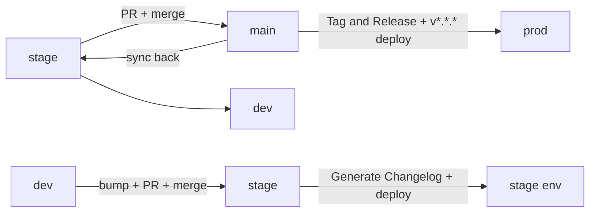

# Dev Release Runbook

Step-by-step commands for the lead developer, or a temporary stand-in,
to cut a release. This covers the _how_; for the _why_ — versioning,
environments, calendar, approvals — see
[Release Management](release-management.md).

> Use this to promote `stage → main` (the real release) or
> `dev → stage` (end of sprint). Commands, not policy.

**Related:** [Release Management](release-management.md) ·
[CI/CD Pipeline](06-cicd-pipeline.md) ·
[CI/CD Workflows](cicd-workflows.md)

**Before you start:** you need write access to `dev`, `stage`, and
`main`; the `gh` CLI (or the GitHub UI); and access to the OpenShift /
ArgoCD console to verify deployments.

## Overview

A release is two ordered promotions. Do the real release first, then
the end-of-sprint promotion.



## 1. Real release: stage to main

This cuts the versioned GitHub release. The custom workflow
`release-please.yml` ("Tag and Release") fires when a PR from `stage`
merges into `main`, and releases the root `package.json` version.

> The `release-please` name is legacy — the workflow no longer uses the
> release-please tool. Read the file to see what it does.

1. **Check the changelog and version.** `CHANGELOG.md` is already
   generated (see section 2). Confirm its top entry, and that root
   `package.json` `version` is the version you intend to release.
2. **Open the PR** from `stage` into `main`:
   ```bash
   gh pr create --base main --head stage --title "chore(release): vX.Y.Z"
   ```
   Get external review per
   [Release Management](release-management.md#release-process).
3. **Merge the PR.** "Tag and Release" creates the git tag and GitHub
   release. The `v*.*.*` tag also triggers the `deploy` workflow to
   **prod**.
4. **Re-sync branches** so they do not diverge (no PR needed; use the
   GitHub UI if you are not comfortable on the CLI):
   ```bash
   git checkout stage && git pull && git merge origin/main && git push
   git checkout dev   && git pull && git merge origin/stage && git push
   ```
5. **Verify in ArgoCD** that **prod** is healthy on the new version.
   If not, see [Troubleshooting](#troubleshooting-deployment).

## 2. End-of-sprint promotion: dev to stage

This ships the sprint to the stage environment and generates the
changelog. The workflow `changelog.yml` ("Generate Changelog") fires
when a PR from `dev` merges into `stage`.

> **⚠️ Bump the version first.** Edit root `package.json` `version`
> (e.g. `0.10.0`) and commit on `dev`. Skip this and the changelog is
> not generated.

1. **Open the PR** from `dev` into `stage`:
   ```bash
   gh pr create --base stage --head dev \
     --title "chore: promote dev to stage (end of sprint N) (#<issue>)"
   ```
   Example: `chore: promote dev to stage (end of sprint 7) (#770)`.
2. **Merge the PR.** `deploy.yml` deploys to **stage**; "Generate
   Changelog" commits the updated `CHANGELOG.md` to `stage`.
3. **Verify in ArgoCD** that stage is healthy. Fix any issues — see
   [Troubleshooting](#troubleshooting-deployment).
4. **Re-sync:** merge `stage` back into `dev`:
   ```bash
   git checkout dev && git pull && git merge origin/stage && git push
   ```

Done. The only remaining step is to **communicate the release**.

## Troubleshooting: deployment

If ArgoCD shows the environment unhealthy or on the wrong version, the
usual suspects:

| Symptom                     | Cause                               | Fix                          |
| --------------------------- | ----------------------------------- | ---------------------------- |
| App errors / missing config | `openshift-app-config` missing vars | Add the missing env vars     |
| Auth failures / stale creds | OpenShift secrets not updated       | Update the OpenShift secrets |
| Schema present, data wrong  | Migrations do not migrate data      | Rebuild the DB (below)       |

### Database rebuild (pre-v1.0.0 only)

> **🚨 Destructive.** `make db-drop` deletes the target database.
> First, open `backend/.env` and confirm `DB_URL` points to the
> environment you intend. The wrong target on prod is unrecoverable.

Until v1.0.0, migrations do not migrate data, so rebuild and reseed.
Get the target `DB_URL` from the secrets manager, set it in
`backend/.env`, then from `backend/`:

```bash
make db-drop && make db-create && make db-migrate && make seed-data
```

`make seed-data` loads the reference data (required up to 0.9.0; from
0.10.0 it is no longer needed). Re-check ArgoCD afterwards.

## Hotfix and rollback

No fixed script — follow standard practice and common sense. For the
policy and procedure, see:

- [Release Management → Emergency Hotfix Process](release-management.md#emergency-hotfix-process)
- [Release Management → Rollback Procedures](release-management.md#rollback-procedures)
- [CI/CD Pipeline → Rollback Mechanisms](06-cicd-pipeline.md#rollback-mechanisms)
