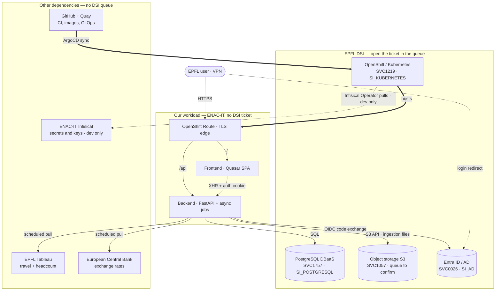

# Security Documentation Index

Maps the ten documents ENAC-IT requires for this service to where each
one actually lives. Most were already written as ordinary engineering
docs; this page is what makes them findable as a set. Start here when
answering a security questionnaire or an audit.

**Reading time**: ~6 minutes

## The ten required documents

| #   | Required document          | Where it lives                                                                                                                                                                                                                                                                                               | State       |
| --- | -------------------------- | ------------------------------------------------------------------------------------------------------------------------------------------------------------------------------------------------------------------------------------------------------------------------------------------------------------ | ----------- |
| 1   | Encryption keys management | [Encryption and Key Management](encryption.md)                                                                                                                                                                                                                                                               | ✅ Complete |
| 2   | Operating procedures       | [Release runbook](release-runbook.md), [Infra overview](../infra/01-overview.md)                                                                                                                                                                                                                             | ✅ Complete |
| 3   | Change management          | [Guardrails § Workflow](../contributing/guardrails.md), [Release management](release-management.md), [Workflow guide](workflow-guide.md)                                                                                                                                                                     | ✅ Complete |
| 4   | Malicious code detection   | [ADR-014 §1, §2, §6](../architecture-decision-records/014-security-checklist.md) — Dependabot, CodeQL, secret scanning, Trivy                                                                                                                                                                                | ✅ Complete |
| 5   | Vulnerability monitoring   | [ADR-014 §1, §2](../architecture-decision-records/014-security-checklist.md), [CI/CD workflows](cicd-workflows.md)                                                                                                                                                                                           | ✅ Complete |
| 6   | Third-party list           | [Third parties](#third-parties) below; dependency-level detail in the repository's GitHub dependency graph                                                                                                                                                                                                   | ✅ Complete |
| 7   | Incident response          | [Incident Response](incident-response.md) — severity tiers, communication timeframes, confidentiality, and the personal-data notification; responder roster in the [Disaster Recovery Plan](https://github.com/EPFL-ENAC/openshift-app-config/blob/main/epfl/co2-calculator/DRP.md) (private ops repository) | ✅ Complete |
| 8   | Business continuity plan   | [Disaster Recovery Plan](https://github.com/EPFL-ENAC/openshift-app-config/blob/main/epfl/co2-calculator/DRP.md) (private ops repository) — recovery team, namespace and bucket re-provisioning, secret recovery, GitOps and ArgoCD restore, database restore, manual build path, monitoring recovery        | ✅ Complete |
| 9   | Maintenance and restore    | [Release runbook](release-runbook.md), [Disaster Recovery Plan](https://github.com/EPFL-ENAC/openshift-app-config/blob/main/epfl/co2-calculator/DRP.md) (private ops repository), backup section of [Infra overview](../infra/01-overview.md), [Recovery objectives](#recovery-objectives)                   | ✅ Complete |
| 10  | Compliance procedures      | [EPFL compliance mapping](epfl-compliance-mapping.md), [EPFL constraints](epfl-constraint.md)                                                                                                                                                                                                                | ✅ Complete |

## What is still open

- **Recovery timeframes (9)** — best effort for what we control,
  documented under [Recovery objectives](#recovery-objectives).
  Detection is measured and fast; database RPO/RTO is now covered by
  EPFL DSI's own SLA (see below), but deleted objects are still not
  recoverable at all — that is a decision to take, not code to write.
- **Object storage support queue** — every other DSI dependency has a
  named `SI_` queue in the [service map](#service-map-and-dsi-queues);
  object storage does not. Ask DSI which queue owns SVC1057 and record
  it there, so an incident is not routed by guesswork.

That gap is not closed by a code change. Track it as an issue rather
than leaving it implied by an unticked box.

## Recovery objectives

**Best effort for what we control.** Detection, notification and
application restore have no contractual SLA — that's ours to own.
Database recovery follows EPFL DSI's own terms: see the
[EPFL PostgreSQL SLA](https://go.epfl.ch/SVC1757) for backup
frequency, RPO, RTO and the point-in-time-recovery window — link it
rather than copying its figures here, since DSI can revise them
without this doc knowing. What _is_ measured on our side:

| Stage                | Actual capability                                                                                                                                                                                |
| -------------------- | ------------------------------------------------------------------------------------------------------------------------------------------------------------------------------------------------ |
| Detection            | 1–10 minutes. `PodOOMKilled` fires at 1 min; `PodNotReady`, `PVCAlmostFull` and `ImagePullBackOff` at 5 min; `BackendMetricsAbsent`, the total-outage detector, at 10 min                        |
| Application symptoms | 5 minutes — latency P50/P95/P99 and error-rate alerts; upload and job SLO breaches at 15 min                                                                                                     |
| Notification         | ~30 s after an alert fires, by email to the sysadmin group; re-sent every 4 h until resolved, and again on recovery                                                                              |
| External check       | Icinga probes HTTPS, certificate validity and the database from outside the cluster                                                                                                              |
| Restore, application | Minutes — ArgoCD auto-sync and self-heal reconcile a bad deploy; revert the GitOps commit and it rolls back                                                                                      |
| Restore, database    | Requested from EPFL DSI by a ticket in `SI_POSTGRESQL` (SVC1757). RPO, RTO and the PITR window are set by the [EPFL PostgreSQL SLA](https://go.epfl.ch/SVC1757), not by us                       |
| Restore, files       | **Not possible, by decision** — buckets have versioning disabled. Object storage stages ingestion files; the durable record is in PostgreSQL, and a lost CSV is re-uploaded rather than restored |

Detection and application recovery are ours and are fast. Database
recovery follows the [EPFL PostgreSQL SLA](https://go.epfl.ch/SVC1757)
— refer to it directly for current figures rather than a value
duplicated here.

Object storage is deliberately not versioned. It holds ingestion files
in transit (`tmp/`, `processing/`, `processed/`); the emission data they
produce lives in PostgreSQL and is backed up there. Paying for version
history on a staging area would protect a copy, not the record.

Alert rules and routing live in the private ops repository under
`overlays/<env>/monitoring/`.

## Service map and DSI queues

Follow an arrow backwards from the symptom to whoever owns it. Anything
in the DSI box has its own service number and support queue: **open the
incident directly in that queue**. A ticket in the wrong queue is
re-routed by hand and costs hours at the worst possible moment.

| Dependency                  | Service                               | Queue             | Open a ticket when                                              |
| --------------------------- | ------------------------------------- | ----------------- | --------------------------------------------------------------- |
| OpenShift / Kubernetes      | [SVC1219](https://go.epfl.ch/SVC1219) | `SI_KUBERNETES`   | Pods will not schedule, Route down, cluster-wide failure        |
| PostgreSQL (DBaaS)          | [SVC1757](https://go.epfl.ch/SVC1757) | `SI_POSTGRESQL`   | Database unreachable, restore or point-in-time recovery request |
| Object storage (S3)         | [SVC1057](https://go.epfl.ch/SVC1057) | **not published** | Bucket unreachable, S3 credentials rejected                     |
| Entra ID / Active Directory | [SVC0026](https://go.epfl.ch/SVC0026) | `SI_AD`           | Login broken, group or role claims missing                      |

Numbers and queues are as supplied by EPFL DSI and are not verified from
this repository. The linked service page carries the current service
manager — read it there rather than trusting a name copied into a doc.

**Object storage has no published `SI_` queue.** Buckets are ordered and
managed through the VPSI XaaS portal (<https://portal-xaas.epfl.ch>,
[FAQ](https://inside.epfl.ch/portal-xaas/s3-object-storage-faq/)) — start
there, or open the incident against SVC1057 itself and let DSI route it.
Record the queue here once it is known — see
[What is still open](#what-is-still-open).

Infisical, Tableau, the ECB feed and GitHub are **not DSI services**; an
`SI_` ticket for them goes nowhere. Infisical is ENAC-IT's own vault
(dev only — stage and prod secrets are created by hand), the others are
vendor or data-source issues.

This map is scoped to triage: who to call when something breaks. For the
full picture, including local Docker Compose and the observability
stack, see [Deployment Topology](11-deployment-topology.md).

## Third parties

Services this deployment depends on:

| Service                | Role                                            |
| ---------------------- | ----------------------------------------------- |
| Microsoft Entra ID     | Authentication and authorization (OIDC)         |
| EPFL DSI PostgreSQL    | Application database                            |
| EPFL S3                | Object storage for uploads and ingestion files  |
| ENAC-IT Infisical      | Secret and encryption-key vault                 |
| EPFL Tableau           | Source of travel and headcount data             |
| European Central Bank  | Exchange-rate reference data                    |
| GitHub                 | Source hosting, CI/CD, image registry, scanning |
| OpenShift / Kubernetes | Runtime platform                                |

DSI-run services carry a service number and a support queue — see the
[service map](#service-map-and-dsi-queues) for which one to ticket.

Library and package dependencies are not listed here — they change too
often for a hand-maintained list to stay honest. The GitHub dependency
graph is the source of truth, and Dependabot watches it.

## Ownership and review cadence

| Document                      | Owner           | Reviewed                    |
| ----------------------------- | --------------- | --------------------------- |
| This index                    | Lead developer  | Annually, and on any change |
| Encryption and key management | Lead developer  | On any encryption change    |
| Operating and restore docs    | Lead developer  | Before each major release   |
| Third-party list              | Project manager | Quarterly                   |
| Incident response, BCP        | Project manager | Annually                    |

A document that changes without this index changing is the failure mode
this page exists to prevent — update both in the same PR.
