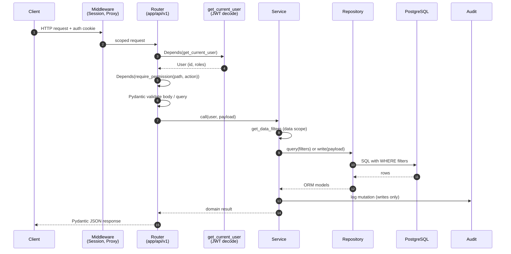
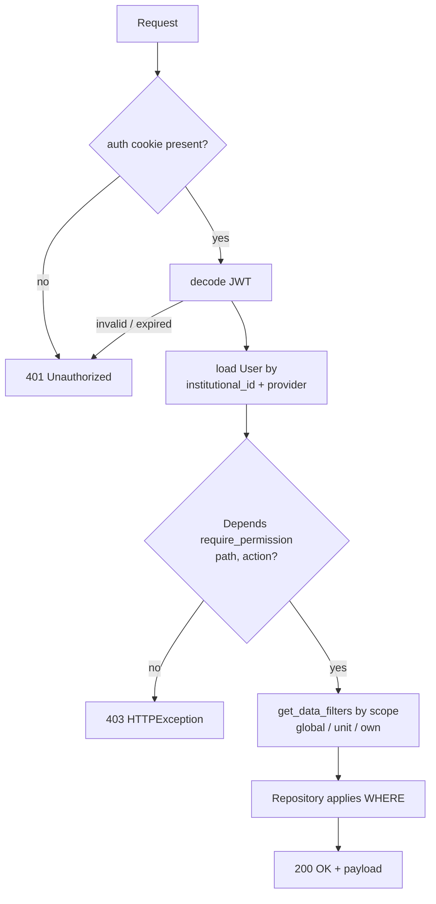

# Request Flow

A request travels through middleware, router, service, and repository
before hitting the database. Each layer has one job. This page shows
the lifecycle and points at the auth and audit hooks.

For deeper auth details see
[06 Permission System](06-PERMISSION-SYSTEM.md),
[07 Permissions Developer Guide](07-DEVELOPER-GUIDE-PERMISSIONS.md),
[ADR-005 In-Code RBAC](../architecture-decision-records/005-authorization-strategy.md),
and [ADR-012 JWT](../architecture-decision-records/012-jwt-authentication-strategy.md).

## Sequence



Authentication runs as a FastAPI dependency, not middleware.
**Permission checks run at the route layer** via
`Depends(require_permission(path, action))` per ADR-005 — see usage
across `backend/app/api/v1/data_sync.py`. Service code receives an
already-authorized user and focuses on **data-scope filtering**.

Audit writes have two integration points: auth events log directly
from `app/api/v1/auth.py` via `_log_auth_audit_event`; service-layer
mutations log via `AuditDocumentService.create_version()`. The
`audit_helpers` module is utility-only (e.g., `extract_handled_ids`)
— not a write path.

## Auth and Permission Flow



Roles are stored on `User.roles_raw`. Permissions are computed during
policy evaluation per request from the role list — never persisted.
The `/auth/me` endpoint is a separate route used by the SPA to fetch
its own permission set; it is not on the request-time auth path for
other endpoints. See [06 Permission System](06-PERMISSION-SYSTEM.md)
for computation rules and [07](07-DEVELOPER-GUIDE-PERMISSIONS.md) for
adding new permission paths.

## Worked Example: `GET /api/v1/resources`

Router declares dependencies — FastAPI handles JWT decode, body
validation, permission check, and DI before the handler runs:

```python
@router.get(
    "/resources",
    response_model=list[ResourceRead],
    dependencies=[Depends(require_permission("modules.resources", "view"))],
)
async def list_resources(
    db: AsyncSession = Depends(get_db),
    user: User = Depends(get_current_active_user),
):
    return await resource_service.list_resources(db, user)
```

Service builds the scope filter and delegates — no permission check
here, route already enforced it:

```python
async def list_resources(db: AsyncSession, user: User):
    filters = get_data_filters(user, "resources")  # global/unit/own
    return await resource_repo.get_resources(db, filters)
```

Repository applies the filters at the database level — never in Python,
never trust caller-provided ones:

```python
async def get_resources(session: AsyncSession, filters: dict):
    stmt = select(Resource)
    for key, value in filters.items():
        col = getattr(Resource, key)
        stmt = stmt.where(col.in_(value) if isinstance(value, list) else col == value)
    result = await session.exec(stmt)
    return result.all()
```

Pydantic `response_model` serializes the ORM rows to JSON.

## Errors

Route-level authorization currently raises
`HTTPException(403, "Permission denied")` from `app/core/security.py`
when `require_permission` denies access. That is the 403 shape callers
see today.

For service-layer code that needs structured payloads, three custom
exception classes are pre-wired in `app/main.py` with handlers:

```python
app.add_exception_handler(PermissionDeniedError, permission_denied_handler)
app.add_exception_handler(InsufficientScopeError, permission_denied_handler)
app.add_exception_handler(RecordAccessDeniedError, permission_denied_handler)
```

`permission_denied_handler` (`app/core/exception_handlers.py`) returns
HTTP 403 with a structured body containing `detail`, `permission.path`,
`permission.action`, and — when applicable — `scope` or `record`
context. These classes are scaffolding: services may raise them to
surface structured 403 details. Today no service raises them in
production code, so a debugger tracing a real 403 should look at
`HTTPException` first.

Other failure modes:

- `401` — missing or invalid JWT (FastAPI `HTTPException` from the
  `get_current_user` dependency).
- `422` — Pydantic validation error on body, query, or path params
  (FastAPI default handler).
- `5xx` — uncaught exceptions; the global logger captures them.

Fail closed: when scope or permission state is ambiguous, services
raise rather than return data.

## Rules

- One job per layer. Routers validate, depend on permission and DB
  sessions, and route. Services orchestrate and apply data-scope.
  Repositories query.
- Filter at the database. Build a filter dict in the service, apply
  it in `WHERE`. Never load-then-filter in Python.
- Declare dependencies. Use `Depends(...)` so auth, permission, and DB
  sessions are visible in the signature.
- Audit on writes. Auth events log from `app/api/v1/auth.py` via
  `_log_auth_audit_event`; service mutations log via
  `AuditDocumentService.create_version()`. `audit_helpers` is
  utility-only.
