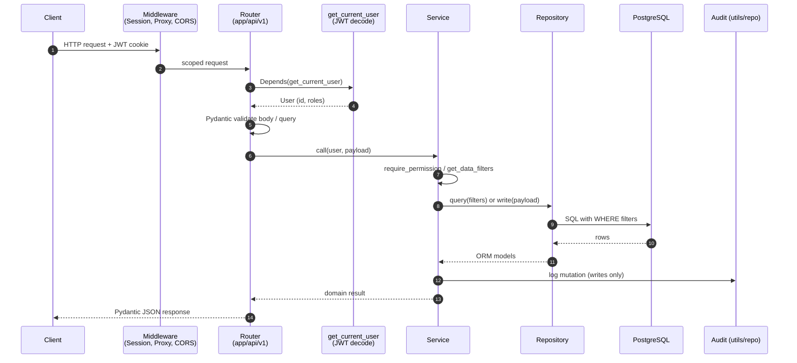
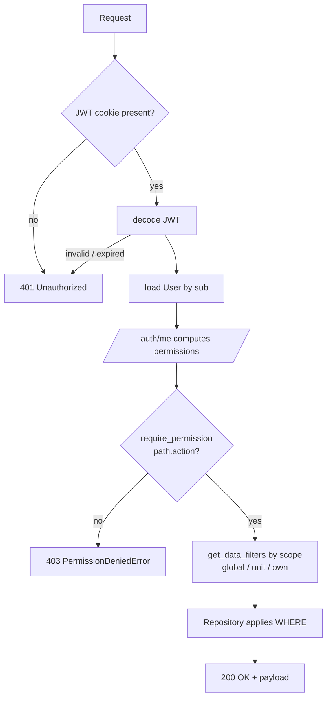

# Request Flow

A request travels through middleware, router, service, and repository
before hitting the database. Each layer has one job. This page shows
the lifecycle and points at the auth and audit hooks.

For deeper auth details see
[06 Permission System](06-PERMISSION-SYSTEM.md),
[07 Permissions Developer Guide](07-DEVELOPER-GUIDE-PERMISSIONS.md),
[ADR-005 In-Code RBAC](../architecture-decision-records/005-authorization-strategy.md),
and [ADR-012 JWT](../architecture-decision-records/012-jwt-authentication-strategy.md).

## Sequence



Authentication runs as a FastAPI dependency, not middleware. Permission
checks and data-scope filters run in the service layer per ADR-005.
Audit writes are invoked from services on mutating endpoints via
`app/utils/audit_helpers.py` and `app/repositories/audit_repo.py`.

## Auth and Permission Flow



Roles are stored on `User.roles_raw`. Permissions are computed on every
`/auth/me` call from the role list — never persisted. See
[06 Permission System](06-PERMISSION-SYSTEM.md) for the computation
rules and [07](07-DEVELOPER-GUIDE-PERMISSIONS.md) for adding new
permission paths.

## Worked Example: `GET /api/v1/resources`

Router declares dependencies — FastAPI handles JWT decode, body
validation, and DI before the handler runs:

```python
@router.get("/resources", response_model=list[ResourceRead])
def list_resources(
    db: Session = Depends(get_db),
    user: User = Depends(get_current_active_user),
):
    return resource_service.list_resources(db, user)
```

Service checks permission, builds the scope filter, delegates:

```python
def list_resources(db: Session, user: User):
    require_permission(user, "modules.resources", "view")
    filters = get_data_filters(user, "resources")  # global/unit/own
    return resource_repo.get_resources(db, filters)
```

Repository applies the filters at the database level — never in Python,
never trust caller-provided ones:

```python
def get_resources(db: Session, filters: dict):
    q = db.query(Resource)
    for key, value in filters.items():
        col = getattr(Resource, key)
        q = q.filter(col.in_(value) if isinstance(value, list) else col == value)
    return q.all()
```

Pydantic `response_model` serializes the ORM rows to JSON.

## Errors

Custom exceptions raised inside services are translated to JSON by
handlers registered in `app/main.py`:

```python
app.add_exception_handler(PermissionDeniedError, permission_denied_handler)
app.add_exception_handler(InsufficientScopeError, permission_denied_handler)
app.add_exception_handler(RecordAccessDeniedError, permission_denied_handler)
```

`permission_denied_handler` (`app/core/exception_handlers.py`) returns
HTTP 403 with a structured body containing `detail`, `permission.path`,
`permission.action`, and — when applicable — `scope` or `record`
context. Every denial is logged with the request path and method.

Other failure modes:

- `401` — missing or invalid JWT (FastAPI `HTTPException` from the
  `get_current_user` dependency).
- `422` — Pydantic validation error on body, query, or path params
  (FastAPI default handler).
- `5xx` — uncaught exceptions; the global logger captures them.

Fail closed: when scope or permission state is ambiguous, services
raise rather than return data.

## Rules

- One job per layer. Routers validate and route, services authorize
  and orchestrate, repositories query.
- Filter at the database. Build a filter dict in the service, apply
  it in `WHERE`. Never load-then-filter in Python.
- Declare dependencies. Use `Depends(...)` so auth and DB sessions
  are visible in the signature.
- Audit on writes. Mutating services log via `audit_helpers` so
  history is consistent across modules.
