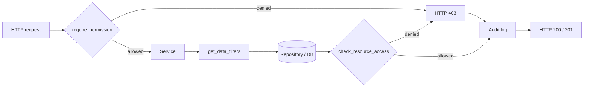

# Backend Permission System

The CO2 Calculator uses permission-based authorization rather than role
checks scattered through the codebase. Permissions are computed dynamically
from a user's roles on every request and are **never stored in the database**.

> **This is the single canonical reference for the permission system.** It is
> long by design — overview, model, matrix, usage, the add-a-permission
> recipe, and the audit trail are consolidated here. Use the contents below to
> jump.

## Contents

- [Why permission-based authorization](#why-permission-based-authorization)
- [Implementation plans and related issues](#implementation-plans-and-related-issues)
- [Files handling permissions](#files-handling-permissions)
- [The three authorization layers](#the-three-authorization-layers)
- [Permission model](#permission-model)
- [Role-permission matrix](#role-permission-matrix)
- [How permissions are computed](#how-permissions-are-computed)
- [Permission shape in the API](#permission-shape-in-the-api)
- [Using permissions in code](#using-permissions-in-code)
- [Resource-level policy](#resource-level-policy)
- [Adding a new permission](#adding-a-new-permission)
- [Audit trail](#audit-trail)
- [Key principles](#key-principles)

## Why permission-based authorization

Permissions are derived from roles dynamically at request time and combined
with scope-based data filtering and resource-level policy checks. This keeps
business logic and authorization separated, makes new roles cheap to add, and
produces an auditable trail.

The enforcement anchor is [#414 — Enforce permissions across all
routes](https://github.com/EPFL-ENAC/co2-calculator/issues/414). Backoffice
reporting is scoped to a unit subtree: the metier scope token is an ACCRED unit
cf (`institutional_id`) at any level, resolved to that unit's descendants via
`path_institutional_code` ([#862](https://github.com/EPFL-ENAC/co2-calculator/issues/862),
superseding the earlier path_name/sub-perimeter approach of
[#459](https://github.com/EPFL-ENAC/co2-calculator/issues/459)).

## Implementation plans and related issues

| Plan                                                                                                                   | Issue                                                          | Status      | Scope                                                                                    |
| ---------------------------------------------------------------------------------------------------------------------- | -------------------------------------------------------------- | ----------- | ---------------------------------------------------------------------------------------- |
| [Permission-based access control](../implementation-plans/archive/221-permission-based-access-control.md)              | [#414](https://github.com/EPFL-ENAC/co2-calculator/issues/414) | Abandoned   | Original hybrid (defense-in-depth) design; enforcement shipped under #414.               |
| [Authentication & integration hardening](../implementation-plans/458-security-authentication-integration-hardening.md) | [#458](https://github.com/EPFL-ENAC/co2-calculator/issues/458) | Delivered   | Pins the OAuth/JWT trust boundary; centralizes JWT→user resolution.                      |
| [Professional travel permission conflict](../implementation-plans/archive/698-permission-conflict.md)                  | [#698](https://github.com/EPFL-ENAC/co2-calculator/issues/698) | Abandoned   | Standard user with `professional_travel.edit` wrongly redirected.                        |
| [Tighten unit-scoped permission gates](../implementation-plans/977-tighten-unit-permission-gates.md)                   | [#977](https://github.com/EPFL-ENAC/co2-calculator/issues/977) | Delivered   | Unit gating for `carbon_report` + `unit_results`; drops the coarse `modules.*` fallback. |
| [Update backoffice permissions](../implementation-plans/862-backoffice-update-permissions.md)                          | [#862](https://github.com/EPFL-ENAC/co2-calculator/issues/862) | In progress | Page-driven model: one permission per backoffice page; removes `system.users`.           |
| [Backoffice ACCRED affiliation scoping](../implementation-plans/459-backoffice-accred-affiliation-scoping.md)          | [#459](https://github.com/EPFL-ENAC/co2-calculator/issues/459) | Superseded  | Scope `backoffice.*` by ACCRED sub-perimeter; path_name approach replaced by #862.       |
| [Affiliation scope by unit subtree](../implementation-plans/862-backoffice-affiliation-scope-by-unit-subtree.md)       | [#862](https://github.com/EPFL-ENAC/co2-calculator/issues/862) | Delivered   | Scope `backoffice.reporting` to a unit-cf subtree; `scope ∩ (affiliation ∪ lvl4)` clamp. |

## Files handling permissions

### Backend

Core authorization infrastructure:

- `app/models/user.py` — `RoleName` enum, User model, and `calculate_user_permissions()`.
- `app/schemas/user.py` — `UserRead` with the `@computed_field` `permissions`.
- `app/utils/permissions.py` — runtime check `has_permission()` and `derive_backoffice_affiliations()`.
- `app/utils/scoping.py` — affiliation gate `gate_backoffice()` and the
  `build_scope_subtree_predicate()` unit-subtree SQL predicate.
- `app/core/security.py` — `require_permission()` route decorator and `is_permitted()`.
- `app/core/policy.py` — in-code policy evaluation (`query_policy`, resource access).
- `app/services/authorization_service.py` — `get_data_filters()`, `check_resource_access()`.
- `app/providers/role_provider.py` — ACCRED role + affiliation (sub-perimeter) provider.
- `app/api/deps.py` — current-user and dependency wiring.

Enforced at (route and service consumers): `app/api/v1/{audit,auth,carbon_report,carbon_report_module,carbon_report_module_stats,data_sync,factors,taxonomies,unit_results,units,users}.py`, the `backoffice*.py` routers, and `app/services/{unit_service,unit_totals_service,user_service}.py`.

### Frontend

The frontend checks **permissions only, never roles**. All permission logic
lives in two files plus one router guard — consumers always call the auth store:

- `src/utils/permission.ts` — store-free **leaf**: the `PermissionAction` enum,
  the `FlatUserPermissions` types, the `MODULE_STATUS_PERMISSION` constant, and
  the pure predicates `hasPermission()`, `hasAnyScopePermission()`,
  `hasBackOfficeAreaPermission()`, `getModulePermissionPath()`. No store
  imports, so it stays importable by pure unit tests.
- `src/stores/auth.ts` — **the single entry point** every consumer calls. Holds
  the session `user`/`permissions` and the stateful helpers `hasUserPermission`,
  `hasUserModulePermission`, `hasUserCanValidateModuleStatus`,
  `canUserAccessModule`, `hasUserBackOfficeAreaPermission`,
  `hasUserAnyScopePermission`; re-exports `PermissionAction` so callers import
  everything from here.
- `src/router/guards/permissionGuard.ts` — one `permissionGuard` for
  `beforeEnter`: module routes (`meta.moduleEdit`) need workspace-scoped
  view+edit on the route's module; back-office routes declare
  `meta.requiredPermission` (+ optional `meta.requiredAction`), checked
  any-scope.
- `src/router/routes.ts` — `meta.requiredPermission` / `meta.requiredAction`
  (back-office) and `meta.moduleEdit` (module pages) are the **single source of
  truth**: `permissionGuard` enforces them and `Co2Sidebar` reads the same meta
  to decide reachability, so router and nav can never drift.

Consumers (gated UI): `src/pages/ErrorUnauthorized.vue`, `src/components/layout/{Co2Sidebar,Co2Header}.vue`, `src/components/organisms/layout/Co2ModuleSidebar.vue`, `src/components/organisms/module/{ModuleTable,SubModuleSection,HeadcountMemberSelect,ModuleTotalResult}.vue`.

## The three authorization layers

Three layers cooperate on every request:

- **Route layer** — `require_permission("path.resource", "action")` rejects
  requests that lack the required permission with HTTP 403.
- **Service layer** — `get_data_filters(...)` returns scope-aware filters
  (`global` / `unit` / `own`) that the repository applies to queries.
- **Resource layer** — `check_resource_access(...)` evaluates an OPA-style
  policy on a single record (e.g. "API trips are read-only").



Both the allow and deny branches emit an audit event so reviewers can trace
who attempted what and why a decision was made.

## Permission model

### Paths and actions

Permissions use dot-notation paths combined with an action:

- **Paths**: `backoffice.reporting`, `backoffice.users`,
  `backoffice.documentation`, `backoffice.ui_texts`, `backoffice.configuration`,
  `backoffice.pipeline_operations`, `backoffice.logs`, `modules.headcount`, …
  Module paths carry an explicit scope suffix: `/<institutional_id>` for
  unit-scoped grants (principal) or `/<institutional_id>/own` for own-scoped
  grants (standard user). See [Explicit RoleScope](../implementation-plans/role-scope-explicit-own-unit.md).
  Custom **affordance** keys gate a specific UI control rather than a data
  domain — e.g. `module.status/<institutional_id>` gates the module-status
  validate button, granted to unit-breadth users (principal) only. Prefer a
  dedicated key over inferring breadth on the frontend.
- **Actions**: `view` (read), `edit` (create/update/delete), `export` (data
  export), `sync` (trigger imports — granted on every `modules.*` for
  principals, and the backoffice global sync via `backoffice.configuration`).

Domains are independent: backoffice roles do not grant module access. There is
**one permission per backoffice page** (#862) — reporting, users, documentation,
ui_texts (all metier + super admin) plus configuration, pipeline_operations and
logs (super admin only) — alongside `modules.*` (calculation modules). The old
`backoffice.data_management` and `system.*` keys were removed.

### Roles

Roles are assigned to users and determine which permissions they receive. The
canonical identifiers live in the `RoleName` enum in
[`app/models/user.py`](https://github.com/EPFL-ENAC/co2-calculator/blob/main/backend/app/models/user.py):

- `calco2.user.standard` — Standard user, own-scope access (professional
  travel and external cloud / AI).
- `calco2.user.principal` — Unit manager, unit-scope access (all modules).
- `calco2.backoffice.metier` — Backoffice administrator: affiliation-scoped
  reporting plus scope-less users / documentation / ui_texts.
- `calco2.backoffice.admin` — Super administrator with every backoffice page,
  including configuration / pipeline_operations / logs (no `modules.*` grants).

### Scopes

Scopes determine which **data records** a user can see:

- **Global** — see everything (super admin, backoffice metier).
- **Unit** — see records for assigned units (principals).
- **Own** — see only records the user created (standard users).

`get_data_filters()` translates the scope into structured filters:

```python
{}                                  # Global
{"unit_ids": ["12345", "67890"]}    # Unit
{"user_id": "user-123"}             # Own
```

### Resources

A _resource_ is a single data record (a specific headcount entry, a single
travel record, etc.). Resource-level policy can enforce business rules that
generic permission checks cannot — see
[Resource-level policy](#resource-level-policy).

## Role-permission matrix

The canonical human-readable view of which actions each role grants lives on
the published back-office guide — **[Roles &
permissions](https://epfl-enac.github.io/co2-calculator-back-office-doc/roles/)**
(source:
[`co2-calculator-back-office-doc/docs/roles.md`](https://github.com/EPFL-ENAC/co2-calculator-back-office-doc/blob/main/docs/roles.md)).
The code source of truth is
[`app/models/user.py::calculate_user_permissions`](https://github.com/EPFL-ENAC/co2-calculator/blob/main/backend/app/models/user.py)
— whenever you change a grant there, update the roles page in the same change
set. This section documents only the **scope mechanics** the roles page omits.

### Scope is explicit in the key

`V` = view, `E` = edit, `X` = export, `S` = sync. The grant matrix is on the
roles page; what it does not show is how scope is encoded in the permission
key:

- Principal grants are unit-scoped — `modules.X/<unit>`.
- Standard-user grants are own-scoped — `modules.X/<unit>/own`.
- `backoffice.reporting` is affiliation-scoped for metier — `/<cf>`, where
  `<cf>` is the granted unit's `institutional_id` at any level; the query
  resolves it to that unit's subtree (#862).
- All other `backoffice.*` keys are bare (global).

> **Unit-level module operations** (e.g. PATCH a module's validation status)
> require **unit** breadth — principal or global. A standard user (own breadth)
> is rejected even though they may `edit` their own records, because their key
> is `modules.X/<unit>/own`, not `modules.X/<unit>`. This is enforced by
> `resolve_module_scope` / `require_module_unit_scope`. The frontend mirrors
> this for UX by gating the validate button on the dedicated
> `module.status/<cf>` affordance (granted to principals only); the PATCH stays
> the source of truth.

### Scope summary

| Role                       | Scope       | Notes                                                                                           |
| -------------------------- | ----------- | ----------------------------------------------------------------------------------------------- |
| `calco2.backoffice.admin`  | Global      | Every `backoffice.*` page (bare keys); **no `modules.*` grants**                                |
| `calco2.backoffice.metier` | Affiliation | `backoffice.reporting/<cf>` (unit-subtree scoped) + scope-less users / documentation / ui_texts |
| `calco2.user.principal`    | Unit        | `view, edit, sync` on every `modules.X/<unit>` for assigned units                               |
| `calco2.user.standard`     | Own         | `view, edit` on `modules.{professional_travel,external_cloud_and_ai}/<unit>/own`                |

## How permissions are computed

The backend calculates permissions during the `GET /v1/session` response:

1. Read the user from the database with the `roles_raw` field.
2. Convert roles to `Role` objects via the `User.roles` property.
3. `UserRead.calculate_permissions()` calls
   `calculate_user_permissions(roles)`.
4. Roles map to permission keys per the [matrix](#role-permission-matrix).
5. The computed permissions are included in the response.

Permissions are computed in-memory. No database writes occur.

## Permission shape in the API

`GET /v1/session` returns a **flat** dictionary keyed by dot-notation path,
with a **list of action strings** as the value. Module paths carry an explicit
scope suffix — `/<institutional_id>` (unit, principal) or
`/<institutional_id>/own` (own, standard user); `backoffice.*` keys are bare
except `backoffice.reporting/<cf>` for an affiliation-scoped metier (the cf is
resolved to a unit subtree at query time).

```json
{
  "id": "123456",
  "email": "user@epfl.ch",
  "roles": ["..."],
  "permissions": {
    "backoffice.reporting": ["view", "export"],
    "backoffice.users": ["view", "edit", "export"],
    "backoffice.configuration": ["view", "edit"],
    "backoffice.pipeline_operations": ["view", "edit"],
    "backoffice.logs": ["view"],
    "modules.headcount/0184": ["view", "edit", "sync"],
    "module.status/0184": ["edit"],
    "modules.professional_travel/0184/own": ["view", "edit"]
  }
}
```

Use the `permissions` field for access control. The `roles` field is for
display only.

## Using permissions in code

### Route-level checks

Use the `require_permission()` dependency to protect endpoints:

```python
from app.core.security import require_permission
from app.models.user import User
from fastapi import Depends

@router.get("/headcounts")
async def get_headcounts(
    current_user: User = Depends(require_permission("modules.headcount", "view")),
):
    """Get headcounts. Requires modules.headcount.view; data is scope-filtered."""
    service = HeadcountService(db, user=current_user)
    return await service.get_headcounts()
```

On denial it raises `HTTPException(403, detail="Permission denied")`. The
missing `path.action` is **not** echoed to the client — it is recorded in the
`Permission check denied` log entry (see [Audit trail](#audit-trail)).

### Service-level data filtering

Use `get_data_filters()` to filter data by the caller's scope:

```python
from app.services.authorization_service import get_data_filters

filters = await get_data_filters(
    user=self.user, resource_type="headcount", action="list"
)
# {"unit_ids": [...]} for unit scope, {"user_id": "..."} for own, {} for global
return await self.repository.get_headcounts(filters=filters)
```

### Resource-level access control

Use `check_resource_access()` for per-record rules:

```python
from app.services.authorization_service import check_resource_access

has_access = await check_resource_access(
    user=self.user,
    resource_type="professional_travel",
    resource={"id": trip.id, "created_by": trip.created_by,
              "unit_id": trip.unit_id, "provider": trip.provider},
    action="access",
)
if not has_access:
    raise HTTPException(403, "Access denied")
```

## Resource-level policy

In-code policy functions in `app/core/policy.py` enforce business rules for
individual resources (OPA-style naming, no policy engine).

### Professional travel policy

The `authz/resource/access` policy implements:

1. **API trips are read-only** — cannot be edited by anyone (`provider == "api"`).
2. **Super admin** — can edit all non-API trips (global scope).
3. **Principals** — can edit manual/CSV trips in their assigned units.
4. **Standard users** — can edit only their own manual trips.

```python
decision = await query_policy("authz/resource/access", {
    "user": user,
    "resource_type": "professional_travel",
    "resource": {"id": 123, "provider": "api", "created_by": "user-456", "unit_id": "12345"},
})
# {"allow": False, "reason": "API trips are read-only"}
```

### Adding custom resource policies

Extend `_evaluate_resource_access_policy()` in `app/core/policy.py`:

```python
if resource_type == "your_resource":
    if some_condition:
        return {"allow": False, "reason": "Your denial reason"}
    return {"allow": True, "reason": "Access granted"}
```

## Adding a new permission

### 1. Grant it in `calculate_user_permissions`

There is no separate registry — adding the key to a role branch in
[`calculate_user_permissions`](https://github.com/EPFL-ENAC/co2-calculator/blob/main/backend/app/models/user.py)
**is** the declaration. The returned object is a flat dict of
`{path: [actions]}`.

```python
elif role_name == RoleName.CO2_SUPERADMIN.value:
    if is_global_scope(scope):
        permissions["backoffice.your_new_resource"] = merge_actions(
            permissions.get("backoffice.your_new_resource"), ["view", "edit"],
        )
```

Module permissions are unit-scoped — append `scope_key` so the key looks like
`modules.your_new_resource/<institutional_id>`:

```python
elif role_name == RoleName.CO2_USER_PRINCIPAL.value:
    if is_role_scope(scope):
        permissions[f"modules.your_new_resource{scope_key}"] = merge_actions(
            permissions.get(f"modules.your_new_resource{scope_key}"),
            ["view", "edit", "sync"],
        )
```

### 2. Protect the route

```python
@router.get("/your-endpoint", responses={403: {"description": "Permission denied"}})
async def get_your_resource(
    current_user: User = Depends(
        require_permission("backoffice.your_new_resource", "view")
    ),
):
    """Required permission: ``backoffice.your_new_resource.view``."""
    ...
```

### 3. Filter data in the service (list endpoints)

```python
filters = await get_data_filters(
    user=self.user, resource_type="your_new_resource", action="list"
)
return await self.repository.get_all(filters=filters)
```

### 4. Add a resource-level rule (only if needed)

Extend `_evaluate_resource_access_policy()` in `app/core/policy.py` as shown
in [Resource-level policy](#resource-level-policy).

### 5. Update the frontend

Call the auth store — the single entry point. Never check roles.

```typescript
const canEdit = authStore.hasUserPermission(
  "backoffice.your_new_resource",
  PermissionAction.EDIT,
);
```

For a custom affordance key, add a `MODULE_*_PERMISSION` constant and a named
helper (e.g. `hasUserCanValidateModuleStatus`) so call sites read intent, not a
raw key string. Use the result for conditional rendering or to disable buttons.
Backend `require_permission` remains the source of truth — frontend gating is
UX only.

### 6. Test and ship

- Unit: assert 403 for unauthorised callers, 200 for authorised ones.
- Integration: verify scope filtering with `standard / principal / superadmin`
  fixtures.
- Update the [matrix](#role-permission-matrix) row, the route docstring, and
  any changelog/ADR. Mention scope intent (global / unit / own / affiliation)
  so reviewers can match the grant against the backoffice subtree-scoping
  work (#862).

## Audit trail

Every authorization decision is logged so reviewers can reconstruct who
attempted what and why a request was allowed or denied. The trail spans all
three checks — route, service, and resource — using structured logging.

### What gets logged

- `require_permission` — emits a `Permission check denied` warning on deny,
  with `user_id`, the required `path`, and the requested `action`.
- `get_data_filters` — emits `data_filter` events with the chosen scope and
  the resulting filters dict.
- `check_resource_access` — emits `resource_access` events with the resource
  type, the snapshot fields used by policy, and the decision plus its `reason`.
- HTTP 403 responses carry a generic `{"detail": "Permission denied"}` body —
  the missing `path.action` is **not** echoed to the client.

### Decision flow

1. Request enters the FastAPI dependency chain.
2. `require_permission` resolves the user, looks up the calculated permission,
   and logs `permission_check`.
3. On allow, the service computes scope filters and logs `data_filter`.
4. The repository runs the query with those filters.
5. For per-record actions, `check_resource_access` evaluates the policy and
   logs `resource_access` with the `reason`.
6. The route returns 200/201 (allow) or 403 (deny). Both branches have already
   produced an audit event upstream.

### Debugging a 403

1. Find the most recent `Permission check denied` warning for the request's
   `user_id` / `request_id`; its `extra` payload carries the required `path`
   and `action`.
2. Call `GET /v1/session` and inspect the flat `permissions` dict for a key
   matching `path` (or `path/<institutional_id>` for modules) whose action
   list contains `action`.
3. If the grant looks correct but the request still fails, check the most
   recent `resource_access` event for the `reason` (e.g. `API trips are
read-only`).
4. If no deny event is present at all, suspect token expiry or an upstream
   auth failure — re-authenticate and retry.

### Migrating legacy role checks

Legacy `User.has_role(...)` call sites should be migrated to the
permission-based helpers: `require_permission` (route), `get_data_filters`
(service), or `check_resource_access` (resource).

## Key principles

1. Permissions are calculated from roles, never stored.
2. Frontend checks permissions, not roles — and frontend gating is UX only;
   the backend is the source of truth.
3. Permissions recalculate on every `GET /v1/session` call.
4. Domains are independent and combine when a user holds multiple roles.
5. Flat dot-notation keys with a list-of-actions value.
6. Authorization is enforced at three layers: route (`require_permission`),
   service (`get_data_filters`), and resource (`check_resource_access`).
7. **Deprecated**: direct role checks in business logic — use permissions.
