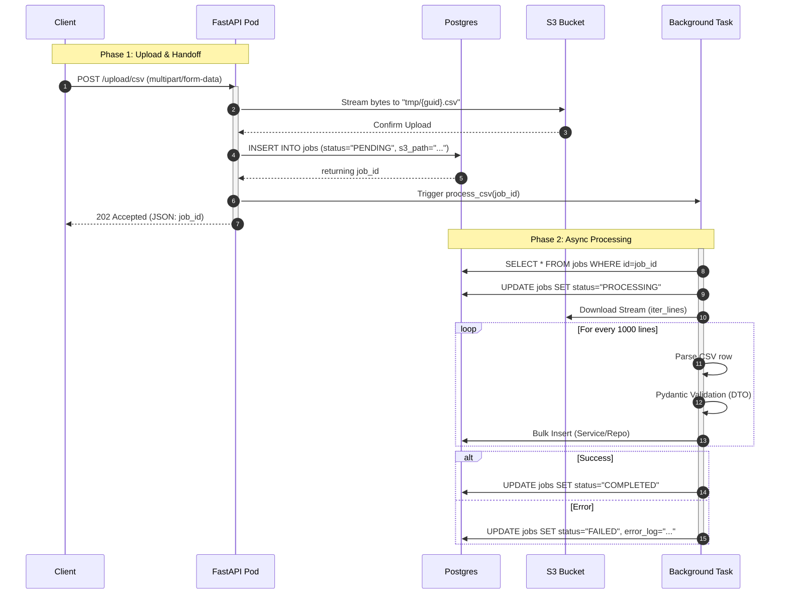

# File upload flow

```mermaid

sequenceDiagram
    autonumber
    participant Client
    participant API as FastAPI Pod
    participant DB as Postgres
    participant S3 as S3 Bucket
    participant Worker as Background Task

    Note over Client, API: Phase 1: Upload & Handoff
    Client->>API: POST /upload/csv (multipart/form-data)

    activate API
    API->>S3: Stream bytes to "tmp/{guid}.csv"
    S3-->>API: Confirm Upload

    API->>DB: INSERT INTO jobs (status="PENDING", s3_path="...")
    DB-->>API: returning job_id

    API->>Worker: Trigger process_csv(job_id)
    API-->>Client: 202 Accepted (JSON: job_id)
    deactivate API

    Note over Worker, DB: Phase 2: Async Processing
    activate Worker
    Worker->>DB: SELECT * FROM jobs WHERE id=job_id
    Worker->>DB: UPDATE jobs SET status="PROCESSING"

    Worker->>S3: Download Stream (iter_lines)

    loop For every 1000 lines
        Worker->>Worker: Parse CSV row
        Worker->>Worker: Pydantic Validation (DTO)
        Worker->>DB: Bulk Insert (Service/Repo)
    end

    alt Success
        Worker->>DB: UPDATE jobs SET status="COMPLETED"
    else Error
        Worker->>DB: UPDATE jobs SET status="FAILED", error_log="..."
    end
    deactivate Worker
```
