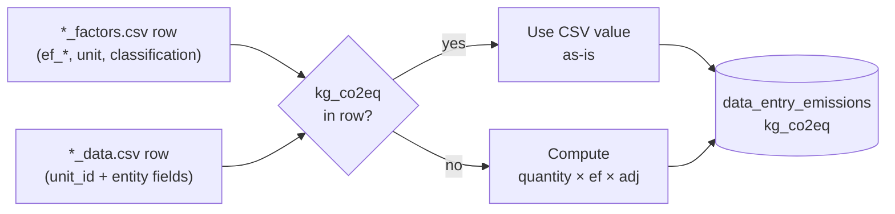
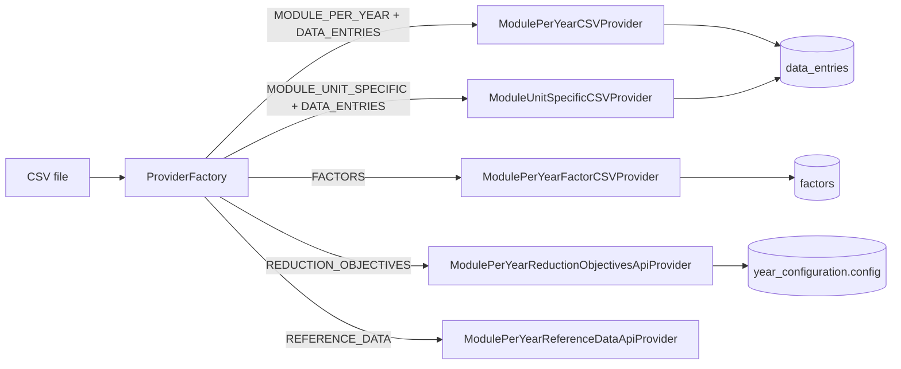

# CSV seed formats

## Why this exists

The backend ingests CSV files from operator uploads, integration-test fixtures,
and (historically) seed scripts. Each upload routes through a CSV provider in
`backend/app/services/data_ingestion/csv_providers/`. This page lists the
supported formats, their column schemas, and idempotency rules — so a developer
or LLM agent extending ingestion knows what to produce, parse, or assert against.

For the database entities these CSVs feed, see [Database ERD](../database/erd.md).

## Where to get the seed CSVs

The `backend/seed_data/` directory is **not tracked in git**. It is a local mirror of a private SharePoint folder maintained by the team. A fresh clone will not have it. To populate it, ask a team member for access to the SharePoint source.

For a self-contained example of the CSV shapes documented below, see `backend/tests/integration/data_ingestion/fixtures/` — the canonical in-repo reference for these formats.

## Three families: factors, data, test

The seed-data folder follows a strict naming convention. Every CSV belongs to one of three families, distinguished by suffix:

- **`*_factors.csv`** — emission factors (`ef_*`) and unit definitions. One row per `(classification, year)` tuple. Loaded into the `factors` table.
- **`*_data.csv`** — per-unit observations: `unit_institutional_id` + entity fields + optional `note` and optional `kg_co2eq` override. One row per data entry. Loaded into `data_entries`.
- **`*_test.csv`** — a subset of `*_data.csv` columns with `unit_institutional_id` and `kg_co2eq` removed. Used as upload-pipeline fixtures, not seed data.



For the runtime computation path see `data_entry_emission_service.py`; for the override pass-through see `base_csv_provider.py`.

## kg_co2eq override semantics

!!! warning "Override behavior"
    The `kg_co2eq` column on `*_data.csv` is an **override**, not an input. When the column is present and non-empty, the backend skips the factor-based computation and uses the CSV value verbatim.

The two relevant code points:

- `base_csv_provider.py:794-799` — even though `kg_co2eq` is not in any handler's `create_dto`, the provider explicitly preserves it from the source row when present and non-empty.
- `data_entry_emission_service.py:143-151` — emission compute logs `Using CSV-provided kg_co2eq=… override` and returns the float as-is, bypassing factor lookup.

For the complete per-file column tables, see [CSV column inventory](./csv-seed-formats/inventory.md).

## Provider overview



Routing keys live in `backend/app/services/data_ingestion/provider_factory.py`.

## Common conventions

CSV providers share many — but not all — defaults. The list below splits them
into truly-shared behaviour and per-provider differences.

### Shared by all providers

- **Delimiter:** comma. Quote character: double quote.
- **Header row:** required; column order is free.
- **Extra columns:** silently ignored.
- **Empty file:** rejected with `CSV file is empty`
  (`base_csv_provider.py:244`, `base_factor_csv_provider.py:300`,
  `base_reduction_objective_csv_provider.py:320`). The data-entry path wraps
  this message with the prefix described below; the factor and
  reduction-objective paths raise a bare `ValueError`.
- **Source paths:** must start with `tmp/`, `uploads/`, or `temporary/`
  (`base_csv_provider.py::_validate_file_path`).

### Per-provider differences

| Aspect | `BaseCSVProvider` (data entries) | `BaseFactorCSVProvider` (factors, reference data) | `BaseReductionObjectiveCSVProvider` |
|---|---|---|---|
| Encoding | `utf-8-sig` (BOM tolerated) — `base_csv_provider.py:746` | plain `utf-8` (no BOM tolerance) — `base_factor_csv_provider.py:272` | `utf-8-sig` (BOM tolerated) — `base_reduction_objective_csv_provider.py:279` |
| Header-validation error wrapping | `Wrong CSV format or encoding: <message>` (`base_csv_provider.py:768`) | bare `ValueError` (`base_factor_csv_provider.py::_validate_csv_headers`) | bare `ValueError` (`base_reduction_objective_csv_provider.py::_validate_csv_headers`) |

## Module-per-year CSV (data entries)

- **Provider:** `ModulePerYearCSVProvider`
- **Path:** `backend/app/services/data_ingestion/csv_providers/module_per_year.py`
- **Target entity:** `data_entries` (one row per CSV row).
- **Used for:** headcount, professional travel, buildings, purchases, research
  facilities, etc.

### Required and expected columns

The only column required by the provider for every row is
`unit_institutional_id` (`module_per_year.py:111`). Remaining columns are
derived from the active `BaseModuleHandler` subclasses' `create_dto.model_fields`
(see `_get_expected_columns_from_handlers` in `base_csv_provider.py:79`).

| Column | Type | Required | Description |
|---|---|---|---|
| `unit_institutional_id` | string | yes | Unit code; resolves to `units.institutional_id`. |
| handler-specific fields | varies | varies | Defined by the matching `BaseModuleHandler.create_dto`. |
| `note` | string | no | Free-form annotation kept on the data entry. |

For the headcount-member handler the columns are
`unit_institutional_id, name, position_title, position_category,
user_institutional_id, fte, note` (verified against
`backend/tests/integration/data_ingestion/fixtures/valid_module_per_year.csv`).

### Idempotency

Delete-then-insert per affected module: rows previously inserted with
`source = CSV_MODULE_PER_YEAR` are removed before the new batch is loaded
(`base_csv_provider.py::_delete_existing_entries_for_module_per_year`,
implementation plan `docs/implementation-plans/220-csv-upload-implementation-summary.md`).
Manual user entries (`source = USER_MANUAL`) are never touched.

### Example

```csv
unit_institutional_id,name,position_title,position_category,user_institutional_id,fte,note
UNIT001,John Doe,Professor,professor,UID001,1.0,
UNIT002,Jane Smith,Post-doctoral researcher,postdoctoral_assistant,UID002,0.5,
```

## Module-unit-specific CSV (data entries)

- **Provider:** `ModuleUnitSpecificCSVProvider`
- **Path:** `backend/app/services/data_ingestion/csv_providers/module_unit_specific.py`
- **Target entity:** `data_entries` for one specific `carbon_report_module_id`.
- **Used for:** equipment, external AI, external clouds, and other
  unit-scoped uploads.

### Required and expected columns

The provider requires a single `data_entry_type_id` in the upload config and
loads one handler. Required columns come from the handler's
`create_dto.model_fields` filtered by `is_required()`
(`base_csv_provider.py::_get_required_columns_from_handler`). The CSV does
**not** include `unit_institutional_id` — the unit is fixed by
`carbon_report_module_id` from the API request.

For the equipment handler the columns are
`name, equipment_class, sub_class, active_usage_hours_per_week,
standby_usage_hours_per_week, note` (verified against
`backend/app/modules/equipment_electric_consumption/schemas.py::EquipmentHandlerCreate`).

### Validation rules

- `active_usage_hours_per_week + standby_usage_hours_per_week <= 168`
  (`EquipmentModuleHandler.pre_compute`).
- Other handlers attach their own `field_validator`s to the create DTO.

### Idempotency

**Append-only.** No prior rows are deleted: the deletion call is gated by an
`if self.entity_type == EntityType.MODULE_PER_YEAR` guard
(`base_csv_provider.py:568`), so `MODULE_UNIT_SPECIFIC` never enters the
`_delete_existing_entries_for_module_per_year` branch. Confirmed in
`docs/implementation-plans/220-csv-upload-implementation-summary.md`.

### Example

```csv
name,equipment_class,sub_class,active_usage_hours_per_week,standby_usage_hours_per_week,note
Thermostat Numerique,Agitator / Incubator,CO2 incubators,12,150,Test equipment
ECRAN EIZO FLEXSCAN,Monitors,,8,160,
```

## Factors CSV

- **Provider:** `ModulePerYearFactorCSVProvider`
- **Path:** `backend/app/services/data_ingestion/csv_providers/factors.py`
- **Target entity:** `factors`.
- **Config inputs:** `module_type_id`, optional `data_entry_type_id`, `year`.

### Columns

Columns vary per `BaseFactorHandler` subclass. The expected set is
`create_dto.model_fields - FACTOR_META_FIELDS`, where the meta-fields excluded
from CSVs are `id, classification, values, emission_type_id,
data_entry_type_id, year` (`backend/app/schemas/factor.py:11`). To find the
columns for a given factor type, read its `*FactorCreate` class in
`backend/app/modules/<module>/schemas.py`.

Example — `TravelPlaneFactorHandler` (verified at
`backend/app/modules/professional_travel/schemas.py:412`):

| Column | Type | Required | Description |
|---|---|---|---|
| `category` | enum | yes | `very_short_haul`, `short_haul`, `medium_haul`, or `long_haul`. |
| `ef_kg_co2eq_per_km` | float | yes | Emission factor; must be `>= 0`. |
| `rfi_adjustment` | float | yes | Radiative-forcing index multiplier. |
| `class_adjustement` | float | yes | Cabin-class multiplier (note: legacy spelling). |
| `min_distance` | float | yes | Lower bound of the distance band (km). |
| `max_distance` | float | yes | Upper bound of the distance band (km). |

### Idempotency

Delete-then-insert by `(data_entry_type_id, year)`
(`base_factor_csv_provider.py:173-191`). All existing factor rows for that
combination are removed via `factor_service.bulk_delete_by_data_entry_type`
before the new batch is inserted via `factor_service.bulk_create`. The set of
types deleted is computed by `_get_types_to_delete`
(`base_factor_csv_provider.py:572-582`); subclasses (notably
`LocalFactorCSVProvider` in `csv_providers/local_seed.py`) override that hook
to scope deletion to specific data-entry types when a single CSV covers only
part of a module's types.

### Example

```csv
category,ef_kg_co2eq_per_km,rfi_adjustment,class_adjustement,min_distance,max_distance
very_short_haul,0.258,1.0,1.0,0,500
short_haul,0.156,2.0,1.0,500,1500
medium_haul,0.131,2.0,1.2,1500,3500
long_haul,0.151,2.0,1.4,3500,20000
```

## Reduction-objective CSV

- **Provider:** `ModulePerYearReductionObjectivesApiProvider`
- **Path:** `backend/app/services/data_ingestion/csv_providers/reduction_objectives.py`
- **Target entity:** `year_configuration.config.reduction_objectives.<key>`
  (single JSON blob per category, not row-per-row).
- **Selector:** `reduction_objective_type_id` in the upload config picks one of
  three sub-formats (`backend/app/schemas/year_configuration.py:119`).

### Sub-formats

| `reduction_objective_type_id` | `config_key` | Required columns |
|---|---|---|
| `0` (FOOTPRINT) | `institutional_footprint` | `year, category, co2` |
| `1` (POPULATION) | `population_projections` | `year, pop` |
| `2` (SCENARIOS) | `unit_scenarios` | `scenario, year, reduction_percentage` |

Validation rules (`backend/app/schemas/year_configuration.py:43-94`):

- `co2 >= 0`, `pop >= 0`, `0.0 <= reduction_percentage <= 1.0`.

### Idempotency

The whole validated row set is written as a JSON list under
`year_configuration.config.reduction_objectives.<config_key>`, replacing the
previous value for that key.

### Example (FOOTPRINT)

```csv
year,category,co2
2024,energy,1234.5
2024,food,567.8
2024,travel,890.1
```

## Reference-data CSV

- **Provider:** `ModulePerYearReferenceDataApiProvider`
- **Path:** `backend/app/services/data_ingestion/csv_providers/reference_data.py`
- **Status:** Setup currently returns `{}`; column schema and validation rules
  are **TBD**. Do not rely on this format until the provider is fleshed out.
  Track work against the file above.

## Where fixtures live

Integration-test CSV fixtures (the ground truth for shape and edge cases) sit
under `backend/tests/integration/data_ingestion/fixtures/`. The fixture
README in that directory documents valid examples, missing-column failures,
extra-column tolerance, and empty-file handling.

Note: an older comment in that README points to `backend/seed_data/` for
production CSVs. That directory does not exist on `main` today; treat the
fixtures dir as the canonical reference.

## How to add a new format

1. Subclass `BaseCSVProvider`, `BaseFactorCSVProvider`, or
   `BaseReductionObjectiveCSVProvider` and implement the abstract hooks
   (`_setup_handlers_and_factors` / `_setup_handlers_and_context` /
   `_resolve_handler`).
2. Register the provider in `ProviderFactory.PROVIDERS` (or
   `COMPUTED_FACTOR_PROVIDERS`) in
   `backend/app/services/data_ingestion/provider_factory.py` under the right
   `(module_type, ingestion_method, target_type, entity_type)` key.
3. Add a fixture CSV under
   `backend/tests/integration/data_ingestion/fixtures/` and document its
   shape in the fixtures README.
4. Add an integration test under
   `backend/tests/integration/data_ingestion/` that exercises happy-path,
   missing-column, and idempotency scenarios.
