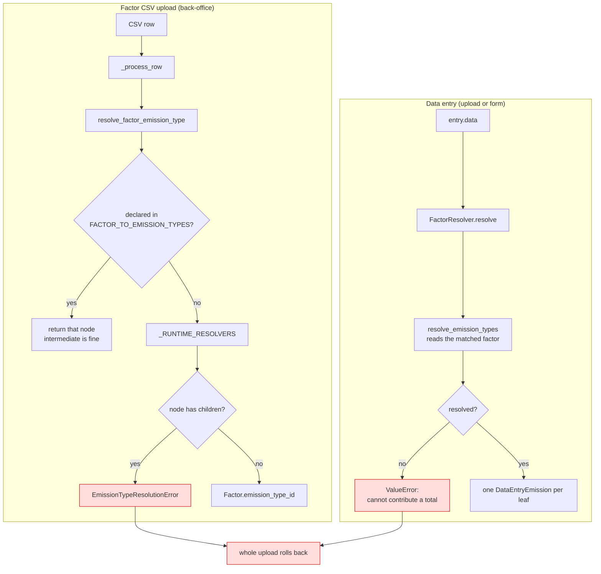
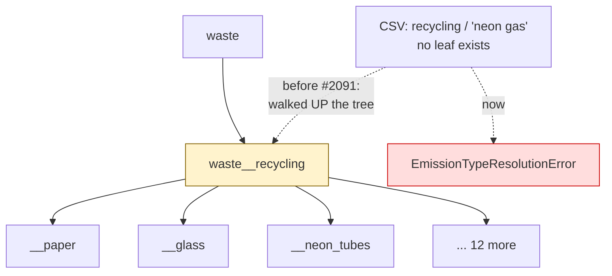

# Emission type resolution

Every emission row carries one `emission_type_id`. This page says who
decides it, what a module is allowed to answer, and what happens when a CSV
carries a value the taxonomy has never heard of.

Read this before touching any `app/modules/*/emissions.py`. The taxonomy
itself is [`app/modules/emissions/taxonomy.py`][taxonomy]; the CSV column
contracts are in the [Data Management Guide](../user-docs/data-management-guide.md).

[taxonomy]: https://github.com/EPFL-ENAC/co2-calculator/blob/dev/backend/app/modules/emissions/taxonomy.py

## Two paths, one funnel each

A factor row and a data-entry row resolve independently, and they can
legitimately land on different nodes.



## Leaf or intermediate — the invariant

The taxonomy is a tree. A node with children already sums those children,
so writing data at an intermediate node double-counts it.



A factor landing on `waste__recycling` is counted once as itself and again
inside every child that resolves correctly. The total still renders, still
looks complete, and is wrong — the failure this codebase treats as its
worst.

**The rule:** a runtime resolver returns exactly one _leaf_. Only
`FACTOR_TO_EMISSION_TYPES` may name an intermediate node, and only because
the leaf is a data-entry-time decision there:

| Declared intermediate        | Who picks the leaf, and from what                                       |
| ---------------------------- | ----------------------------------------------------------------------- |
| `buildings__rooms`           | `resolve_building_rooms` — factor's `energy_type` + entry's `room_type` |
| `professional_travel__plane` | `resolve_plane` — entry's `cabin_class`                                 |
| `professional_travel__train` | `resolve_train` — entry's `cabin_class`                                 |

## What each module resolves on

| Module                        | Resolver                          | Keys on                                       | Unknown value        |
| ----------------------------- | --------------------------------- | --------------------------------------------- | -------------------- |
| Headcount                     | `resolve_headcount_factor`        | `headcount_category` / `_class` / `_subclass` | raises               |
| Buildings — rooms             | `resolve_building_rooms`          | factor `energy_type` + `room_type`            | raises               |
| Buildings — combustion        | `resolve_combustion`              | `name`                                        | raises               |
| Process emissions             | `resolve_process_emissions`       | `category`                                    | raises               |
| Professional travel           | `resolve_plane` / `resolve_train` | `cabin_class`                                 | raises               |
| Purchases — centralized       | `resolve_purchases_centralized`   | `name`                                        | raises               |
| External — clouds             | `resolve_clouds`                  | `service_type`                                | raises               |
| External — AI                 | `resolve_ai`                      | `provider`                                    | raises               |
| Research facilities           | `resolve_research_facilities`     | `researchfacility_id`                         | **declared default** |
| Research facilities — animal  | `resolve_animal_facilities`       | `researchfacility_type`                       | raises               |
| Equipment, Purchases (common) | —                                 | static `DATA_ENTRY_TO_EMISSION_TYPES`         | n/a                  |

`resolve_research_facilities` is the single legitimate default: the IT
facility list is an opt-in allow-list, so "not in the list" genuinely means
`research_facilities__facilities`, a childless leaf. That is a declared
answer, not a fallback.

## Canonicalisation is not matching

`canonical_token` maps one CSV cell to one name segment — lowercase,
non-alphanumerics to `_`, trim. `"domestic waste"`, `"non-ferrous metals"`
and `"organic waste (lawn)"` become `domestic_waste`, `non_ferrous_metals`
and `organic_waste_lawn`, which is how the taxonomy already spells them.

It never _chooses_ a node. Anything that does not land on a declared name
still raises. Where two strings genuinely name the same leaf, say so
explicitly in the module's alias map — `"Claude (Anthropic)"` →
`provider_anthropic` is a declaration, not a guess.

## Failure behaviour

`EmissionTypeResolutionError` from a factor CSV **aborts the whole upload**
and rolls the transaction back. It is not a skipped row.

Skipping was the old behaviour and it is why this went unnoticed for so
long: the good rows committed, the job finished `WARNING`, and the module
quietly lost a category. A rejected upload is recoverable in a minute; a
half-updated factor table that reports a plausible total is not.

Malformed _values_ — a bad float, a missing column — keep their
skip-and-continue semantics. Only emission-type resolution escalates.

## Adding a module or a factor category

1. Add the leaf to `EmissionType`. **Append, never renumber** — those ints
   are persisted on `data_entry_emission` rows and survive deploys.
2. Regenerate the frontend mirror: `make gen-emission-taxonomy`.
3. If it shows in a chart, add its label to `frontend/src/constant/charts.ts`
   and both locales in `frontend/src/i18n/results.ts`.
4. Map the CSV spelling in the module's resolver. Declare aliases; do not
   widen the matching.
5. Dry-run the real CSVs before the back-office does:

   ```bash
   cd backend && uv run python scripts/audit_emission_type_resolution.py INPUT_DATA
   ```
