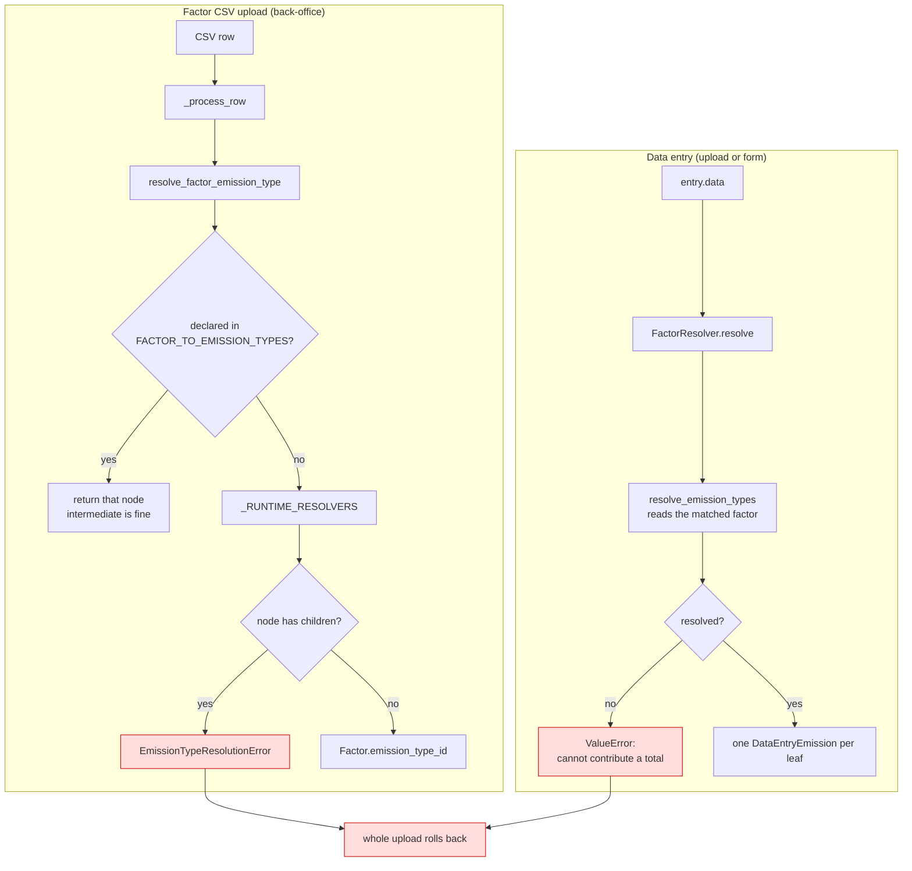
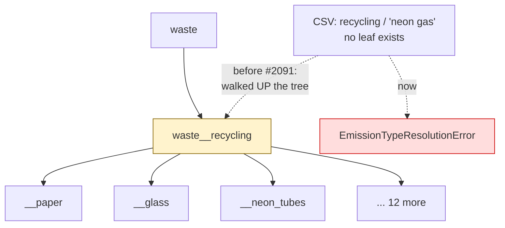
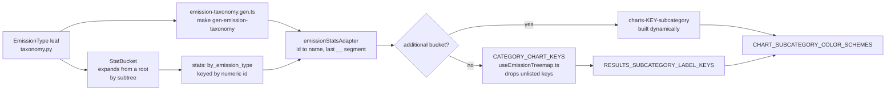

# Emission type resolution

Every emission row carries one `emission_type_id`. This page says who
decides it, what a module is allowed to answer, and what happens when a CSV
carries a value the taxonomy has never heard of.

Read this before touching any `app/modules/*/emissions.py`. The taxonomy
itself is [`app/modules/emissions/taxonomy.py`][taxonomy]; the CSV column
contracts are in the [Data Management Guide](../user-docs/data-management-guide.md).

[taxonomy]: https://github.com/EPFL-ENAC/co2-calculator/blob/dev/backend/app/modules/emissions/taxonomy.py

## Two paths, one funnel each

A factor row and a data-entry row resolve independently, and they can
legitimately land on different nodes.



## Leaf or intermediate — the invariant

The taxonomy is a tree. A node with children already sums those children,
so writing data at an intermediate node double-counts it.



A factor landing on `waste__recycling` is counted once as itself and again
inside every child that resolves correctly. The total still renders, still
looks complete, and is wrong — the failure this codebase treats as its
worst.

**The rule:** a runtime resolver returns exactly one _leaf_. Only
`FACTOR_TO_EMISSION_TYPES` may name an intermediate node, and only because
the leaf is a data-entry-time decision there:

| Declared intermediate        | Who picks the leaf, and from what                                       |
| ---------------------------- | ----------------------------------------------------------------------- |
| `buildings__rooms`           | `resolve_building_rooms` — factor's `energy_type` + entry's `room_type` |
| `professional_travel__plane` | `resolve_plane` — entry's `cabin_class`                                 |
| `professional_travel__train` | `resolve_train` — entry's `cabin_class`                                 |

## What each module resolves on

| Module                        | Resolver                          | Keys on                                       | Unknown value        |
| ----------------------------- | --------------------------------- | --------------------------------------------- | -------------------- |
| Headcount                     | `resolve_headcount_factor`        | `headcount_category` / `_class` / `_subclass` | raises               |
| Buildings — rooms             | `resolve_building_rooms`          | factor `energy_type` + `room_type`            | raises               |
| Buildings — combustion        | `resolve_combustion`              | `name`                                        | raises               |
| Process emissions             | `resolve_process_emissions`       | `category`                                    | raises               |
| Professional travel           | `resolve_plane` / `resolve_train` | `cabin_class`                                 | raises               |
| Purchases — centralized       | `resolve_purchases_centralized`   | `name`                                        | raises               |
| External — clouds             | `resolve_clouds`                  | `service_type`                                | raises               |
| External — AI                 | `resolve_ai`                      | `provider`                                    | raises               |
| Research facilities           | `resolve_research_facilities`     | `researchfacility_id`                         | **declared default** |
| Research facilities — animal  | `resolve_animal_facilities`       | `researchfacility_type`                       | raises               |
| Equipment, Purchases (common) | —                                 | static `DATA_ENTRY_TO_EMISSION_TYPES`         | n/a                  |

`resolve_research_facilities` is the single legitimate default: the IT
facility list is an opt-in allow-list, so "not in the list" genuinely means
`research_facilities__facilities`, a childless leaf. That is a declared
answer, not a fallback.

## Canonicalisation is not matching

`canonical_token` maps one CSV cell to one name segment — lowercase,
non-alphanumerics to `_`, trim. `"domestic waste"`, `"non-ferrous metals"`
and `"organic waste (lawn)"` become `domestic_waste`, `non_ferrous_metals`
and `organic_waste_lawn`, which is how the taxonomy already spells them.

It never _chooses_ a node. Anything that does not land on a declared name
still raises. Where two strings genuinely name the same leaf, say so
explicitly in the module's alias map — `"Claude (Anthropic)"` →
`provider_anthropic` is a declaration, not a guess.

## Failure behaviour

`EmissionTypeResolutionError` from a factor CSV **aborts the whole upload**
and rolls the transaction back. It is not a skipped row.

Skipping was the old behaviour and it is why this went unnoticed for so
long: the good rows committed, the job finished `WARNING`, and the module
quietly lost a category. A rejected upload is recoverable in a minute; a
half-updated factor table that reports a plausible total is not.

Malformed _values_ — a bad float, a missing column — keep their
skip-and-continue semantics. Only emission-type resolution escalates.

## Where a leaf has to be wired

A leaf is only half-shipped when it resolves. It also has to survive
aggregation and reach a chart with a label and a colour, and nothing used
to fail when the files involved drifted apart.



Buckets expand from their roots through `get_all_nodes`, so a leaf added
under an existing root joins its bucket automatically — that half needs no
edit. The frontend half does not, and it fails in two distinct ways:

- **Unmapped label or colour → renders wrong.** The raw key shows to the
  user; unmapped segments all fall onto one shared shade.
- **Key missing from `CATEGORY_CHART_KEYS` → does not render at all.** The
  Results treemap, `EmissionBreakdownChart` and `EmissionTypeBreakdownChart`
  all iterate and filter through that list, so a segment it does not name
  is silently dropped from every non-additional chart — the failure mode
  that hid the six new process-emission gases. Its order is the charts'
  display order. (Its comment used to claim it mirrors a backend list; it
  is frontend-only truth now.)

Beyond the shared maps, three charts keep their own wiring:

- `ModuleCarbonFootprintChart.vue` builds one stacked-bar series and one
  dataset dimension per key. Process emissions derives both from
  `CATEGORY_CHART_KEYS`; the other categories are still written out by
  hand, so a new key there means a new series **and** a new dimension.
- `GenericEmissionTreeMapChart.vue` (`LABEL_KEY_MAP`) and
  `PlannerGrantComparisonChart.vue` (`SEGMENT_LABEL_KEYS`) hold local
  label maps that fall back to the raw key.

`tests/unit/modules/test_emission_taxonomy_rendering_coverage.py` asserts
the shared maps — bucket membership, scope, label on the right path,
colour, and that the generated TypeScript mirror is current. It does **not**
cover `CATEGORY_CHART_KEYS`, the footprint chart's series/dimensions, or
the local label maps; those you check by looking at the Results page.

## Adding a module or a factor category

1. Add the leaf to `EmissionType`. **Append, never renumber** — those ints
   are persisted on `data_entry_emission` rows and survive deploys.
2. Regenerate the frontend mirror: `cd backend && make gen-emission-taxonomy`.
3. Add the label under the key the adapter derives — the **last `__`
   segment** of the name. Additional buckets (food, waste, commuting,
   embodied energy) use the dynamic `charts-<key>-subcategory` i18n key;
   every other bucket goes through `RESULTS_SUBCATEGORY_LABEL_KEYS` in
   `frontend/src/constant/charts.ts`. Both locales, always.
4. Add a colour in `CHART_SUBCATEGORY_COLOR_SCHEMES` when the bucket
   renders more than one segment. Process emissions and purchases generate
   an interpolated scale from a key list in the same file — for those, add
   the key to the list and the shade comes for free.
5. Non-additional bucket? Add the key to `CATEGORY_CHART_KEYS` in
   `frontend/src/composables/useEmissionTreemap.ts`, in display position —
   an unlisted key is silently dropped from every Results chart, not
   rendered raw.
6. Wire the charts with their own maps: a series + dataset dimension in
   `ModuleCarbonFootprintChart.vue` (process emissions reads
   `CATEGORY_CHART_KEYS`, everything else is hand-written), and the label
   in `GenericEmissionTreeMapChart.vue` and
   `PlannerGrantComparisonChart.vue`.
7. Map the CSV spelling in the module's resolver. Declare aliases; do not
   widen the matching.
8. Never key frontend behaviour on a literal category string. The module
   form's class/subclass options come from the year's factor CSV via the
   class-subclass map, so new categories appear by themselves — but a
   hardcoded value in a module config or `ModuleTable` check (the old
   `Refrigerant` subcategory gate) breaks silently the day the CSV
   spelling changes. Derive from the subclass map instead: subcategory
   input and requiredness follow "this category has subclasses".
9. Dry-run the real CSVs before the back-office does:

   ```bash
   cd backend && uv run python scripts/audit_emission_type_resolution.py INPUT_DATA
   ```
