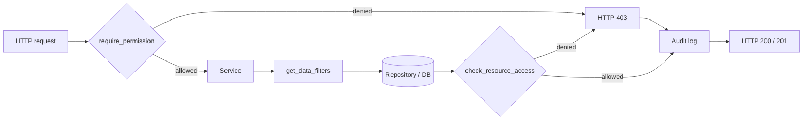

# Developer Guide: Permissions

## Why

The CO2 Calculator API uses **permission-based authorization** rather than
role checks scattered through the codebase. Permissions are derived from
roles dynamically at request time and combined with scope-based data
filtering and resource-level policy checks. This keeps business logic and
authorization separated, makes new roles cheap to add, and produces an
auditable trail.

Reference issue: <https://github.com/EPFL-ENAC/co2-calculator/issues/414>.
Backoffice scoping by sub-perimeter is being refined under issue #459.

## What

Three layers cooperate on every request:

- **Route layer** — `require_permission("path.resource", "action")` rejects
  requests that lack the required permission with HTTP 403.
- **Service layer** — `get_data_filters(...)` returns scope-aware filters
  (`global` / `unit` / `own`) that the repository applies to queries.
- **Resource layer** — `check_resource_access(...)` evaluates an OPA-style
  policy on a single record (e.g. "API trips are read-only").

## How (request to audit flow)

Both the allow and deny branches emit an audit event so reviewers can trace
who attempted what and why a decision was made.

## Sub-pages

- [Model](./model.md) — roles, scopes, permission grants.
- [Matrix](./matrix.md) — role x resource permission matrix.
- [How to add a permission](./how-to-add.md) — step-by-step recipe.
- [Audit trail](./audit.md) — log shape, retention, debugging tips.

See also: [Permission System Overview](../06-PERMISSION-SYSTEM.md),
[Backend Architecture](../02-ARCHITECTURE.md),
[Request Flow](../05-REQUEST_FLOW.md).
