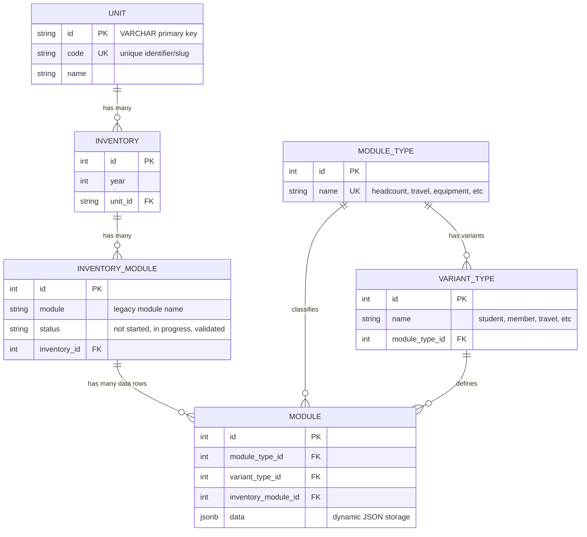

```mermaid
erDiagram
    INVENTORY ||--o{ INVENTORY_MODULE : "has many"
    INVENTORY_MODULE ||--o{ MODULE : "has many data rows"
    UNIT ||--o{ INVENTORY : "has many"
    MODULE_TYPE ||--o{ MODULE : "classifies"
    VARIANT_TYPE ||--o{ MODULE : "defines"
    MODULE_TYPE ||--o{ VARIANT_TYPE : "has variants"

    INVENTORY {
        int id PK
        int year
        string unit_id FK
    }

    INVENTORY_MODULE {
        int id PK
        string module "legacy module name"
        string status "not started, in progress, validated"
        int inventory_id FK
    }

    UNIT {
        string id PK "VARCHAR primary key"
        string code UK "unique identifier/slug"
        string name
    }

    MODULE {
        int id PK
        int module_type_id FK
        int variant_type_id FK
        int inventory_module_id FK
        jsonb data "dynamic JSON storage"
    }

    MODULE_TYPE {
        int id PK
        string name UK "headcount, travel, equipment, etc"
    }

    VARIANT_TYPE {
        int id PK
        string name "student, member, travel, etc"
        int module_type_id FK
    }
```
