# Generic Emission Calculation System

## Overview

This document describes the CO2 calculator system architecture, database schema, calculation strategies, and audit trail mechanisms for factor-based emission calculations with full traceability and batch recalculation support.

---

## Table of Contents

1. [Architecture Overview](#1-architecture-overview)
2. [Database Schema](#2-key-tables)
   - [2.1 departments](#21-departments---organizational-units)
   - [2.2 carbon_reports](#22-carbon_reports---annual-carbon-reports)
   - [2.3 carbon_report_modules](#23-carbon_report_modules---report-sections)
   - [2.4 data_entries](#24-data_entries---individual-data-points)
   - [2.5 data_entry_emissions](#25-data_entry_emissions---calculated-emissions)
   - [2.6 factors](#26-factors---generic-calculation-coefficients)
   - [2.7 emission_factors (energy mix)](#27-emission-factors-energy-mix---merged-into-factors)
   - [2.8 data_entry_types](#28-data_entry_types---entry-type-definitions-submodules)
   - [2.9 document_versions](#29-document_versions---audit-trail)
   - [2.10 users](#210-users---authenticated-users)
   - [2.11 department_users](#211-department_users---department-membership)
   - [2.12 module_types](#212-module_types---module-categories)
   - [2.13 emission_types](#213-emission_types---emission-categories)
3. [Factor Management](#3-factor-management-flow)
4. [Emission Calculation](#4-emission-calculation-flow)
   - [4.1 Single DataEntry Calculation](#41-single-dataentry-calculation)
   - [4.2 Strategy Pattern](#42-strategy-pattern)
   - [4.3 Equipment Calculation](#43-equipment-calculation-example-two-factor-model)
   - [4.4 Headcount Calculation](#44-headcount-calculation-example-four-factors)
   - [4.5 Batch Recalculation](#45-batch-recalculation-flow)
5. [Audit, Versioning & Performance](#5-audit-versioning--performance)
   - [5.1 Traceability Queries](#51-traceability-queries)
   - [5.2 Versioning Pattern](#52-versioning-patterns)
   - [5.3 Services Reference](#53-services-reference)
   - [5.4 Performance Indexes](#54-performance-indexes)
6. [Future Extensions](#6-future-extensions)

---

## 1. Architecture Overview


---

## 2. Database Schema

> **📊 Visual Reference:**


### 2.1 `departments` - Organizational Units

Represents organizational units (labs, departments, faculties) that own carbon reports.

| Column            | Type    | Description                                         | Example                               |
| ----------------- | ------- | --------------------------------------------------- | ------------------------------------- |
| id                | INTEGER | Primary key (auto-increment)                        | `1`                                   |
| code              | VARCHAR | Provider-assigned department code (unique, indexed) | `10208`                               |
| name              | VARCHAR | Department name (indexed)                           | `Laboratory of Computational Biology` |
| provider          | VARCHAR | Sync source provider (accred, default, test)        | `accred`                              |
| principal_user_id | INTEGER | FK to users.id for the principal investigator       | `1`                                   |
| cost_centers      | JSON    | List of cost center codes (Finance IDs)             | `["C1348", "C1349"]`                  |
| affiliations      | JSON    | List of affiliations                                | `["SB", "ISIC"]`                      |

> **Note:** All table primary keys (`id`) are integers for index optimization and normalization.
> The `principal_user_id` is a proper FK to `users.id` — user details (name, email, function) come from the `users` table.

```csv
id,code,name,provider,principal_user_id,cost_centers,affiliations
1,10208,Laboratory of Computational Biology,accred,1,"[""C1348""]","[""SB"",""ISIC""]"
2,10456,Laboratory of Physics of Biological Systems,accred,2,"[""C2456""]","[""SB""]"
```

---

### 2.2 `carbon_reports` - Annual Carbon Reports

A carbon report for a department for a specific year. Contains multiple modules.

| Column        | Type    | Description                  | Example |
| ------------- | ------- | ---------------------------- | ------- |
| id            | INTEGER | Primary key (auto-increment) | `1`     |
| year          | INTEGER | Report year                  | `2025`  |
| department_id | INTEGER | FK to departments            | `1`     |

> **Unique constraint:** (year, department_id) - one report per department per year.

```csv
id,year,department_id
1,2025,1
2,2024,1
3,2025,2
```

---

### 2.3 `carbon_report_modules` - Report Sections

A section of a carbon report (e.g., "Equipment", "Headcount", "Flights").

| Column           | Type    | Description                                       | Example           |
| ---------------- | ------- | ------------------------------------------------- | ----------------- |
| id               | INTEGER | Primary key (auto-increment)                      | `1`               |
| carbon_report_id | INTEGER | FK to carbon_reports (indexed)                    | `1`               |
| module_type_id   | INTEGER | FK to module_types (indexed)                      | `1` (equipment)   |
| status           | INTEGER | Status: 0=not_started, 1=in_progress, 2=validated | `1` (in_progress) |

> **Unique constraint:** (carbon_report_id, module_type_id) - one module instance per type per report.

```csv
id,carbon_report_id,module_type_id,status
1,1,1,1
2,1,2,0
```

---

### 2.4 `data_entries` - Individual Data Points

A single data entry within a module (e.g., one piece of equipment, one flight).

| Column                  | Type    | Description                                | Example                                                              |
| ----------------------- | ------- | ------------------------------------------ | -------------------------------------------------------------------- |
| id                      | INTEGER | Primary key (auto-increment, indexed)      | `1`                                                                  |
| carbon_report_module_id | INTEGER | FK to carbon_report_modules (indexed)      | `1`                                                                  |
| data_entry_type_id      | INTEGER | FK to data_entry_types (indexed, nullable) | `9` (scientific)                                                     |
| data                    | JSON    | Module-specific data as JSON               | `{"equipment_class": "Centrifugation", "active_hours_per_week": 40}` |

> **Note:** To get `module_type_id`, join through `carbon_report_modules`: `data_entries.carbon_report_module_id → carbon_report_modules.module_type_id`

```csv
id,carbon_report_module_id,data_entry_type_id,data
1,1,9,"{""equipment_class"":""Centrifugation"",""active_hours_per_week"":40}"
```

---

### 2.5 `data_entry_emissions` - Calculated Emissions

Computed emission results for a data entry. Versioning is handled via `document_versions` table.

| Column            | Type      | Description                                                  | Example                                         |
| ----------------- | --------- | ------------------------------------------------------------ | ----------------------------------------------- |
| id                | INTEGER   | Primary key (auto-increment, indexed)                        | `1`                                             |
| data_entry_id     | INTEGER   | FK to data_entries (indexed)                                 | `1`                                             |
| emission_type_id  | INTEGER   | FK to emission_types (indexed)                               | `2` (equipment)                                 |
| primary_factor_id | INTEGER   | FK to primary factor (power, headcount, flight) (indexed)    | `5` (power factor)                              |
| subcategory       | VARCHAR   | Subcategory for grouping (scientific, it, plane, food, etc.) | `scientific`                                    |
| kg_co2eq          | FLOAT     | Calculated CO2 equivalent in kg                              | `42.83`                                         |
| meta              | JSON      | Calculation inputs and factors_used array for traceability   | `{"annual_kwh": 3569.3, "factors_used": [...]}` |
| formula_version   | VARCHAR   | Git SHA1 or version tag of the codebase                      | `abc123def`                                     |
| computed_at       | TIMESTAMP | When calculation was performed (indexed)                     | `2025-01-08T10:00:00`                           |

> **Factor Storage:**
>
> - **primary_factor_id**: Main calculation factor (for traceability and recalculation queries)
> - **meta.factors_used**: Array of all factors with roles: `[{id, role, emission_type_id, values}, ...]`
>   - Equipment: `[{role: "primary", ...power_factor}, {role: "emission", ...energy_mix}]`
>   - Headcount: `[{role: "primary", ...headcount_factor}]`
>
> **Subcategory field** enables consistent grouping across module types:
>
> - Equipment: data_entry_type name (scientific, it, admin)
> - Travel: data.travel_type (plane, train, car)
> - Headcount: emission_type code (food, waste, transport, grey_energy)
>
> **Versioning:** The row is always updated in place. Historical values are stored in `document_versions` with full snapshots.

```csv
id,data_entry_id,emission_type_id,primary_factor_id,subcategory,kg_co2eq,computed_at
1,1,2,5,scientific,42.83,2025-01-08T10:00:00
```

---

### 2.6 `factors` - Generic Calculation Coefficients

Stores all calculation coefficients with JSON flexibility. Each factor belongs to an emission_type, which determines the calculation strategy.

| Column             | Type    | Description                                                 | Example                                                         |
| ------------------ | ------- | ----------------------------------------------------------- | --------------------------------------------------------------- |
| id                 | INTEGER | Primary key (auto-increment, indexed)                       | `1`                                                             |
| emission_type_id   | INTEGER | FK to emission_types - determines calculation strategy      | `2` (equipment)                                                 |
| is_conversion      | BOOLEAN | True for conversion factors (energy mix), false for primary | `false`                                                         |
| data_entry_type_id | INTEGER | FK to data_entry_types (indexed, nullable)                  | `9` (scientific)                                                |
| classification     | JSON    | Module-specific classification hierarchy                    | `{"class": "Centrifugation", "sub_class": "Ultra centrifuges"}` |
| values             | JSON    | Actual coefficient values                                   | `{"active_power_w": 1300, "standby_power_w": 130}`              |

> **`emission_type_id`** determines which **calculation strategy** to use:
>
> - emission_type_id=2 (equipment) → EquipmentCalculationStrategy (hours × watts × emission_factor)
> - emission_type_id=2,3,4,5 (food/waste/commute/grey_energy) → HeadcountCalculationStrategy (fte × kg_per_fte)
> - emission_type_id=6 (professional_travel) → FlightCalculationStrategy (distance × kg_per_km)
>
> **`is_conversion`** flag distinguishes helper factors from primary calculation factors:
>
> - `is_conversion=true` → Conversion factors (e.g., energy mix: kWh → kg CO2eq)
> - `is_conversion=false` → Primary calculation factors (power, headcount, flight)
>
> Multiple `data_entry_types` can share the same `emission_type_id` (e.g., `scientific`, `it`, `admin` all produce equipment emissions).

> For headcount, you have **4 separate factor rows** (one per emission type: food, waste, commute, grey_energy), each with its own emission_type_id.

> **`classification`** is **optional and module-specific**:
>
> - Equipment: `{"class": "Centrifugation", "sub_class": "Ultra centrifuges"}`
> - Buildings: `{"building_name": "BC", "building_type": "office"}`
> - Headcount: `{}` (empty — submodule already defines the category)
> - Flights: `{"distance_band": "long_haul", "cabin_class": "economy"}`
>
> **Versioning:** Factor history is tracked via `document_versions` table.

#### Factor Examples by Module Type

**Equipment (power factor with classification)**

```json
{
  "emission_type_id": 2,
  "is_conversion": false,
  "data_entry_type_id": 9,
  "classification": {
    "class": "Centrifugation",
    "sub_class": "Ultra centrifuges"
  },
  "values": { "active_power_w": 1300, "standby_power_w": 130 }
}
```

**Headcount (one factor row per emission type)**

For headcount, we have **4 separate factor rows** (one per emission type):

```json
// Food factor for members
{
  "emission_type_id": 2,
  "is_conversion": false,
  "data_entry_type_id": 1,
  "classification": {},
  "values": { "kg_co2eq_per_fte": 420 }
}

// Waste factor for members
{
  "emission_type_id": 3,
  "is_conversion": false,
  "data_entry_type_id": 1,
  "classification": {},
  "values": { "kg_co2eq_per_fte": 65 }
}

// Commute factor for members
{
  "emission_type_id": 4,
  "is_conversion": false,
  "data_entry_type_id": 1,
  "classification": {},
  "values": { "kg_co2eq_per_fte": 350 }
}

// Grey energy factor for members
{
  "emission_type_id": 5,
  "is_conversion": false,
  "data_entry_type_id": 1,
  "classification": {},
  "values": { "kg_co2eq_per_fte": 120 }
}
```

> The calculation service fetches all 4 factors for the data_entry_type and creates one `data_entry_emission` row per factor.

**Buildings (future)**

```json
{
  "emission_type_id": 7,
  "is_conversion": false,
  "data_entry_type_id": 15,
  "classification": { "building_name": "BC", "building_type": "office" },
  "values": { "kwh_per_m2": 85, "heating_factor": 0.15 }
}
```

```csv
id,emission_type_id,is_conversion,data_entry_type_id,classification,values
1,2,false,9,"{""class"":""Centrifugation""}","{""active_power_w"":1300}"
2,2,false,1,"{}","{""kg_co2eq_per_fte"":420}"
3,3,false,1,"{}","{""kg_co2eq_per_fte"":65}"
```

---

### 2.7 Emission Factors (Energy Mix) - Merged into `factors`

CO2 conversion factors (e.g., kWh → kg CO2) are stored in the **`factors` table** with `is_conversion = true` and `emission_type_id = 1` (energy).

This uses a **"global" data_entry_type** that isn't tied to user-facing modules:

```
module_types:
  id=1: equipment
  id=2: headcount
  id=99: global  ← System/reference data

data_entry_types:
  id=100: energy_mix (module_type=99)
```

**Example: Swiss electricity mix**

```json
{
  "emission_type_id": 1,
  "is_conversion": true,
  "data_entry_type_id": 100,
  "classification": { "region": "CH" },
  "values": { "kg_co2eq_per_kwh": 0.012 }
}
```

**Example: EU electricity mix**

```json
{
  "emission_type_id": 1,
  "is_conversion": true,
  "data_entry_type_id": 100,
  "classification": { "region": "EU" },
  "values": { "kg_co2eq_per_kwh": 0.233 }
}
```

> **Benefits of merging:**
>
> - ✅ Unified model — all coefficients in one `factors` table
> - ✅ Same versioning via `document_versions`
> - ✅ Same audit trail ("Who changed the Swiss energy mix?")
> - ✅ Consistent traceability — all factors stored in `meta.factors_used` array
> - ✅ Clear distinction via `is_conversion` flag
>
> **Note:** The `global` module_type should have `is_system = true` to hide from user-facing UI.

```csv
id,emission_type_id,is_conversion,data_entry_type_id,classification,values
10,1,true,100,"{""region"":""CH""}","{""kg_co2eq_per_kwh"":0.012}"
11,1,true,100,"{""region"":""EU""}","{""kg_co2eq_per_kwh"":0.233}"
```

---

### 2.8 `data_entry_types` - Entry Type Definitions (Submodules)

Defines types of data entries (e.g., "scientific equipment", "admin equipment").

> **Aliases:** This table is also known as **"submodules"** in the domain model. In some legacy code, you may see references to `variant_types` — this table is **deprecated** and `data_entry_types` is the source of truth.

| Column         | Type    | Description                           | Example                |
| -------------- | ------- | ------------------------------------- | ---------------------- |
| id             | INTEGER | Primary key (auto-increment, indexed) | `9`                    |
| name           | VARCHAR | Type name (indexed)                   | `scientific`           |
| description    | VARCHAR | Human-readable description            | `Scientific equipment` |
| module_type_id | INTEGER | FK to module_types (indexed)          | `1`                    |

**Equipment submodules:**

- `scientific` - Scientific/lab equipment
- `it` - IT equipment (laptops, servers)
- `admin` - Administrative equipment

**Headcount submodules:**

- `student` - Students (Bachelor, Master, PhD)
- `member` - Staff members

```csv
id,name,description,module_type_id
1,member,Staff members,2
2,student,Students,2
9,scientific,Scientific equipment,1
10,it,IT equipment,1
11,admin,Administrative equipment,1
```

---

### 2.9 `document_versions` - Audit Trail

Append-only versioning for any entity. Tracks all changes with hash chain for integrity verification.

| Column        | Type     | Description                                  | Example                                   |
| ------------- | -------- | -------------------------------------------- | ----------------------------------------- |
| id            | INTEGER  | Primary key (auto-increment, indexed)        | `1`                                       |
| entity_type   | VARCHAR  | Target table/entity name (indexed)           | `factors`                                 |
| entity_id     | INTEGER  | Target entity primary key (indexed)          | `1`                                       |
| version       | INTEGER  | Monotonic version number (indexed)           | `2`                                       |
| is_current    | BOOLEAN  | Whether this is the current version          | `true`                                    |
| data_snapshot | JSON     | Full JSON snapshot of entity at this version | `{"values": {"active_power_w": 1300}}`    |
| data_diff     | JSON     | JSON diff from previous version (optional)   | `{"values.active_power_w": [1200, 1300]}` |
| change_type   | VARCHAR  | Type: CREATE, UPDATE, DELETE, ROLLBACK       | `UPDATE`                                  |
| change_reason | VARCHAR  | Human-readable reason for change (optional)  | `Updated from manufacturer specs`         |
| changed_by    | VARCHAR  | Actor identifier (SCIPER or email)           | `admin@epfl.ch`                           |
| changed_at    | DATETIME | Timestamp of change (UTC)                    | `2025-01-08T10:00:00`                     |
| previous_hash | VARCHAR  | Hash of previous version (NULL for v1)       | `a1b2c3...`                               |
| current_hash  | VARCHAR  | Hash of this version's data                  | `d4e5f6...`                               |

> **Hash Chain:** Each version includes `previous_hash` (hash of prior version) and `current_hash` (hash of this version's data). This creates an immutable audit chain for integrity verification.
>
> **Change Types:** `CREATE`, `UPDATE`, `DELETE`, `ROLLBACK`

```csv
id,entity_type,entity_id,version,is_current,change_type,changed_by,changed_at,previous_hash,current_hash
1,factors,1,1,false,CREATE,admin@epfl.ch,2025-01-01T09:00:00,NULL,a1b2c3d4
2,factors,1,2,true,UPDATE,admin@epfl.ch,2025-01-08T10:00:00,a1b2c3d4,e5f6g7h8
```

---

### 2.10 `users` - Authenticated Users

Represents authenticated users in the system.

| Column       | Type     | Description                                        | Example                                             |
| ------------ | -------- | -------------------------------------------------- | --------------------------------------------------- |
| id           | INTEGER  | Primary key (auto-increment, indexed)              | `1`                                                 |
| code         | VARCHAR  | Provider-assigned user code (SCIPER for EPFL)      | `123456`                                            |
| email        | VARCHAR  | User email (unique, indexed)                       | `john.doe@epfl.ch`                                  |
| display_name | VARCHAR  | User display name                                  | `John Doe`                                          |
| function     | VARCHAR  | User function/title (e.g., Professor, PhD Student) | `Professor`                                         |
| provider     | VARCHAR  | Sync source provider (accred, default, test)       | `accred`                                            |
| roles_raw    | JSON     | User roles with scopes (from provider)             | `[{"role": "co2.user.std", "on": {"unit": "123"}}]` |
| last_login   | DATETIME | Last login timestamp                               | `2025-01-08T10:00:00`                               |

```csv
id,code,email,display_name,function,provider
1,123456,john.doe@epfl.ch,John Doe,Professor,accred
2,789012,jane.smith@epfl.ch,Jane Smith,PhD Student,accred
```

---

### 2.11 `department_users` - Department Membership

Join table linking users to departments (many-to-many relationship).

| Column        | Type    | Description                             | Example        |
| ------------- | ------- | --------------------------------------- | -------------- |
| id            | INTEGER | Primary key (auto-increment)            | `1`            |
| department_id | INTEGER | FK to departments (indexed)             | `1`            |
| user_id       | INTEGER | FK to users (indexed)                   | `1`            |
| role          | VARCHAR | User's role within department (indexed) | `co2.user.std` |

> **Unique constraint:** (department_id, user_id) - a user can only have one role per department.

```csv
id,department_id,user_id,role
1,1,1,co2.user.principal
2,1,2,co2.user.std
3,2,1,co2.user.std
```

---

### 2.12 `module_types` - Module Categories

Reference table defining module categories (headcount, equipment, travel, etc.).

| Column      | Type    | Description                           | Example                       |
| ----------- | ------- | ------------------------------------- | ----------------------------- |
| id          | INTEGER | Primary key (auto-increment, indexed) | `1`                           |
| name        | VARCHAR | Module type name (unique, indexed)    | `my-lab`                      |
| description | VARCHAR | Human-readable description            | `Headcount and lab personnel` |

```csv
id,name,description
1,my-lab,Headcount and lab personnel
2,professional-travel,Professional travel and transport
3,infrastructure,Building and infrastructure
4,equipment-electric-consumption,Equipment electricity consumption
5,purchase,Purchases and procurement
6,internal-services,Internal EPFL services
7,external-cloud,External cloud services
99,global,Global reference data (not a real module)
```

---

### 2.13 `emission_types` - Emission Categories

Reference table for strict categorization of emissions. All values are in kg_co2eq (implicit).

| Column      | Type    | Description                           | Example                             |
| ----------- | ------- | ------------------------------------- | ----------------------------------- |
| id          | INTEGER | Primary key (auto-increment, indexed) | `1`                                 |
| code        | VARCHAR | Unique code identifier (indexed)      | `equipment`                         |
| description | VARCHAR | Description of this emission type     | `Equipment electricity consumption` |

> This provides a stable taxonomy for all emission calculations. Used as FK in `data_entry_emissions` and `factors` for type-safe categorization.

**Chart grouping varies by module:**

- **Equipment**: group by `data_entry_type` (scientific, it, other)
- **Travel**: group by `data.travel_type` (plane, train, car)
- **Headcount**: group by `emission_type` (food, waste, commute, grey_energy)
- **Purchases**: group by `data_entry_type` (bio_chemicals, consumables, etc.)

```csv
id,code,description
1,equipment,Equipment electricity consumption
2,food,Food-related emissions (catering meals)
3,waste,Waste disposal emissions
4,commute,Commuting/transport emissions
5,grey_energy,Embodied energy in materials and infrastructure
6,professional_travel,Business travel (flights trains cars)
7,infrastructure,Building infrastructure (heating cooling etc)
8,infrastructure_gas,Building gas consumption
9,unit_gas,Unit-level gas consumption
10,purchases,Procurement emissions
11,internal_services,Internal EPFL services (SCITAS RCP etc)
12,external_cloud,External cloud services
13,research_core_facilities,Shared research infrastructure
```

---

## 3. Factor Management Flow

### 3.1 Creating a Factor


**Code Path:**

```python
await factor_service.create_factor(
    session=session,
    emission_type_id=2,  # equipment
    is_conversion=False,
    values={"active_power_w": 1300, "standby_power_w": 130},
    data_entry_type_id=9,  # scientific
    classification={"class": "Centrifugation", "sub_class": "Ultra centrifuges"},
    created_by="admin@epfl.ch",
    change_reason="Initial data from manufacturer specs"
)
```

### 3.2 Updating a Factor

Factor updates are tracked via `document_versions`. The factor row is updated in place, and a version snapshot is created.

```mermaid
graph LR
    A["Admin"] --> B["FactorService<br/>.update()"]
    B --> C["1. Snapshot current → document_ver<br/>2. Update factor row<br/>3. Create new document_version (v2)"]
```



**Code Path:**

```python
await factor_service.update_factor(
    session=session,
    factor_id=1,
    values={"active_power_w": 1400, "standby_power_w": 140},
    updated_by="admin@epfl.ch",
    change_reason="Updated from 2026 manufacturer specs"
)
# Creates document_versions record with previous values snapshot
# Then updates the factor row with new values
```

---

## 4. Emission Calculation Flow

This section describes how emissions are calculated from data entries using factors, including the strategy pattern for different module types and batch recalculation when factors change.

### 4.1 Single DataEntry Calculation

```mermaid
graph LR
    A["Admin"] --> B["FactorService<br/>.update()"]
    B --> C["1. Snapshot current → document_ver<br/>2. Update factor row<br/>3. Create new document_version (v2)"]

    style A fill:#e1f5ff,stroke:#333,stroke-width:2px
    style B fill:#fff4e1,stroke:#333,stroke-width:2px
    style C fill:#e1ffe1,stroke:#333,stroke-width:2px

```



### 4.2 Strategy Pattern

| DataEntry Type                 | Strategy                     | Emissions Produced                    | Uses emission_factor? |
| ------------------------------ | ---------------------------- | ------------------------------------- | --------------------- |
| equipment-electric-consumption | EquipmentCalculationStrategy | 1 (equipment)                         | ✅ Yes (energy mix)   |
| headcount                      | HeadcountCalculationStrategy | 4 (food, waste, commute, grey_energy) | ❌ No                 |
| flight (future)                | FlightCalculationStrategy    | 1 (professional_travel)               | ❌ No                 |

### 4.3 Equipment Calculation Example (Two-Factor Model)

Equipment calculations use **two factors**:

1. **Power factor** (`factor_id`) — converts usage to kWh
2. **Emission factor** (`emission_factor_id`) — converts kWh to kg CO2eq

```python
# DataEntry.data
{"equipment_class": "Centrifugation", "sub_class": "Ultra centrifuges",
 "active_hours_per_week": 40, "standby_hours_per_week": 128, "status": "In service"}

# Power Factor (factor_id=5, emission_type_id=2, is_conversion=false)
{"active_power_w": 1300, "standby_power_w": 130}

# Emission Factor (factor_id=10, emission_type_id=1, is_conversion=true)
{"kg_co2eq_per_kwh": 0.012}  # Swiss electricity mix

# Calculation
# Step 1: Calculate annual kWh using power factor
weekly_wh = (40 × 1300) + (128 × 130) = 68,640 Wh
annual_kwh = (68,640 × 52) / 1000 = 3,569.3 kWh

# Step 2: Convert to kg CO2eq using emission factor
kg_co2eq = 3,569.3 × 0.012 = 42.83 kg CO2eq

# data_entry_emission record:
# factor_id=5, emission_factor_id=10, kg_co2eq=42.83
# meta={"annual_kwh": 3569.3, "active_hours": 40, "standby_hours": 128}
```

> **Note:** `active_hours_per_week` and `standby_hours_per_week` represent actual hours (max 168 hrs/week = 24×7).

### 4.4 Headcount Calculation Example (Four Factors)

Headcount uses **4 separate factor rows** (one per emission type), no emission_factor needed:

```python
# DataEntry.data
{"fte": 150}  # data_entry_type_id=2 (student)

# 4 Factor rows for student type:
# Factor id=20: emission_type=food,        values={"kg_co2eq_per_fte": 320}
# Factor id=21: emission_type=waste,       values={"kg_co2eq_per_fte": 45}
# Factor id=22: emission_type=commute,     values={"kg_co2eq_per_fte": 180}
# Factor id=23: emission_type=grey_energy, values={"kg_co2eq_per_fte": 95}

# Service fetches all 4 factors for data_entry_type=student
# Creates 4 data_entry_emission rows:

# emission_type=food:        factor_id=20, kg_co2eq = 150 × 320 = 48,000
# emission_type=waste:       factor_id=21, kg_co2eq = 150 × 45  = 6,750
# emission_type=commute:     factor_id=22, kg_co2eq = 150 × 180 = 27,000
# emission_type=grey_energy: factor_id=23, kg_co2eq = 150 × 95  = 14,250

# All 4 rows have emission_factor_id=NULL (direct kg_co2eq values)
```

### 4.5 Batch Recalculation Flow

When a factor changes, all affected emissions must be recalculated.

```mermaid
graph LR
    A["Factor Updated"] --> B["BatchRecalcService<br/>.recalculate_for_factor"]
    B --> C["For each data_entry:<br/>1. Snapshot old → doc_vers<br/>2. Calculate new emission<br/>3. Update emission row"]

    style A fill:#ffe1e1,stroke:#333,stroke-width:2px
    style B fill:#e1f5ff,stroke:#333,stroke-width:2px
    style C fill:#fff4e1,stroke:#333,stroke-width:2px
```



```sql
-- Find all data_entries using a specific power/headcount/flight factor
SELECT DISTINCT dee.data_entry_id
FROM data_entry_emissions dee
WHERE dee.factor_id = :changed_factor_id;

-- Find all data_entries using a specific emission factor (energy mix)
SELECT DISTINCT dee.data_entry_id
FROM data_entry_emissions dee
WHERE dee.emission_factor_id = :changed_emission_factor_id;
```

> **Two queries** because changing an emission factor (energy mix) affects all equipment using that region's energy mix, while changing a power factor affects only equipment using that specific classification.

---

## 5. Audit, Versioning & Performance

This section covers traceability queries, versioning patterns, service responsibilities, and performance optimization.

### 5.1 Traceability Queries

#### "Why is this number what it is?"

```sql
-- Get current emission with its calculation inputs (two-factor model)
SELECT
    dee.kg_co2eq,
    dee.computed_at,
    dee.meta,
    pf.values AS power_factor_values,
    pf.classification,
    ef.values AS emission_factor_values
FROM data_entry_emissions dee
LEFT JOIN factors pf ON pf.id = dee.factor_id          -- power/headcount/flight factor
LEFT JOIN factors ef ON ef.id = dee.emission_factor_id -- emission factor (energy mix, nullable)
WHERE dee.data_entry_id = :data_entry_id;
```

#### "What factor values were used at calculation time?"

```sql
-- Get factor snapshot at the time emission was computed
SELECT dv.data_snapshot, dv.version, dv.changed_at
FROM document_versions dv
WHERE dv.entity_type = 'factors'
  AND dv.entity_id = :factor_id
  AND dv.changed_at <= :emission_computed_at
ORDER BY dv.version DESC
LIMIT 1;
```

#### "Who changed this factor and when?"

```sql
SELECT version, change_type, change_reason, changed_by, changed_at, data_diff
FROM document_versions
WHERE entity_type = 'factors' AND entity_id = :factor_id
ORDER BY version DESC;
```

#### "Show emission calculation history"

```sql
SELECT dv.version, dv.data_snapshot->>'kg_co2eq' as kg_co2eq,
       dv.changed_at, dv.change_reason
FROM document_versions dv
WHERE dv.entity_type = 'data_entry_emissions'
  AND dv.entity_id = :emission_id
ORDER BY dv.version DESC;
```

### 5.2 Versioning Patterns

All entities use a **unified versioning pattern** via the `document_versions` table:

| Entity            | Current State          | History                                                  |
| ----------------- | ---------------------- | -------------------------------------------------------- |
| DataEntry         | `data_entries` table   | `document_versions` (entity_type='data_entries')         |
| DataEntryEmission | `data_entry_emissions` | `document_versions` (entity_type='data_entry_emissions') |
| Factor            | `factors` table        | `document_versions` (entity_type='factors')              |

> **Note:** Emission factors (energy mix) are stored in the `factors` table with `is_conversion=true`, so they use the same versioning pattern as other factors.

### How it works:

1. **Current state** lives in the entity's own table (single row per entity)
2. **Before any update**, current state is snapshotted to `document_versions`
3. **After update**, a new `document_versions` record is created with `is_current=true`
4. **Hash chain** ensures integrity: each version includes `previous_hash` → `current_hash`


### Benefits:

- ✅ Single source of truth for current state
- ✅ Complete history with diffs and snapshots
- ✅ Hash chain for tamper detection
- ✅ Consistent pattern across all entities

### 5.3 Services Reference

| Service                      | Responsibility              |
| ---------------------------- | --------------------------- |
| `FactorService`              | Factor CRUD with versioning |
| `DocumentVersioningService`  | Audit trail management      |
| `EmissionCalculationService` | Calculate emissions         |
| `BatchRecalculationService`  | Handle factor changes       |
| `CarbonReportService`        | Report CRUD                 |
| `DepartmentService`          | Department CRUD             |

### 5.4 Performance Indexes

```sql
-- Factor lookups
CREATE INDEX ix_factors_lookup ON factors(emission_type_id, data_entry_type_id);
CREATE INDEX ix_factors_is_conversion ON factors(is_conversion);

-- Batch recalculation
CREATE INDEX ix_dee_primary_factor ON data_entry_emissions(primary_factor_id);

-- Audit queries (primary)
CREATE INDEX ix_doc_versions_lookup ON document_versions(entity_type, entity_id, version);

-- Current version lookup
CREATE INDEX ix_doc_versions_current ON document_versions(entity_type, entity_id) WHERE is_current = TRUE;

-- Time-based history queries
CREATE INDEX ix_doc_versions_time ON document_versions(entity_type, entity_id, changed_at);
```

---

## 6. Future Extensions

Add new calculation strategy:

```python
class FlightCalculationStrategy(EmissionCalculationStrategy):
    @property
    def data_entry_type_name(self) -> str:
        return "flight"

    async def calculate(self, data_entry: DataEntry, ...):
        # Calculate flight emissions based on distance, cabin class
        pass

# Register
emission_service.register_strategy(FlightCalculationStrategy())
```

Add new factor for flights:

```python
await factor_service.create_factor(
    emission_type_id=6,  # professional_travel
    is_conversion=False,
    values={"kg_per_km_economy": 0.15, "kg_per_km_business": 0.45},
    classification={"distance_band": "long_haul"},
)
```

---

**Last Updated:** 2026-01-09
