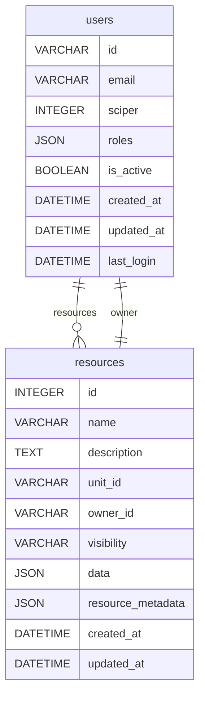

```mermaid
erDiagram
  users {
    VARCHAR id
    VARCHAR email
    INTEGER sciper
    JSON roles
    BOOLEAN is_active
    DATETIME created_at
    DATETIME updated_at
    DATETIME last_login
  }
  resources {
    INTEGER id
    VARCHAR name
    TEXT description
    VARCHAR unit_id
    VARCHAR owner_id
    VARCHAR visibility
    JSON data
    JSON resource_metadata
    DATETIME created_at
    DATETIME updated_at
  }
  resources ||--|| users : owner
  users ||--}o resources : resources
```
