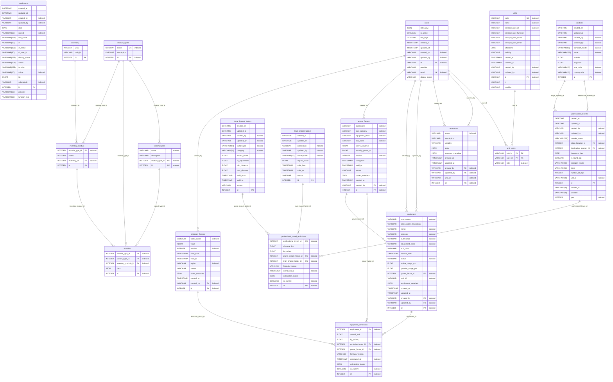

Generating Mermaid ERD...

```mermaid
erDiagram
  emission_factors {
    VARCHAR factor_name "indexed"
    FLOAT value
    INTEGER version "indexed"
    TIMESTAMP valid_from
    TIMESTAMP valid_to
    VARCHAR region "indexed"
    VARCHAR source
    JSON factor_metadata
    TIMESTAMP created_at
    VARCHAR created_by FK "indexed"
    INTEGER id PK "indexed"
  }
  power_factors {
    VARCHAR submodule "indexed"
    VARCHAR sub_category "indexed"
    VARCHAR equipment_class "indexed"
    VARCHAR sub_class "indexed"
    FLOAT active_power_w
    FLOAT standby_power_w
    INTEGER version "indexed"
    TIMESTAMP valid_from
    TIMESTAMP valid_to
    VARCHAR source
    JSON power_metadata
    TIMESTAMP created_at
    VARCHAR created_by FK "indexed"
    INTEGER id PK "indexed"
  }
  equipment {
    VARCHAR cost_center "indexed"
    VARCHAR cost_center_description
    VARCHAR name "indexed"
    VARCHAR category "indexed"
    VARCHAR submodule "indexed"
    VARCHAR equipment_class "indexed"
    VARCHAR sub_class
    TIMESTAMP service_date
    VARCHAR status "indexed"
    FLOAT active_usage_pct
    FLOAT passive_usage_pct
    INTEGER power_factor_id FK "indexed"
    VARCHAR unit_id "indexed"
    JSON equipment_metadata
    TIMESTAMP created_at
    TIMESTAMP updated_at
    VARCHAR created_by FK "indexed"
    VARCHAR updated_by FK "indexed"
    INTEGER id PK "indexed"
  }
  equipment_emissions {
    INTEGER equipment_id FK "indexed"
    FLOAT annual_kwh
    FLOAT kg_co2eq
    INTEGER emission_factor_id FK "indexed"
    INTEGER power_factor_id FK "indexed"
    VARCHAR formula_version
    TIMESTAMP computed_at "indexed"
    JSON calculation_inputs
    BOOLEAN is_current "indexed"
    INTEGER id PK "indexed"
  }
  headcounts {
    DATETIME created_at
    DATETIME updated_at
    VARCHAR created_by "indexed"
    VARCHAR updated_by "indexed"
    DATE date
    VARCHAR(50) unit_id "indexed"
    VARCHAR(255) unit_name
    VARCHAR(50) cf
    VARCHAR(255) cf_name
    VARCHAR(50) cf_user_id
    VARCHAR(255) display_name
    VARCHAR(100) status
    VARCHAR(255) function
    VARCHAR(20) sciper "indexed"
    FLOAT fte
    VARCHAR submodule "indexed"
    INTEGER id PK
    VARCHAR(50) provider
    VARCHAR(50) function_role
  }
  inventory {
    INTEGER year
    VARCHAR unit_id
    INTEGER id PK
  }
  inventory_module {
    INTEGER module_type_id FK "indexed"
    INTEGER status
    INTEGER inventory_id FK "indexed"
    INTEGER id PK
  }
  locations {
    DATETIME created_at
    DATETIME updated_at
    VARCHAR created_by "indexed"
    VARCHAR updated_by "indexed"
    VARCHAR(50) transport_mode "indexed"
    VARCHAR(255) name "indexed"
    FLOAT latitude
    FLOAT longitude
    VARCHAR(10) iata_code "indexed"
    VARCHAR(10) countrycode "indexed"
    INTEGER id PK
  }
  modules {
    INTEGER module_type_id FK "indexed"
    INTEGER variant_type_id FK "indexed"
    INTEGER inventory_module_id FK "indexed"
    JSON data
    INTEGER id PK "indexed"
  }
  module_types {
    VARCHAR name UK "indexed"
    VARCHAR description
    INTEGER id PK "indexed"
  }
  professional_travels {
    DATETIME created_at
    DATETIME updated_at
    VARCHAR created_by "indexed"
    VARCHAR updated_by "indexed"
    VARCHAR(255) traveler_name
    INTEGER origin_location_id FK "indexed"
    INTEGER destination_location_id FK "indexed"
    DATE departure_date
    BOOLEAN is_round_trip
    VARCHAR(50) transport_mode
    VARCHAR(50) class
    INTEGER number_of_trips
    VARCHAR(50) unit_id "indexed"
    INTEGER id PK
    VARCHAR(50) traveler_id
    VARCHAR(50) provider
    INTEGER year "indexed"
  }
  professional_travel_emissions {
    INTEGER professional_travel_id FK "indexed"
    FLOAT distance_km
    FLOAT kg_co2eq
    INTEGER plane_impact_factor_id FK "indexed"
    INTEGER train_impact_factor_id FK "indexed"
    VARCHAR formula_version
    TIMESTAMP computed_at "indexed"
    JSON calculation_inputs
    BOOLEAN is_current "indexed"
    INTEGER id PK "indexed"
  }
  resources {
    VARCHAR name "indexed"
    VARCHAR description
    VARCHAR visibility
    JSON data
    JSON resource_metadata
    TIMESTAMP created_at
    TIMESTAMP updated_at
    VARCHAR created_by FK "indexed"
    VARCHAR updated_by FK "indexed"
    VARCHAR unit_id "indexed"
    INTEGER id PK "indexed"
  }
  plane_impact_factors {
    DATETIME created_at
    DATETIME updated_at
    VARCHAR created_by "indexed"
    VARCHAR updated_by "indexed"
    VARCHAR(50) factor_type "indexed"
    VARCHAR(50) category "indexed"
    FLOAT impact_score
    FLOAT rfi_adjustment
    FLOAT min_distance
    FLOAT max_distance
    TIMESTAMP valid_from
    TIMESTAMP valid_to
    VARCHAR source
    INTEGER id PK
  }
  train_impact_factors {
    DATETIME created_at
    DATETIME updated_at
    VARCHAR created_by "indexed"
    VARCHAR updated_by "indexed"
    VARCHAR(10) countrycode "indexed"
    FLOAT impact_score
    TIMESTAMP valid_from
    TIMESTAMP valid_to
    VARCHAR source
    INTEGER id PK
  }
  units {
    VARCHAR code UK "indexed"
    VARCHAR name "indexed"
    VARCHAR principal_user_id "indexed"
    VARCHAR principal_user_function
    VARCHAR principal_user_name
    VARCHAR principal_user_email
    JSON affiliations
    VARCHAR visibility
    TIMESTAMP created_at
    TIMESTAMP updated_at
    VARCHAR created_by "indexed"
    VARCHAR updated_by "indexed"
    VARCHAR id PK "indexed"
    VARCHAR cf
    VARCHAR provider
  }
  unit_users {
    VARCHAR unit_id PK "FK"
    VARCHAR user_id PK "FK"
    VARCHAR role "indexed"
  }
  users {
    JSON roles_raw
    BOOLEAN is_active
    DATETIME last_login
    TIMESTAMP created_at
    TIMESTAMP updated_at
    VARCHAR created_by "indexed"
    VARCHAR updated_by "indexed"
    VARCHAR id PK "indexed"
    VARCHAR provider
    VARCHAR email UK "indexed"
    VARCHAR display_name
  }
  variant_types {
    VARCHAR name "indexed"
    VARCHAR description
    INTEGER module_type_id FK "indexed"
    INTEGER id PK "indexed"
  }
  users ||--}o emission_factors : created_by
  users ||--}o power_factors : created_by
  power_factors ||--}o equipment : power_factor_id
  users ||--}o equipment : created_by
  users ||--}o equipment : updated_by
  emission_factors ||--}o equipment_emissions : emission_factor_id
  power_factors ||--}o equipment_emissions : power_factor_id
  equipment ||--}o equipment_emissions : equipment_id
  inventory ||--}o inventory_module : inventory_id
  module_types ||--}o inventory_module : module_type_id
  module_types ||--}o modules : module_type_id
  inventory_module ||--}o modules : inventory_module_id
  variant_types ||--}o modules : variant_type_id
  locations ||--}o professional_travels : origin_location_id
  locations ||--}o professional_travels : destination_location_id
  professional_travels ||--}o professional_travel_emissions : professional_travel_id
  train_impact_factors ||--}o professional_travel_emissions : train_impact_factor_id
  plane_impact_factors ||--}o professional_travel_emissions : plane_impact_factor_id
  users ||--}o resources : created_by
  users ||--}o resources : updated_by
  units ||--}o unit_users : unit_id
  users ||--}o unit_users : user_id
  module_types ||--}o variant_types : module_type_id
```

Mermaid ERD generation complete.
