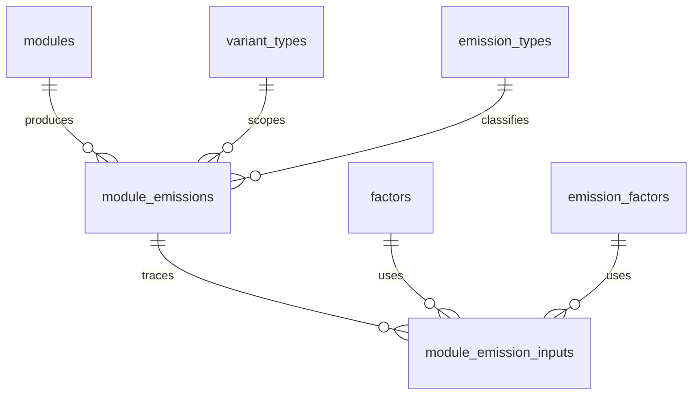
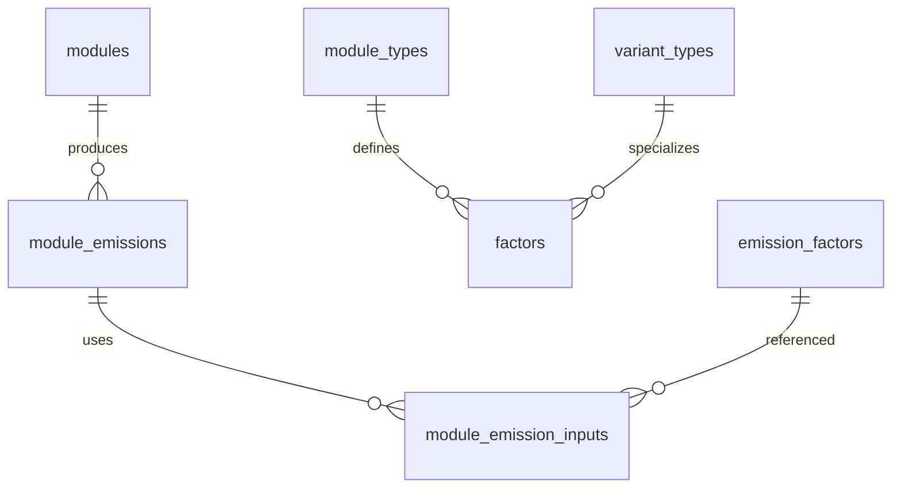

Perfect — this is now **very clear**, and your instincts are right:

- ✅ `emission_type` **must be a table**
- ✅ Use **JSON where variability explodes**
- ✅ Keep the relational spine _thin but strict_

I’ll give you a **generic ERD + table design** that:

- Covers **equipment power factors**
- Covers **headcount multi-emissions**
- Covers **future modules (flights, cloud, etc.)**
- Preserves **traceability**
- Avoids schema churn

---

## 1. Normalize the concepts (final vocabulary)

We will use **exactly 5 core concepts**:

1. **Module** → _what exists_
2. **Variant (submodule)** → _how it behaves_
3. **Factor** → _assumptions / coefficients_
4. **Emission type** → _what kind of emission_
5. **Emission result** → _the computed output_

Everything fits cleanly in this frame.

---

## 2. Emission types (strict FK, as requested)

### `emission_types`

```sql
emission_types (
  id PK,
  code TEXT UNIQUE NOT NULL,     -- 'energy', 'food', 'waste', 'transport'
  label TEXT NOT NULL,
  unit TEXT NOT NULL             -- always 'kg_co2eq' for now
);
```

Examples:

| code        | label                |
| ----------- | -------------------- |
| energy      | Electricity / energy |
| food        | Food                 |
| waste       | Waste                |
| transport   | Transport            |
| grey_energy | Grey energy          |

✅ Stable
✅ FK-friendly
✅ Extensible

---

## 3. Generic factors table (THIS replaces power_factors, headcount factors…)

### `factors`

```sql
factors (
  id PK,

  factor_family TEXT NOT NULL,
  -- e.g. 'power', 'headcount', 'flight', 'cloud'

  module_type_id FK NULL,
  variant_type_id FK NULL,

  classification JSONB NOT NULL,
  -- free structure: class, sub_class, category, etc.

  values JSONB NOT NULL,
  -- actual coefficients

  unit JSONB,
  source TEXT,

  created_at TIMESTAMP,
  created_by VARCHAR
);
```

---

## 4. Mapping your power CSV into `factors`

### Example CSV row

```
Submodule = scientific
Class = Centrifugation
Sub-class = Ultra centrifuges
Active = 1300 W
Standby = 130 W
```

### Stored as

```json
classification = {
  "submodule": "scientific",
  "category": "Miscellaneous lab equipment",
  "class": "Centrifugation",
  "sub_class": "Ultra centrifuges"
}

values = {
  "active_power_w": 1300,
  "standby_power_w": 130
}

unit = {
  "active_power_w": "W",
  "standby_power_w": "W"
}
```

✔ No schema explosion
✔ CSVs import cleanly
✔ You can index JSON paths later if needed

---

## 5. Headcount factors (same table, different family)

### Example: student FTE

```json
factor_family = "headcount"

values = {
  "food_kg_per_fte": 420,
  "waste_kg_per_fte": 90,
  "transport_kg_per_fte": 110,
  "grey_energy_kg_per_fte": 75
}
```

✔ One factor → many emission types
✔ No duplication

---

## 6. Emission results (generic, clean)

### `module_emissions`

```sql
module_emissions (
  id PK,

  module_id FK NOT NULL,
  variant_type_id FK NOT NULL,

  emission_type_id FK NOT NULL,

  kg_co2eq FLOAT NOT NULL,

  metadata JSONB,
  -- annual_kwh, fte, distance_km, etc.

  computed_at TIMESTAMP NOT NULL,
  formula_version TEXT,
  is_current BOOLEAN DEFAULT true
);
```

---

## 7. Traceability of inputs (this is the “audit spine”)

### `module_emission_inputs`

```sql
module_emission_inputs (
  id PK,

  module_emission_id FK NOT NULL,

  factor_id FK NULL,
  emission_factor_id FK NULL,

  snapshot JSONB NOT NULL
);
```

### Snapshot example

```json
{
  "active_power_w": 1300,
  "standby_power_w": 130,
  "annual_kwh": 5400,
  "electricity_mix": "CH-2022",
  "kg_co2eq_per_kwh": 0.012
}
```

✔ Explains the number
✔ Independent of later factor updates
✔ Legally strong

---

## 8. How equipment vs headcount works (side by side)

### Equipment

- 1 module
- 1 variant
- 1 emission_type = `energy`
- Uses:
  - power factor
  - electricity emission factor

### Headcount

- 1 module
- 1 variant (`student`, `staff`)
- **4 emissions**
  - food
  - waste
  - transport
  - grey_energy

- Uses:
  - headcount factor
  - NO electricity mix

Same tables.
Different rows.

---

## 9. Final ERD (Mermaid)



---

## 10. Why this is the _right_ generic design

✅ Supports **N emissions per module**
✅ Supports **heterogeneous inputs**
✅ CSVs import naturally
✅ JSON only where variability exists
✅ FK where meaning must be strict
✅ No module-specific tables ever again

---

## 11. What I recommend next (very concrete)

Next best steps (in order):

1. **Define `emission_types` taxonomy** (small, stable)
2. Lock **factor_family enum values**
3. Define **JSON schema per factor_family** (lightweight)
4. Then design **module_emissions indexes** for performance

If you want, next I can:

- Write the **exact SQL DDL**
- Show **example INSERTs** for equipment + headcount
- Help design **JSON validation rules**
- Map this cleanly to your existing API DTOs

Just tell me where you want to go next.

Excellent, this is the **right abstraction point**.
You’re basically designing a **generic calculation graph**:

> **Module instance → Submodule (variant) → Inputs (factors) → Emission results**

Let’s do this **clean, generic, and extensible**, without over-engineering.

---

# 1. First: clarify the model in one sentence

> **A module instance produces one or more emission results, each result being computed from a set of factors (inputs), possibly combined with global emission factors (e.g. energy mix).**

This sentence drives the ERD.

---

# 2. Core design decisions (important)

### 2.1 Emissions are **results**, not documents

- Calculated
- Time-based
- No rollback semantics
- Must be traceable (how was it computed?)

➡️ **Class B (business state + audit)**

### 2.2 Factors are **inputs**

- Some are module-specific (headcount, power)
- Some are global reference (energy mix)

➡️ Stored separately, referenced explicitly

---

# 3. Key abstraction: “Emission component”

You already spotted the problem:

- Equipment → **1 emission**
- Headcount → **3 emissions** (food, waste, transport)

👉 Solution: **don’t force 1 row = 1 module**

Instead:

> **One module instance can produce N emission components**

---

# 4. Proposed core tables (generic)

## 4.1 `module_emissions` (replaces equipment_emissions)

This is the **emission result header**.

```sql
module_emissions (
  id PK,
  module_id FK,                 -- modules.id
  variant_type_id FK,           -- submodule
  emission_type TEXT,           -- 'energy', 'food', 'waste', 'transport', etc.

  kg_co2eq FLOAT NOT NULL,

  computed_at TIMESTAMP NOT NULL,
  formula_version TEXT,
  is_current BOOLEAN DEFAULT true
)
```

### Why this works

- Equipment → 1 row (`emission_type = 'energy'`)
- Headcount → 3 rows (`food`, `waste`, `transport`)
- Future modules → arbitrary types

📌 `emission_type` can later become a FK if you want strict taxonomy.

---

## 4.2 `module_emission_inputs` (traceability of factors)

This table answers **“why is this number what it is?”**

```sql
module_emission_inputs (
  id PK,
  module_emission_id FK,

  input_type TEXT,              -- 'power_factor', 'headcount_factor', 'energy_mix'
  input_ref_id INTEGER,         -- FK to factor table (soft FK)
  input_name TEXT,              -- snapshot label
  input_value FLOAT,            -- snapshot value

  unit TEXT                     -- 'kWh', 'kg/person', etc.
)
```

### This is critical

- You **snapshot inputs**
- Even if factors change later, emissions stay explainable
- Auditors LOVE this

---

# 5. Generic factors model

Now let’s unify **power factors, headcount factors, etc.**

## 5.1 `factors` (generic)

```sql
factors (
  id PK,
  factor_type TEXT,        -- 'power', 'headcount', 'waste', etc.
  name TEXT,
  unit TEXT,
  value FLOAT,

  scope TEXT,              -- 'global', 'module', 'submodule'
  module_type_id FK NULL,
  variant_type_id FK NULL,

  source TEXT,
  created_at TIMESTAMP,
  created_by VARCHAR
)
```

### Examples

| factor_type | name                | value |
| ----------- | ------------------- | ----- |
| power       | active_power_w      | 120   |
| power       | standby_power_w     | 5     |
| headcount   | kg_food_per_person  | 420   |
| headcount   | kg_waste_per_person | 90    |

---

## 5.2 Emission factors (energy mix)

You already have this concept — keep it explicit.

```sql
emission_factors (
  id PK,
  factor_type TEXT,        -- 'electricity', 'heat'
  region TEXT,
  kg_co2eq_per_kwh FLOAT,
  source TEXT,
  valid_from TIMESTAMP,
  valid_to TIMESTAMP
)
```

These are **referenced**, never embedded.

---

# 6. How a calculation actually works (example)

### Equipment module

- module_id = 42
- variant = “Laptop”

**Inputs**

- active_power_w
- standby_power_w
- annual_kwh
- electricity emission factor (CH)

**Outputs**

```text
module_emissions
  → emission_type = 'energy'
  → kg_co2eq = 123.4
```

Inputs recorded in `module_emission_inputs`.

---

### Headcount module

- module_id = 77
- variant = “Staff”

**Outputs**

```text
module_emissions
  → food
  → waste
  → transport
```

Each row:

- Same module_id
- Different emission_type
- Different inputs

---

# 7. ERD (Mermaid)



---

# 8. Why this design scales

✅ Supports:

- 1-to-many emissions per module
- Arbitrary future modules
- Multiple calculation methods
- Factor changes over time
- Full traceability

❌ Avoids:

- Module-specific tables
- Schema churn
- Hardcoded assumptions

---

# 9. Migration path from current tables

| Old                     | New                    |
| ----------------------- | ---------------------- |
| equipment_emissions     | module_emissions       |
| power_factors           | factors                |
| headcount emissions     | module_emissions       |
| calculation_inputs JSON | module_emission_inputs |

You can migrate **incrementally**.

---

# 10. Final mental model (remember this)

> **Modules define scope
> Factors define assumptions
> Emissions define results
> Inputs define traceability**

This is a **very strong, future-proof design**.

---

If you want next, I can:

- Validate this with a **real SQL example**
- Help you define **factor taxonomy**
- Design **indexes for performance**
- Map this cleanly to your existing frontend model

Just tell me where you want to go next.

**YES!** That's actually a much cleaner approach. Let me explain why your instinct is correct:

---

## Problem with the Current Design

The document has **two conflicting versions** of `factors`:

### Version 1 (Section 5.1 - lines 398-428) - Simple scalar

```sql
factors (
  id PK,
  factor_type TEXT,
  name TEXT,
  unit TEXT,
  value FLOAT,              -- ❌ Only ONE value
  ...
)
```

This forces you to have **multiple rows** for related data:

- Row 1: active_power_w = 120
- Row 2: standby_power_w = 5

### Version 2 (Section 3 - lines 43-75) - JSON

```sql
factors (
  id PK,
  factor_family TEXT,
  classification JSONB,
  values JSONB,              -- ✅ Multiple values together
  unit JSONB,
  ...
)
```

This keeps related data **together**:

```json
values = {
  "active_power_w": 120,
  "standby_power_w": 5
}
```

---

## Your Proposal (Best of Both Worlds)

Store **everything** in `factors` with JSON + use `document_version` for audit:

```sql
factors (
  id PK,
  factor_family TEXT NOT NULL,
  module_type_id FK NULL,
  variant_type_id FK NULL,

  values JSONB NOT NULL,
  -- {
  --   "active_power_w": 120,
  --   "standby_power_w": 5,
  --   "annual_kwh": 450
  -- }

  source TEXT,
  created_at TIMESTAMP,
  created_by VARCHAR
)
```

Then track changes via `document_version`:

```sql
document_version (
  id PK,
  table_name TEXT,           -- 'factors'
  record_id INTEGER,         -- factors.id
  version INTEGER,
  data JSONB,                -- snapshot of the entire row
  changed_at TIMESTAMP,
  changed_by VARCHAR
)
```

---

## Why This is Better

### ✅ Simplification

- **One** factor row = **one** logical unit (e.g., "laptop power profile")
- No need for `module_emission_inputs` table at all

### ✅ Audit Trail

- `document_version` already tracks all changes
- You can reconstruct any historical calculation

### ✅ Recalculation

```python
def recalculate_when_factor_changes(factor_id: int):
    # Find all emissions using this factor
    affected = db.query("""
        SELECT me.id, me.module_id
        FROM module_emissions me
        WHERE me.factor_id = ?
          AND me.is_current = true
    """, factor_id)

    # Mark as stale + recalculate
    ...
```

---

## Revised Schema

```sql
factors (
  id PK,
  factor_family TEXT NOT NULL,
  scope TEXT,
  module_type_id FK NULL,
  variant_type_id FK NULL,

  values JSONB NOT NULL,
  classification JSONB,

  source TEXT,
  created_at TIMESTAMP,
  created_by VARCHAR
)

module_emissions (
  id PK,
  module_id FK NOT NULL,
  variant_type_id FK NOT NULL,
  emission_type_id FK NOT NULL,

  factor_id FK NULL,              -- ✅ Direct link
  emission_factor_id FK NULL,     -- ✅ For energy mix

  kg_co2eq FLOAT NOT NULL,
  metadata JSONB,

  computed_at TIMESTAMP NOT NULL,
  is_current BOOLEAN DEFAULT true
)
```

---

## No More `module_emission_inputs` Table

You don't need it because:

1. **Current calculation**: Read from `factors.values` + `emission_factors`
2. **Historical reconstruction**: Use `document_version` to get factor values at `computed_at` timestamp

---

## Query Example: "What inputs were used?"

```sql
SELECT
  me.kg_co2eq,
  me.computed_at,
  dv.data AS factor_snapshot
FROM module_emissions me
JOIN document_version dv
  ON dv.table_name = 'factors'
  AND dv.record_id = me.factor_id
  AND dv.changed_at <= me.computed_at
ORDER BY dv.changed_at DESC
LIMIT 1
```

This gives you the factor values **as they were** when the emission was computed.

---

## Comparison

| Approach            | Tables                                                  | Complexity | Audit                          |
| ------------------- | ------------------------------------------------------- | ---------- | ------------------------------ |
| **Original design** | `factors`, `module_emissions`, `module_emission_inputs` | High       | Manual snapshots               |
| **Your proposal**   | `factors`, `module_emissions`, `document_version`       | Medium     | Automatic via document_version |

---

## My Recommendation

**Use your approach.** Store everything in `factors` with JSON, and let `document_version` handle the audit trail.

**Only caveat**: Make sure your `document_version` implementation captures changes **before** they're saved, so you can always reconstruct history.

Does this align with what you were thinking?
