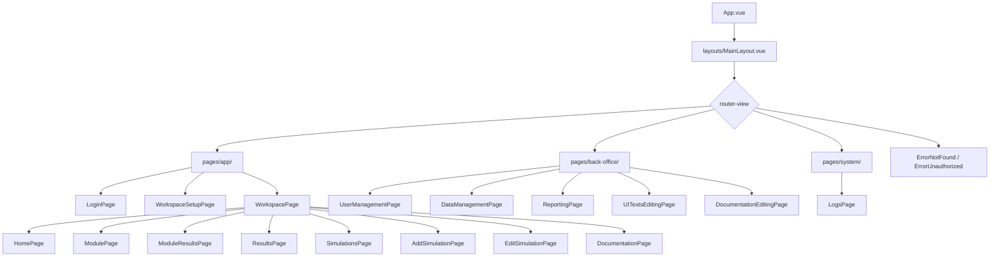
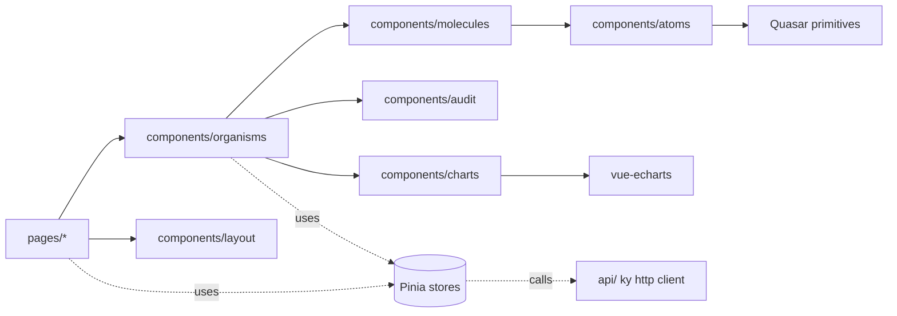

# Component Tree

The frontend follows a loose Atomic Design split (`atoms/molecules/organisms`)
under `frontend/src/components/`, plus feature folders (`audit/`, `charts/`,
`layout/`). Pages live in `frontend/src/pages/` grouped by audience: `app/`
(end users), `back-office/` (admins), `system/` (superadmin).

## Top-Level Tree

`WorkspacePage` is the workspace shell: it owns the unit/year context and
renders the module-scoped children.

## Component Layers

- **atoms/** — `CO2Container`, `CO2DestinationInput`, `Co2LanguageSelector`,
  `ModuleIcon`. Single-purpose, story-covered.
- **molecules/** — `BigNumber`, `ChartContainer`, `Co2TimelineItem`,
  `HeadCountBarChart`, `NoteDialog`.
- **organisms/** — feature subfolders: `backoffice/`, `data-management/`,
  `layout/`, `login/`, `module/`, `workspace-selector/`, plus large composed
  views like `AdditionalCategoriesSection.vue` and `ItFocusSection.vue`.
- **audit/** — back-office audit log UI: `AuditDetailDrawer`,
  `AuditFilterBar`, `AuditPagination`, `AuditSearchBar`, `AuditStatCards`,
  `AuditTable`.

## Pinia Stores

State lives in `frontend/src/stores/`. The active stores are:

| Store                      | Purpose                                             |
| -------------------------- | --------------------------------------------------- |
| `auth`                     | Current user, `roles_raw`, `permissions`, login/out |
| `workspace`                | Selected unit + year; drives most of the app shell  |
| `modules`                  | Module config and per-module activity data          |
| `factors`                  | Emission factors loaded from the backend            |
| `unitFilters`              | Unit picker filtering and search                    |
| `yearConfig`               | Year-scoped configuration (open/closed years, etc.) |
| `building_rooms`           | Room metadata for equipment module                  |
| `files`                    | Upload state for CSV imports                        |
| `backoffice`               | Back-office shell state                             |
| `backofficeDataManagement` | Factor / unit / activity admin                      |
| `colorblind`               | Accessibility palette toggle                        |

## Routing & Guards

Defined in `frontend/src/router/routes.ts`. All authenticated routes nest
under `/:language(en|fr)/`; the workspace routes nest further under
`/:unit/:year/`. Three guards from `router/guards/`:

- `requirePermission(resource, action)` — back-office and system pages.
- `requireModuleEditPermission()` — module data-entry pages.
- `validateUnitGuard`, `redirectToWorkspaceIfSelectedGuard` — workspace.

## API Layer

`frontend/src/api/` wraps [ky](https://github.com/sindresorhus/ky) with
endpoint constants and an auth-aware fetch wrapper. Components do not call
`fetch` directly: they go through stores, which call the api layer. Errors
bubble back to UI as Quasar `Notify` toasts.

## Charts and Visualization

`components/charts/` plus `vue-echarts` (declarative ECharts). Use
`ChartContainer.vue` for sizing and reactive resize. See
`HeadCountBarChart.vue` for a worked example.
