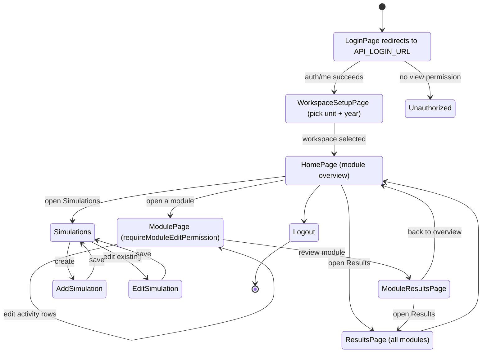
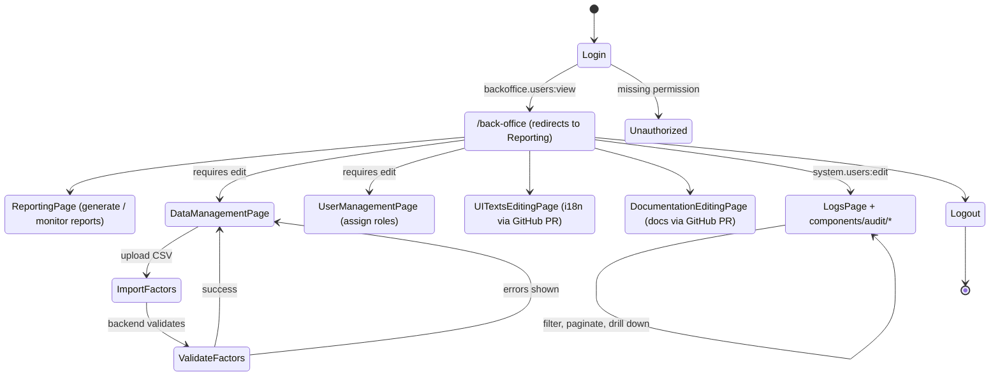

# Persona Flows

Two primary personas drive the frontend. Both authenticate against Microsoft
Entra ID via the backend, then diverge based on permissions returned from
`auth/me`.

## Data-Entry User

Lab member who enters activity data for the unit they belong to and reviews
the resulting emissions.

Key gates:

- `validateUnitGuard` rejects unknown units in the URL.
- `requireModuleEditPermission()` blocks read-only users from `ModulePage`
  while still letting them open `ModuleResultsPage` and `ResultsPage`.
- The `workspace` Pinia store holds the selected `(unit, year)` and survives
  page reloads via `pinia-plugin-persistedstate`.

## Back-Office User

Admin who curates emission factors, manages users, edits documentation, and
audits the system. Access is gated by `backoffice.users` permissions
(scoped per affiliation — see issue #459).

Key gates:

- Most back-office routes use `requirePermission('backoffice.users', …)`;
  the audit logs route is the exception (`LogsPage` uses
  `system.users:edit`, see `frontend/src/router/routes.ts:265-278`).
- The audit drawer (`AuditDetailDrawer.vue`) reads from
  `components/audit/*` and the `backofficeDataManagement` store.
- `UITextsEditingPage` and `DocumentationEditingPage` write changes by
  opening pull requests on the docs / i18n repo — no direct file writes
  from the browser.

## Where Things Live

| Concern                 | Code path                                                |
| ----------------------- | -------------------------------------------------------- |
| Login                   | `pages/app/LoginPage.vue`, `stores/auth.ts`              |
| Workspace selection     | `pages/app/WorkspaceSetupPage.vue`, `stores/workspace.ts`|
| Module data entry       | `pages/app/ModulePage.vue`, `components/organisms/module`|
| Results                 | `pages/app/ResultsPage.vue` (consolidated)               |
| Back-office data        | `pages/back-office/DataManagementPage.vue`               |
| Audit                   | `pages/system/LogsPage.vue`, `components/audit/`         |
| Route guards            | `frontend/src/router/guards/`                            |

For the underlying request/response model, see
[Auth Flow Across Layers](../../architecture/04-auth-flow.md) and
[Data Flow](../../architecture/10-data-flow.md).
