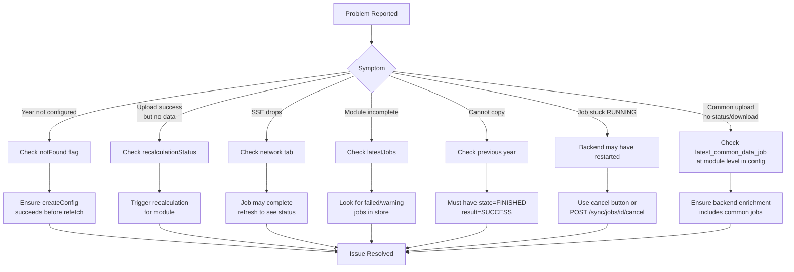

# API and Troubleshooting

## API Endpoints

```mermaid
flowchart LR
    subgraph YearConfiguration
        Y1[GET /year-configuration/{year}]
        Y2[POST /year-configuration/{year}]
        Y3[PATCH /year-configuration/{year}]
    end

    subgraph SyncJobs
        S1[GET /sync/jobs/year/{year}]
        S2[GET /sync/jobs/year/{year}/latest]
        S3[POST /sync/dispatch]
        S4[GET /sync/jobs/{jobId}/stream<br/>SSE]
        S5[POST /sync/factors/{moduleId}/{dataTypeId}]
        S6[POST /sync/recalculate-emissions/{moduleId}]
        S7[POST /sync/units]
        S8[POST /sync/jobs/{jobId}/cancel]
    end

    subgraph Files
        F1[POST /files/temp]
        F2[GET /files/{filePath}]
    end
```

### Initiate Sync — `POST /sync/dispatch`

Request:

```json
{
  "ingestion_method": 1,
  "target_type": 0,
  "year": 2023,
  "filters": {},
  "config": {
    "module_type_id": 1,
    "data_entry_type_id": 1
  },
  "file_path": "/tmp/uploads/file.csv"
}
```

Response:

```json
{ "job_id": 94 }
```

### SSE Stream Update

```json
{
  "job_id": 94,
  "module_type_id": 1,
  "target_type": 0,
  "year": 2023,
  "state": 3,
  "result": 0,
  "status_message": "Job finished",
  "meta": {
    "rows_processed": 150,
    "rows_skipped": 5,
    "rows_with_factors": 145,
    "rows_without_factors": 5
  }
}
```

## Troubleshooting



### Debug Checklist

1. **Inspect store state in the browser console:**

   ```javascript
   const yearConfig = useYearConfigStore();
   console.log('Config:', yearConfig.config);
   console.log('Not found:', yearConfig.notFound);

   const dataManagement = useBackofficeDataManagement();
   console.log('Sync jobs:', dataManagement.syncJobs);
   ```

2. **Verify API responses:** open the Network tab and filter by
   `year-configuration` or `sync` to inspect payloads.

3. **Check the SSE connection:**

   ```javascript
   const store = useBackofficeDataManagement();
   console.log('SSE Connection:', store.sseConnection);
   ```

## i18n Keys

### Page-level

- `data_management_reporting_year`
- `data_management_sync_units_from_accred`
- `data_management_year_not_configured`
- `data_management_year_not_configured_hint`
- `data_management_create_year`
- `data_management_reporting_year_hint`
- `open_year_for_users`
- `data_management_open_year_disabled_tooltip`

### Module-level

- `data_management_recalculate_emissions`
- `data_management_recalculation_needed`
- `data_management_recalculation_success`
- `data_management_recalculation_warning`
- `data_management_recalculation_error`
- `common_disabled`
- `common_filter_incomplete`

### Reduction Objectives

- `data_management_reduction_objectives`
- `data_management_institution_carbon_footprint_title`
- `data_management_institution_carbon_footprint_description`
- `data_management_population_projections_title`
- `data_management_population_projections_description`
- `data_management_unit_reduction_scenarios_title`
- `data_management_unit_reduction_scenarios_description`
- `data_management_define_reduction_objectives_title`
- `data_management_define_reduction_objectives_description`

### Uploads

- `common_upload_csv`
- `csv_sync_completed`
- `csv_sync_completed_with_warnings`
- `csv_sync_failed`
- `csv_sync_success_caption`
- `csv_sync_warnings_caption`
- `csv_sync_connection_lost`
- `data_management_connection_failed`
- `data_management_no_previous_jobs`
- `data_management_copy_failed`
- `data_management_job_in_progress`
- `data_management_cancel_job`

### Config

- `year_config_saved`
- `year_config_save_error`
- `year_config_target_year_error`
- `year_config_percentage_error`
- `year_config_reference_year_error`

## Future Improvements

- [ ] Dynamic available years (currently hardcoded `MIN_YEARS = 2024`)
- [ ] Download reduction objective files (TODO in code)
- [ ] Batch recalculation for multiple modules
- [ ] Export year configuration
- [ ] Import year configuration from JSON
- [ ] Real-time collaboration (multiple admins)
- [ ] Audit trail for configuration changes
- [x] Progress indicators for long-running uploads (SSE + cancel button)
- [ ] Bulk operations (enable/disable multiple modules)
- [ ] Template configurations for new years
