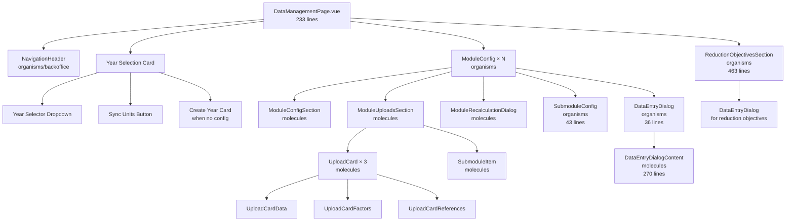
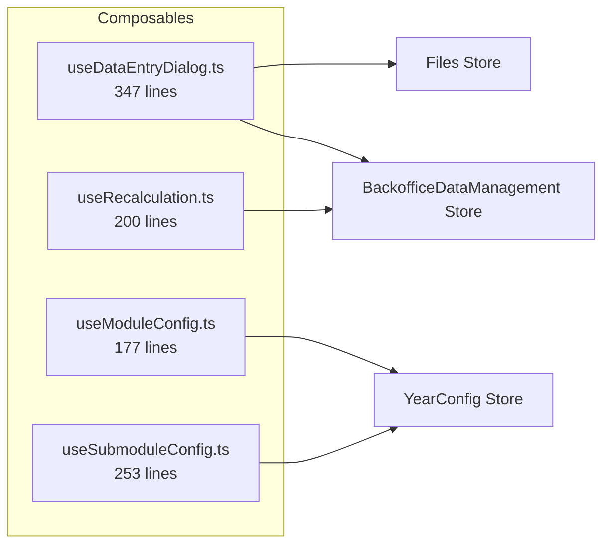
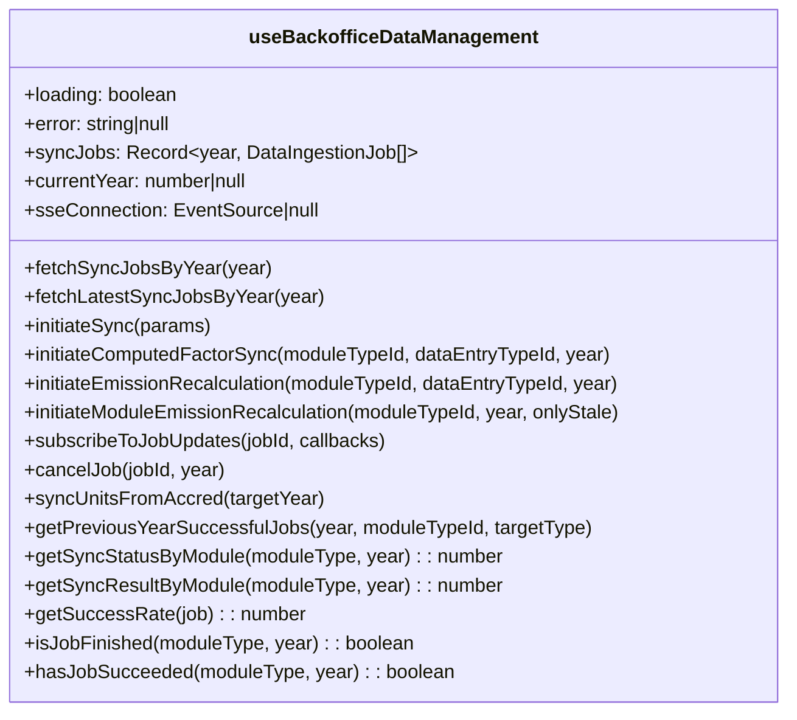
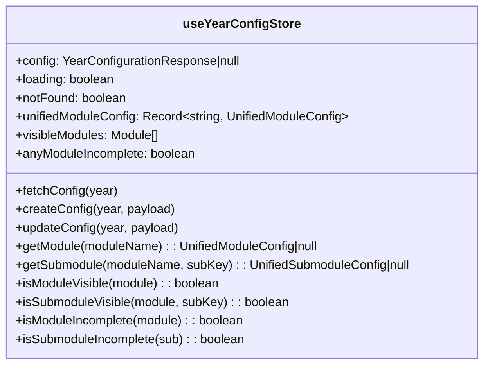

# Architecture

## Component Hierarchy



## Component Summary

| Type     | Component                        | Lines | Responsibility                                                    |
| -------- | -------------------------------- | ----- | ----------------------------------------------------------------- |
| Organism | `DataManagementPage.vue`         | 233   | Page root: year selection, module iteration, dialog orchestration |
| Organism | `ModuleConfig.vue`               | 198   | Single module: expansion item with config, uploads, submodules    |
| Organism | `SubmoduleConfig.vue`            | 43    | Renders submodule list within a module                            |
| Organism | `DataEntryDialog.vue`            | 36    | Thin wrapper around DataEntryDialogContent                        |
| Organism | `ReductionObjectivesSection.vue` | 463   | Reduction objectives: file uploads + 3 goal slots                 |
| Molecule | `ModuleConfigSection.vue`        | 101   | Module enable/disable, uncertainty tagging                        |
| Molecule | `ModuleUploadsSection.vue`       | 121   | Upload cards + recalculation triggers                             |
| Molecule | `DataEntryDialogContent.vue`     | 270   | CSV upload, API connection, copy logic                            |
| Molecule | `SubmoduleItem.vue`              | 250   | Individual submodule row with status                              |
| Molecule | `ModuleRecalculationDialog.vue`  | 86    | Module-wide recalculation confirmation                            |
| Molecule | `ComputedFactorDialog.vue`       | 57    | Computed factor regeneration dialog                               |
| Molecule | `UploadCard.vue`                 | 278   | Base upload card with download, cancel, status                    |
| Molecule | `UploadCardData.vue`             | 66    | Data upload (CSV / API / copy)                                    |
| Molecule | `UploadCardFactors.vue`          | 89    | Factor upload (CSV / computed)                                    |
| Molecule | `UploadCardReferences.vue`       | 408   | Self-contained reference data upload with SSE + cancel            |

## Composables



| Composable              | Lines | Responsibility                                                     |
| ----------------------- | ----- | ------------------------------------------------------------------ |
| `useDataEntryDialog.ts` | 347   | CSV upload, API connection, previous year copy, SSE job monitoring |
| `useModuleConfig.ts`    | 177   | Module enable/disable, uncertainty management, job status lookup   |
| `useRecalculation.ts`   | 200   | Recalculation status tracking, trigger module/type recalculation   |
| `useSubmoduleConfig.ts` | 253   | Submodule enable/disable, threshold configuration                  |

## Stores

### `useBackofficeDataManagement`



### `useYearConfigStore`



## File Structure

```
frontend/src/
├── pages/back-office/
│   └── DataManagementPage.vue          # Page root (233 lines)
├── components/
│   ├── organisms/data-management/
│   │   ├── ModuleConfig.vue
│   │   ├── SubmoduleConfig.vue
│   │   ├── DataEntryDialog.vue
│   │   └── ReductionObjectivesSection.vue
│   └── molecules/data-management/
│       ├── ModuleConfigSection.vue
│       ├── ModuleUploadsSection.vue
│       ├── DataEntryDialogContent.vue
│       ├── SubmoduleItem.vue
│       ├── ModuleRecalculationDialog.vue
│       ├── ComputedFactorDialog.vue
│       ├── UploadCard.vue
│       ├── UploadCardData.vue
│       ├── UploadCardFactors.vue
│       └── UploadCardReferences.vue
├── composables/
│   ├── useDataEntryDialog.ts
│   ├── useModuleConfig.ts
│   ├── useRecalculation.ts
│   └── useSubmoduleConfig.ts
├── stores/
│   ├── backofficeDataManagement.ts
│   └── yearConfig.ts
├── constant/
│   ├── backoffice-module-config.ts
│   └── modules.ts
└── api/http.ts
```
