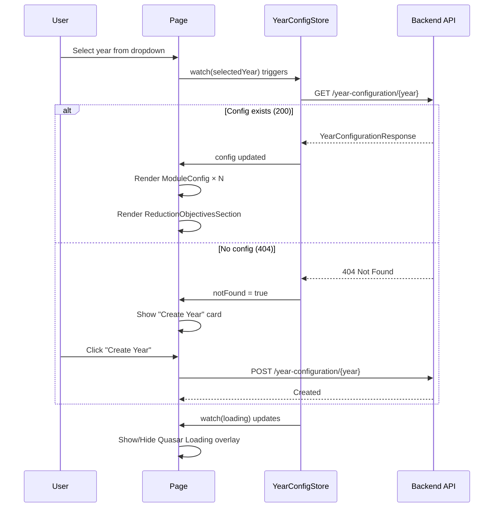
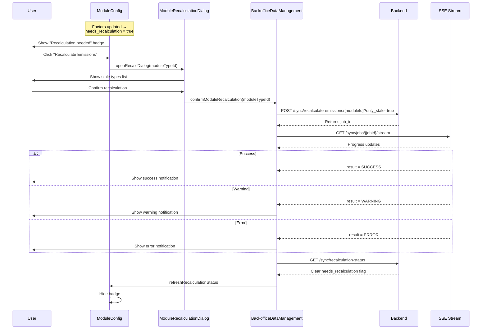
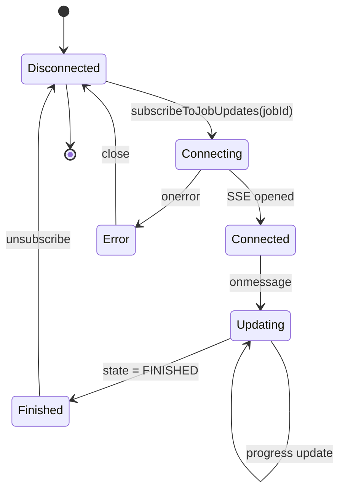
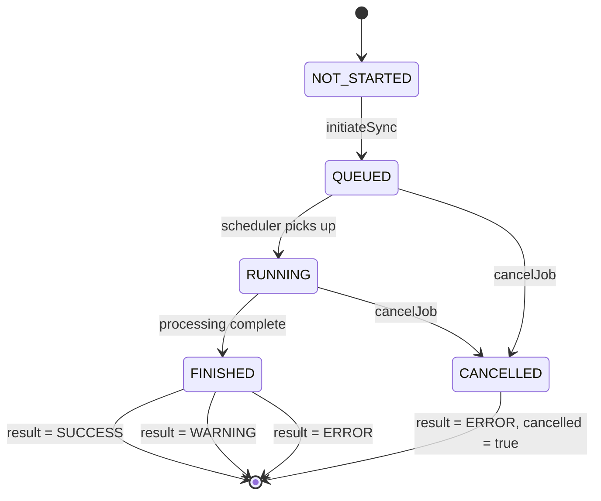

# Data Flows

## 1. Year Configuration Lifecycle



## 2. Data Upload Flow

```mermaid
flowchart TD
    Start[User clicks Upload/Connect] --> OpenDialog[openDataEntryDialog<br/>ImportRow + TargetType]
    OpenDialog --> Dialog[DataEntryDialogContent opens]

    Dialog --> Choice{Choose method}

    Choice -->|CSV| CSV[Select files]
    CSV --> Upload[filesStore.uploadTempFiles<br/>POST /files/temp]
    Upload --> InitCSV[initiateSync provider: csv<br/>POST /sync/dispatch]

    Choice -->|API| API[Fill credentials]
    API --> InitAPI[initiateSync provider: api<br/>POST /sync/dispatch]

    Choice -->|Copy| Copy[loadPreviousYearJobs<br/>GET /sync/jobs/year/{y-1}/latest]
    Copy --> SelectJob[Select job from list]
    SelectJob --> InitCopy[initiateSync provider: copy<br/>POST /sync/dispatch]

    InitCSV --> GetJobId[Returns job_id]
    InitAPI --> GetJobId
    InitCopy --> GetJobId

    GetJobId --> Subscribe[subscribeToJobUpdates<br/>SSE: GET /sync/jobs/{jobId}/stream]

    Subscribe --> Monitor{Monitor progress}
    Monitor -->|Update| Update[Update syncJobs store]
    Update --> Monitor
    Monitor -->|Complete| Complete[On completion handler]

    Complete --> Refresh1[refreshRecalculationStatus]
    Complete --> Refresh2[fetch year config]
    Complete --> Notify[Show notification]

    Notify --> End[Dialog closes]
```

## 3. Recalculation Flow



## SSE Job Monitoring



## Job Status Flow


