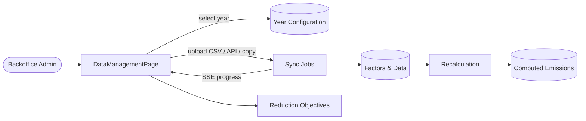

# Data Management

## Why

The Data Management page is the central backoffice surface where administrators
configure CO2 emission inputs for each reporting year. Without it, modules have
no factors, no data, and emissions cannot be computed.

## What

Year-scoped configuration for every emission module: enable/disable modules
and submodules, upload data and emission factors, copy from previous years,
trigger recalculations, and define reduction objectives.

Source page: `frontend/src/pages/back-office/DataManagementPage.vue`.

## How

## Sub-pages

- [Architecture](architecture.md) — component hierarchy, composables, stores.
- [Data flows](data-flows.md) — year config lifecycle, upload, recalculation.
- [Modules & configuration](modules-and-config.md) — module/submodule layout,
  year-config schema, common-upload pattern, completeness rules.
- [API & troubleshooting](api-and-troubleshooting.md) — endpoints, payloads,
  i18n keys, debug checklist, future improvements.
