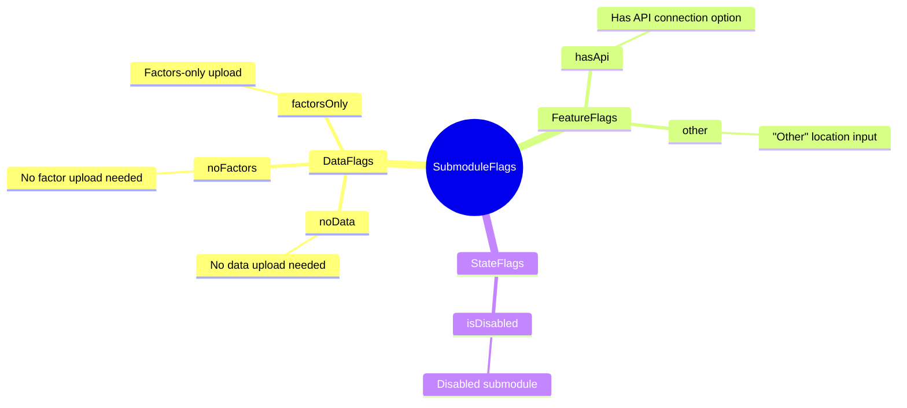
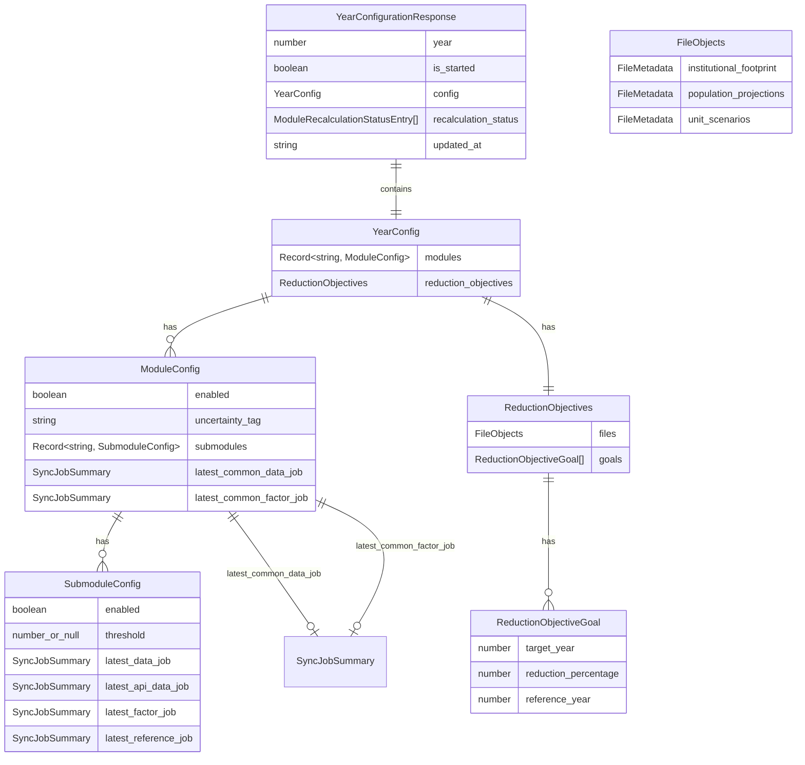
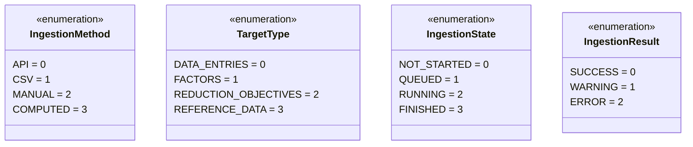
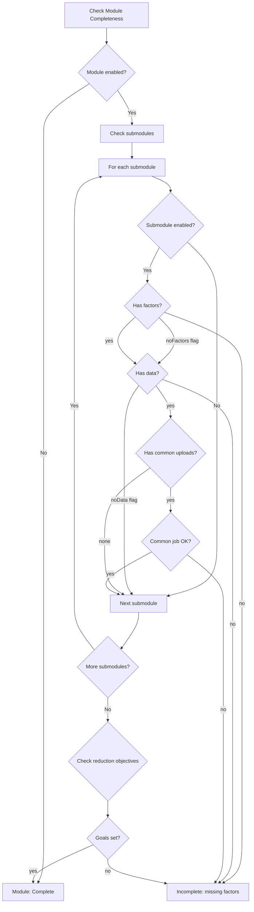
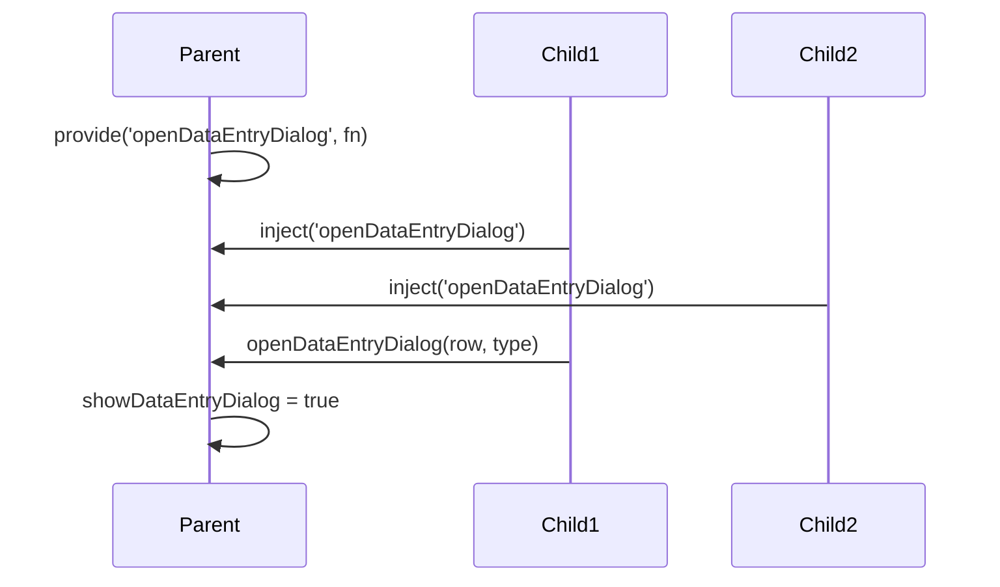

# Modules and Configuration

## Module / Submodule Structure

```mermaid
flowchart TB
    subgraph MODULE_SUBMODULES
        Headcount[headcount<br/>moduleTypeId: 1]
        Travel[professionalTravel<br/>moduleTypeId: 2]
        Buildings[buildings<br/>moduleTypeId: 3]
        Equipment[equipmentElectricConsumption<br/>moduleTypeId: 4]
        Purchase[purchase<br/>moduleTypeId: 5]
        Research[researchFacilities<br/>moduleTypeId: 6]
        Cloud[externalCloudAndAI<br/>moduleTypeId: 7]
        Process[processEmissions<br/>moduleTypeId: 8]
    end

    Headcount --> H1[member<br/>dataEntryTypeId: 1]
    Headcount --> H2[student<br/>dataEntryTypeId: 2<br/>noData: true]

    Travel --> T1[train<br/>dataEntryTypeId: 21<br/>other: true]
    Travel --> T2[plane<br/>dataEntryTypeId: 20<br/>hasApi: true<br/>other: true]

    Buildings --> B1[building<br/>dataEntryTypeId: 30]
    Buildings --> B2[energy_combustion<br/>dataEntryTypeId: 31]
    Buildings --> B3[building_embodied_energy<br/>dataEntryTypeId: 32<br/>factorsOnly: true]

    Equipment --> E1[scientific<br/>dataEntryTypeId: 10<br/>noData, noFactors]
    Equipment --> E2[it<br/>dataEntryTypeId: 11<br/>noData, noFactors]
    Equipment --> E3[other<br/>dataEntryTypeId: 12<br/>noData, noFactors]
    Equipment --> E4[equipment_common<br/>moduleTypeId: 4]

    Purchase --> P1[scientific_equipment<br/>dataEntryTypeId: 60<br/>noData, noFactors]
    Purchase --> P2[it_equipment<br/>dataEntryTypeId: 61<br/>noData, noFactors]
    Purchase --> P3[consumables<br/>dataEntryTypeId: 62<br/>noData, noFactors]
    Purchase --> P4[services<br/>dataEntryTypeId: 64<br/>noData, noFactors]
    Purchase --> P5[additional_purchases<br/>dataEntryTypeId: 67]
    Purchase --> P6[purchases_common<br/>moduleTypeId: 5]

    Research --> R1[research-facilities<br/>dataEntryTypeId: 70]
    Research --> R2[animal-facilities<br/>dataEntryTypeId: 71]

    Cloud --> C1[external_clouds<br/>dataEntryTypeId: 40]
    Cloud --> C2[external_ai<br/>dataEntryTypeId: 41]

    Process --> Pr1[process_emissions<br/>dataEntryTypeId: 50]
```



## Submodule Flags



## Year Configuration Schema



## Enums



## Common Upload Pattern

Modules like Equipment and Purchase have "common uploads" with no
`dataEntryTypeId`. Their jobs have `data_entry_type_id = None` in the DB, so
they cannot be keyed under a specific submodule. The backend instead injects
them at the **module level**:

```
ModuleConfig
├── submodules
│   ├── "10" → { latest_data_job: null, latest_factor_job: null }  (scientific, noData)
│   ├── "11" → { latest_data_job: null, latest_factor_job: null }  (it, noData)
│   └── "12" → { latest_data_job: null, latest_factor_job: null }  (other, noData)
├── latest_common_data_job   → { job_id: 5, ... }
└── latest_common_factor_job → { job_id: 6, ... }
```

In `getImportRow()`, when `dataEntryTypeId` is undefined, the composable falls
back to `mod.latest_common_data_job` / `mod.latest_common_factor_job`.

> Important: config updates (e.g. `updateSubmoduleThreshold`) must send only
> targeted partial updates. Never spread the `unifiedModule` object back to the
> backend — it contains string-keyed submodules and frontend-only fields that
> would leak into the DB.

## Unified Config Pattern

```mermaid
flowchart LR
    subgraph Backend
        B[modules: 1: enabled true,<br/>uncertainty_tag medium,<br/>submodules ...,<br/>latest_common_data_job null,<br/>latest_common_factor_job null]
    end

    subgraph Static
        S[MODULE_SUBMODULES<br/>headcount[0].moduleTypeId = 1]
    end

    subgraph Frontend
        U[unifiedModuleConfig<br/>headcount → enabled true]
    end

    B --> Merge[Merge Process]
    S --> Merge
    Merge --> U
```

## Module Completeness Detection



## Dependency Injection (provide / inject)


