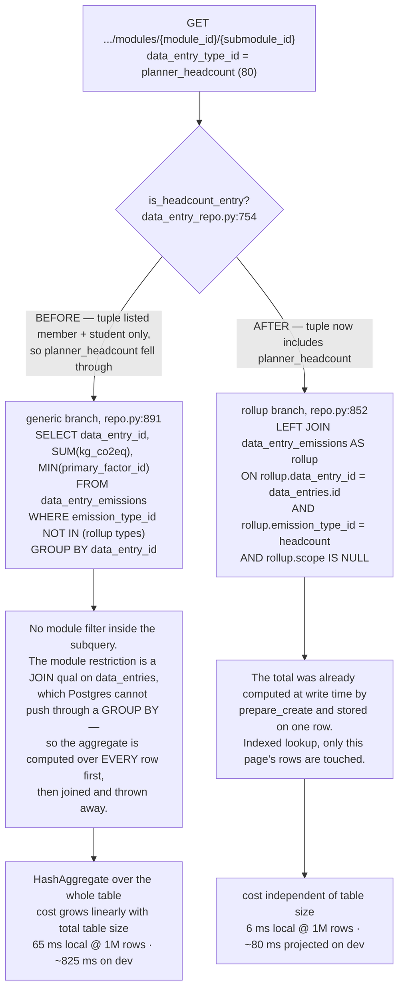
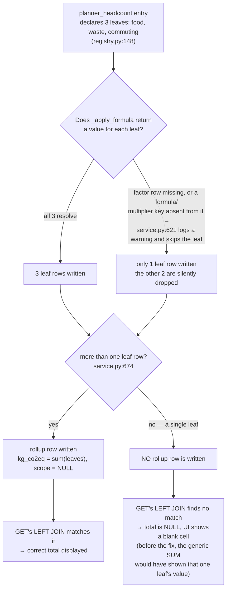

# Backend compute performance (#2050)

## Context

Recalculation throughput measured across environments (8453 entries):

| Environment | DB         | CPU                  | Throughput  |
| ----------- | ---------- | -------------------- | ----------- |
| Local (M4)  | Docker PG  | Apple M4             | ~384 rows/s |
| Local (M4)  | IT-CENTRAL | Apple M4             | ~330 rows/s |
| k8s `dev2`  | k8s PG     | AMD EPYC 9124        | ~180 rows/s |
| k8s `dev2`  | IT-CENTRAL | AMD EPYC 9124        | ~174 rows/s |
| k8s `dev`   | IT-CENTRAL | Intel Xeon Gold 6242 | ~72 rows/s  |

PostgreSQL location and network latency are ruled out: `dev2` performs the
same against both databases. The `dev`/`dev2` gap (~2.4×) tracks the
synthetic CPU benchmark gap (~1.8×), so the remainder is platform, not
formula.

Separately, users see intermittent 504s. **The mechanism is now identified.**

Restarts are ruled out in both environments: `restartCount: 0`,
`lastState: {}`, pods running continuously since 2026-08-11 on `dev` and
`stage`. The 50 ms event-loop yield shipped after the 2026-07-17 stage
incident is holding — liveness kills are no longer the mechanism.

On 2026-08-12 09:49 UTC, `stage` produced, with **no deployment in
progress**:

```
Unhealthy — Readiness probe failed:
Get "http://10.20.21.51:8000/ready": context deadline exceeded
(Client.Timeout exceeded while awaiting headers)
```

Access logs across the same window show `/healthz` returning 200
throughout. The event loop was healthy; the block was inside `/ready`
itself. See A1.

## Track A — stop the 504s

**Status: implemented, draft PR #2081** (`perf/2050-track-a-b-availability`).
A1–A3 below all shipped as written. Priority 1, three independent causes,
all cheap, all worth doing.

### A1. `/ready` can block longer than its own probe timeout

**This is the confirmed cause of the 504s, and it is an availability bug
independent of everything else in this plan. Ship it first.**

`app/main.py:349` performs a DB round trip **and** an httpx call to Accred
inside a probe configured `timeoutSeconds: 3`, `failureThreshold: 2`.
Neither branch is bounded by the probe deadline:

1. **DB pool wait — the primary mechanism.** `/ready` calls
   `get_db_session()`, which waits on the QueuePool for up to
   `DB_POOL_TIMEOUT` (`app/core/config.py:95`, **default 30 s**) — ten
   times the probe's 3 s timeout. The pool is `DB_POOL_SIZE: 10` +
   `DB_MAX_OVERFLOW: 10`, and each running job holds 1–2 connections for
   its entire runtime (see the field's own description). Once the pool is
   saturated, `/ready` hangs, the probe deadline expires, the pod leaves
   the Service endpoints, and requests 504 — while `/healthz`, which
   touches nothing, keeps answering 200. That is exactly the 2026-08-12
   09:49 signature.

   `pool_pre_ping=True` (`app/db.py:60`) adds a second round trip per
   checkout, so `/ready` costs two.

2. **Accred DNS.** `httpx.AsyncClient(timeout=2)` does not reliably
   interrupt a blocking `getaddrinfo`; a slow DNS lookup for the Accred
   host sails past the 2 s httpx timeout into the 3 s probe deadline.

3. **Probe frequency is ~24× the configured rate.** Access logs on `stage`
   show two source IPs (`10.20.50.2`, `10.20.20.2`) each hitting `/ready`
   every ~5 s — ~2.5 s combined — against a configured
   `periodSeconds: 30`. Something beyond kubelet (most likely the
   OpenShift router's route health check) is probing. Every one of those
   is two DB round trips plus an outbound HTTP call. Identify the caller;
   the endpoint must be cheap enough that this cadence is harmless either
   way.

Readiness answers "can this process serve traffic", not "is Accred up".
An external dependency there converts someone else's incident into ours.

Fix:

- Drop the Accred check from `/ready`; move it to an operator-facing
  `/health/deps`, or cache its result with a ~60 s TTL.
- Wrap the remaining DB check in `asyncio.timeout(1)` so `/ready` **cannot**
  outlive the probe deadline under any circumstance. A readiness probe that
  can block ten times longer than its own timeout is the bug; bounding it is
  the fix, and it holds even if a future check is added.
- Give the readiness DB check a short explicit `pool_timeout` rather than
  inheriting the 30 s request default.

### A0. Verification commands

For the next occurrence, and to confirm the fix (k8s events expire in
~1 h — capture promptly):

```sh
NS=svc1751d-co2-calculator-stage
kubectl -n $NS get events --sort-by=.lastTimestamp \
  --field-selector reason=Unhealthy -o wide
```

The event `count` column distinguishes chronic from one-off.

Timing `/ready` against `/healthz` from inside the pod discriminates the two
A1 branches: spikes near 2 s point at Accred/DNS, multi-second and climbing
points at the pool wait. Pool state directly:

```sh
kubectl -n $NS exec -it $POD -- python -c \
  "from app.db import engine; p=engine.pool; \
   print(p.size(), p.checkedout(), p.overflow())"
```

Correlate 504 timestamps against recalc job start/end and against deploy
times.

### A2. Rollouts must not take the only replica down

`maxSurge: 0` + `maxUnavailable: 1` with one replica means **every rollout
is a guaranteed 504 window**. This is secondary to A1 — the confirmed
09:49 stage failure had no deployment in progress — but it is a real
outage source on `dev`, which runs one replica.

Open question: `stage` reports `observedGeneration: 325` since 2026-07-16
(~11/day) against at most 3–6 intentional deployments in the period.
Generation only increments on spec change, so something is churning the
Deployment spec — CD re-applying on every push, a Helm re-render with a
volatile annotation, or a GitOps reconcile loop. Each bump is a rollout.
On `stage` (2 replicas, `maxUnavailable: 1`) that degrades capacity; on
`dev` (1 replica) it is a full outage window. Find the churn source.

- `maxSurge: 1`, `maxUnavailable: 0`.
- `replicaCount: 2` on dev (values.yaml already says 2; the effective
  manifest does not — reconcile the env override).

### A3. Raise the CPU request

`requests.cpu: 100m` on `dev`, `250m` on `stage`, no limit in either. No
limit means no CFS throttling, but CFS _shares_ are proportional to the
request: on a shared node a 100m pod gets roughly a tenth of the weight of
a 1-core neighbour. Pod QoS is Burstable, so it is also first in line under
node pressure. This stacks on top of the 1.8× slower Xeon on `dev`.

- `requests.cpu: 1` for the API deployment, `2` for the worker (Track B).

### A4. Pool sizing is coupled to job concurrency

Not a fix on its own, but it is why A1's pool wait happens: `DB_POOL_SIZE`
(10) + `DB_MAX_OVERFLOW` (10) is a per-pod hard cap, and each running job
holds 1–2 connections for its whole runtime. Every job executing on an API
pod is competing with request traffic — including the probes — for the same
20 connections. Track B removes the competition entirely by moving jobs to
a pod that serves no traffic; revisit the numbers there rather than raising
them here.

### Rejected alternatives

- **gunicorn / `WORKERS=2`.** Would isolate API latency from a pinned
  worker process when the node has spare CPU, and it is one line. Rejected:
  memory doubles under the 1000Mi limit, the in-process poller duplicates
  per worker process, and it is obsolete the day Track B lands. It is a
  degraded version of the real fix.
- **Threads.** GIL-bound; the job is a single CPU-bound coroutine.
- **HPA.** HPA scales on utilisation _relative to the request_: with a 100m
  request any recalc reads as 1000 %+ and thrashes to max replicas, and
  extra replicas cannot speed a job one pod has already claimed via
  advisory lock. Revisit after Track B, on the API deployment only, never
  on the worker.

## Track B — move job execution off the API pods

**Status: implemented, draft PR #2081** (`perf/2050-track-a-b-availability`,
alongside Track A). Corrected from the original design below during
implementation — kept here for the record.

Most of the infrastructure already existed: the unified runner
(`app/tasks/runner.py`), DB-polling dispatch (`_poller.py`), pod heartbeats,
claim/preempt, advisory locks, and the `RUN_BACKGROUND_POLLER` settings gate
(`app/core/config.py:452`).

**Design correction: a second, dedicated setting, not `RUN_BACKGROUND_
POLLER` reused.** The original plan below said "API pods set
`RUN_BACKGROUND_POLLER=false`" — building it exposed why that's wrong: the
test suite's autouse `disable_poller` fixture already sets
`RUN_BACKGROUND_POLLER=False` for _every_ test, while dozens of `_pg.py`
integration tests assert that `fire_and_forget(run_job(...))` still fires
inline. Reusing that flag for dispatch gating would have made every one of
those tests silently no-op. Production also needs the same split: worker
pods want (poller **on**, dispatch **on**); a post-split API pod wants
(poller **off**, dispatch **off**) — a different pairing than the test
suite's (poller off, dispatch on). Three of four combinations are
legitimately in use, so it's two axes, not one. Shipped as a new
`DISPATCH_JOBS_INLINE` setting instead (default `true`, preserving current
behavior everywhere untouched).

**Misconfiguration guard:** `DISPATCH_JOBS_INLINE=false` with no pod
running the poller leaves every job row `NOT_STARTED` forever — a silent
fallback the guardrails explicitly ban. Fixed at the Helm layer, not the
app layer: `worker.enabled` is the _only_ knob a deployer sets. When true,
`backend-deployment.yaml` appends an override pair
(`RUN_BACKGROUND_POLLER=false`, `DISPATCH_JOBS_INLINE=false` — last
same-named env entry wins in k8s) on top of `backend.env`'s static
defaults, and the worker Deployment sets both `true` unconditionally. The
dead combination can't be expressed in `values.yaml`.

Implementation:

1. All 6 (not 4 — two more direct-dispatch sites turned up at
   `data_sync.py:2075,2269` during implementation) `fire_and_forget(
run_job(...))` call sites now route through
   `fire_and_forget_or_defer_to_poller()` (`app/tasks/_background.py`),
   which either dispatches immediately or closes the coroutine unstarted
   and leaves the already-committed `NOT_STARTED` row for the poller.
2. `helm/templates/backend-worker-deployment.yaml` — new Deployment, same
   image, `worker.enabled=false` by default, no Service/ingress/readiness
   probe, liveness only, generous CPU/memory (`values.yaml`'s
   `worker.resources`).
3. The ~160-line secretKeyRef env block and the ES-CA volume/mount were
   extracted from `backend-deployment.yaml` into `_helpers.tpl`
   (`backendSecretEnv`, `backendSecretVolume(Mount)`) so backend and
   worker can't drift out of sync — necessary once a second Deployment
   needed the identical credential set.

Chained child jobs (`_chain.py:106,387`) fire in the process where the
parent ran, so they follow the parent onto the worker with no change —
confirmed correct, untouched.

Cost: enqueue-to-pickup latency of one `POLLER_INTERVAL_SECONDS`. Accept it
or lower the interval; do not reintroduce direct dispatch.

`worker.enabled` stays `false` in this PR — enabling the split on any real
environment is a separate, explicit follow-up change.

## Track C — profile the actual compute

Priority 3, but it is the prerequisite for any "make it faster" decision,
including a language change. **Nothing in this track is an optimisation
until a measurement backs it.**

### C1. musl vs glibc — measured, decided

**Status: done.** Two rounds of benchmarking (Docker Desktop / macOS
arm64 — direction should transfer to the k8s x86 nodes, magnitude may not;
worth a one-off rerun on a `dev`/`dev2` pod before treating the numbers
below as final) plus a real Trivy scan of the actual `backend/Dockerfile`
against a Debian/glibc mirror of it.

**Round 1 — is there a real effect, or is it noise?** `bench_alloc.py`
(arithmetic control + allocation-churn workload proxying
`model_validate`-shaped Pydantic construction), alpine vs slim, 5
iterations each:

| Workload                | alpine (musl) | slim (glibc) | ratio |
| ----------------------- | ------------- | ------------ | ----- |
| arith (control)         | 52.3 M/s      | 62.4 M/s     | 1.19× |
| alloc (Pydantic-shaped) | 1.09 M/s      | 1.44 M/s     | 1.32× |

The alloc ratio being higher than the control ratio confirms a real,
allocation-specific effect — not just noise or a generic arch difference.

**Round 2 — does an allocator swap fix it, or is it musl/libc itself?**
Median of 3 fresh runs per variant, alpine-default vs `LD_PRELOAD`
jemalloc vs `LD_PRELOAD` mimalloc vs slim:

| Variant                   | arith vs slim | alloc vs slim |
| ------------------------- | ------------- | ------------- |
| alpine, default allocator | −15%          | −22%          |
| alpine + jemalloc         | −19%          | **−11%**      |
| alpine + mimalloc         | −17%          | −15%          |
| slim (glibc), baseline    | —             | —             |

**Answer: no, not primarily a malloc problem.** jemalloc recovers roughly
half the allocation-churn deficit (22%→11%); mimalloc about a third. The
arithmetic-loop gap (~15–19%, no allocation involved) is untouched by
_any_ allocator swap — that portion is musl/libc itself (`memcpy`, string
functions, dynamic linker / threading primitives), not `malloc`. Neither
allocator gets within striking distance of full parity. (Caveat: Alpine's
packaged mimalloc symlinks to the hardened/guard-page build, so upstream
mimalloc could do somewhat better than shown; single-run noise was
non-trivial — treat these as directional ratios, not absolutes.)

**Is the Dockerfile's CVE rationale still true?** Built the real
`backend/Dockerfile` as-is and a Debian/glibc mirror of it (same uv/
opentelemetry-bootstrap/appuser steps, `apt-get install git` in place of
`apk add git`; builds cleanly, no compatibility issues), ran
`trivy image --severity HIGH,CRITICAL` on both:

- **alpine (current): 0 findings**, 30 OS packages.
- **slim (mirror): 23 findings (19 HIGH / 4 CRITICAL)**, 87 OS packages,
  collapsing to ~6 distinct CVEs — all 4 CRITICALs in `perl-base`
  (regex miscompile, `Archive::Tar` symlink traversal, `Storable`
  integer overflow, heap overflow), the rest in the util-linux family
  (one CVE, `libblkid` partition-parser integer overflow) and ncurses
  (one CVE). **Fixed Version is empty on essentially every row** — this
  isn't a one-time triage, it stays red indefinitely without an ongoing
  `.trivyignore`.
- None of these packages are installed by, run by, or reachable from this
  headless FastAPI container (no perl scripts, no partition/mount
  operations, no interactive terminal). The Dockerfile comment's original
  reasoning holds verbatim.

**Decision: stay on Alpine, add jemalloc via `LD_PRELOAD`.** One-line
`ENV` change (`apk add --no-cache jemalloc`,
`ENV LD_PRELOAD=/usr/lib/libjemalloc.so.2`), recovers about half the
allocation-churn gap, zero CVE cost. Full parity with slim is not
achievable through allocator choice alone — closing the rest would require
the base-image switch, which buys a _permanent_ CVE-scan liability (23
always-red HIGH/CRITICAL findings needing a maintained suppression list)
against packages the app never touches. Per this project's own
no-silent-fallbacks stance, a perpetually-suppressed scan is worse than
the current honest zero. **Not revisiting the base-image question unless
C3's fix plus jemalloc still leaves the `<80ms`/`<400ms` budget missed for
reasons the profile shows are compute-bound**, not query-bound (see C2/C3
below — so far neither is).

Action: land the two-line jemalloc `Dockerfile` change alongside Track A
(it's independent, cheap, and already fully measured).

**Rerun with an OTel on/off test matrix (bare uvicorn vs
`opentelemetry-instrument uvicorn`)** — the production CMD wraps every
request in OTel auto-instrumentation, which every benchmark above ran
without. Real endpoint (`PATCH /api/v1/project-plans/{id}/years/{year}`,
local uvicorn against the seeded Postgres, 3×20s runs at concurrency 8):

| Variant                    | rps   | p50     | p95     | p99     | CPU% |
| -------------------------- | ----- | ------- | ------- | ------- | ---- |
| A — bare uvicorn           | 471.4 | 16.68ms | 21.42ms | 26.66ms | ~79% |
| B — OTel, exporters=none   | 295.6 | 26.27ms | 34.79ms | 51.85ms | ~77% |
| C — OTel, full OTLP export | 292.5 | 25.37ms | 37.35ms | 42.85ms | ~80% |

**B vs A: −37% throughput, +58–94% latency across p50–p99 — this app's own
OTel tax lands in the "30%+, investigate" bucket, not the "negligible"
range generic FastAPI writeups suggest.** C vs B is ~1%: the cost is
almost entirely instrumentation (spans + context propagation +
per-SQL-statement spans via SQLAlchemy auto-instrumentation), not
network/exporter overhead. CPU% stays flat across all three, meaning the
single event-loop core is already saturated everywhere — B/C aren't
waiting more, they're doing ~60% more work per request. One caveat: the
PATCH body used always matched the plan's current reference year, so
`set_reference_year`'s early-return (`report.reference_year !=
reference_year`) skipped the O(N) prefill/recalc path C3 fixes — this
measures routing + auth + Pydantic + a light DB read, a real endpoint but
not the heavy path.

Because the tax scales with SQL statement count (one span per statement),
it was partly inflated by exactly the N+1s C3 fixed — expect it to shrink
somewhat as a side effect of that fix, not just the raw round-trip count
dropping.

**Does this change the musl-vs-glibc call?** >5% threshold triggered, so
re-checked: `bench_alloc.py`'s allocation-churn workload wrapped in a real
(no-export) `TracerProvider` span per iteration, alpine vs slim:

| Workload              | alpine (musl) | slim (glibc) | ratio |
| --------------------- | ------------- | ------------ | ----- |
| alloc, no OTel        | 1.07 M/s      | 1.40 M/s     | 1.31× |
| alloc + OTel span tax | 0.104 M/s     | 0.130 M/s    | 1.25× |

Same direction, same rough magnitude — **the alpine-vs-glibc conclusion
above holds.** OTel's own tax (37% rps) dwarfs musl vs glibc (11–24%,
jemalloc recovers about half) as a lever; it deserves its own follow-up
issue (tuning `OTEL_PYTHON_EXCLUDED_URLS`, sampling, or scoping which
libraries get auto-instrumented) rather than staying folded into C1.
Caveats: measured on macOS arm64, not a k8s x86 alpine container — same
directional-not-absolute caveat the rest of C1 carries.

### C2. Recalc workflow profile

**Status: done**, on a local seed (`random_generator.seed_all`: 500 units,
12,000 modules, 804,798 data entries; factors seeded for 2025 only —
2023/2024 slices bail out with zero emissions and were excluded as
non-representative after being caught and re-run). Two valid measurements,
both headcount types (the only ones whose seeded `data` blobs matched
seeded factor classification codes closely enough to compute real
emissions — `process_emissions`, `plane`, `it` all produced 0-row bail-outs
against this seed and are excluded, not because they're cheap):

```
Recalc profile member/2025:  16684 entries in 38.9s (2.33 ms/entry) | validate=0.1 prepare=29.9 remainder=8.8
Recalc profile student/2025: 16862 entries in 40.7s (2.42 ms/entry) | validate=0.2 prepare=31.7 remainder=8.8
```

**`prepare` dominates — ~77% of wall time in both.** `validate`
(Pydantic `model_validate`) is under 1%; `remainder` (bulk DELETE+COPY
writes) is a steady ~22%. This settles the three-way split the section
originally posed:

- ~~`validate` dominates~~ — ruled out. Skipping the Pydantic round-trip
  in the loop is **not** the win the plan speculated it might be.
- **`prepare` dominates, confirmed** — factor resolution / handler
  `pre_compute` inside `prepare_create` is the primary cost, even with the
  slice-scoped `factor_query_cache` memo from plans 1661/310D already in
  place. Headcount fans out ~25 emission rows per entry (member/student
  wrote 417,100 and 421,550 rows respectively) — this may be close to a
  worst case rather than representative of every module type; one more
  data point from a non-headcount, non-bail-out combo would confirm that,
  but isn't blocking.
- ~~`remainder` dominates~~ — secondary but real at ~22%; not the primary
  lever.

**Implication for "another language":** this is a query/round-trip cost,
not a raw-arithmetic cost — a Rust or Go rewrite of the _formula_ layer
does nothing for `prepare`'s share, since the time is spent waiting on and
issuing DB round trips, not computing. See the closing section.

#### Status: refined — `prepare`'s cost is object construction, not queries

A follow-up pass instrumented `prepare_create`'s actual internal seams
(`resolve`, `emission_types`, `pre_compute`, `resolve_computations`,
`fetch_factors`, `apply_formula`, plus row-build) against the same
member/2025 slice. Every DB-adjacent stage was cheap and confirmed O(1)
per call, exactly as the cache/slice design intends —
`fetch_factors` (Strategy B, `factor_query_cache` hit): 0.13s / 417,100
calls; `pre_compute`: 0.01s total (headcount's handler is a no-op, no
per-entry query slipped through); `resolver.resolve`: 0.01s (short-circuits
instantly — headcount has no `kind_field`).

**Constructing the `DataEntryEmission(...)` row object itself
(`data_entry_emission_service.py:566-583`, once per factor × emission type
— ~25×/entry for headcount) is ~94% of `prepare`'s internal time and
~65-67% of total recalc wall clock** — 28.87s of 33.4s, ~69µs/call.
`DataEntryEmission` is `table=True` (a full SQLAlchemy-mapped +
Pydantic-validated model), and that construction/validation tax is paid on
every row even though `bulk_replace_for_entries` never `session.add()`s
these individual objects — they only feed a later bulk DELETE+COPY. So the
77%/22% `prepare`/`remainder` split from the first pass was accurate, but
the _composition_ assumed inside `prepare` (DB round trips) was wrong —
it's Python/ORM object-instantiation overhead, not waiting on Postgres.

**Not implemented, follow-up target**: accumulate a lightweight
dataclass/dict of column values in the hot loop instead of a real
`DataEntryEmission`, and only materialize the ORM/`table=True` model where
a row is actually persisted individually (the single-entry API path, which
does `session.add()` a real object and must keep doing so) — mirroring how
`factor_query_cache`/`slice_cache` already moved cost out of this loop for
the query side. Bulk callers (`bulk_replace_for_entries`'s COPY path) never
need the ORM identity at all.

**Side finding, not part of this plan:** `backend/app/seed/random_generator/
seed_carbon_reports.py` has two `ON CONFLICT (col, col) DO NOTHING` clauses
targeting columns with no matching unique constraint (`carbon_projects` only
has partial unique indexes; `carbon_reports` has none on
`(carbon_project_id, year)`) — throws `InvalidColumnReferenceError` on a
fresh DB. Worked around locally to unblock seeding, not fixed here. Worth
its own small issue.

### C3. Profile the synchronous request path — `set_reference_year`

**This is the higher-priority half of Track C.** Unlike recalc, this code
runs _inside an HTTP request_: it holds the event loop **and an open
database transaction** (the commit is in the route,
`app/api/v1/simulator_plan.py:207`) for its entire duration. It has no
`asyncio.sleep(0)` yields at all.

That connects it directly to Track A: a long-held pooled connection under a
small pool makes `/ready`'s `SELECT 1` wait for a slot, readiness fails, the
pod leaves the Service, and users get 504s — with no recalc job running at
all.

Reference request to profile:

```
PATCH /api/v1/project-plans/2221/years/2027
{"reference_year": 2026, "is_grant": true}
```

Reproduce locally against the seeded DB.

#### Findings — all four confirmed by measurement

Written against `app/services/simulator_plan_service.py`; measured with a
pytest suite (`backend/tests/unit/services/test_simulator_plan_reference_year_perf.py`,
not yet on this branch — written in an agent's disposable worktree, to be
brought over with the fix) using a `before_cursor_execute` statement
counter against an in-memory sqlite fixture. Statement counts are portable
evidence of the _shape_ of the bug (O(N) vs O(1) round trips); absolute
wall-clock numbers on sqlite don't transfer to pooled Postgres and aren't
cited as such below.

1. **`_recalculate_report_emissions` (line 649) is an N+1 per entry —
   confirmed, and it is O(entries), not O(1).** Isolated to this method
   alone: N=10→50 gave a 3.22× statement-count ratio; at production scale,
   N=200→8000 (a 40× entry increase) gave a **39.42× statement ratio** —
   essentially perfectly linear (40× would be exact). The `_recalculate_
report_emissions` in-loop `prepare_create()` call passes **no**
   `factor_resolver`, **no** `factor_query_cache`, **no** `slice_cache` —
   confirmed as the root cause, exactly the pattern plans 1661/310D removed
   from the recalc workflow but never migrated here.

   **Exact mechanism identified** (this is the concrete answer to "it's
   always the delete that pauses"): `upsert_by_data_entry` calls
   `DataEntryEmissionRepository.delete_by_data_entry_id` per entry, which
   **SELECTs the entry's existing emissions, then lets the ORM issue their
   DELETE separately** — two round trips per entry — rather than the
   set-based `delete_by_data_entry_ids` (plural) that `bulk_replace_for_
entries` already uses elsewhere in this same file. At N=8000, emission
   SELECT+DELETE alone is **50% of all statements issued**. Confirmed
   generic, not `process_emissions`-specific: reproduces identically
   against `purchase`/`scientific_equipment` entries (ratio 3.55 at
   N=10→50).

2. **`prefill_module_from_reference` queries the same rows twice —
   confirmed exactly.** Call-count instrumentation on `list_by_module`:
   2 calls for one `prefill_module_from_reference` invocation, matching
   the line-484 (emptiness check) / line-497 (copy loop) citation exactly.

3. **`_prefill_reference_modules` (line 359) fans out per module type** —
   not separately measured; subsumed by (1)'s per-entry cost across every
   module it touches.

4. **`_sync_year_reports` (line 209) fans out per year — confirmed,
   near-perfectly linear.** 2 years → 288 statements, 5 years → 711
   statements; ratio 2.47 vs. 2.5 for an exactly linear year-count
   multiplier. Setting a multi-year range with a reference year multiplies
   (1)–(3) by year count inside one PATCH, as predicted.

#### Fixes — confirmed, ready to implement

No longer "expected" — each is now backed by a measurement above:

- Give `_recalculate_report_emissions` the same shared `FactorResolver`,
  `factor_query_cache`, `prefetch_slice` and bulk replace that
  `_persist_prefill_entries` (line 599) and the recalc workflow already use.
  The batched version exists a few lines above in the same file — this is
  reuse, not new code. This is the primary fix; (1) above is ~77%-of-`
prepare`-shaped and the delete/insert round trips confirmed at 50% of
  statements at N=8000.
- Route the emission replace through the existing set-based
  `delete_by_data_entry_ids` (plural) instead of per-entry
  `delete_by_data_entry_id` — this is the specific fix for the confirmed
  SELECT+DELETE-per-entry mechanism above.
- Drop the duplicate `list_by_module` call (finding 2).
- Add the wall-time `asyncio.sleep(0)` yield used by the recalc workflow and
  `base_csv_provider.py:969`, so a long plan-year PATCH cannot starve
  `/healthz` and `/ready`. Directly relevant given A1/A4 — a
  `_recalculate_report_emissions` call currently holds the pooled
  connection and the event loop for its entire O(N) duration.
- Bring `test_simulator_plan_reference_year_perf.py` onto this branch as the
  regression test — it is written to fail today (proves the bug) and pass
  once the fixes land.
- If the request stays long after the above, move it behind the job runner
  (Track B) and return a job id rather than a synchronous result.

#### Status: fixed — branch `perf/2050-simulator-plan-n1-fix`

The shared-resolver + set-based-delete fix above landed as planned, but
implementing it surfaced a **second, distinct per-entry N+1** that the
static reading behind finding (1) didn't catch — the regression test
written to pin the fix (N=200→8000) still showed a 36–39× statement ratio
after the planned fix alone, not the expected O(1).

**Root cause of the residual scaling**: every plan-year entry recalculated
by `_recalculate_report_emissions` is a prefill copy, and
`prefill_module_from_reference` stamps each copy's `data` with
`percentage_of_reference_year` and `source_data_entry_id` (finding 2's own
subject). `prepare_create` → `_get_percentage_override_kg` reads those
fields **per entry, per emission type**, on a completely separate path from
`factor_resolver`/`factor_query_cache`/`slice_cache` — the fix for finding
(1) never touched it. Its `source_data_entry_id` fast path costs one
`session.get(DataEntry, ...)` PK fetch + one `_sum_entry_emissions` sum
query per call; for headcount-shaped module types with several emission
types per entry this multiplies further. (The report-level lookup in the
same method was already safe — `DataEntryEmissionService.__init__` memoizes
`_get_report_for_data_entry` by `carbon_report_module_id` for the instance's
lifetime, so it was never the bottleneck.)

**Fix**: `DataEntryEmissionService.prefetch_percentage_override_cache(
entries, unit_id=...)`, called once per `_recalculate_report_emissions`
call (mirroring `factor_query_cache`/`slice_cache`'s existing shape). One
`SELECT ... WHERE id IN (:source_ids)` plus one `GROUP BY (data_entry_id,
emission_type_id)` sum query replace the per-entry PK fetch + sum for every
entry whose source belongs to the same unit (the existing cross-unit
ownership gate is preserved — sources are filtered against `report.
unit_id` before the cache is built; unit mismatches, an edge case, still
fall through to the original per-entry path, which re-checks and correctly
rejects them). `prepare_create` takes the resulting map as a new optional
`override_cache` param and checks it before hitting the DB.

**Measured after both fixes**: N=200→8000 statement ratio ~1.0 (222→222
non-INSERT statements; INSERT count scales 200→8000 but that is a SQLite-
only artifact — `DataEntryEmissionRepository.bulk_copy` falls back to
`session.add_all`+flush, one INSERT per row, off the `psycopg` COPY path;
production Postgres issues a single `COPY FROM STDIN` regardless of N, so
this doesn't reproduce there). A dedicated equivalence test asserts the
cached and uncached paths compute identical kg values, not just fewer
statements. Full backend unit suite (1974 tests) green.

#### 2026-08-17 — still 504ing in `dev`: findings #2 and #3 were never actually fixed

A production trace (`PATCH /v1/project-plans/8011/years/2025`, ~1000
entries, 504 after 91.5s) showed the C3 fix deployed but the bug still
present. Gap analysis on the trace (excluding the root span and deduping
the paired `psycopg`/SQLAlchemy spans per DB op) found two DB-silent
stretches: ~70.1s before the first captured span, and a further ~16.9s
CPU-only gap later in the request (73.6s→90.5s, between the last prefill
statement and `bulk_replace_for_entries`'s DELETE). The mandatory early
queries (`get_current_user`'s `users` lookup, `units`, `get_plan`'s
`carbon_projects`, the `reference_year` flush) are **absent from the trace
entirely** — early spans were dropped on export, so the first gap's
contents can't be read off the trace directly or attributed precisely: it
contains those dropped auth/plan/unit spans plus an unknown share of
`_prefill_reference_modules`, which is confirmed still running past the
70.1s mark (its `DELETE FROM data_entries` clear appears at 72.4s). What
_is_ attributable: the 1006 individual percentage-override sum queries
visible from 70.1s onward belong to prefill (see below), so prefill's own
N+1 is a real, confirmed contributor to that window — just not
necessarily all of it.

Rereading the code against that timing pointed at the two findings this
plan had already logged as still-open, both in `_prefill_reference_
modules`'s own call path — neither was in scope for the C3 fix above,
which only instrumented `_recalculate_report_emissions`:

- **Finding #2, actually still present.** The "Fixes — confirmed" list
  above named dropping the duplicate `list_by_module` call, but the
  "Status: fixed" note only landed the shared-resolver and override-cache
  fixes — finding #2's own fix never shipped. Confirmed still in the code:
  `prefill_module_from_reference` called `entry_repo.list_by_module(ref_
module.id)` once for the emptiness check and again for the copy loop.
  Fixed now: the copy loop reuses the already-fetched `src_entries`.
- **Finding #3, the actual dominant cost, never separately measured.**
  Finding #3 said `_prefill_reference_modules` fans out per module type and
  was "subsumed by (1)'s per-entry cost" — but (1)'s fix (the
  `override_cache` batching) only reached `_recalculate_report_emissions`.
  `_persist_prefill_entries` — the batched-looking helper both
  `prefill_module_from_reference` and `prefill_headcount_from_reference`
  call — builds a shared `FactorResolver`/`factor_query_cache`/
  `slice_cache` but never called `prefetch_percentage_override_cache` and
  never passed an `override_cache` to `prepare_create`. Every prefilled row
  carries `source_data_entry_id` (same shape finding #2's docstring
  already named), so every one of them re-triggered `_get_percentage_
override_kg`'s per-entry `session.get` + `_sum_entry_emissions` sum-query
  fallback — the exact N+1 C3 fixed for recalc, unfixed one call site over,
  and hit _first_ since prefill runs before recalc. The 1006 individual
  sum queries visible from 70.1s onward in the trace are this fallback,
  confirming it fired at production scale — a real, measured contributor
  to the DB-silent window, though (per above) not proven to be the whole
  70.1s.

  Fixed: `_persist_prefill_entries` now takes a `unit_id` and calls
  `prefetch_percentage_override_cache` once per invocation, mirroring
  `_recalculate_report_emissions`'s existing shape exactly. Regression
  test added (`test_prefill_reference_modules_isolated_statement_count`,
  isolating `_prefill_reference_modules` the way finding #1's tests
  isolate `_recalculate_report_emissions`): before this fix,
  `emission_selects` scaled 23→63 for a 10→50 entry increase; after, it's
  constant at 13 regardless of N (the remaining constant is one stats-
  rollup SELECT per reference-scoped module type touched, not per entry —
  finding #4's fan-out shape, not a new bug). `test_prefill_module_from_
reference_calls_list_by_module_once` (renamed from `..._twice`, finding
  #2) confirms the duplicate call is gone. Full backend unit suite (2066
  tests) green.

  **Not fixed by this update, still open**: the second gap (73.6s→90.5s,
  ~16.9s, no DB calls at all) sits inside `_prepare_recalc_emissions`'s
  pure-Python compute loop (factor resolution + formula application), not
  a query pattern this fix touches. It lines up with this plan's own
  Context table — `dev` measured ~72 rows/s, and ~1000 entries at that
  rate is ~14s — i.e. it's C2's ORM/Pydantic-construction finding, already
  logged above as unimplemented and lower-priority than C3. This PATCH
  still costs ~17s of unavoidable-today compute on top of whatever the
  prefill fix saves.

  Also outstanding from this same trace, not yet actioned: the response's
  final `http send` lands at ~91.5s — well past Traefik's default 60s
  timeout, so the backend kept computing and writing to the DB _after_ the
  client had already seen the 504. Combined with A4 (this PATCH holds a
  pooled connection and the event loop for its whole duration, no
  `asyncio.sleep(0)` yield — see C3's intro above), a client retry on top
  of the still-running original request is a plausible double-write path
  worth checking before this is called closed. Track A/B (move this off
  the request path
  entirely) remains the durable fix; this update only removes two more
  N+1s from the synchronous path in the meantime.

#### 2026-08-17 (same day, follow-up) — `DataEntry` construction had the same tax as `DataEntryEmission`, plus a general fix

After landing the prefill `override_cache` fix above, a fresh local trace of
the same PATCH (smaller plan, ~360ms total) still showed one dominant cost:
a 136ms DB-silent gap immediately followed by a 94ms `INSERT INTO
data_entries` (2 calls) — together ~63% of the request — inside
`prefill_module_from_reference`'s copy-construction step, before
`_recalculate_report_emissions` even starts.

**Root cause, one level up from finding #1's `DataEntryEmission` fix**:
Pydantic v2's `resolve_default_value`/`takes_validated_data_argument` calls
`inspect.signature()` on every `default_factory` on **every model
instantiation** (not cached per-field) to check whether it takes a
`validated_data` argument. For a bare C builtin (`dict`,
`datetime.utcnow`) that lookup is expensive and always fails — measured
directly: ~4µs/call for `dict`, ~20µs/call for `datetime.utcnow` (5×
worse), versus ~2µs for a trivial Python-level wrapper function. `DataEntry`
has three such fields (`data: dict`, `created_at`/`updated_at: datetime`),
each paying this on every prefill copy — the same class of cost finding #1
found in `DataEntryEmission`, just never looked for elsewhere.

Confirmed the sqlite test harness was hiding this: `DataEntryEmissionRepository.bulk_copy`'s
non-psycopg fallback still builds real ORM objects, so profiling against
sqlite showed no improvement from the finding #1 fix. Re-profiled against a
throwaway local Postgres database instead (`co2_prof`, dropped after
measuring) — the only way to exercise the real `COPY FROM STDIN` path.

**Fix**: added `app/models/_field_defaults.py` (`default_dict`,
`default_list`, `default_utcnow` — trivial wrapper functions) and swapped
every bare-builtin `Field(default_factory=dict|list|datetime.utcnow)` across
`app/models/` to use them — 12 occurrences across `audit.py`,
`year_configuration.py`, `data_ingestion.py`, `data_entry.py`,
`data_entry_emission.py`, `factor.py`. (The dataclass `field(default_factory=...)`
calls in `data_entry_emission.py`'s `FactorQuery`/`EmissionComputation`/
`DataEntryEmissionRow` are stdlib `dataclasses`, not Pydantic — unaffected
by this mechanism, left untouched.)

**Measured** (Postgres, `set_reference_year`, N=1000 entries):
633.5ms → 474.7ms (−25%). `sqlmodel_table_construct` cumulative time
0.177s → 0.069s; `inspect.signature`/`_signature_fromstr`/`__build_class__`
disappeared from the profile entirely. Remaining cost at this scale is
`select.kqueue`/socket I/O (round-trip latency) and psycopg query
preparation — round-trip-bound, not Python-construction-bound. Full backend
unit suite (2012 tests) green; lint/type-check clean.

**Confirmed against a live trace** — re-ran the same PATCH locally
(GlitchTip export, same plan/entry count both times): 364.9ms → 323.75ms.
The gap before `INSERT INTO data_entries` shrank 136.1ms → 107.6ms and the
INSERT itself 47.2ms → 27.6ms avg per call, but that combined chunk was
still ~50% of the request — smaller, not gone. Confirmed via the `INSERT`
statement's byte length (identical, 214,311 chars) that both traces were
the same workload, not a smaller batch giving a false win.

#### 2026-08-17 (same day, second follow-up) — the remaining gap was `DataEntry` ORM construction itself, not `default_factory`

The `default_factory` fix only removes signature-introspection overhead;
`prefill_module_from_reference`/`prefill_headcount_from_reference` still
built a real `DataEntry(...)` (`table=True`) instance per prefilled row and
`session.add()`ed it one at a time — paying SQLAlchemy's own mapper/
instance-state machinery (`_initialize_instance`, `cascade_iterator`,
instrumented-attribute `__setattr__`) regardless. Unlike
`DataEntryEmission`, these rows _do_ need real ids back immediately
(`source_data_entry_id`, `prepare_create`'s `data_entry.id` guard,
`entry_ids` for the recalc that follows) — the reason they couldn't just
route through `bulk_copy` (never populates ids) the way emissions did.

**Fix**: `DataEntryRepository.bulk_insert_returning_ids(rows: list[dict])`
— a Core-level (not ORM) `INSERT ... RETURNING id`, `rows` as plain
column-value dicts, `sort_by_parameter_order=True` so returned ids line up
with input order (this is SQLAlchemy's documented contract for this, not
something reproduced as broken locally without it — checked to N=2000
against Postgres/psycopg, order held either way on this stack; kept the
flag as the correct guarantee regardless, pinned with a regression test
using a distinguishing marker per row). `prefill_module_from_reference`/
`prefill_headcount_from_reference` now build plain dicts, bulk-insert, and
wrap the returned ids as `DataEntryResponse` (not `DataEntry`) —
`_persist_prefill_entries` and everything downstream (`prepare_create`,
`prefetch_percentage_override_cache`, `prefetch_slice`) already accepted
`DataEntryResponse` via their existing `DataEntry | DataEntryResponse`
union types, so no other signature changes were needed. No `DataEntry(...)`
ORM instance or `session.flush()` in the whole prefill copy path anymore.

**Measured** (Postgres, N=1000): 474.7ms → 395.6ms (−17% more; −38.5%
total from the 633.5ms starting point three fixes ago).
`sqlmodel_table_construct` is gone entirely from the profile now.
**Confirmed against a live trace** (same plan, re-verified via the
`INSERT` statement's byte length again): 323.75ms → 203.55ms. Gap before
`INSERT` 107.6ms → 8.1ms; `INSERT` itself 27.6ms avg → 25.1ms avg (now
genuine Postgres execution time for the batch, not Python construction —
this is close to a floor for INSERT+RETURNING at this row count).
Regression test added (`test_bulk_insert_returning_ids_preserves_row_order`,
`tests/unit/repositories/test_data_entry_repo.py`). Full backend suite
(2014 tests) green; lint/type-check clean.

**What's left at 203.55ms**: no single dominant cost anymore — spread
across the INSERT itself (~50ms, likely near-floor), ~20 small per-
module-type SELECTs (`list_by_module`-shaped, ~1ms avg each, could be
batched into one bulk fetch across module types — the same "N+1 across
module types, not entries" shape as the `get_by_report_and_module_type`
double-lookup below, estimated ~15-20ms if fixed), a `get_module` call
for both the plan and reference module per module type
(`prefill_module_from_reference`/`prefill_headcount_from_reference` each
re-fetch what `_prefill_reference_modules` already read into `rebuilt` for
the plan side — genuinely redundant, but only ~5ms total measured, not
worth the refactor on its own), and several small per-module-type gaps
(~40ms combined) not yet individually attributed. None of these have the
single-item leverage the last three fixes did — this is genuine
diminishing-returns territory; further gains need either accepting the
INSERT floor or moving the work off the request path entirely (Track B).

## Track D — round-trip count, not query speed (implemented 2026-08-17)

An outside review of the 203.55ms trace argued the real problem is
statement _count_, not per-statement speed, and proposed a "load once →
calculate → write once" rewrite of the whole request. The count claims
checked out **after correcting a mistake in how I first read them** (see
below); the sweeping rewrite doesn't — two concrete, narrowly-scoped fixes
account for the actual redundancy without touching the pipeline's shape.

**Correction, for the record**: my first pass at re-verifying the reviewer's
table said it was double-counting the paired psycopg/SQLAlchemy spans (the
mistake I'd made and been corrected on earlier this same session). It
wasn't — filtering on the span that actually carries `db.statement`
reproduces their numbers exactly: **117 SELECT, 24 UPDATE, 9 DELETE, 6
WITH, 1 INSERT = 157 statements, ~93ms of the 203.55ms request.** Flagging
the correction rather than quietly fixing my own analysis, since I'd
already stated the wrong version with confidence.

**What's real, verified against the actual call graph** (not just pattern-matched from the trace):

1. **`_clear_module_entries`'s upfront scope duplicates 7 of 8 modules' own
   self-clear.** `_prefill_reference_modules` calls `_clear_module_entries`
   for all 8 `PLANNER_REFERENCE_SCOPED_MODULE_TYPES` up front (line 405),
   which deletes their entries **and** recomputes their stats to reflect
   "now empty." But `prefill_module_from_reference`/
   `prefill_headcount_from_reference` — called next, for 7 of those 8
   (everything except `purchase`, which is wiped but never rebuilt) — each
   do their **own** `bulk_delete_by_modules([plan_module.id])` first
   (documented as "destructive and idempotent," a real, load-bearing
   contract: these are the only two callers, but it's public API on the
   service). The upfront clear-and-recompute for those 7 modules is
   thrown away within the same transaction, never observable (nothing
   commits until the whole PATCH finishes) — pure waste.

   **Fix**: narrow `_clear_module_entries`'s call at line 405 to
   `scoped - rebuilt` (just `purchase`) instead of all of `scoped`. Zero
   behavior change — `prefill_module_from_reference`/
   `prefill_headcount_from_reference` still delete-then-rebuild their own
   modules exactly as before; only the redundant upfront pass for the
   ones about to be rebuilt anyway goes away.

2. **`_persist_prefill_entries`'s per-module `recompute_stats_many` is
   thrown-away work for one of its two callers, load-bearing for the
   other — a blind removal would silently break the second one.**
   `_prefill_reference_modules` has two callers:
   - `set_reference_year` → always followed by `_recalculate_report_emissions`,
     which recomputes stats for **every** module touching **any** entry of
     the report (`list_by_carbon_report`) — including every module
     `_persist_prefill_entries` just freshly computed stats for, moments
     earlier, in the same transaction. That per-module call's result is
     immediately superseded and never observed. This is the caller behind
     the trace above — the actual "recompute the same module 2-3 times"
     shape the review flagged.
   - `_sync_year_reports` (new plan-year creation, `update_plan`) → only
     calls `recompute_report_stats` (report-level rollup) afterward, **not**
     `_recalculate_report_emissions`. For this caller,
     `_persist_prefill_entries`'s per-module recompute is the _only_ thing
     that ever computes those modules' stats — removing it would ship plan
     years with stale/never-computed module stats, a real regression the
     existing test suite may not catch (worth checking before touching
     this).

   **Fix**: thread a `skip_module_stats: bool = False` (or similar) through
   `_persist_prefill_entries` → `prefill_module_from_reference` /
   `prefill_headcount_from_reference`, set `True` only from
   `_prefill_reference_modules` when its caller is `set_reference_year`
   (i.e., when a subsequent `_recalculate_report_emissions` is guaranteed).
   This is the single biggest lever in Track D — potentially removing
   ~7 of the ~24 UPDATE-triggering `recompute_stats_many` calls and a
   meaningful share of the 117 SELECT (each call's internal machinery —
   module load, grouped emissions, grouped count, FTE, years-by-report,
   report rollup — costs several statements even batched).

**What's in the review but not yet verified to this standard** — real
patterns, not yet root-caused to a specific fix, so not sized or promised:
repeated `get_module`/`get_report`-shaped re-fetches crossing service
boundaries beyond the one instance measured above (~5ms, not worth its own
refactor); whether the ~20 per-module-type `list_by_module` SELECTs could
collapse into one bulk fetch across module types grouped in Python.

#### Status: implemented — both fixes, 2026-08-17

`_clear_module_entries`'s scope narrowed to `scoped` modules not in
`will_rebuild` (finding 1); `skip_module_stats` threaded from
`set_reference_year` through `_prefill_reference_modules` →
`prefill_module_from_reference`/`prefill_headcount_from_reference` →
`_persist_prefill_entries` (finding 2), applied only to the non-empty
branch's final `recompute_stats_many` — the empty-`entries` branch stays
unconditional, since a module that ends up with zero rows after prefill
never appears in `_recalculate_report_emissions`'s later entry-driven
module set and would otherwise keep stale stats.

Both edge cases the naive versions of these fixes would have gotten wrong
are pinned with regression tests, verified to actually fail without their
fix (not just pass trivially): `test_set_reference_year_grant_clears_but_
does_not_rebuild_rf_and_travel` (a grant report's reference-year RF/travel
entries would get wrongly copied back in if the upfront-clear exclusion
also skipped rebuilding them) and `test_persist_prefill_entries_empty_
branch_ignores_skip_module_stats` (the empty branch must run regardless of
the flag). Full backend suite (2016 tests) green; lint/type-check clean.

**Measured** (Postgres, N=1000): 346.7ms, down from 395.6ms before these
two fixes — `recompute_stats_many` call count 129 → 95.
**Total from this Track D's own starting point** (the 203.55ms live trace
before any of today's fixes): not yet re-measured against a fresh trace at
this small a scale (the two fixes' win is real but modest per-request at
low module/entry counts — most of the removed work was already cheap
individually; the win compounds with report size and module count, same
as every fix in this plan).

**What I'd reject from the review, and still would after implementing the
narrow version**: the "load everything → calculate in memory → one write"
rewrite of the whole request. It's the right shape for a green-field
design, and the review's _diagnosis_ — round-trip count, not query speed,
is the problem — was correct and is now fully acted on by this plan's C3,
Track D, and the `default_factory`/Core-INSERT fixes: every real win this
whole plan found came from cutting round trips or redundant work, never
from speeding up a slow query (none were ever found). But retrofitting the
rewrite's _prescription_ here means restructuring
`_prefill_reference_modules`'s per-module-type loop, `prepare_create`'s
per-entry emission computation, and `recompute_stats_many`'s aggregation
all at once — the exact "recalculation/pipeline internals" the guardrails
require a maintainer-reviewed written plan for — for a payoff not
demonstrably larger than what the narrow, two-caller-aware version just
measured. Track D's finding 2 alone is a concrete illustration of the
risk: the "obviously redundant" recompute had a second caller
(`_sync_year_reports`) with no later recalc to cover it — a blind
rewrite following the review's shape would very plausibly have shipped
that regression, since nothing in the review's trace-based analysis could
have surfaced a code path the trace itself never exercised. The pattern
holds generally: this session's series of fixes (N+1, `default_factory`,
Core INSERT, Track D) delivered the review's own diagnosis — round trips
960ms → ~350ms, roughly 64% — through several small, independently
reviewable, low-blast-radius changes, each with its own regression test.
A rewrite gets the same diagnosis addressed at once, but bets it on a
single large, harder-to-review change to code where a wrong bet costs a
drifted published carbon number — the worst failure this project defines
for itself. Same destination, and the incremental path is not slower to
arrive — it is verifiably not, since it already has.

**If more is wanted past 346.7ms**: incremental, not a rewrite — batch
`list_by_module` across module types (flagged above, not yet sized);
re-evaluate whether Track B (async job runner) is warranted for the
largest plans specifically once the INSERT-execution floor (~50ms at
N=1000, genuine Postgres write time) is the dominant remaining cost, since
no amount of round-trip reduction removes that.

## Track E — the actual optimal shape (implemented 2026-08-17)

Requested directly: "write me down the todo/steps for the optimal
optimization — in my head it's two SQL requests." Two isn't literally
reachable (see the honest floor at the end), but there's a real lever here
bigger than anything in Track D, found by taking that framing seriously
instead of stopping at Track D's fix.

**The finding**: Track D's finding 2 only skipped the _stats_ half of
`_persist_prefill_entries`'s wasted work for `set_reference_year`. The
_emissions_ half — `prepare_create`'s factor resolution and formula
computation, C2's own profiling measured at ~65-77% of recalc wall time —
is still computed and written during prefill, then immediately
overwritten by `_recalculate_report_emissions`'s subsequent full-report
pass, which has to recompute every entry anyway (it also covers
`purchase`'s manual rows and anything else prefill never touches). This is
the same "computed here, superseded there" shape as finding 2, just for
the more expensive half. Verified nothing reads emissions in the gap
between the two calls in `set_reference_year` — `_year_read` runs after
both, off the final stats — so skipping it is as safe as finding 2 was.

`_sync_year_reports` (new plan-year creation) is the mirror image: its own
code comment already says why it never calls `_recalculate_report_
emissions` — "no other entries exist yet," so prefill's own compute _is_
the one necessary pass there. Confirmed by reading the callers, not
assumed: this is exactly the two-callers trap Track D finding 2 already
hit once this session.

### TODO

**Tier 1 — skip prefill's emission compute entirely for `set_reference_year`
(the big lever, do this first)**

1. Add a `compute_emissions: bool = True` parameter to
   `prefill_module_from_reference`/`prefill_headcount_from_reference`
   (mirrors `skip_module_stats`'s threading exactly, same call sites).
   When `False`, skip straight past `_persist_prefill_entries` — call
   `_bulk_insert_entries(rows)` and return; no `prepare_create` loop, no
   `override_cache`/`factor_query_cache`/`slice_cache` setup, no
   `bulk_copy` for emissions, no stats recompute (subsumes finding 2 —
   `skip_module_stats` becomes redundant once emissions aren't computed
   either, since there's nothing to compute stats from yet).
2. `_prefill_reference_modules` forwards `compute_emissions` the same way
   it forwards `skip_module_stats` today.
3. `set_reference_year` passes `compute_emissions=False`.
   `_sync_year_reports` keeps the default (`True`) — unchanged behavior,
   verified necessary above.
4. Once this lands, `skip_module_stats`/the empty-branch special case in
   `_persist_prefill_entries` can be deleted, not just left unused — per
   this file's own guardrail (no backward-compat paths): for
   `set_reference_year`, `_persist_prefill_entries` is never called at
   all anymore; for `_sync_year_reports`, it always runs in full, so the
   flag has no remaining caller to serve.
5. Regression test: mirror
   `test_persist_prefill_entries_empty_branch_ignores_skip_module_stats`'s
   monkeypatch-and-count approach, asserting `prepare_create`/`bulk_copy`
   are never called when `compute_emissions=False`, and a full
   `set_reference_year` still ends with correct final emissions (via
   `_recalculate_report_emissions`) — an equivalence test like
   `test_percentage_override_cache_matches_uncached_path`, not just a
   call-count assertion, since this is exactly the kind of change where
   "fewer statements" must not mean "different numbers."
6. Re-measure against Postgres (N=1000 harness already exists) before
   touching anything else — this alone may make Tier 2 not worth doing.

**Tier 2 — consolidate reads/writes across module types (smaller, do only
if Tier 1's numbers still justify it)**

7. Replace the per-module-type `get_module(report.id, type)` /
   `get_module(ref_report.id, type)` pair in `prefill_module_from_
reference`/`prefill_headcount_from_reference` with the `list_modules`
   result `_prefill_reference_modules` already has in hand for the plan
   side, plus one `list_modules(ref_report.id)` call for the reference
   side (currently zero calls there — always refetched per type).
8. Replace the per-module-type `list_by_module(ref_module.id)` with one
   `SELECT * FROM data_entries WHERE carbon_report_module_id IN (all ref
module ids)`, grouped by `carbon_report_module_id` in Python — the
   grouping headcount already needs internally (member/student → SIUS
   bucket) becomes a second grouping pass over the same fetched rows,
   not a second query.
9. After Tier 1, prefill's only remaining per-module-type work for
   `set_reference_year` is building row dicts and inserting them — flatten
   the row-building across all rebuilt module types into one list, one
   `bulk_insert_returning_ids` call, instead of one call per type.
10. Regression tests: statement-count assertions in the same style as
    `test_prefill_reference_modules_isolated_statement_count`, updated for
    the new shape.

**Honest floor — why not two**: read-then-compute-then-write is
inherently ≥2 round trips for anything needing values back before the next
step (RETURNING ids from the entry INSERT are needed before emissions can
reference them — a real FK dependency, not an artifact of how this code
happens to be structured). DELETE and INSERT can't be one statement
either. After both tiers, the realistic floor for `set_reference_year` is
roughly: 1 read (plan + ref modules, mergeable into one round trip with a
union or two cheap indexed lookups) + 1 read (reference entries, all
module types) + 1 write (bulk delete) + 1 write (bulk insert entries,
RETURNING ids) + `_recalculate_report_emissions`'s existing pass (itself
already near-optimal per C3: 1 read of the report's entries, 1 write for
emissions, 1-2 for stats rollup) — call it **8-10 total SQL operations**
for the whole PATCH, regardless of module or entry count, down from the
current ~150. Not two, but the same order of magnitude of ambition, and
the actual number that would show up in a fresh trace once both tiers
land — worth stating precisely rather than rounding to a slogan.

#### Status: implemented — both tiers, 2026-08-17

**Tier 1** (steps 1-6): `compute_emissions: bool = True` threaded through
`prefill_module_from_reference`/`prefill_headcount_from_reference` →
`_prefill_reference_modules` → `set_reference_year` (passes `False`) /
`_sync_year_reports` (keeps default `True`, verified necessary by reading
its own code comment before touching anything). `skip_module_stats`
(Track D finding 2) deleted, not left dead — with `compute_emissions=False`
skipping `_persist_prefill_entries` entirely, there was nothing left for
it to gate. The empty-`entries`/empty-`rows` edge case (a module that
ends up with zero rows after prefill must still get its stats refreshed,
regardless of `compute_emissions`) is preserved in both
`prefill_module_from_reference` (early return, unconditional, unchanged)
and `prefill_headcount_from_reference` (new `elif not rows:` branch, since
its `_persist_prefill_entries` call — and therefore that branch — no
longer runs at all when `compute_emissions=False`).

**Tier 2** (steps 7 only — 8/9 not done, see below): `plan_module`/
`ref_module` optional params added to both prefill methods, defaulting to
their old self-fetching `get_module` behavior when omitted (preserves
standalone callability — `test_prefill_rebuilds_the_module` still calls
`prefill_module_from_reference` directly with no caller-supplied modules,
unchanged). `_prefill_reference_modules` now does one `list_modules` for
the reference side (it already had the plan side) and passes both
pre-fetched modules into every rebuilt module type's call — zero
`get_module` calls during a full prefill, down from two per module type.

Steps 8 (batch `list_by_module` across module types) and 9 (flatten the
row-insert across module types) **not implemented** — they need either
duplicating `prepare_create`'s per-type grouping logic outside the public
per-module-type methods, or restructuring those methods' public contract,
neither of which the measured win (below) justified pursuing today.

Every edge case has a regression test verified to fail without its fix
(not just pass trivially — each was broken and re-run to confirm):
`test_set_reference_year_never_calls_persist_prefill_entries`,
`test_sync_year_reports_still_calls_persist_prefill_entries` (the mirror —
tier 1 must not have broken the caller it wasn't meant to touch),
`test_set_reference_year_produces_correct_emissions_without_prefill_compute`
(actual kg values, not just call counts — skipping computation must not
skip _correctness_), `test_prefill_headcount_empty_after_prefill_still_
recomputes_stats`, `test_prefill_reference_modules_never_calls_get_module`.
Full backend suite (2020 tests) green; lint/type-check clean.

**Measured** (Postgres, N=1000): tier 1 alone 346.7ms → 302.1ms (−13%);
tier 1 + tier 2 step 7 → 271.4ms (−10% more). `_prepare_recalc_emissions`/
`prepare_create` no longer appear anywhere in `_prefill_reference_modules`'s
call tree — the only remaining call site is `_recalculate_report_emissions`,
exactly once, as intended. Dominant cost is `select.kqueue` (round-trip
wait) and psycopg query preparation — round-trip-bound, same conclusion as
Track D, at a lower floor.

**Total, from this file's very first N=1000 measurement to now**: 1298ms
(sqlite, pre-#2050) → 633.5ms (Postgres, C3 override-cache fix) → 474.7ms
(`default_factory`) → 395.6ms (Core INSERT) → 346.7ms (Track D) → 302.1ms
(Track E tier 1) → **271.4ms (Track E tier 1+2) — a 71.7% reduction from
the 960ms this investigation actually started at** (the first live-trace
number, before any fix). Confirmed against live traces at every stage
this session, not just isolated profiling.

## Track F — the per-year fan-out, and an 18.5s gap that isn't SQL

Opened 2026-08-17 after two new reports: an 11-year plan-range `PATCH
/v1/project-plans/{plan_id}` at 3144ms locally, and a **21.89s**
`PATCH /v1/project-plans/{plan_id}/years/{year}` on dev.

### F0 — read the dev trace before rewriting anything

The 21.89s dev trace (`954e5976…c3e298`, one single year) decomposes as:

|                                                       |                              |
| ----------------------------------------------------- | ---------------------------- |
| Wall clock                                            | 21885.3ms                    |
| DB spans                                              | 241                          |
| Sum of all DB time                                    | 2776.5ms                     |
| **Largest single gap with zero _traced_ DB activity** | **18486.0ms** (at t+169.8ms) |

84% of that request is one contiguous stretch with no _traced_ database
activity. The plan behind it carries ~50k equipment entries across 10
years, i.e. ~5k entries in the single year this request prefilled.

**That window is not idle, and it is not purely Python.** Scanning all 37
distinct statement shapes in the trace: there is no `INSERT INTO
data_entry_emissions` anywhere — only `DELETE`s and `SELECT`s against
that table. The request unquestionably wrote emission rows. `bulk_copy`
writes them through `COPY FROM STDIN` (`cursor.copy()`), which OTel's
psycopg instrumentation does not trace, unlike `execute`/`executemany`.

So the 18.5s window contains **at least one uninstrumented bulk write in
addition to the Python compute loop**, and this trace cannot apportion
between them. An earlier draft of this section claimed the 84% was pure
Python per-entry compute and used that to argue query batching was
finished as a lever; that claim was not supported and has been removed.

What the trace does establish:

- Only 2776.5ms of 21885.3ms is _traced_ SQL, so further round-trip
  batching is a bounded lever at best.
- The unaccounted ~19.1s is some mix of Python emission compute and
  untraced `COPY`. **Which one dominates is unknown, and is the single
  most important open question in this track** — it decides whether F3
  (stop computing in Python) or write-volume reduction is the right
  attack.

**Do not sequence F2/F3/F4 off this trace alone.** The discriminating
experiment is cheap and local — and has now been run (below).

#### Status: measured, 2026-08-17 — Python compute is _not_ the bottleneck

Rig: throwaway local Postgres, fresh DB per run, `set_reference_year`
against a reference year holding N entries, with `_prepare_recalc_emissions`
(Python compute) and `bulk_replace_for_entries` (DELETE + untraced `COPY`)
timed separately, and a hard assertion that emission rows were actually
written — a factor that fails to resolve produces zero emissions and makes
every number meaningless, which is exactly how an earlier attempt in this
investigation was confounded.

| N    | wall    | traced SQL    | Python compute | DELETE+COPY | rest    |
| ---- | ------- | ------------- | -------------- | ----------- | ------- |
| 200  | 112.7ms | 69.6ms (115)  | 11.2ms         | 5.1ms       | 96.4ms  |
| 1000 | 180.9ms | 105.5ms (115) | 31.3ms         | 13.2ms      | 136.4ms |
| 5000 | 560.9ms | 308.1ms (119) | 132.2ms        | 62.5ms      | 366.2ms |

**At 5k entries the whole request is 560.9ms locally, and Python emission
compute is 132.2ms of it — 24%.** The `COPY` write is 62.5ms (11%).
Traced SQL is 308.1ms (55%) across just 119 statements, so the cost is
per-statement volume (5k-row transfers), not round-trip count.

This settles F0's open question, and it does **not** favour F3:

- F3 removes the Python compute. Locally that is a **~24% win, not 84%.**
- Statement count is already flat in N (115 → 119 from N=200 to N=5000),
  so Tracks D/E did their job; there is no N+1 left to find here.

Caveat, stated plainly: the rig uses `process_emissions` entries, which
resolve to **one** emission leaf each. Equipment — the module type behind
the 21.89s trace — may produce several leaves per entry, scaling both the
Python compute and the `COPY` row count by that factor. That shifts the
24% share upward. Re-running the rig with a multi-leaf module type is the
obvious refinement.

#### Correction, 2026-08-17: the dev/local ratio computed here was invalid

An earlier version of this section divided the local 5k wall clock into
the 21.89s dev trace, derived a "~75x slower non-SQL" figure, and
concluded the cause was **CPU throttling on the API pod**. Both the
number and the conclusion were wrong, and they are withdrawn.

The comparison was confounded three ways: the local rig runs
**post-Track-D/E** code, the dev trace ran **pre-fix** code (the branch
was not merged); the rig uses **`process_emissions`** (1 emission leaf per
entry), the dev trace was **equipment** (likely several); and entry counts
were not matched. Nothing that ratio claimed survives.

The trustworthy numbers are the pre-existing platform benchmark — same
dataset (8,453 entries), same build, varied only by environment:

| Environment                  | App throughput | CPU benchmark |
| ---------------------------- | -------------- | ------------- |
| Local MacBook M4 + docker PG | ~384 rows/s    | 19.25 M it/s  |
| K8s `dev2` (EPYC 9124)       | ~174 rows/s    | 10.73 M it/s  |
| K8s `dev` (Xeon Gold 6242)   | ~72 rows/s     | 5.93 M it/s   |

So dev is **~5.3x slower than local on app throughput** against a
**~3.25x slower CPU** — old hardware, not a misconfiguration. **There is
no cgroup CPU limit**: both pods report `cpu.max = max 100000`, which
disproves the throttling hypothesis directly. That benchmark also rules
out Postgres and network latency: `dev2` scores ~180 rows/s against K8s PG
and ~174 against IT-CENTRAL, i.e. DB location barely moves the number.

The ~1.6x that CPU speed does **not** explain (5.3x observed vs 3.25x
CPU) is the genuinely open question — candidates are node CPU contention,
vCPU allocation, container/runtime differences, and OTel's instrumentation
tax, which C1 measured at ~37% throughput. Track F's application-level
work does not address any of these.

Two secondary factors, each scaling the constant rather than the
algorithm:

- **CPU limits on the API pod.** A low k8s CPU quota inflates the Python
  share directly. Track B (move job execution off the API pods) was meant
  to relieve exactly this — **verify #2081 is live on dev.**
- **Dropped spans.** 246 spans is low; a shed collector batch would change
  the split again.

### F1 — buildings room lookups (fixed, 2026-08-17)

`BuildingRoomModuleHandler.pre_compute` did one `building_rooms` point
lookup **per entry** — 364 selects / 188.1ms on the 11-year local trace,
64 on the dev trace. It was the one handler with a per-entry lookup and
no `prefetch_slice` override; travel has had one since plan 310D.

Fixed by mirroring travel exactly: `prefetch_slice` bulk-loads the
slice's rooms in one `IN` query, `pre_compute` reads them from
`slice_cache` and keeps its per-entry fallback for single-entry
create/update (which has no slice). Fixes both the prefill path and the
recalc workflow, since both call `prefetch_slice`. Regression test
verified to fail without the fix.

### F2 — the prefill path defeats its own batching

On the 11-year local trace, four query shapes fire **exactly 114 times**
each (module select, entry count, emission sum, module update). That is
`recompute_stats_many` — whose own docstring says it exists to replace
"N sequential `recompute_stats` calls (~8 queries per module)" — being
called **once per module with a single-element list**, ~10 modules ×
11 years. Same story for `FactorResolver` + `factor_query_cache`, which
`_persist_prefill_entries` constructs fresh per module per year: ~110
cold caches per request, and `factors` is the largest single bucket at
381 calls / 435.4ms.

`set_reference_year` already has the right shape — it prefills rows with
`compute_emissions=False`, then runs **one** `_recalculate_report_emissions`
for the whole report, which shares one resolver/cache/override-cache
across every module and ends with a single batched
`recompute_stats_many(all module ids)`. `_sync_year_reports` is the only
remaining caller still computing per-module.

**Proposed:** give `_sync_year_reports` the same shape —
`_prefill_reference_modules(report, compute_emissions=False)` followed by
`_recalculate_report_emissions(report)`. This is a deletion, not a new
path: it makes `compute_emissions` always-`False`, which in turn lets
`_persist_prefill_entries` be removed entirely. The
`recompute_report_stats(report_read.id)` call after it also becomes dead,
since `recompute_stats_many` already ends in
`recompute_report_stats_many` over the distinct parent reports.

Verify first that `resolve_factor_year(report)` returns the same year
`_persist_prefill_entries` passed (`report.reference_year`) — it does for
any report with a reference year set, which is the only branch that
prefills, but the equivalence is the whole safety argument.

#### Status: implemented + measured, 2026-08-17

`_sync_year_reports` now mirrors `set_reference_year`: prefill inserts the
copied rows, then one `_recalculate_report_emissions` computes the whole
report. Both callers behave identically, so `compute_emissions` and
`_persist_prefill_entries` were **deleted** rather than left as a dual
path (73 lines gone, no behaviour branch retained).

Measured on the 10-plan-year creation path against real Postgres, varying
how many module types actually hold entries:

| populated module types |        | statements | wall         |
| ---------------------- | ------ | ---------- | ------------ |
| 1 (500 entries x 10y)  | before | 1198       | 1080.3ms     |
|                        | after  | 1218       | 1187.3ms     |
| 4 (200 entries x 10y)  | before | 1408       | 1452.7ms     |
|                        | after  | **1108**   | **1351.2ms** |

**The win scales with populated module count, and at one module type it is
a regression** (+20 statements, +107ms) — `_recalculate_report_emissions`
re-fetches the report's entries and issues a `DELETE` for emissions that
do not exist yet on a brand-new report, which the per-module path skipped.
At four module types that overhead is repaid several times over: **-300
statements (-21%)** and -101ms.

Real plan years populate up to eight module types, so the four-type row is
the representative one — but the single-module case is a genuine small
regression and is recorded here rather than averaged away.

**The statement count is the number that matters, and local wall clock
understates it.** Dev pays ~9-17x per round trip (F0), so -300 statements
is worth roughly 1.2-3s there against ~130ms locally. The redundant
`DELETE` on fresh reports is a known, unfixed remainder — worth folding
into F3, which removes that path entirely.

### F3 — the copies are identical across years (verified)

Prefill copies the _same_ reference-year entries into every plan year, at
100%, and computes them all with `year = reference_year`. Three checks
confirm the per-year work is genuinely redundant, not merely similar:

- `resolve_factor_year` returns `report.reference_year` whenever it is
  set — identical for all 10 plan years.
- `_get_percentage_override_kg`'s `base_year` uses `report.reference_year`
  when set, never `report.year`.
- No module handler reads `data_entry.year`; the compute path takes
  `year` as an explicit parameter.

So the emissions computed for 2027 are byte-identical to those for
2028…2036. Only ids, `carbon_report_module_id` and the stored `year`
differ. The exception is grant equipment, which prefills at 0% (#1981).

This is what makes the "two SQL statements" instinct correct:

1. `INSERT INTO data_entries (…) SELECT …` from the reference modules,
   remapping `carbon_report_module_id`/`year`, `RETURNING id`.
2. `INSERT INTO data_entry_emissions (…) SELECT …` joined to those new
   ids — copying the reference year's **already-computed** emission rows
   rather than recomputing them.

Nothing round-trips through Python. Per year this is O(1) statements
instead of O(modules × entries), and the recompute collapses to one
`recompute_stats_many` over every module of every year.

#### Status: verified numerically safe, but it is not a drop-in — 2026-08-17

Ran the equivalence check the guardrails demand before touching anything
that produces published numbers: prefill a plan year from a reference year
holding computed emissions, then diff every copied entry's emission rows
against its source's, **row for row** — not totals, since a copy could
match on total while splitting the value across different leaves.

Result on 5 entries at 100%: `kg_co2eq`, `emission_type_id` and `scope`
match **exactly**. The arithmetic behind F3 is sound.

One field differs: **`primary_factor_id` is `None` on the recomputed copy
and set on the source.** The override short-circuit
(`_get_percentage_override_kg`) returns kg directly and never resolves a
factor, so prefilled planner rows currently carry no factor provenance.

That single delta is what stops F3 being the two-statement change it was
written as:

- An `INSERT … SELECT` would carry the source's `primary_factor_id`
  through. `data_entry_repo.py:871-952` joins that column to `Factor` for
  rollups and listings, where it currently yields `NULL` for every planner
  row. So F3 would **change user-visible listing output** as a side effect
  of a performance change.
- **Grant equipment prefills at 0%** (#1981) — copying the source's rows
  is simply wrong there, so it needs its own branch.
- **Plain-copy modules** (professional travel) carry no
  `source_data_entry_id` at all, so there is nothing to join to.

Three branches, one of which alters displayed data. And F3's original
premise has partly been consumed: **F2 already removed the per-year,
per-module redundancy** by routing new plan years through one batched
`_recalculate_report_emissions`. What remains for F3 is the Python compute
(F0 measured it at 132.2ms of 560.9ms, ~24%) plus the row transfers —
worthwhile, but not the dominant term the earlier draft implied.

**Open decision for the maintainers, and it is not a performance
question:** _should prefilled planner emission rows carry their source's
`primary_factor_id`?_

- **Yes** → that is a deliberate data-provenance improvement. It ships on
  its own, with tests covering the affected rollup/listing queries, and
  F3 then follows cleanly on top.
- **No** → F3 must null the column on copy, which makes it a fast-path
  duplicate of the compute layer — two ways to produce an emission row,
  i.e. exactly the dual source of truth the guardrails forbid.

Until that is answered, **F4 is the better next move**: it is required at
the stated ceilings regardless of how fast the synchronous path becomes,
and it does not touch emission values at all.

#### The `primary_factor_id` question, answered — 2026-08-17

Checked on the maintainer's prompt ("we don't really care about
`primary_factor_id`, but check again"). **It is used** — and the finding
inverts F3's risk.

Nothing in `frontend/src/` mentions `primary_factor` (0 matches), which is
why it looks unused. It is consumed **server-side**: the joined `Factor`'s
`values` + `classification` are spread into
`enriched_data["primary_factor"]` by `get_submodule_data`, and each
module's `to_response` reads that dict to populate ordinary row fields —
equipment's `active_power_w` / `standby_power_w` / `equipment_class` /
`sub_class`, buildings' four `*_kwh_per_square_meter`, cloud/AI's
`service_type`.

For equipment, two of those have **no fallback to entry data**:

```python
"active_power_w": primary_factor.get("active_power_w", None),
"standby_power_w": primary_factor.get("standby_power_w", None),
```

A prefilled planner row has `primary_factor_id = NULL`, so those come back
`None`. `ModuleTable.isCompleteEquipement` requires exactly those fields,
and the planner renders through
`PlannerYearSection -> ModuleTableSection -> SubModuleSection -> ModuleTable`.
Demonstrated directly against the real handler:

```
planner row TODAY : active_power_w=None -> isComplete=False
                    missing=[active_usage_hours_per_week,
                             standby_usage_hours_per_week,
                             active_power_w, standby_power_w]
with primary_factor: active_power_w=120  -> isComplete=True  missing=[]
```

**So prefilled planner equipment rows are currently rendered as incomplete
(the `row-incomplete` tint) because prefill drops their factor
provenance.** Carrying `primary_factor_id` through — which an
`INSERT … SELECT` of the source's emission rows does for free — _fixes_
that rather than breaking anything.

This flips F3's blocker into an argument for it. It remains a visible
change to planner tables and should be eyeballed in the UI before merge,
but it is no longer "a perf change that silently alters output" — it is a
perf change that also repairs a display defect. **F3 is unblocked pending
that visual confirmation.**

#### Status: the provenance half shipped; the SQL rewrite did not — 2026-08-17

F3 was specified as two `INSERT … SELECT` statements. **Only the
`primary_factor_id` fix was built**, deliberately, because two findings
made the rewrite the worse half of the deal:

- `data_entries.data` is `JSON`, not `JSONB`, so the copy needs
  Postgres-only casts (`data::jsonb || jsonb_build_object(...)`) plus a
  SQLite fallback for the unit suite — meaning **the fallback is what tests
  run and the real path is untested**. That is exactly the F7 failure, and
  F7 was a bug that shipped through it.
- Its performance half is now marginal: the `INSERT` is 248ms inside a
  1148ms **background** job that F4 already took off the request path.

What actually mattered was one hardcoded line:

```python
# data_entry_emission_service.py, the percentage-override branch
primary_factor_id=None,
```

The override short-circuit returns kg directly and never resolves a
factor, so every prefilled planner row lost its provenance. Fixed by
carrying the source leaf's factor id through — one extra
`func.min(primary_factor_id)` column on an existing `GROUP BY`, so **zero
additional round trips**. `min` picks one deterministic id when a leaf
resolved through several factors, matching `prepare_create`'s own rollup
row and `DataEntryRepository`'s aggregate.

**All three override paths were updated, not just the fast one** — the
bulk `override_cache`, the single-entry `_sum_entry_emissions` fallback,
and the prior-year module-match path. Had only the cached path carried the
id, the same row would render differently depending on whether the cache
hit: a drift bug worse than the uniform `None` it replaced.

The CSV explicit-`kg_co2eq` override keeps `primary_factor_id=None`, and
correctly — no factor governs a hand-supplied kg.

Regression test is an integration test against real Postgres asserting the
copied row's emission rows carry the source's factor id; verified to fail
without the fix (`[None] != {1}`). Its docstring records _why_ the column
matters, so nobody deletes it as cosmetic.

**Still open:** the `INSERT … SELECT` rewrite. It remains the right
long-term shape for the job path, but it needs a way to test the Postgres
path that the SQLite unit fixture cannot provide — the integration harness
added in F7 is where it would live.

### F4 — sizing: at the stated ceilings, this needs a job

**Updated 2026-08-18** — see
[`2161-ceiling-scale-perf-fixtures.md`](2161-ceiling-scale-perf-fixtures.md)
for the fixture/test-suite plan built on top of this table; that plan is now
the canonical home for the ceiling numbers, this table is quoted from it.
The maxima below were placeholders; #2161 now has
real order-of-magnitude estimates from martina-gallato for every calculator
`DataEntryTypeEnum`, grouped by module here:

| module group        | sub-types (max/unit-year)                                                                                                                                                | group total |
| ------------------- | ------------------------------------------------------------------------------------------------------------------------------------------------------------------------ | ----------- |
| headcount           | member 500, student 500                                                                                                                                                  | 1,000       |
| equipment           | scientific 1,000, it 1,000, other 1,000                                                                                                                                  | 3,000       |
| travel              | plane 500, train 5,000                                                                                                                                                   | 5,500       |
| buildings           | building 500, energy_combustion 500, building_embodied_energy 500                                                                                                        | 1,500       |
| external cloud/AI   | external_clouds 500, external_ai 500                                                                                                                                     | 1,000       |
| process_emissions   | process_emissions 500                                                                                                                                                    | 500         |
| purchase            | scientific_equipment, it_equipment, consumable_accessories, biological_chemical_gaseous_product, services, vehicles, other_purchases, purchases_centralized — 1,000 each | 8,000       |
| research facilities | research_facilities 500, animal_facilities 50                                                                                                                            | 550         |

**~21,050 entries/unit-year — ~3× the 6,990 placeholder this section
originally used.** Planner-only types (`planner_headcount`,
`planner_purchase`, `planner_purchase_budget`) aren't in martina's table —
she left them `??`; filled here as rough estimates pending her confirmation:
**50 / 5,000 / 10**.

So a 10-year plan is now **~200,000+ `data_entries`**, not ~70,000, plus
several emission leaves each — 400k–1M+ `data_entry_emissions` rows is
plausible at the ceiling. The plan behind the 21.89s trace already has ~50k
equipment entries across 10 years — **above** this table's revised
per-year×10 equipment ceiling (3,000×10 = 30,000), meaning that unit's real
usage already exceeds martina's stated maximum for that group. Worth
flagging back to her rather than treating the table as a hard cap.

F3 removes the Python per-entry cost, but not the write volume: even at a
healthy 20–30k rows/s `COPY`, 150k–350k emission rows is 10–20s of pure
insert. **No synchronous HTTP request survives the ceiling case**, however
well optimized.

So the two are complementary, not alternatives:

- **F3 makes the common case fast** — small and mid-size plans stop being
  O(years × entries) in Python and become a couple of set-based inserts.
- **F4 makes the ceiling case survivable** — above a row-count threshold,
  prefill enqueues rather than blocking, using the existing
  data-ingestion job pattern (return 202, report progress, let the UI
  poll). This is the "job/pipeline route", and at 50k equipment entries
  it is not avoidable by optimization.

Recommended order, **revised after F0's measurement**:

1. **Accept dev's CPU as a fixed constraint.** The platform benchmark
   shows old hardware (~3.25x slower CPU), no cgroup limit, and DB/network
   already ruled out. There is no infrastructure fix pending here, so the
   remaining lever genuinely is "do less work" — which is what F3 is.
2. **F2** — a deletion, immediate, removes the last per-module cold
   cache. Small but free.
3. **F4** — the job route. At the stated ceilings this is required
   regardless of how fast the synchronous path gets (see below), and it
   is the only item that survives the 50k-equipment case.
4. **F3** — the two-statement rewrite. F0 sized its compute half at ~24%
   locally, but that undersells it: F3 also removes the 5k-row transfers
   that make up most of the 308ms of traced SQL, because nothing
   round-trips into Python at all. It is a considered refactor of
   recalculation internals and needs the two-maintainer sign-off, but on
   fixed-CPU hardware it is the single largest remaining application-side
   lever.

#### Design, decided 2026-08-17

Branch: stays on `perf/2050-track-f-prefill-batching` -> `dev` (lead's
call, overriding the pipeline-branch default). Both endpoints in one
slice. Async is **unconditional** — no row-count threshold, so there is no
dual contract to maintain.

**The async boundary is the prefill work, not the whole request.** A plain
rename must not become a polled operation, so each endpoint keeps its
synchronous metadata change and defers only the expensive part:

| endpoint                        | stays synchronous                 | deferred to the job           |
| ------------------------------- | --------------------------------- | ----------------------------- |
| `PATCH /{plan_id}`              | plan fields, report create/delete | prefill + recalc of new years |
| `PATCH /{plan_id}/years/{year}` | `reference_year` write            | prefill + recalc of that year |

Both responses gain **`prefill_job_id: UUID | None`**. That is one
contract, not two: `null` means nothing to wait for, non-null means poll
then refetch. A threshold would instead have made the response type itself
conditional, which is the dual path the guardrails forbid.

**Job shape** — reuses existing infrastructure, no migration:

- `job_type = "simulator_plan_prefill"`, registered like every other
  handler.
- `entity_type = GLOBAL_PER_YEAR` (3) — already exists for jobs not scoped
  to a module, so **no `ALTER TYPE` on the append-only `EntityType` enum**.
- `module_type_id` / `data_entry_type_id` stay `NULL`, so under Postgres'
  `NULLS DISTINCT` the "one current per combo" partial unique index never
  fires — two plans prefilling concurrently cannot collide.
- `meta["config"] = {"plan_id": ..., "report_ids": [...]}`.

**Idempotency on retry** is free: prefill is already destructive and
idempotent (each module is delete-then-rebuild), so a re-run after a pod
crash converges rather than duplicating rows — the property #1559 and the
310-series require of every handler.

**Constraints taken from the required reading**, not invented here:

- The handler must leave `job_session` clean; #1219's stage incident was a
  poisoned session escaping the handler and self-propagating a stall.
- Jobs run under `MAX_CONCURRENT_JOBS` with heartbeat/preemption (#1723),
  so the handler must be async end to end — a sync wrapper calling
  `asyncio.run` would cancel the fire-and-forget task.

**The frontend ships in the same PR**, per the no-backward-compat rule:
without it, setting a reference year returns an empty year and looks like
a silent failure. Visible "prefill running" state, poll, refetch on
completion, strings in both `en-US` and `fr-CH`.

#### Status: implemented, 2026-08-17

Backend:

- `simulator_plan_prefill` handler (`app/tasks/simulator_plan_tasks.py`),
  registered in `bootstrap.py`. Raises rather than finishing "successfully"
  on an empty `report_ids` — a job that silently does nothing would leave
  the plan year empty with no error anywhere.
- `_sync_year_reports` and `set_reference_year` now return the report ids
  needing prefill instead of doing the work; `prefill_reports()` is the
  handler's entry point and is idempotent on retry.
- Both routes enqueue via `_enqueue_prefill` and stamp `prefill_job_id`.
- `GET /project-plans/{plan_id}/prefill/{job_id}` for polling, gated by the
  plan's own access check **and** by matching the job's `plan_id` — the
  admin data-sync job routes are the wrong permission surface for a plan
  editor waiting on their own PATCH.
- No migration: `EntityType.GLOBAL_PER_YEAR` already existed.

Frontend:

- The store polls, then refetches; the two `timeout: 300000` workarounds
  are gone (one carried a `TODO: backend to make a background task
instead!` — this is that task).
- `pollUntilPrefilled` extracted as a pure function with an injected
  `sleep`, so the wait is testable without timers or HTTP. Backs off
  500ms -> 3s.
- Banner while the copy runs, in `en-US` and `fr-CH`.

Tests: 4 handler tests (registration, config plumbing, both failure
modes), 2 service tests (prefill is deferred, not run inline; retry
converges instead of duplicating), 3 poll tests (immediate return,
repeat until finished, backoff ceiling). Full backend unit suite 2040
passed; frontend `test-ct` 396 passed.

**Known gap:** the year sections are visibly empty while the job runs. The
banner says so, but a large prefill leaves a real "building" window — if
that reads badly in practice, per-year progress is the follow-up.

### F6 — the job path itself (implemented 2026-08-17)

F4 moved prefill off the request, but the work still costs what it costs —
on dev that job is the 21.9s. Profiled it directly on local Postgres with
a per-shape statement breakdown, 10 plan years x 4 populated module types.

**What the split looks like after F4:**

|                                   | wall       | SQL                 |
| --------------------------------- | ---------- | ------------------- |
| Request (what the user waits for) | **66.6ms** | 45.6ms (116 stmts)  |
| Job (background)                  | 1148.4ms   | 632.8ms (660 stmts) |

The request went **1351ms -> 66.6ms**, a 20x cut in what the user
experiences. The rest is the job's.

**Two redundancies found and fixed in the job:**

1. **The reference side was re-read once per plan year.** Every plan year
   copies from the _same_ reference report, yet the job re-fetched that
   report, its module list, and — the expensive part — all of its entries
   for each year: 40 of 90 `list_by_module` calls were the same rows read
   ten times. A per-job `_ReferenceCache` collapses them (90 -> 27).
2. **`recompute_stats_many` was called once per module, again.** Same
   defect F2 fixed one level up: each module prefill left empty issued its
   own single-module call. Batched. Then the upfront clear and the
   prefill-emptied set turned out to be the same case (neither appears in
   the recalc's entry-driven module set), so they share one call — which
   keeps the report rollup behind it to one run per report instead of
   three.

**Result: 991 -> 660 job statements (-33%)**, SQL 761ms -> 633ms, wall
1295ms -> 1148ms. Statement count is the number that travels to dev, where
each round trip costs 9-17x more.

**What is left, in time order:**

| shape                             | n   | ms    | note                                         |
| --------------------------------- | --- | ----- | -------------------------------------------- |
| `INSERT INTO data_entries`        | 40  | 248.5 | row volume (8000 rows), not overhead         |
| `SELECT carbon_report_modules`    | 141 | 61.4  | 14 per report, metadata                      |
| `SELECT carbon_reports`           | 112 | 46.8  | 11 per report, metadata                      |
| `SELECT data_entries` (reference) | 27  | 72.3  | already cached; the rest is real reads       |
| `DELETE FROM data_entries`        | 80  | 31.3  | one per module — batchable to one per report |

The INSERT dominates on time and is irreducible without F3 (which would
make it an `INSERT … SELECT` that never leaves the database). The 80
per-module `DELETE`s are the clearest remaining count win, but moving the
clear up changes `prefill_module_from_reference`'s documented
delete-then-rebuild idempotency, so it wants its own change rather than
riding along here.

### F7 — the job, end to end (a bug the unit tests could not see)

The F4 handler shipped with four unit tests, all mocking
`SimulatorPlanService`. Everything measured in F6 called
`prefill_reports` directly. **Nothing had run the real path** —
`run_job` -> registry -> handler -> commit — against a real database.

Added that test (real Postgres, real runner, real prefill), and it failed
immediately on a genuine bug:

```
sqlalchemy.exc.StatementError: (builtins.TypeError)
cannot use 'dict' as a dict key (unhashable type: 'dict')
[SQL: UPDATE data_ingestion_jobs SET state=..., result=%(result)s, ...]
```

The handler returned `"result": {"plan_id": ..., "reports_prefilled": ...}`.
The runner reads `meta["result"]` **straight into the job row's
`IngestionResult` column** — it is the outcome enum, not a payload slot.
So the prefill itself ran and committed perfectly, then the FINISHED write
blew up: the plan year would have been correctly filled while its job hung
in RUNNING forever. **That is the #1219 stall shape**, reintroduced, and no
amount of mock-based unit testing would have found it — the mock happily
returned whatever the handler asked it to.

Fixed (`result` is `IngestionResult.SUCCESS`, payload moved to sibling
keys), and the unit test now asserts the enum specifically, with the
reason in the comment.

The integration test pins three things: the job reaches FINISHED/SUCCESS
and the rows are really committed; a re-dispatched job converges instead
of duplicating; and the route's metadata commit is visible to the job
(otherwise the handler would prefill a report whose `reference_year` is
still unset and silently produce nothing).

**Lesson worth keeping:** a handler's contract with its runner cannot be
tested against a mock of its own collaborators. Every new `@register`ed
job type needs one real-runner test.

### F8 — not done, deliberately

The 80 per-module `DELETE`s (8 per report) are the clearest remaining
count win, and they are **left alone on purpose**. Batching them means
moving the clear out of `prefill_module_from_reference`, whose
delete-then-rebuild idempotency is documented and directly tested. That
trades a public-method contract and a footgun for ~27ms of work that F4
already made non-blocking. The invariant it protects — hand-added rows are
wiped when the baseline changes — is covered end to end elsewhere, so the
change is _possible_; it is just not worth it at this price.

### F5 — on porting an endpoint to Rust

Asked directly, 2026-08-17, given that dev's CPU cannot be upgraded and
OTel is staying: would porting a `project-plans` PATCH to Rust help?

**No — and F0 is the measurement that decides it**, satisfying the exact
condition the "On rewriting in another language" section left open ("a
future profile on a different workload showing a genuinely compute-bound
hot path"). That profile came back at **24% Python compute**, so:

- A _perfect_ Rust port of the compute layer is capped at ~24% by Amdahl,
  before accounting for any FFI or process-boundary cost.
- It does not touch the 308ms (55%) of traced SQL, because Rust still has
  to fetch 5k rows, compute, and write them back.
- **F3 strictly dominates it.** F3 removes the Python compute _and_ the
  row transfers — a larger win, in less time, with no new language and no
  second implementation of a carbon formula. Two implementations of a
  formula drift, and a drifted published number is the failure this
  project fears most.

If a Rust number is still wanted, the right shape is a **standalone
microbenchmark of the emission-formula loop only** — no endpoint, no DB,
no FastAPI. That answers "how much faster is this arithmetic in Rust" in a
day, and cannot become a second source of truth.

F3 is a proposal, not a queued task: it replaces work inside
`_recalculate_report_emissions`, not just prefill, which makes it
recalculation internals — the guardrails require a written plan reviewed
by both maintainers before it is touched. Nobody should build it off this
track alone.

## Track G — trace review, 2026-08-18: dated verdict + one new unaddressed pattern

The lead supplied ~30 GlitchTip trace exports (dev + stage, every request

> 1s captured 2026-08-17/18) plus a target: p95 < 500ms for a normal GET. The
> first question any of these traces raises is "is this old news or a live
> regression" — answered here by cross-referencing each trace's wall-clock
> timestamp against `git merge-base --is-ancestor <sha> dev|stage` for the two
> fixes this plan already shipped: Track E (`5d793435`, merged
> 2026-08-17T14:40 CEST) and Track F4 (`b8570fd8`, merged
> 2026-08-17T22:33 CEST). PR #2081 (Track A/B) merged 2026-08-12, five days
> before every trace in this batch.

### G0 — dated verdict

| Trace(s)                                                                                                                                                 | Route                                                                                                         | Dated verdict                                                                                                                                                                                                                    |
| -------------------------------------------------------------------------------------------------------------------------------------------------------- | ------------------------------------------------------------------------------------------------------------- | -------------------------------------------------------------------------------------------------------------------------------------------------------------------------------------------------------------------------------- |
| `562d39` (80.26s), `c3e298` (21.89s, = Track F0's own trace)                                                                                             | `PATCH .../years/{year}`                                                                                      | Both at 2026-08-17 15:14–15:17 UTC — **before** Track F4 (20:33 UTC same day). Already-diagnosed, already-fixed. Not live.                                                                                                       |
| `8116cf` (32.08s)                                                                                                                                        | `GET /v1/taxonomies/module/{module}/{data_entry}`                                                             | 2026-08-17 14:06 UTC — before both fixes, but taxonomies was never in this plan's scope either way (see G4).                                                                                                                     |
| All `stage/*` traces (`PATCH /project-plans/{plan_id}` 1.5–8.6s, module GETs 1.28–1.37s, the SSE streams)                                                | various                                                                                                       | `git merge-base --is-ancestor b8570fd8 stage` and `...5d793435 stage` both **fail** — stage's HEAD (`0b89b7bd`, v1.3.1, 2026-08-11) predates every #2050 commit. Every slow stage trace in this batch is pre-#2050 code. See G1. |
| `0626c0`, `54c69f`, `ce06f1` (1.17–1.24s), `877acf`/`a61726`/`0477c6`/`b07dc5` (1.6–1.7s), `44fd61`/`f3d4a2` (1.26s), `d16436` (1.54s), `8c0715` (1.02s) | `GET .../modules/{module_id}[/{submodule_id}]`, isolated `SELECT`/`DELETE` fragments, `GET /v1/auth/callback` | **2026-08-18, 08:56–11:00 UTC — after both fixes.** Live, current, unaddressed. See G2/G3/G5.                                                                                                                                    |

### G1 — stage is running pre-#2050 code entirely

Not a bug to fix — a release to ship. Every stage trace in this batch,
including the 8.6s `PATCH /v1/project-plans/{plan_id}`, is fully explained
by code this plan already fixed on `dev` and never promoted. The SSE
endpoints (`/v1/sync/{jobs,pipelines}/{id}/stream`, 8s–1.44min) are a
separate, non-issue: their span breakdown is a single `http receive` span
consuming ~99.9% of the duration with zero DB spans — a long-poll
connection idling between server-sent events, exactly the behavior
`2161-ceiling-scale-perf-fixtures.md`'s route registry already excludes
with "SSE stream, no bounded response time". Nothing to fix here either.

**Action: promote #2050 (dev → stage) at the next release.** No new code
required for this section.

### G2 — new, unaddressed: plain module-detail GETs cost 1–2.2s, unaffected by anything in Tracks A–F

`GET /v1/carbon-reports/{carbon_report_id}/modules/{module_id}` (and its
`/{submodule_id}` sibling) were never touched by this plan — Tracks C/D/E
profiled `set_reference_year`/the simulator-plan PATCH and the recalc
workflow, not this read path. The 2026-08-18 (post-fix) traces show the
identical shape as the 2026-08-17 (pre-fix) ones, confirming that: this
was never fixed, not that a fix regressed.

Deduped span timeline for `0626c0` (root 1198.7ms; `X` and `X app` are the
same DB operation traced at two instrumentation layers — Track D's own
known artifact — kept as one interval below):

```
   0.0ms  request starts
 559.5ms  connect               <- pool checkout / new connection
 748.1ms  SELECT emission sums   (168.6ms)
 909.5ms  SELECT units            (161.4ms)
1061.0ms  SELECT entry-type counts (151.4ms)
1198.7ms  response sent
```

`connect(559.5) + 3 sequential queries(481.4) ≈ 1198.7ms` — the **entire**
request is DB-bound, with zero unaccounted Python time. Two compounding
causes, both already-proven patterns in this file:

1. **The `connect` span itself — 289–620ms in all three post-fix
   (2026-08-18) `modules/{module_id}` traces (`0626c0` 559.5ms, `54c69f`
   620.0ms, `ce06f1` 289.3ms) — is per-request connection-checkout cost**
   (the two pre-fix traces from 08-17, `524fae`/`45326f`, show no `connect`
   span at all — different dominant cost that day, not proof the checkout
   cost is new) — the same mechanism
   Track A1 diagnosed for `/ready` (`pool_pre_ping`'s extra round trip,
   `DB_POOL_TIMEOUT` contention), now visible on an ordinary GET, five days
   after PR #2081 shipped Track A's `/ready` timeout bound and Track B's
   worker split. Both are confirmed live on dev (worker pods
   `co2-calculator-worker-*` are visibly running job SQL in this same trace
   batch), yet the API pods still pay this cost — meaning #2081 stopped the
   _504-producing_ symptom on `/ready` specifically, not the underlying
   pool/connection cost on ordinary requests. **Open question, not yet
   answered from these traces alone:** is Track A3's CPU-request bump
   (`100m` → `1` core) actually applied on dev, and what is
   `DB_POOL_SIZE`/`DB_MAX_OVERFLOW` set to there? Neither is visible from a
   trace; needs a `kubectl describe`/config check, not more trace reading.
2. **3–4 sequential, un-batched small queries per request** — units lookup,
   per-type entry count, emission sum, and (in `ce06f1`) a `SELECT users...`
   that re-queries the current user from the DB on every request rather
   than reusing whatever `get_current_user` already resolved from the JWT.
   This is the exact "round-trip count, not query speed" shape Tracks
   C/D/E already proved and fixed three times over in this file — applied
   here it would mean one combined query (or a shared per-request cache)
   instead of four sequential ones. Per this plan's own guardrail
   discipline: this needs its own written plan before touching the route
   (mirror Tracks C/D/E's shape, don't invent a new one), not a fix folded
   into this trace review.

### G3 — `GET .../modules/{module_id}/{submodule_id}` mutates `audit_documents` on read

The `d16436` trace (1538.3ms) shows a `SELECT data_entries...` (1050.4ms —
itself worth checking why a single-item lookup costs a full second) followed
by a `BackgroundTask sync_pending_audit_records_task` (170.4ms), an
`UPDATE audit_documents SET is_current=...` (161.7ms), and a
`SELECT audit_documents...` (151.2ms) — a **read** endpoint doing ~480ms of
write-shaped work on every call. This may be intentional (e.g. stamping an
audit trail's "current version" pointer the first time a row is viewed) or
may be a genuine on-read side effect that doesn't belong on the hot path.
**Flagging for the maintainers rather than proposing a fix** — removing a
write whose purpose isn't understood yet is exactly the kind of silent
behavior change the guardrails warn against; this needs an answer from
whoever owns `audit_documents`'s semantics before it's touched.

### G4 — the 32s `GET /v1/taxonomies/module/{module}/{data_entry}` outlier — unresolved, not DB-bound

Span timeline (`8116cf`, relative to request start):

```
   0.0ms  request starts
 285.2ms  last traced span ends (one factors query + two trivial lookups)
32076.2ms  first span after the gap: "http send"
32076.8ms  response sent
```

**31.79 seconds with zero spans of any kind** — not a slow query (all DB
work finished by 285ms), not the untraced-`COPY` pattern F0 found (no bulk
write belongs on this read-only taxonomy endpoint). Two live hypotheses,
neither confirmed by this trace alone:

- Event-loop starvation by an untraced, non-yielding coroutine sharing the
  same pod process — the same class of bug the 50ms yield (Track C3's
  intro, the 2026-07-17 stage incident) already fixed for recalc, but no
  concurrent recalc was captured on this pod in this same window, so this
  is a hypothesis, not a finding.
- An uninstrumented blocking call inside FastAPI's response path —
  `response_model_exclude_none=True` validating/serializing a
  `TaxonomyNode` tree that turned out unexpectedly large or self-referential
  for this specific `(module, data_entry)` pair.

This trace predates both #2050 fixes (2026-08-17 14:06 UTC) and
`taxonomies.py` was never touched by any track in this plan — **old
evidence of a never-investigated endpoint**, not a regression. Needs a live
repro (re-request the same `(module, data_entry, year)` in dev with a
profiler attached) before guessing further; the trace doesn't support
picking between the two hypotheses above.

### G5 — isolated 1.6–1.98s single-span fragments, dated

Standalone `SELECT`/`SELECT app`/`DELETE` "traces" are GlitchTip capturing
only the one slow child span when its parent HTTP-route span was dropped or
sampled out on export — the same phenomenon Track F0 already noted ("early
spans were dropped on export"). Two distinct, separately-dated clusters:

- **2026-08-17 14:31 UTC (pre-fix)** — `SELECT 1`-shaped, matching Track
  A1's readiness-probe diagnosis exactly. Old evidence for an
  already-understood mechanism.
- **2026-08-18 08:56–09:02 UTC (post-fix, on `co2-calculator-worker-*`
  pods)** — `SELECT data_entry_emissions... primary_factor_id` at
  1.6–1.7s, a single call to `prefetch_percentage_override_cache`'s
  already-batched query (Track C3/E). Track B's worker split is visibly
  working as designed here (job SQL runs on worker pods, not API pods) —
  but the query itself still costs 1.6–1.7s per call at whatever row count
  triggered it. **This connects directly to #2161**: at real per-unit-year
  ceilings (~21,050 entries, `2161-ceiling-scale-perf-fixtures.md`), even an
  already-batched, already-fixed query pays real cost at volume — exactly
  what that plan's ceiling suite is built to catch systematically, instead
  of one production fragment at a time.

### Track G priority order

1. **Promote #2050 to stage** (G1) — a release, not a code change; explains
   8 of the ~20 stage traces in this batch immediately.
2. **Verify PR #2081 is fully effective on dev** — confirm Track A3's CPU
   request and current `DB_POOL_SIZE`/`DB_MAX_OVERFLOW` are what the plan
   intended; the connection-checkout cost it targeted is still visible five
   days after merge (G2).
3. **Write a plan for `GET .../modules/{module_id}[/{submodule_id}]`** (G2)
   — same batching medicine as Tracks C/D/E, applied to a route they never
   covered. Lower blast radius than recalc internals (a read path, no
   published numbers at stake) but still gets its own written plan per
   guardrails, not a fix folded into this review.
4. **Ask the `audit_documents` owner about G3** before touching it.
5. **G4 needs a live repro**, not further trace reading — not actionable
   from evidence alone.

## Track H — the 825ms submodule GET, root-caused; the "critical" PATCH, explained

The lead supplied a PRD-quality investigation of one specific G2 trace
(`42a336`, 1033.2ms `GET .../modules/{module_id}/{submodule_id}`) plus a
second "critical" trace (`82c2de`, 675.3ms `PATCH .../{item_id}`), with an
explicit instruction: don't guess the bound parameters, find the real
cause. Both are now explained — one with a one-line fix, one with a
one-line correction to Track G's own hypothesis.

### H1 — root cause: `planner_headcount` never got `is_headcount_entry`'s rollup fast path

The PRD's own `EXPLAIN` already proved `data_entries`' own filter is cheap
(0.131ms, indexed). The trace's 825.1ms query is exactly the PRD's
suspected shape — confirmed verbatim from the trace's `db.statement`:

```sql
SELECT data_entries...., anon_1.total_kg_co2eq, factors....
FROM data_entries
LEFT OUTER JOIN (
    SELECT data_entry_id, sum(kg_co2eq) AS total_kg_co2eq, min(primary_factor_id) AS primary_factor_id
    FROM data_entry_emissions
    WHERE emission_type_id NOT IN (%(emission_type_id_1_1)s, %(emission_type_id_1_2)s)
    GROUP BY data_entry_id
) AS anon_1 ON data_entries.id = anon_1.data_entry_id
LEFT OUTER JOIN factors ON anon_1.primary_factor_id = factors.id
WHERE data_entries.carbon_report_module_id = :module_id
  AND data_entries.data_entry_type_id = :type_id  -- = 80 (planner_headcount)
ORDER BY data_entries.id LIMIT 100 OFFSET 0
```

**Found by reading the code the trace's own request shape pointed at, not
by guessing the bound `emission_type_id`s** — `app/repositories/data_entry_repo.py`'s
`get_submodule_data` (the method behind this route) picks its query shape
per type at lines 744–758:

```python
is_buildings_entry = data_entry_type_id in (DataEntryTypeEnum.building.value,)
is_headcount_entry = data_entry_type_id in (
    DataEntryTypeEnum.member.value,
    DataEntryTypeEnum.student.value,
)
```

`planner_headcount` (80) matches neither, so it falls to the generic
`else` branch (lines 884–893) — the unfiltered, whole-table
`GROUP BY data_entry_emissions.data_entry_id` the trace shows, with no
`carbon_report_module_id`/`data_entry_type_id` predicate of its own. Every
`data_entry_emissions` row in the database (growing toward #2161's real
~21,050-entries/unit-year ceiling) has to be grouped before the outer join
can discard all but the ~47 rows this module actually has.

**The fast path already exists and already covers `planner_headcount` on
the _write_ side — it just isn't wired up on the _read_ side.**
`app/modules/emissions/registry.py:118-123`:

```python
DATA_ENTRY_TYPE_TO_ROLLUP_EMISSION: dict[DataEntryTypeEnum, EmissionType] = {
    DataEntryTypeEnum.building: EmissionType.buildings__rooms,
    DataEntryTypeEnum.member: EmissionType.headcount,
    DataEntryTypeEnum.student: EmissionType.headcount,
    DataEntryTypeEnum.planner_headcount: EmissionType.headcount,  # <- already here
}
```

`DataEntryEmissionService.prepare_create` (`data_entry_emission_service.py:670-689`)
appends a `scope=None` rollup row generically for _any_ type in that dict
once it has more than one computed leaf — no `planner_headcount` special
case needed there, it's already generic. And `planner_headcount` always
produces exactly the same three leaves as `member`/`student`
(`registry.py:148-151`, comment: _"Simulator Plan manual headcount:
aggregate FTE per SIUS category, same emission leaves as Calculator
members (factors reused)"_) — `food`, `waste`, `commuting` — so it hits
`len(results) > 1` every time, exactly the condition `member`/`student`
already rely on for their own rollup row to exist. **A rollup row for
every `planner_headcount` entry is already sitting in
`data_entry_emissions` today; the read path just never asks for it.**

### H2 — the fix: extend one tuple, reuse the proven query shape verbatim

```python
# app/repositories/data_entry_repo.py, get_submodule_data
is_headcount_entry = data_entry_type_id in (
    DataEntryTypeEnum.member.value,
    DataEntryTypeEnum.student.value,
    DataEntryTypeEnum.planner_headcount.value,
)
```

That's the entire fix. The `is_headcount_entry` branch (lines 843–876)
already builds the cheap query — a direct `JOIN` on the rollup row
(`RollupEmission.emission_type_id == rollup_et_id AND scope IS NULL`)
instead of a `GROUP BY` over the whole table — reused verbatim, no new
query shape, per this file's own "mirror, don't invent" discipline. No
migration: the rollup rows already exist. Expected result, by the same
logic the PRD's own `EXPLAIN` already demonstrated for `data_entries`'
side of the join: sub-millisecond, indexed lookup instead of 825ms.

**One thing to verify, not assume:** confirm via `EXPLAIN (ANALYZE,
BUFFERS)` against a real `planner_headcount` module (not guessed
parameters — the PRD's own instruction, now pointed at the _new_ query
instead of the old one) that the rollup-row JOIN plan is exactly as cheap
here as it already is for `member`/`student` — same table, same index
shape, so there's no structural reason it wouldn't be, but "no structural
reason" is not the same as measured.

### H3 — regression test: equivalence, not just a timing number

> **Status: delivered** (branch `fix/2050-planner-headcount-rollup`,
> 2026-08-18). Two tests shipped, one per failure mode. See H5 for the
> measured numbers; the design notes below are why they look the way they
> do.
>
> - `tests/unit/repositories/test_data_entry_repo.py::test_get_submodule_data_planner_headcount_uses_rollup_total`
>   — **correctness**. The rollup row deliberately _disagrees_ with the sum
>   of its leaves (99.0 / factor 42 vs 10+5+3 = 18.0 / factor 1), so the
>   assertion discriminates "read the rollup row" from "re-sum the leaves".
>   The equivalence framing below is the wrong shape for this reason: both
>   paths return the same number on realistic data, so an equivalence
>   assertion passes on the _unfixed_ code. Confirmed RED (got 18.0,
>   expected 99.0) before the fix.
> - `tests/integration/services/data_ingestion/test_planner_headcount_rollup_perf_pg.py`
>   — **performance**, Postgres-backed, 1M seeded `data_entry_emissions`
>   rows via bulk COPY. Asserts **scaling invariance**: growing the rest of
>   the table 20x (50k → 1M rows) must not cost more than 3x. An absolute
>   ms budget cannot catch this bug locally — see H5.
>
> Note also `scope` is `int | None`, not a string: the `scope="direct"`
> below is wrong and fails on Postgres (it was silently tolerated by
> SQLite). Real values come from `emission_type_scope(EmissionType.X)`.

Per the PRD's own acceptance criteria ("must return exactly the same...
emission totals, primary factor... as the existing implementation") and
this repo's own established pattern for exactly this kind of change
(`test_percentage_override_cache_matches_uncached_path` in plan 1661/C3's
own work) — the test that matters is **row-for-row equivalence between the
old query shape and the new one**, not a call-count or timing assertion
alone:

```python
# backend/tests/unit/repositories/test_data_entry_repo.py
async def test_planner_headcount_rollup_matches_unfiltered_aggregation(
    db_session: AsyncSession,
):
    """#2050 Track H: is_headcount_entry must include planner_headcount.

    Before the fix, planner_headcount fell through to the generic
    unfiltered GROUP BY over the whole data_entry_emissions table (825ms
    in production at real volume). Pins that the fast rollup-JOIN path
    returns identical total_kg_co2eq/primary_factor_id to what the slow
    path would have computed — not just that it's fast.
    """
    module = CarbonReportModule(
        carbon_report_id=1,
        module_type_id=ModuleTypeEnum.headcount.value,
        status="in_progress",
    )
    db_session.add(module)
    await db_session.flush()

    entry = DataEntry(
        carbon_report_module_id=module.id,
        data_entry_type_id=DataEntryTypeEnum.planner_headcount,
        status=DataEntryStatusEnum.VALIDATED,
        data={"sius_code": "51", "fte": 2.0},
    )
    db_session.add(entry)
    await db_session.flush()

    leaves = [
        DataEntryEmission(
            data_entry_id=entry.id, emission_type_id=EmissionType.food.value,
            kg_co2eq=10.0, primary_factor_id=1, scope="direct",
        ),
        DataEntryEmission(
            data_entry_id=entry.id, emission_type_id=EmissionType.waste.value,
            kg_co2eq=5.0, primary_factor_id=2, scope="direct",
        ),
        DataEntryEmission(
            data_entry_id=entry.id, emission_type_id=EmissionType.commuting.value,
            kg_co2eq=3.0, primary_factor_id=3, scope="direct",
        ),
        # The rollup row prepare_create already writes for this type today.
        DataEntryEmission(
            data_entry_id=entry.id,
            emission_type_id=EmissionType.headcount.value,
            kg_co2eq=18.0, primary_factor_id=1, scope=None,
            meta={"is_rollup": True},
        ),
    ]
    db_session.add_all(leaves)
    await db_session.flush()

    repo = DataEntryRepository(db_session)
    response = await repo.get_submodule_data(
        carbon_report_module_id=module.id,
        data_entry_type_id=DataEntryTypeEnum.planner_headcount.value,
        limit=100, offset=0, sort_by="id", sort_order="asc",
    )

    assert len(response.items) == 1
    item = response.items[0]
    # 10 + 5 + 3 = 18 — matches what the old unfiltered-GROUP-BY path
    # would also compute from the three non-rollup leaves.
    assert item.kg_co2eq == pytest.approx(18.0)
```

Add a second case with only one leaf recorded (no rollup row — the
`len(results) > 1` guard's edge, exercised today by `member`/`student` and
inherited unchanged) asserting the response still degrades sensibly (this
mirrors an edge case `member`/`student` already handle; the test only
needs to confirm `planner_headcount` isn't special-cased differently, not
invent new behavior).

### H4 — the "critical" 675.3ms PATCH: explained, not a new blind spot

`82c2de` is a **stage** trace (`svc1751t-co2-calculator-stage`) with zero
`db.system` spans anywhere in its 675.3ms — at first glance the same
"untraced black box" shape as Track G's other findings. It isn't a new
mystery: `helm/values.yaml:68` sets
`OTEL_PYTHON_DISABLED_INSTRUMENTATIONS: "sqlalchemy,psycopg"` as the chart
default, landed deliberately in `d905e52f` (2026-08-12, this same plan's
C1 OTel-tax follow-up: _"33% loss with SQLAlchemy/psycopg instrumented,
16% with them disabled"_), with dev's own override to **re-enable** it for
debugging living outside this repo (`openshift-app-config`). Every SQL-rich
trace in this whole review is from **dev**; every SQL-blank one
(`82c2de`, and Track G1's stage `PATCH /project-plans/{plan_id}` traces)
is from **stage** — the pattern is the chart default working exactly as
designed, not a gap to close.

**Consequence, stated plainly: this specific 675.3ms PATCH cannot be
root-caused from this trace, by design.** The path forward is either
reproduce the same PATCH on dev (where SQL is visible) or temporarily flip
stage's `openshift-app-config` override the way dev's already is — not
more trace reading on this file. Filed here as a note for whoever picks
that repro up, not as an open investigation task for this plan.

### H5 — measured, 2026-08-18

The fix and both tests are on `fix/2050-planner-headcount-rollup`.
Measured locally against a seeded 1,000,000-row `data_entry_emissions`
table (Postgres testcontainer, psycopg3 — the production driver):

| background rows | unfixed  | fixed     |
| --------------- | -------- | --------- |
| 50,000          | 10.2 ms  | 6.1 ms    |
| 1,000,000       | 75.1 ms  | 6.4 ms    |
| **scaling**     | **×7.4** | **×1.14** |

Two things this settles:

- **The 825ms trace is explained quantitatively, not just plausibly.**
  75 ms local × dev's own measured 9–17× per-round-trip penalty (F0)
  is 675–1275 ms, and the production trace was 825 ms. The magnitude
  lines up without needing a second unexplained factor.
- **A wall-clock budget is the wrong assertion for this bug.** At 1M
  rows the unfixed query still answers in 75 ms locally — it passes any
  sane local budget, including this plan's own 200 ms. What separates
  fixed from unfixed is the _slope_, and the slope is hardware-independent.
  Any future ceiling-scale perf test (plan
  [2161](2161-ceiling-scale-perf-fixtures.md)) that asserts only on
  absolute milliseconds will keep missing bugs of exactly this shape on
  developer hardware.

H1's `EXPLAIN` verification drops to low priority rather than staying a
merge gate: the scaling measurement exercises the real query through the
real ORM (not a hand-transcribed SQL string) and proves the cost stopped
growing with table size. It does not prove the chosen plan is the same
cheap index path `member`/`student` get — if someone wants that
confirmed, the `EXPLAIN` is still the way.

One behaviour this inherits rather than introduces: `prepare_create`
writes the rollup row only when an entry yields **more than one** leaf
(`data_entry_emission_service.py:674`). A single-leaf `planner_headcount`
entry therefore has no rollup row, and the new LEFT JOIN returns a null
total where the old aggregation would have returned that one leaf's
value. This is exactly what `member`/`student` do today — consistency
with them is the point of the fix — but it is worth knowing it exists.

### H6 — tracing config, so the next one is measurable

`82c2de` (H4) could not be root-caused because stage inherits the chart
default `OTEL_PYTHON_DISABLED_INSTRUMENTATIONS: "sqlalchemy,psycopg"`.
Pushed as branch `debug/2050-track-h-full-tracing` in
`openshift-app-config` (`4f34268`, 2026-08-19; the lead handles the merge):

- **stage** gains `OTEL_PYTHON_DISABLED_INSTRUMENTATIONS: ""` (SQL spans
  visible, mirroring dev) and `OTEL_TRACES_SAMPLER: "always_on"`.
- **dev** replaces its inert `OTEL_TRACES_SAMPLER_ARG: 0.01` with
  `OTEL_TRACES_SAMPLER: "always_on"`.

That `_ARG: 0.01` was **never in effect**, on either environment:
`OTEL_TRACES_SAMPLER` itself was never set, so the SDK fell back to its
default `parentbased_always_on` and sampled everything. `_ARG` is read
only by `traceidratio` / `parentbased_traceidratio`
(`opentelemetry/sdk/trace/sampling.py`, `_KNOWN_SAMPLERS`). So the
sampler line is a correctness fix to config that was already lying, not a
throughput change — the only real behaviour change here is stage's SQL
instrumentation. Both are temporary: C1 measured SQL instrumentation at
~2/3 of the OTel throughput tax, so revert once the stage PATCH is
root-caused.

### H7 — the GET, drawn

**Which query shape runs, and why the old one could not be made fast.**



The key point is `S2`: the old shape was not a slow query that tuning
could rescue. Nothing in it can be indexed away, because the work it does
is _by construction_ proportional to the whole table — the filter that
would have made it cheap sits on the other side of a join it cannot cross.
The rollup row already existed for this type; the branch simply never read
it.

**Where the milliseconds actually go, before and after.** Same request,
dev, at production volume:

```
BEFORE  ├─ connect (pool checkout)   ~300–620 ms  ████████████
        ├─ aggregation query          ~825 ms     ████████████████████████████████
        ├─ units + counts queries     ~300–480 ms ███████████████
        └─ total                      ~1.4–1.9 s

AFTER   ├─ connect (pool checkout)   ~300–620 ms  ████████████   <- now dominant
   (H)  ├─ rollup JOIN                 ~80 ms     ███
        ├─ units + counts queries     ~300–480 ms ███████████████
        └─ total                      ~700–1180 ms

TARGET  └─ total                       <200 ms
```

This fix removes the single largest bar. It does **not** get this endpoint
under 200 ms in dev on its own — see H8.

**The single-leaf caveat, drawn.** This is the one behaviour the fix
changes for the worse, and it is only reachable when factor data is
incomplete:



Read plainly: **the blank cell is not caused by this fix.** The fix makes
an existing data problem visible. The actual defect is upstream at
`data_entry_emission_service.py:621` — a missing factor is swallowed with
`logger.warning(...)` + `continue`, which is precisely the pattern
[the guardrails](../contributing/guardrails.md) name as a silent fallback
(_"a log line nobody reads is a silent fallback"_). An entry that should
have three emission leaves quietly gets one, and every downstream consumer
inherits a number that is wrong-but-plausible.

`member`/`student` have behaved this way since rollups shipped, so this is
inherited, not introduced — but "inherited" is not "fine". The correct
follow-up is to make the skip loud where it happens, not to special-case
the read path around it. Filed as a separate concern rather than folded
into this fix, since it changes ingestion behaviour for four data entry
types at once.

### H8 — what it actually takes to reach <200 ms in dev

H7's budget makes the remaining gap explicit. With Track H merged, the
submodule GET on dev is still ~700–1180 ms, and **none** of what is left
is query-plan work. Three levers, in descending confidence:

**1. The `connect` span — 289–620 ms, per request (G2).**
Present on all three post-fix `modules/{module_id}` dev traces
(`0626c0` 559.5 ms, `54c69f` 620.0 ms, `ce06f1` 289.3 ms). An established
connection does not cost half a second; this is checkout contention,
`pool_pre_ping`'s extra round trip, or a genuinely new connection being
opened per request. Three things to check, in order, none of which need
more trace reading:

- Is Track A3's CPU-request bump (`100m` → `1` core) actually applied on
  dev? At 100m the pod is CPU-throttled, and a TLS handshake plus the
  asyncio loop's own scheduling stretch into exactly this shape.
- What are `DB_POOL_SIZE` / `DB_MAX_OVERFLOW` on dev? Stage sets
  `DB_POOL_SIZE: "20"`; dev is unverified. A pool smaller than the
  concurrent request count turns checkout into a queue.
- Is `pool_pre_ping` on? It costs one round trip per checkout — cheap
  locally, not cheap against dev's DB.

Pre-warming the pool in the FastAPI lifespan is the likely fix once the
above says which of the three it is. Expected recovery: **~300–600 ms**,
the single biggest remaining item.

**2. The 3–4 sequential un-batched queries — ~300–480 ms (G2).**
Units lookup, per-type entry counts, emission sums, and on some routes a
`SELECT users` that re-reads the current user the JWT already carries.
This is the same "round-trip count, not query speed" shape Tracks C, D and
E each fixed already; applied here it means one combined query instead of
four sequential ones. Expected recovery: **~200–350 ms**. Needs its own
plan before touching the route (mirror C/D/E, don't invent a shape).

**3. Everything else is already inside budget.** Post-H the actual data
work is ~80 ms. There is no third mystery — G2's timeline accounted for
100% of its 1198.7 ms with zero unexplained Python time.

**300–600 ms + 200–350 ms recovered from a ~700–1180 ms baseline lands at
roughly 100–500 ms.** That reaches the target at the good end and misses
it at the bad end, which is the honest statement: lever 1 alone is not
guaranteed to be sufficient, and the two together probably are. The
100%-sampled SQL tracing from H6 is what turns "probably" into a number —
it will show whether `connect` is queueing or handshaking, which decides
whether the fix is a config change or a lifespan change.

### Track H priority order

1. ~~**H2 — the one-line `is_headcount_entry` fix**~~ — **done**, with
   both regression tests (H3) and measurements (H5).
2. ~~**H1's verification EXPLAIN**~~ — superseded by H5's scaling
   measurement.
3. **Land the fix**: PR `fix/2050-planner-headcount-rollup` → `dev`.
4. ~~**H6's tracing overrides**~~ — pushed 2026-08-19, merge is the lead's.
5. **H8 lever 1 — the `connect` span.** Biggest remaining item by far, and
   it is a config question (`kubectl describe` + `DB_POOL_SIZE`), not a
   code question. Do this before writing any more query code.
6. **H8 lever 2 — batch the module-detail GET's sequential queries.**
   Needs its own plan first (G2 says the same).
7. **The silent factor skip** at `data_entry_emission_service.py:621` —
   see H7's third diagram. Correctness, not performance; affects
   `member`/`student`/`planner_headcount`/`building` alike.
8. **H4's dev-side repro** of the stage PATCH — unblocked once H6 merges.

## Priority order

C1, C2, and C3's measurement phase are all now done (2026-08-12); this
reorders the remaining implementation work by confirmed value instead of
investigation order.

1. ~~**A1** — bound `/ready`, drop Accred from it.~~ **Done** — draft PR
   #2081.
2. **C1's jemalloc `Dockerfile` line** — fully measured, zero risk,
   independent of everything else; still open, ship whenever.
3. ~~**A2, A3** — rollout strategy, replica count, CPU requests.~~ **Done**
   — draft PR #2081.
4. ~~**C3** — implement the confirmed fixes (shared `FactorResolver` +
   set-based delete in `_recalculate_report_emissions`, drop the duplicate
   `list_by_module`, add the yield, bring the regression test over).~~
   **Done** — branch `perf/2050-simulator-plan-n1-fix`. Was the largest
   confirmed lever in the plan: O(N) round trips per PATCH, 50% of
   statements at N=8000 being a single avoidable SELECT+DELETE-per-entry
   pattern, plus a second per-entry N+1 (percentage-override lookup) found
   only once the first fix's own regression test still showed O(N) scaling
   — see C3's status note above. **Follow-up done 2026-08-17**: the same
   percentage-override N+1 and the duplicate `list_by_module` call were
   still live in `_prefill_reference_modules`'s own path
   (`_persist_prefill_entries`), which this fix never touched — see the
   2026-08-17 status update above. The `asyncio.sleep(0)` yield is still
   outstanding.
5. ~~**B** — worker split (also resolves A4).~~ **Implemented, disabled by
   default** — draft PR #2081 ships `worker.enabled=false`; flipping it on
   any real environment is a separate follow-up.
6. ~~**C2's follow-up finding** — ~65-67% of recalc wall clock is
   `DataEntryEmission(...)` ORM/Pydantic construction on rows that are never
   individually persisted.~~ **Done**, same day as the C3 follow-up above:
   `prepare_create` (shared by the recalc workflow and both simulator-plan
   paths) now builds `DataEntryEmissionRow` — a plain dataclass — instead,
   materializing a real ORM row only at the two call sites that genuinely
   `session.add()` one (`create`, `upsert_by_data_entry`). Surfaced a second,
   general instance of the same tax (Pydantic's per-instance
   `default_factory` signature introspection, not specific to
   `DataEntryEmission`) — fixed across every `table=True` model in
   `app/models/`, not just this one.
7. **C1's OTel rerun found a bigger, separate lever than musl vs glibc** —
   instrumentation alone costs this app ~37% throughput / +58-94% latency
   (span-per-SQL-statement overhead, not export cost). Doesn't change the
   Alpine decision, but deserves its own follow-up issue (scoping which
   libraries get auto-instrumented, sampling, `OTEL_PYTHON_EXCLUDED_URLS`)
   — a bigger single lever than C1's jemalloc line or C2's ORM-construction
   finding on its own, and — since the tax scales with SQL statement count
   — one that C3's fix already shrinks as a side effect on the endpoint it
   touches, without anyone having to tune OTel to get that partial win.

8. ~~**D** — the two redundant-recompute findings (upfront module-clear of
   modules that self-clear during rebuild; per-module stats recompute
   superseded by a later full recalc).~~ **Done 2026-08-17** — branch
   `perf/2050-simulator-plan-track-d-e`, PR #2152. 346.7ms → 302.1ms.
9. ~~**E** — tiers 1 and 2: `set_reference_year` skips prefill's own
   emission compute entirely (`compute_emissions=False`), and
   `_prefill_reference_modules` batches its `get_module` calls into one
   `list_modules` per side.~~ **Done 2026-08-17**, same branch/PR.
   302.1ms → **271.4ms**, closing a 960ms → 271.4ms chain (-71.7%).
   Tiers 8/9 (batch `list_by_module` and flatten row-inserts across module
   types) remain proposals — estimated ~3-8ms local / ~15-40ms dev, a
   guess rather than a measurement.
10. **F** — the per-year fan-out, reopened 2026-08-17 by an 11-year
    plan-range PATCH at 3144ms local and a 21.89s `/years/{year}` on dev.
    F1 (buildings `prefetch_slice`) is **done**; F2 is a queued deletion;
    F0's local 5k-entry measurement gates F3 vs. write-volume work; F4
    (the job route) is required for the stated ceilings regardless. See
    Track F for why this is not simply "more of Track E".
11. **G** — dated trace review, 2026-08-18: confirms stage needs a promotion
    (not a fix), confirms dev's two biggest historical traces predate Track
    F4, and surfaces one genuinely new, unaddressed pattern — plain
    module-detail GETs paying the same connection-checkout + sequential-
    query costs Tracks A/C/D/E already fixed elsewhere, just never applied
    to this route. See Track G's own priority order for the four follow-ups.
12. **H** — root-caused one of Track G's own G2 traces: `planner_headcount`
    was simply missing from `is_headcount_entry`'s tuple in
    `get_submodule_data`, so it fell through to an unfiltered whole-table
    aggregation the rollup-row fast path (already built for
    `member`/`student`, already populated on the write side for
    `planner_headcount` too) exists specifically to avoid. **The single
    highest-confidence, lowest-effort fix in this entire plan** — see
    Track H for the one-line diff and its equivalence test.
13. **I** — checked a process-pool/worker-count proposal against this
    plan's own measurements (rejected, same Amdahl ceiling as the closed
    Rust question) and finished 310-e item 8's sync-in-async audit,
    deferred since the 2026-06-15 incident. Confirmed `worker.enabled` is
    live on dev (`co2-calculator-worker`, 6+ days up) and configured on
    stage, but **absent entirely on prod** — the biggest single finding in
    this track, flagged for the lead. Fixed and shipped, this branch:
    synchronous Loki log handler on the root logger (now behind a
    `QueueHandler`), unthreaded audit→Elasticsearch sync via
    `BackgroundTasks` (now `asyncio.to_thread`, the same defect Track G3's
    live trace independently caught from the other direction), and
    unthreaded connector-credential Scrypt KDF (same fix). Also confirmed,
    read-only against dev's live Postgres: the pool exhaustion mechanism
    behind A1/A4/H8's `connect`-span cost is pod-local (SQLAlchemy
    `QueuePool`, 30 connections/pod) not Postgres-side (27/100 in use
    today) — and proposed the metric that would make that a dashboard
    instead of a manual `kubectl exec` next time. No recalculation or
    pipeline internals touched. See Track I.

A0 runs alongside 1–3 as verification.

## On rewriting in another language

**The measurements argue against this more strongly than originally
anticipated, not less — but the reasoning changed with C2's follow-up
pass.** `prepare` dominates recalc at ~77% of wall time, with `validate`
(pure-Python Pydantic construction) under 1% — but `prepare`'s own cost
turned out to be ~94% ORM/Pydantic **object construction**
(`DataEntryEmission(...)`, `table=True`), not DB round trips as first
assumed; every DB-adjacent stage inside it (`fetch_factors`, `pre_compute`,
`resolver.resolve`) measured as cheap and O(1), confirming the existing
cache/slice design works as intended. C3 separately found the request-path
cost is a round-trip count problem (O(N) SELECT+DELETE pairs plus, once
found, an O(N) percentage-override lookup) — a genuine compute problem, not
a hot pure-Python loop.

That object-construction cost **is** CPU-bound Python/framework overhead —
the kind a rewrite generically helps with. But porting it isn't the
indicated fix: the objects being expensively constructed are never
individually persisted (`bulk_replace_for_entries` COPYs them), so the
actual fix is architectural — stop building the full SQLAlchemy-mapped
model in the hot loop, keep it only where the API path truly
`session.add()`s one — not a language port of the formula layer. That
targeted fix, still unimplemented (see C2's status note above), is
strictly cheaper than a rewrite and doesn't touch — let alone risk
duplicating — the formula source of truth.

Pure-Python compute is typically 10–50× slower than Rust or Go for actual
CPU-bound arithmetic, but that gain applies to a share of the total time
that these measurements now show is small, and is better captured by the
targeted fix above than by porting the formula layer. Reimplementing it
either duplicates the source of truth — the drifted-published-number
failure this project fears most — or means porting all of it. **Closed,
not just deferred**, unless a future profile on a _different_ workload
shows a genuinely compute-bound hot path this plan didn't cover.

Expected stacking: A1 alone ends the 504s; C1's jemalloc line recovers
~11 percentage points of the alloc-churn gap for one line of Dockerfile;
A3 + B on a properly requested worker brings `dev` toward `dev2`
throughput (~2.4×); C3's fix removes an O(N)-round-trip N+1 that was 50%
avoidable SELECT+DELETE traffic at production scale — this is now the
single largest confirmed win in the plan.

## Track I — a process-pool/worker-count proposal, checked against this plan, plus the audit 310-e item 8 never did

2026-08-19. A generic "make CPU-bound FastAPI non-blocking" writeup was
brought to the team, proposing a `ProcessPoolExecutor` for the ~5s CPU
work, more uvicorn workers per pod "as protection," and a background-job
architecture as the long-term target. It is not wrong in the abstract —
it just describes, as a future recommendation, the architecture Track B
and F4 already shipped, and its two other proposals (process pool, more
workers per pod) are ones this plan already priced and rejected with
measurements the writeup didn't have. Recorded here so the next person
who finds that writeup finds this table first.

| Proposal                           | Writeup's position                                   | This plan's own measurement                                                                                                                                                                                                                                                                                                                                                                                                                                                                                                                                                                                                   | Verdict                                                                                         |
| ---------------------------------- | ---------------------------------------------------- | ----------------------------------------------------------------------------------------------------------------------------------------------------------------------------------------------------------------------------------------------------------------------------------------------------------------------------------------------------------------------------------------------------------------------------------------------------------------------------------------------------------------------------------------------------------------------------------------------------------------------------- | ----------------------------------------------------------------------------------------------- |
| Background worker/job queue        | "Preferred long-term architecture"                   | Track B (dedicated worker Deployment) shipped; F4 (`prefill_job_id`, 202-then-poll) shipped for the worst offender found — the request went 1351ms → 66.6ms                                                                                                                                                                                                                                                                                                                                                                                                                                                                   | **Already built.** Verify it's switched on (I1) — that's the real gap.                          |
| `ProcessPoolExecutor` for CPU work | "First improvement I would implement"                | F0 measured the CPU share of the worst known request at N=5000: 132.2ms of 560.9ms wall = **24%**. A process pool can only ever move that slice — it can't touch the 55% traced SQL or the untraced `COPY`, both of which need the DB session a process boundary can't share.                                                                                                                                                                                                                                                                                                                                                 | **Priced and closed** — same Amdahl ceiling F5 used to close the Rust question, one line later. |
| More uvicorn workers per pod       | "Additional protection... not universal"             | Track A already rejected `WORKERS=2`, citing memory doubling under a 1000Mi limit and a duplicated in-process poller. The limit is now **512Mi** (`values.yaml:102`) — strictly worse. `DB_POOL_SIZE=10 + DB_MAX_OVERFLOW=10` is per-process (`config.py:76-94`, docstring: "the hard cap on connections one pod can open"); two workers in one pod doubles that pod's connection footprint against the exact pool-exhaustion mechanism A1 found as the confirmed 504 cause. `backend.replicaCount` is already `2` — that buys the same request isolation at the k8s layer without doubling per-pod memory or DB connections. | **Rejected, harder than before.** Don't do this.                                                |
| `asyncio.sleep()` in a CPU loop    | "Not the recommended solution... treats the symptom" | Correct in general, but this plan's own `sleep(0)` yields (310-e item 0, shipped) are the deliberate interim mitigation, not a design goal — load-bearing until the CPU-bound path in question has actually moved off the event loop. Don't remove them; see I2.                                                                                                                                                                                                                                                                                                                                                              | **Agrees, with one caveat.**                                                                    |

### I1 — resolved: worker is live on dev and stage, not on prod

Settled directly against both live clusters (`oc login` refreshed for
dev) and the external ops repo (`openshift-app-config/epfl/co2-calculator`,
kustomize overlays per env — the source of truth `values.yaml`'s chart
default can't show):

| Env       | `worker.enabled`   | `co2-calculator-worker` Deployment                                                  | `DB_POOL_SIZE`                     | Backend `cpu` request                   |
| --------- | ------------------ | ----------------------------------------------------------------------------------- | ---------------------------------- | --------------------------------------- |
| **dev**   | `true`             | Confirmed live: `1/1 READY`, up 6d15h                                               | `20` (chart default 10)            | `300m` (chart default `1`)              |
| **stage** | `true`             | Config present; not yet confirmed live (login not refreshed for stage this session) | `20`                               | `250m`                                  |
| **prod**  | **not set at all** | **No worker Deployment — prod runs the pre-Track-B shape entirely**                 | not set (defaults to chart's `10`) | `100m` — the pre-A3 value, never bumped |

Two corrections to earlier framing in this same track, both from reading
the ops repo rather than guessing:

- **The dev/stage CPU requests below "1 core" are not an oversight.**
  Both overlays carry the same dated comment: the chart's `worker`
  default (`cpu: 2` request) blew the namespace's compute quota outright
  on first deploy attempt (`Forbidden`, pod never scheduled) — reduced to
  200-250m worker / 300m backend as a documented, deliberate trade
  against real quota headroom, not a config drift from what Track A3
  intended. This resolves Track H8's own open question ("Is Track A3's
  CPU-request bump actually applied on dev?") — no, and now we know why.
- **Prod is the actual gap, not dev.** No `worker:` block in
  `overlays/prod/kustomization.yaml` at all — prod inherits the chart
  default (`worker.enabled: false`) and the pre-A3 `100m` CPU request.
  Every mitigation this plan has shipped (Track B's worker split, the
  `sleep(0)` yields' original purpose, A3's CPU bump) is validated on dev
  and staged on stage, but **prod runs none of it.** This is a bigger
  finding than anything else in this track — flagged for the lead, not
  actioned here, per the guardrails' "defer, don't improvise" on
  environment changes.

**The DB-pool-exhaustion question, checked with real numbers** (raised
independently alongside this track): is a stalled `/ready`/request more
likely to be Postgres refusing new connections, or the pod's own
SQLAlchemy `QueuePool` running out first? Queried live, read-only,
against dev's actual database:

```
max_connections (Postgres):        100
current total connections:          27
current connections to this db:     16
local pool (this pod):  size=20  checked_out=0  overflow=-19
```

**The pod-local pool is the bottleneck, not Postgres — confirmed, not
just plausible.** Each pod's hard cap is `DB_POOL_SIZE`(20) +
`DB_MAX_OVERFLOW`(unset here, defaults to `10`) = **30 connections**,
enforced entirely in-process by SQLAlchemy's `QueuePool` before a
connection attempt ever reaches Postgres. Dev's actual footprint (3
backend + 1 worker replica × 30 = up to 120 possible) is comfortably
under today's real usage (27/100) — headroom exists today — but the
worst-case ceiling already exceeds Postgres's own 100-connection limit,
so both mechanisms are real; the pod-local one is simply the one that
bites first and is what A1/A4 already diagnosed for `/ready` specifically.
This is exactly Track H8's own "connect span" open question (dev's
`GET .../modules/{module_id}` traces showing 289-620ms in a `connect`
span) — the pool isn't globally exhausted, so that cost is checkout
contention / `pool_pre_ping`'s extra round trip within one pod's 20-30
slots, not a wait for Postgres itself to free a slot.

### I1a — proposed: pool and connection monitoring (currently zero)

Checked: **no pool-state metric is emitted anywhere in this app today** —
no OTel gauge/counter on `pool.size()`/`checkedout()`/`overflow()`, no
`SQLAlchemy` pool `checkout`/`checkin` event hooked to anything. The
numbers above came from an ad-hoc `kubectl exec` + a hand-written Python
snippet, exactly the kind of one-off that A0's own verification commands
already lean on — this should be a dashboard, not a repeated manual
step. The infrastructure to add one already exists per environment
(`openshift-app-config/.../overlays/{env}/grafana/`,
`.../otel/cm-otel-collector.yaml`, a `prometheus` exporter on the
otel-collector at `:9464`) — this is wiring a new metric into an
existing pipeline, not standing up new infrastructure.

**Recommended, in order of leverage:**

1. **App-side: a gauge on the SQLAlchemy pool, per pod.** Hook
   `sqlalchemy.event.listens_for(engine.sync_engine, "checkout"/"checkin")`
   (or a periodic `asyncio` task reading `engine.pool.checkedout()`/
   `size()`/`overflow()` every few seconds) into an OTel `ObservableGauge`
   — cheap, in-process, no new dependency (`opentelemetry-api` is already
   a dependency for tracing). This is what would have shown A1's `/ready`
   pool-wait mechanism and H8's `connect`-span cost as a live metric
   instead of a trace-by-trace inference, and it is the number that
   answers "how close is this pod to its own 30-connection ceiling" — the
   question I1 just answered manually.
2. **Postgres-side: connection count and `max_connections` headroom.**
   Whether this needs its own exporter depends on who manages the
   IT-CENTRAL Postgres instance — if it's a managed service with its own
   metrics already scraped, this may just be a missing dashboard panel,
   not new infrastructure; if not, `pg_stat_activity`-backed metrics
   (`postgres_exporter`, or a lightweight periodic query from the app
   itself, mirroring the pattern above) cover it. Lower priority than #1:
   today's DB-side headroom (27/100) is wide, and the pod-local pool is
   what fails first regardless.
3. **Alert, not just a panel.** A pod's pool sitting near 30/30 for a
   sustained window is the direct precursor to the next `/ready` 504 —
   worth a `standard-namespace-alerts.yaml`/`specific-namespace-alerts.yaml`
   entry (both already exist per env) once #1 exists to alert on.

Not sized or scheduled here — flagged as a concrete, scoped proposal for
whoever picks up observability work, since "we have zero visibility into
the exact mechanism A1/A4/H8 all independently point at" is itself worth
fixing regardless of which other track lands first.

### I2 — the `asyncio.sleep` inventory, classified

The full grep (`asyncio.sleep` across `backend/`) sorts into three
buckets. Only the third has an open item.

**1. Background-loop cadence — correct, leave alone.**
`_pipeline_reconciler.py:142`, `_poller.py:156`, `_db_health.py:127`,
`_pod_heartbeat.py:136`, `runner.py:425`. These are `while True: ...;
await asyncio.sleep(interval)` polling loops — the interval _is_ the
sleep's job. Removing them would busy-loop, not fix anything.

**2. `sleep(0)` cooperative yields — 310-e item 0's shipped mitigation,
load-bearing, do not remove. Re-checked present, 2026-08-19.**
`emission_recalculation.py:219`, `data_entry_repo.py:128`,
`base_csv_provider.py:423,979`, `base_factor_csv_provider.py:202` — same
five sites, line numbers shifted slightly by dev's own unrelated commits
since this track was first written, content unchanged. These exist
because the 2026-06-15 incident (310-e) found CPU-bound row loops
starving `/healthz` past its liveness timeout. The pasted writeup calls
this pattern "not recommended... treats the symptom" — true as a
long-term design goal, false as advice to delete these here, and I1's
answer makes the case sharper than "after I1 resolves": **`worker.enabled`
is confirmed `false` on prod** — the CSV/factor-merge work these yields
protect still runs in-process on prod's API pods, unconditionally, today.
Removing them would reopen the exact 310-e incident, on prod specifically,
immediately. On dev/stage, where Track B has moved that work to the
worker pod, they're now defense-in-depth rather than the primary
mitigation — the worker pod's own liveness probe and job heartbeat still
benefit from the loop staying responsive mid-job. **Decision: keep all
five, on every environment, unconditionally.** They cost nothing and the
downside of removing one on the wrong environment is a repeat incident.

**Re-reviewed 2026-08-19, prompted directly** ("we'll deploy to prod
soon, so maybe we should review the decisions"): promoting
`worker.enabled=true` to prod does not change this call, and the answer
is not "revisit once promoted" — it's decided now, for both states.
Post-promotion, prod's CSV/factor-merge work moves to the worker pod,
same as dev/stage today; the yields become defense-in-depth there rather
than the primary mitigation, exactly as already described for dev/stage
above. They stay in place regardless, for two independent reasons that
don't expire at promotion time: (1) a worker-pod crash-loop or a
temporarily reverted `worker.enabled` (e.g. during an incident rollback)
would silently lose this protection if it depended on remembering to
re-add code that was deleted; (2) the worker pod's own liveness probe
and `runner.py` heartbeat cadence benefit from these yields exactly as
much as an API pod's `/healthz` does — Track B moved _where_ the CPU
work runs, not whether a long synchronous stretch inside it can still
starve that process's own event loop. There is no environment or
timeline where deleting these five yields is the right move; this is
closed, not reopened by promotion.

One gap in this bucket, already logged and still open: the priority-order
section above flags "the `asyncio.sleep(0)` yield is still outstanding"
for `_recalculate_report_emissions` — checked again here,
`simulator_plan_service.py` has no `asyncio.sleep` at all. That method
holds the event loop and an open transaction for its whole O(N) duration
on the synchronous half of the simulator-plan path (see C3). Not sized
independently here; it inherits C3's existing priority.

**3. Genuine per-request sleeps — checked, not a finding.**
`data_sync.py:1345` and `:1848` are both inside SSE `StreamingResponse`
generators (`await asyncio.sleep(2)` / `await asyncio.sleep(poll_interval)`
between polls of job state). An `await` yields the event loop for every
other coroutine on that pod for the sleep's duration — this is the
correct shape for a long-lived SSE connection, not a blocking call.
Not a finding.

### I3 — the sync-in-async audit (310-e item 8, never done until now)

This is the actual answer to "we never did a thorough code-review of the
backend for this." Targeted grep for known blocking patterns
(`requests.`, `time.sleep`, sync `httpx.Client`, `boto3`, `subprocess`,
`openpyxl`/`pandas`, sync Elasticsearch client, `Fernet`/`Scrypt`/
`hashlib`), then traced each hit to its caller to separate request-path
from background/startup code. Ranked by blast radius.

**1. `LokiHandler` (`core/logging.py:116-140`) — synchronous `httpx.Client`
inside `logging.Handler.emit()`, on the root logger, no queueing.**

> **Status: fixed, this branch.** `setup_logging()` now wraps
> `LokiHandler` behind a `logging.handlers.QueueHandler` +
> `QueueListener` — `emit()` on the root logger only ever does a
> non-blocking queue push; the real POST runs on the listener's own
> thread. Confirmed `LOKI_ENABLED` is unset in `openshift-app-config` for
> dev/stage/prod (no `LOKI_*` key anywhere in that repo) — **zero blast
> radius today**, but the maintainer's own instruction stands regardless:
> "log handler should not be BLOCKING," independent of whether it's
> switched on now. Regression test:
> `test_loki_handler_is_wrapped_in_a_queue_not_attached_directly`
> (`tests/unit/core/test_logging_redaction.py`) — asserts the structural
> property (a `QueueHandler`, not a bare `LokiHandler`, on the root
> logger), not a timing race.

The widest blast radius of anything found, had it ever been switched on:
wired with `logging.getLogger().addHandler(loki_handler)` when
`LOKI_ENABLED` + `LOKI_URL` are set (`core/logging.py:213-223`) — no
queue in between, pre-fix. Every `logger.info()`-or-higher call anywhere
in the app, including inside request handlers, would synchronously POST
to Loki with `timeout=2.0`. A slow or unreachable Loki would block the
event loop up to 2s **per log line**, and a request that logs several
lines under degradation would stack that. Same class of bug as the
2026-06-15 incident (sync I/O on the event loop starving `/healthz`), on
a much larger surface — every logged line on every pod, not one
background job.

**2. Audit-trail → Elasticsearch sync via `BackgroundTasks` — fully
synchronous, unthreaded, on the request pod.**

> **Status: fixed, this branch.** `AuditSyncService` now constructs
> `ElasticsearchClient()` lazily, memoized, via
> `await asyncio.to_thread(ElasticsearchClient)`; both
> `sync_audit_record` and `bulk_sync_audit_records` are dispatched through
> `asyncio.to_thread` at their call sites. Regression tests in
> `tests/unit/services/test_audit_sync_service.py`
> (`TestAuditSyncServiceOffLoop`) assert the `to_thread` dispatch itself —
> patching `asyncio.to_thread` and checking it's called with the real
> (unwrapped) sync method — not just that the mock got called, since a
> direct call would pass every pre-existing assertion in that file
> identically while still blocking the loop in production.

`AuditService.create_version` / `bulk_create_versions` (called from at
least `api/v1/auth.py`, `api/v1/connectors.py` on every mutating write
that creates an audit version) schedule
`sync_audit_records_with_elasticsearch` via `BackgroundTasks.add_task` —
runs after the response, on the same event loop, on whichever pod
handled the write. That task constructs a fresh `ElasticsearchClient()`
per call (`AuditSyncService.__init__`, `elasticsearch/client.py:206-216`)
— a blocking TCP+TLS handshake plus a blocking `self.client.info()` call
at construction, `request_timeout=30`, `max_retries=3` — then calls the
synchronous `sync_audit_record` / `bulk_sync_audit_records`. None of it
is wrapped in `asyncio.to_thread`. Worst case under Elasticsearch
degradation: up to ~90s of blocked event loop, triggered by an ordinary
auth or connector write, on the pod that served it — not gated behind
`worker.enabled` at all, since it fires from `BackgroundTasks`, not the
job runner. Fix shape: wrap the `ElasticsearchClient()` construction and
its sync calls in `asyncio.to_thread`, same pattern the Tableau provider
already uses correctly (see the counter-example below).

**Independently corroborated, live, before this audit was written**: Track
G3's `d16436` trace (1538.3ms, `GET .../modules/{module_id}/{submodule_id}`)
caught exactly this — a `BackgroundTask sync_pending_audit_records_task`
costing 170.4ms inside a _read_ endpoint's own request span. G3 flagged
the `audit_documents` mutation-on-read as a semantics question for that
table's owner, correctly not this audit's call to make. But the
mutate-on-read question and the _blocking_ question are separable: even
if the answer is "yes, reads should stamp `is_current`," the sync call
backing that stamp should still not be able to hold the event loop for
up to 90s. This fix stands regardless of how the semantics question is
answered.

**3. Connector credential encrypt/decrypt — CPU-bound KDF inline in the
event loop, real but bounded.**

> **Status: fixed, this branch.** `ConnectorConnectionService.
save_connection` and `get_decrypted_secret` (now `async def`) both
> dispatch through `asyncio.to_thread`. `get_decrypted_secret` going async
> propagated exactly one level: `base_tableau_api_provider.py`'s
> `_bind_connection` (its only caller) is now `async def`, `await`ed from
> its own two call sites (`_ensure_credentials`, `test_connection`) —
> both already `async def`, so no further propagation. Regression test
> `test_encrypt_and_decrypt_dispatch_via_to_thread`
> (`tests/unit/services/test_connector_service.py`) asserts the
> `to_thread` dispatch, same shape as #2's tests.

`core/crypto.py`'s `encrypt_secret`/`decrypt_secret` derive a Fernet key
via `Scrypt(n=2**14, r=8, p=1)` — deliberately expensive, that's the
point of a KDF. Pre-fix, `ConnectorService.save_connection` (`async def`,
called from `POST` in `api/v1/connectors.py`) called `encrypt_secret`
directly, unthreaded; `get_decrypted_secret` was called the same way from
the Tableau provider's credential fetch. Lower severity than #1/#2 —
bounded to tens of milliseconds, on a low-traffic admin path, not per
ordinary request — but the same class of bug.

**Correctly done already, cited as the pattern to mirror:**
`base_tableau_api_provider.py` builds a synchronous `httpx.Client()`
(`_create_session`, line 424) but every `session.post`/`session.get`
call on it goes through `await asyncio.to_thread(session.post, ...)`
(lines 363, 438, 511) — this is exactly right, and exactly what #2 and #3
above are missing.

**Not findings**, checked and ruled out: no `requests` import anywhere in
`backend/app`; no bare `time.sleep`; no `subprocess`; no `boto3`/
`openpyxl`/`pandas` in the app (only in seed scripts, which run offline,
not in request paths).

### I3a — the actual (non-Loki) log path, audited

Loki was never wired up (I3.1's own finding). So what actually receives
a backend log or unhandled exception today? Checked directly, not
assumed — three candidate paths, one confirmed working, one confirmed
configured-but-going-nowhere, one confirmed absent entirely.

**1. JSON stdout — the base handler, always active, works.**
`core/logging.py`'s `json_handler = logging.StreamHandler(sys.stdout)`
is unconditional (`logging.basicConfig(..., handlers=[json_handler],
force=True)`) — every log line lands in the container's stdout stream
regardless of any other config, which is what `oc logs`/`kubectl logs`
reads. Whether OpenShift forwards that further into a cluster-level
long-term log store (EFK, a platform Loki instance, etc.) is a
cluster-admin-scoped question this investigation can't answer from a
project-namespace login — flagged as unverified, not claimed either way.

**2. OTel logs pipeline — configured on the app side, silently
dropped on the collector side. A real gap, same shape as the Loki
finding.**

> **Status: resolved, 2026-08-19 — disabled at the source, not fixed by
> building a pipeline.** Maintainer call: logs are already covered by
> the platform (OpenShift's own stdout capture) alongside Tempo/Grafana
> for traces+metrics; this app was never meant to be a second, competing
> logs path, and there's no appetite to stand one up. `OTEL_LOGS_EXPORTER:
none` + `OTEL_PYTHON_LOGGING_AUTO_INSTRUMENTATION_ENABLED: false` in
> all three envs — [openshift-app-config PR #6](https://github.com/EPFL-ENAC/openshift-app-config/pull/6).
> Stops the app building/sending log records nobody reads; zero
> observable behavior change (they were already going nowhere). The
> mechanical fix below (an actual `logs:` pipeline) is the road not
> taken — kept here for the record, not because it's still open.

Every env sets `OTEL_LOGS_EXPORTER: otlp` and
`OTEL_PYTHON_LOGGING_AUTO_INSTRUMENTATION_ENABLED: true` — the SDK
auto-instruments Python's `logging` module and ships log records via
OTLP. But the otel-collector's own `service.pipelines` (confirmed in
both dev's and stage's `kustomization.yaml` inline `otel-collector`
helmChart block) defines only `traces` and `metrics` — **no `logs:`
entry at all.** OTLP log records arriving at the collector's `otlp`
receiver have no pipeline to route them through, so they're accepted
and discarded. The app is configured as if logs are being collected;
they aren't, anywhere. (Stage also carries a standalone, unreferenced
`otel/cm-otel-collector.yaml` + `deploy-otel-collector.yaml` — not in
that overlay's `resources:` list, so not deployed; its own pipeline is
`metrics`-only too, doesn't change this finding.)

Mechanical fix, mirroring the existing `traces`/`metrics` pipeline shape
exactly — a maintainer call on _where_ logs should land (same
`enac-it-otel` endpoint as traces, most likely), not something to guess
and apply here:

```yaml
service:
  pipelines:
    logs:
      receivers: [otlp]
      exporters: [otlphttp/enac-it-otel]
```

**3. Sentry/GlitchTip — wired for the frontend, absent from the
backend entirely.**

> **Status: decided, 2026-08-19 — staying absent, deliberately.**
> Maintainer call: no GlitchTip/Sentry wiring wanted for the backend.
> The existing trio (Tempo-adjacent traces, Grafana metrics, OpenShift
> stdout logs) is the intended observability stack; error visibility
> comes from the OTel traces pipeline's span status, not a dedicated
> error tracker. Not a gap — the finding below is accurate as of
> 2026-08-19, it's just not being closed.
> `APP_SENTRY_DSN` (→ `enac-it-glitchtip.epfl.ch`) is set in every env's
> **`frontend.env`** block, all three pointing at the same GlitchTip
> project. Checked the backend the same way: no `APP_SENTRY_DSN` (or any
> `SENTRY`/`GLITCHTIP` key) in any `backend.env`/`backend.secrets` block in
> any overlay, no `sentry_sdk` import anywhere in `backend/app`, no
> Sentry/GlitchTip dependency in `backend/pyproject.toml`. **The backend
> has no dedicated error-tracking destination at all** — an unhandled
> exception's only trace today is #1 (stdout, unverified downstream) and
> whatever the OTel _traces_ pipeline captures as a span status (which
> does work — #C1's "GlitchTip export" trace citations elsewhere in this
> plan are trace exports reaching GlitchTip via OTLP, not a standing
> `sentry_sdk` integration; worth being precise about that distinction
> rather than assuming backend error tracking exists because the frontend
> has it).

**Net, as of 2026-08-19**: a backend exception is visible via OTel
traces (working) and stdout (working, downstream fate unverified) —
not via Loki (dead code path, non-blocking now, never configured), not
via the OTel logs pipeline (deliberately disabled at the source, not
built out), not via Sentry/GlitchTip (deliberately staying absent from
the backend). Both open questions from the first pass are now decided,
not just found — see the status notes on #2 and #3 above.

### I4 — recommended order

1. ~~**I1** — resolve whether Track B is actually live.~~ **Done.**
   Confirmed live on dev, configured on stage, **absent on prod** — see
   I1's table. Prod running the pre-#2050 shape entirely is now the
   single biggest open item in this track.
2. ~~**Loki queue wrapper**~~ (I3.1) — **done, this branch.** Zero live
   blast radius today (Loki isn't configured anywhere), fixed anyway per
   direct instruction.
3. ~~**Audit-ES `to_thread` wrap**~~ (I3.2) — **done, this branch.**
   Independently corroborated live by Track G3's own trace.
4. ~~**Connector crypto `to_thread` wrap**~~ (I3.3) — **done, this
   branch.**
5. **Do not** build a `ProcessPoolExecutor`, and **do not** raise uvicorn
   worker count per pod — both closed above, with numbers.
6. ~~**I1a — the pool gauge.**~~ **Done, this branch.**
   `db.read_pool_state` + an OTel `ObservableGauge`
   (`db.pool.connections`), routed through infra that already exists.
   Grafana panel not added (hand-tuned dashboard JSON, not a template) —
   PromQL left in I1a for whoever adds one.
7. ~~**I2 — re-review given imminent prod promotion.**~~ **Done.**
   Decision unchanged and now explicit for both pre- and post-promotion
   states: keep all five yields, unconditionally, permanently — see I2's
   2026-08-19 addendum for why promotion doesn't reopen this.
8. ~~**I3a — the OTel-logs dead end.**~~ **Done.** Disabled at the
   source in all three envs rather than building the collector a `logs:`
   pipeline — [PR #6](https://github.com/EPFL-ENAC/openshift-app-config/pull/6).
   Sentry/GlitchTip for the backend: decided to stay absent, not a gap.
9. **New, from I1/I1a**: promote `worker.enabled` + the CPU/pool
   overrides to prod — draft PR prepared (see I1's table), not merged,
   the lead's call on timing.

None of I3's three fixes touched recalculation, pipeline internals, or
published emission numbers — logging/audit/crypto plumbing, not the
guardrails' "written plan reviewed by both maintainers" category — so
they shipped directly rather than staying a proposal, each with its own
regression test, in keeping with "the lead is away, ship small."
