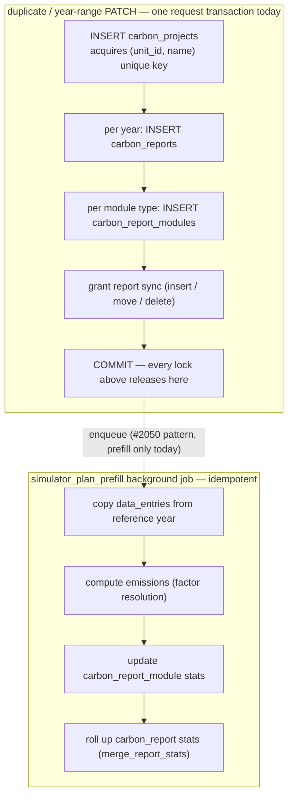

# 2445 — Auto-named plan create loses the unique-index race

## Symptom

GlitchTip [CO2-CALCULATOR-DEV-9F](https://enac-it-glitchtip.epfl.ch/co2-calculator-dev/issues/320)
(stage, 2026-08-27): clicking **Démarrer un projet** produced a
`POST /project-plans/unit/456/` that blocked ~17 s and returned **409**
`"A plan with this name already exists for this unit"` — for a request that
never supplied a name.

## Incident reconstruction (traces + stage pod logs, 2026-08-27/28)

Traces `…97e12d`, `…4a918f`, `…666d1a` plus the backend access logs give the
complete request-level story — all one user on unit 456:

| Time (UTC)  | What                                                                        | Outcome              |
| ----------- | --------------------------------------------------------------------------- | -------------------- |
| 14:16:37    | Create → plan 2209 (`new-project-2`), instant                               | 201                  |
| 14:16:44    | User deletes 2209 — the name is free again                                  | 204                  |
| 14:18:42    | Create #0 → recomputes `new-project-2` (id 2211), INSERT **blocks on X**    | 201 after **82.2 s** |
| 14:19:23    | Create #1 — same name, blocks on #0's uncommitted name key (id 2212 burned) | 409 after **41.4 s** |
| 14:19:47    | Create #2 (the GlitchTip click) — same, id 2213 burned                      | 409 after **17.2 s** |
| 14:20:04.2  | **X rolls back** → #0's INSERT proceeds, commits 14:20:04.4                 | —                    |
| 14:20:04.49 | #1 and #2 fail together: `UniqueViolation` on `(456, new-project-2)`        | —                    |
| 14:20:13    | Create #3 → `new-project-3` (id 2214), 2 ms                                 | **201**              |

**X — the transaction that held `(456, new-project-2)` uncommitted from
≤14:18:42 to 14:20:04 — is not any completed application request.** Verified
absent: the duplicate endpoint (zero calls all day), unit_sync/pipeline jobs
(worker and all backend pods idle of job logs), deploys/migrations (CI runs
checked), and every completed request in all three pods' access logs. X ended
in **rollback**, not commit (a commit would have 409'd #0 too), which is why
it left no row. The remaining shapes: an abandoned uncommitted transaction —
a cancelled HTTP request whose session leaked its transaction, or a human
pgadmin/psql session (three testers were active) — released by manual
rollback, pool recycle, or idle-in-transaction timeout. The Postgres server
log's lock-wait line at ~14:18:43 (if `log_lock_waits` is on) names X's PID,
application_name, client IP and query; that identification is open, and does
not gate the fix.

The 2 ms 201 on the last click is the fix performed manually: re-read names
after the conflict resolves, recompute, insert. The bounded retry works
against every X-shape — app race, leaked transaction, or human session.

## Root cause

Default naming is read-then-insert. `SimulatorPlanService.create_plan(name=None)`
reads the unit's committed plan names and picks the next free `new-project[-N]`;
the partial unique index `uq_carbon_projects_unit_plan_name`
(`(unit_id, name)` where `carbon_report_type = 'Simulator_Plan'`) is what
actually enforces uniqueness. A concurrent transaction holding an uncommitted
row with the same name is invisible to that read but locks the index key:
Postgres blocks the INSERT until the other transaction commits, then raises
`unique_violation`, which `_flush_guarded` maps to `ValueError` → 409.

Any holder of the key triggers it — another auto-named create (the observed
incident: create #0, blocked on X, held the key for the two later creates),
a duplicate of a default-named plan (`duplicate_plan`'s `<name>-N` suffixing
has the identical read-then-insert race), or a non-app transaction.

## Manual reproduction

Two minutes, on stage or local, simulating X with a SQL console:

1. Session A (psql/pgadmin), with a plan named `new-project` existing on the
   unit: `BEGIN; INSERT INTO carbon_projects (unit_id, carbon_report_type,
name, created_by, created_at) VALUES (<unit>, 'Simulator_Plan',
'new-project-2', <user>, now());` — leave the transaction open.
2. App, same unit's home: click **Démarrer un projet** → the button spins
   (blocked INSERT, invisible to the user).
3. Second tab: click again → also spins.
4. Session A: `ROLLBACK;` → tab 1 gets 201 (`new-project-2`), tab 2 gets the
   409 — the incident, exactly. (`COMMIT;` instead: both tabs 409.)

After the fix, step 4 yields 201 + 201 (the loser retries as `new-project-3`).

## Fix

In `SimulatorPlanService` (`backend/app/services/simulator_plan_service.py`),
when the name was **auto-generated** — create with `name=None`, and duplicate's
suffixing — an `IntegrityError` on flush means the computed name lost the race.
Rollback, re-read the names (the winner is now committed and visible),
recompute the next free name, retry the insert, bounded at 3 attempts. One
shared helper covers both call sites.

Behavior kept as-is:

- An explicitly user-chosen colliding name still returns 409 — there the
  conflict is real and actionable.
- No frontend change: with the backend retrying, `onStartProject` succeeds and
  the existing error path stays for genuine failures.

## Test

Regression test in `backend/tests/unit`: first flush raises `IntegrityError`,
retry recomputes from the refreshed name list and succeeds (the SQLite test
schema intentionally omits the partial indexes, so the race is simulated at the
repo boundary). A second test asserts the explicit-name collision still raises.

## Deliverables

- [ ] Shared auto-name retry in `SimulatorPlanService.create_plan` / `duplicate_plan`
- [ ] Regression tests (race retry + explicit-name 409 kept)
- [ ] Flip this plan to `delivered`

## The write cascade, and where the lock lives

Duplicating a plan (and PATCHing its year range) runs the whole downward
cascade inside one request transaction. Every lock acquired along the way —
including the `(unit_id, name)` unique-index key from the very first INSERT —
is held until the final COMMIT, so the 409 window is exactly as long as the
slowest thing in the box:

The upward rollup (entry → emission → module stats → report stats) is the
same chain a user edit walks; #2050 already moved the bulk version of it out
of the request. The downward fan-out (project → reports → modules) was left
in-request. (In this incident the actual key holder turned out to be an
abandoned non-app transaction, not the duplicate cascade — but the cascade
remains the largest in-app lock window of this shape; tracked in #2449.)

## Follow-up (out of scope here)

Tracked separately: split the duplicate/year-sync cascade the same way #2050
split prefill — commit the cheap metadata write in the route, hand the
fan-out to an idempotent job. That shrinks the name-key hold from
tens of seconds to milliseconds; the bounded retry here covers the residue.
