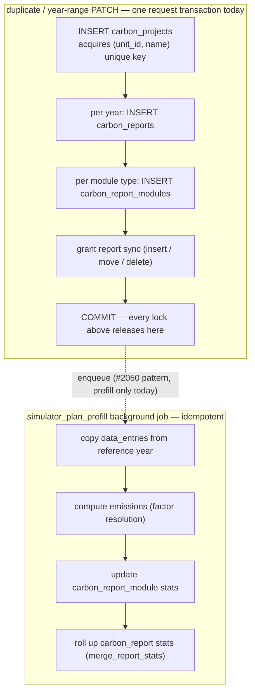

# 2445 — Auto-named plan create loses the unique-index race

## Symptom

GlitchTip [CO2-CALCULATOR-DEV-9F](https://enac-it-glitchtip.epfl.ch/co2-calculator-dev/issues/320)
(stage, 2026-08-27): clicking **Démarrer un projet** produced a
`POST /project-plans/unit/456/` that blocked and returned **409**
`"A plan with this name already exists for this unit"` — for a request that
never supplied a name.

Prior occurrence 2026-08-05: `PATCH /project-plans/2264` → 409 (event
`019fd13d…`). **Not yet classified**: the PATCH route maps at least three
distinct `ValueError`s to 409 (name collision, `start_year <= end_year`
validation, "year sections or grant" constraint), so that event may or may
not be the same bug. Follow-up: stop overloading 409 — validation errors
(`start_year`, sections/grant) should be 422, keeping 409 for real conflicts.

## Incident reconstruction (traces + stage pod logs, 2026-08-27/28)

Traces `…97e12d`, `…4a918f`, `…666d1a` plus the backend access logs give the
complete request-level story — all one user on unit 456:

| Time (UTC)  | What                                                                        | Outcome              |
| ----------- | --------------------------------------------------------------------------- | -------------------- |
| 14:16:37    | Create → plan 2209 (`new-project-2`), instant                               | 201                  |
| 14:16:44    | User deletes 2209 — the name is free again                                  | 204                  |
| 14:18:42    | Create #0 → recomputes `new-project-2` (id 2211), INSERT **blocks on X**    | 201 after **82.2 s** |
| 14:19:23    | Create #1 — same name, blocks on #0's uncommitted name key (id 2212 burned) | 409 after **41.4 s** |
| 14:19:47    | Create #2 (the GlitchTip click) — same, id 2213 burned                      | 409 after **17.2 s** |
| 14:20:04.2  | **X rolls back** → #0's INSERT proceeds, commits 14:20:04.4                 | —                    |
| 14:20:04.49 | #1 and #2 fail together: `UniqueViolation` on `(456, new-project-2)`        | —                    |
| 14:20:13    | Create #3 → `new-project-3` (id 2214), 2 ms                                 | **201**              |

**X — the transaction that held `(456, new-project-2)` uncommitted from
≤14:18:42 to 14:20:04 — is not any completed application request.** Verified
absent: the duplicate endpoint (zero calls all day), unit_sync/pipeline jobs
(worker and all backend pods idle of job logs), deploys/migrations (CI runs
checked), and every completed request in all three pods' access logs. X ended
in **rollback**, not commit (a commit would have 409'd #0 too), which is why
it left no row. The remaining shapes: an abandoned uncommitted transaction —
a cancelled HTTP request whose session leaked its transaction, or a human
pgadmin/psql session (three testers were active) — released by manual
rollback, pool recycle, or idle-in-transaction timeout. The Postgres server
log's lock-wait line at ~14:18:43 (if `log_lock_waits` is on) names X's PID,
application_name, client IP and query; that identification is open, and does
not gate the fix.

**Two load-bearing facts for any redesign:**

1. `POST /project-plans/unit/{unit_id}/` (create) is already a single INSERT
   plus two reads, committing in milliseconds. It runs **no cascade**. The
   82 s was lock _wait_ on X, not work. The report/module cascade runs on
   the year-range PATCH and on duplicate — not on create.
2. The incident is reproducible by any uncommitted holder of the name key,
   including non-app transactions. No amount of splitting _our_ transactions
   prevents it; only (a) not requiring the name to be unique, or (b)
   retrying when the conflict resolves, does.

## Root cause

Default naming is read-then-insert. `SimulatorPlanService.create_plan(name=None)`
reads the unit's committed plan names and picks the next free `new-project[-N]`;
the partial unique index `uq_carbon_projects_unit_plan_name`
(`(unit_id, name)` where `carbon_report_type = 'Simulator_Plan'`) is what
actually enforces uniqueness. A concurrent transaction holding an uncommitted
row with the same name is invisible to that read but locks the index key:
Postgres blocks the INSERT until the other transaction commits, then raises
`unique_violation`, which `_flush_guarded` maps to `ValueError` → 409.

Any holder of the key triggers it — another auto-named create (the observed
incident: create #0, blocked on X, held the key for the two later creates),
a duplicate of a default-named plan (`duplicate_plan`'s `<name>-N` suffixing
has the identical read-then-insert race), or a non-app transaction.

Note: the index's stated justification — "the name is a URL identifier"
(comment in `carbon_project.py`) — is **stale**: all planner routes use the
numeric `:planId(\d+)`; nothing routes by name.

## Decision — three tiers

### Tier 1 · ships in this PR: bounded retry

In `SimulatorPlanService`, when the name was **auto-generated** (create with
`name=None`, duplicate's suffixing), an `IntegrityError` on flush means the
computed name lost the race: rollback, re-read names (the winner is now
visible), recompute, retry the insert — bounded at 3 attempts, one shared
helper for both call sites. An explicitly user-chosen colliding name keeps
its 409. No schema change, no product change, ~15 lines; works against every
X-shape including non-app transactions (proven by create #3's 2 ms success).

Explicitly accepted: if Tier 2 lands, this retry and the whole sequential
allocator are **deleted** (no backward-compat paths). Small, reversible churn
in exchange for closing a live user-facing bug now.

### Tier 2 · proposal for maintainer sign-off (ADR): drop name uniqueness

Names are display metadata; the ID is identity (verified: routing uses
`planId` only). Dropping `uq_carbon_projects_unit_plan_name` deletes the
allocator, the name query, the name-409s (create _and_ rename), the retry,
and the whole race class — strictly less code than any fix that keeps the
index. Prior art for the audit before removal: lookups by `(unit_id, name)`,
`IntegrityError` handling tied to the index, frontend duplicate-name
validation, docs describing the 409.

This is a product decision (duplicate names become visible in the plan
table) and a schema migration, so per the guardrails it waits for an ADR and
maintainer review rather than shipping while the lead is away. Two product
questions to settle there: (a) is "rename to an existing name → 409" a
feature or a bug (the 2026-08-05 event may be evidence either way, once
classified); (b) what the default name looks like without an allocator — a
constant `new-project` (the table already shows date + creator), or a
date-stamped suffix. A random suffix (`new-project-a8F3k91`) is rejected:
once uniqueness is dropped it has no correctness role, and as UX it is
strictly worse than a number or a date.

### Tier 3 · stays in #2449: shorter transactions, on the existing job system

The proposal to split PATCH/duplicate's report+module fan-out out of the
request transaction is right and already tracked in #2449 — implemented as
**jobs in the existing `DataIngestionJob` runner** (the #2050 pattern:
route commits the cheap metadata write, an idempotent job does the fan-out,
the UI polls the existing job-status endpoint).

Rejected from the proposed redesign, with reasons:

- **A new per-plan phase state machine** (`CREATING/READY/FAILED` +
  persisted `initialization_phase`, per-phase auto-retry): duplicates the
  job system the repo already runs (states, retries, heartbeats, stuck-job
  recovery via `/sync/jobs/{id}/recover`, hardened by plans 1215/1219/1559/
  1723). Mirror, don't invent.
- **A reset/restart mechanism for partially initialized plans**: nothing
  references a half-initialized plan; delete-and-recreate _is_ the reset,
  and plan IDs are not a resource worth preserving. YAGNI.
- **Phase-splitting the create endpoint**: create is already one
  millisecond-scale transaction; there is nothing to split. The six-phase
  model applies at most to PATCH/duplicate, where phases 5–6 (prefill,
  stats) are _already_ jobs since #2050, and a new empty plan's stats/
  prefill phases are no-ops.
- **The premise "the first INSERT then performs the complete cascade in the
  same transaction"** is factually wrong for create (see reconstruction),
  and the incident's 82 s was wait, not work. A design justified by that
  premise fixes latency nobody measured while leaving the actual trigger
  (any foreign uncommitted holder) unaddressed.

Kept as design notes for #2449: per-phase tracing/metrics on the fan-out
job, idempotency requirements (already the pipeline rule), and the
observation that each job commit releases its locks before the next starts.

## The write cascade, and where the lock lives

Duplicating a plan (and PATCHing its year range) runs the whole downward
cascade inside one request transaction. Every lock acquired along the way —
including the `(unit_id, name)` unique-index key from the very first INSERT —
is held until the final COMMIT, so the 409 window is exactly as long as the
slowest thing in the box:

The upward rollup (entry → emission → module stats → report stats) is the
same chain a user edit walks; #2050 already moved the bulk version of it out
of the request. The downward fan-out (project → reports → modules) was left
in-request. (In this incident the actual key holder turned out to be an
abandoned non-app transaction, not the duplicate cascade — but the cascade
remains the largest in-app lock window of this shape; tracked in #2449.)

## Manual reproduction

Two minutes, on stage or local, simulating X with a SQL console:

1. Session A (psql/pgadmin), with a plan named `new-project` existing on the
   unit: `BEGIN; INSERT INTO carbon_projects (unit_id, carbon_report_type,
name, created_by, created_at) VALUES (<unit>, 'Simulator_Plan',
'new-project-2', <user>, now());` — leave the transaction open.
2. App, same unit's home: click **Démarrer un projet** → the button spins
   (blocked INSERT, invisible to the user).
3. Second tab: click again → also spins.
4. Session A: `ROLLBACK;` → tab 1 gets 201 (`new-project-2`), tab 2 gets the
   409 — the incident, exactly. (`COMMIT;` instead: both tabs 409.)

After the Tier-1 fix, step 4 yields 201 + 201 (the loser retries as
`new-project-3`). After Tier 2, steps 2–3 don't block at all.

## Test

Regression test in `backend/tests/unit`: first flush raises `IntegrityError`,
retry recomputes from the refreshed name list and succeeds (the SQLite test
schema intentionally omits the partial indexes, so the race is simulated at
the repo boundary). A second test asserts the explicit-name collision still
raises. The manual repro above is the end-to-end validation.

## Deliverables

- [ ] Tier 1: shared auto-name retry in `create_plan` / `duplicate_plan`
- [ ] Tier 1: regression tests (race retry + explicit-name 409 kept)
- [ ] Classify the 2026-08-05 PATCH 409 (which `ValueError`?)
- [ ] Small follow-up issue: 422 for PATCH validation errors, 409 for
      conflicts only
- [ ] Tier 2: ADR proposal "plan names are not unique" for maintainer review
- [ ] Flip this plan to `delivered` when Tier 1 ships

## Follow-up (out of scope here)

Tracked in #2449: split the duplicate/year-sync cascade the same way #2050
split prefill — commit the cheap metadata write in the route, hand the
fan-out to an idempotent job on the existing runner. Side findings from the
investigation, each worth a small issue: stage audit-sync to Elasticsearch
fails on every write (TLS cert), and the worker pod's OTel exporter cannot
reach the collector (missing traces).
