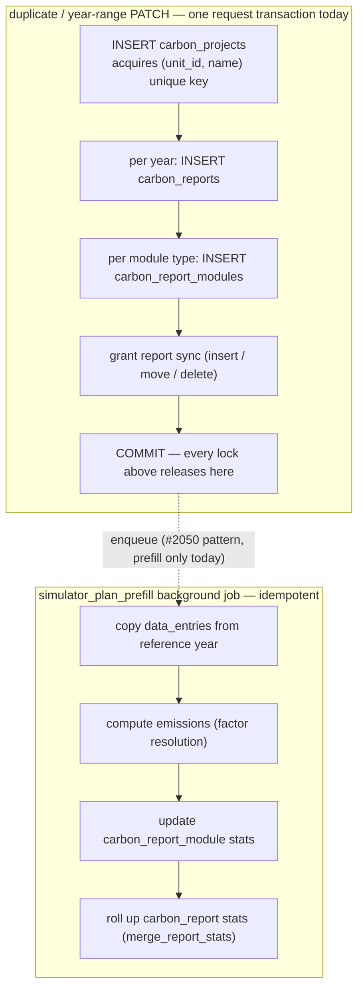

# 2445 — Auto-named plan create loses the unique-index race

## Symptom

GlitchTip [CO2-CALCULATOR-DEV-9F](https://enac-it-glitchtip.epfl.ch/co2-calculator-dev/issues/320)
(stage, 2026-08-27): clicking **Démarrer un projet** produced a
`POST /project-plans/unit/456/` that blocked ~17 s and returned **409**
`"A plan with this name already exists for this unit"` — for a request that
never supplied a name.

## Trace evidence

Backend traces `…4a918f` and `42e3e42ca6ad35ad02db9f3ce3666d1a` (the GlitchTip
event's trace) pin the full timeline, all one user on unit 456:

| Time (UTC)  | What                                                                    | Outcome              |
| ----------- | ----------------------------------------------------------------------- | -------------------- |
| 14:19:23.06 | 1st create — computes `new-project-2`, INSERT blocks                    | 409 after **41.4 s** |
| 14:19:47.26 | 2nd create (the GlitchTip click) — same name, INSERT blocks             | 409 after **17.2 s** |
| 14:20:04.49 | Both INSERTs fail together: `UniqueViolation` on `(456, new-project-2)` | —                    |
| 14:20:13.38 | 3rd create — recomputes from now-committed names, INSERT takes 2 ms     | **201**              |

Both losers failed at the same instant — the moment the **winner** committed: a
third transaction, absent from both traces, that inserted `new-project-2` and
held it uncommitted for **≥41 s**. `duplicate_plan` is the only other code path
inserting `Simulator_Plan` rows, and its shape (flush project row, then build
all per-year reports before the route commits) is exactly such a window.

The 2 ms 201 on the third click is the fix, performed manually: once the loser
re-reads names after the winner's commit, the recomputed name succeeds
immediately.

## Root cause

Default naming is read-then-insert. `SimulatorPlanService.create_plan(name=None)`
reads the unit's committed plan names and picks the next free `new-project[-N]`;
the partial unique index `uq_carbon_projects_unit_plan_name`
(`(unit_id, name)` where `carbon_report_type = 'Simulator_Plan'`) is what
actually enforces uniqueness. A concurrent transaction holding an uncommitted
row with the same name is invisible to that read but locks the index key:
Postgres blocks the INSERT until the other transaction commits, then raises
`unique_violation`, which `_flush_guarded` maps to `ValueError` → 409.

A duplicate of a default-named plan inserts `new-project-2`; a concurrent
no-name create computes the same name, blocks on it, and dies when the
duplicate commits. `duplicate_plan`'s own `<name>-N` suffixing has the
identical race.

## Fix

In `SimulatorPlanService` (`backend/app/services/simulator_plan_service.py`),
when the name was **auto-generated** — create with `name=None`, and duplicate's
suffixing — an `IntegrityError` on flush means the computed name lost the race.
Rollback, re-read the names (the winner is now committed and visible),
recompute the next free name, retry the insert, bounded at 3 attempts. One
shared helper covers both call sites.

Behavior kept as-is:

- An explicitly user-chosen colliding name still returns 409 — there the
  conflict is real and actionable.
- No frontend change: with the backend retrying, `onStartProject` succeeds and
  the existing error path stays for genuine failures.

## Test

Regression test in `backend/tests/unit`: first flush raises `IntegrityError`,
retry recomputes from the refreshed name list and succeeds (the SQLite test
schema intentionally omits the partial indexes, so the race is simulated at the
repo boundary). A second test asserts the explicit-name collision still raises.

## Deliverables

- [ ] Shared auto-name retry in `SimulatorPlanService.create_plan` / `duplicate_plan`
- [ ] Regression tests (race retry + explicit-name 409 kept)
- [ ] Flip this plan to `delivered`

## The write cascade, and where the lock lives

Duplicating a plan (and PATCHing its year range) runs the whole downward
cascade inside one request transaction. Every lock acquired along the way —
including the `(unit_id, name)` unique-index key from the very first INSERT —
is held until the final COMMIT, so the 409 window is exactly as long as the
slowest thing in the box:

The upward rollup (entry → emission → module stats → report stats) is the
same chain a user edit walks; #2050 already moved the bulk version of it out
of the request. The downward fan-out (project → reports → modules) was left
in-request, which is what held the name key for ≥41 s in this incident.

## Follow-up (out of scope here)

Tracked separately: split the duplicate/year-sync cascade the same way #2050
split prefill — commit the cheap metadata write in the route, hand the
fan-out to an idempotent job. That shrinks the name-key hold from
tens of seconds to milliseconds; the bounded retry here covers the residue.
