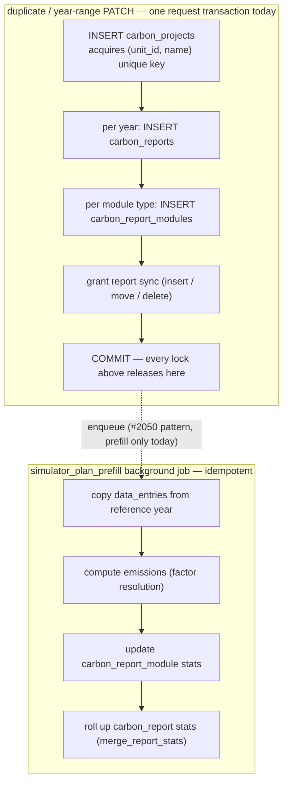

# 2445 — Auto-named plan create loses the unique-index race

## Symptom

GlitchTip [CO2-CALCULATOR-DEV-9F](https://enac-it-glitchtip.epfl.ch/co2-calculator-dev/issues/320)
(stage, 2026-08-27): clicking **Démarrer un projet** produced a
`POST /project-plans/unit/456/` that blocked and returned **409**
`"A plan with this name already exists for this unit"` — for a request that
never supplied a name.

Prior occurrence 2026-08-05: `PATCH /project-plans/2264` → 409 (event
`019fd13d…`). **Not yet classified**: the PATCH route maps at least three
distinct `ValueError`s to 409 (name collision, `start_year <= end_year`
validation, "year sections or grant" constraint), so that event may or may
not be the same bug. Follow-up: stop overloading 409 — validation errors
(`start_year`, sections/grant) should be 422, keeping 409 for real conflicts.

## Incident reconstruction (traces + stage pod logs, 2026-08-27/28)

Traces `…97e12d`, `…4a918f`, `…666d1a` plus the backend access logs give the
complete request-level story — all one user on unit 456:

| Time (UTC)  | What                                                                        | Outcome              |
| ----------- | --------------------------------------------------------------------------- | -------------------- |
| 14:16:37    | Create → plan 2209 (`new-project-2`), instant                               | 201                  |
| 14:16:44    | User deletes 2209 — the name is free again                                  | 204                  |
| 14:18:42    | Create #0 → recomputes `new-project-2` (id 2211), INSERT **blocks on X**    | 201 after **82.2 s** |
| 14:19:23    | Create #1 — same name, blocks on #0's uncommitted name key (id 2212 burned) | 409 after **41.4 s** |
| 14:19:47    | Create #2 (the GlitchTip click) — same, id 2213 burned                      | 409 after **17.2 s** |
| 14:20:04.2  | **X rolls back** → #0's INSERT proceeds, commits 14:20:04.4                 | —                    |
| 14:20:04.49 | #1 and #2 fail together: `UniqueViolation` on `(456, new-project-2)`        | —                    |
| 14:20:13    | Create #3 → `new-project-3` (id 2214), 2 ms                                 | **201**              |

**X — the transaction that held `(456, new-project-2)` uncommitted from
≤14:18:42 to 14:20:04 — is not any completed application request.** Verified
absent: the duplicate endpoint (zero calls all day), unit_sync/pipeline jobs
(worker and all backend pods idle of job logs), deploys/migrations (CI runs
checked), and every completed request in all three pods' access logs. X ended
in **rollback**, not commit (a commit would have 409'd #0 too), which is why
it left no row. The remaining shapes: an abandoned uncommitted transaction —
a cancelled HTTP request whose session leaked its transaction, or a human
pgadmin/psql session (three testers were active) — released by manual
rollback, pool recycle, or idle-in-transaction timeout. The Postgres server
log's lock-wait line at ~14:18:43 (if `log_lock_waits` is on) names X's PID,
application_name, client IP and query; that identification is open, and does
not gate the fix.

**Two load-bearing facts for any redesign:**

1. `POST /project-plans/unit/{unit_id}/` (create) is already a single INSERT
   plus two reads, committing in milliseconds. It runs **no cascade**. The
   82 s was lock _wait_ on X, not work. The report/module cascade runs on
   the year-range PATCH and on duplicate — not on create.
2. The incident is reproducible by any uncommitted holder of the name key,
   including non-app transactions. No amount of splitting _our_ transactions
   prevents it; only (a) not requiring the name to be unique, or (b)
   retrying when the conflict resolves, does.

## Root cause

Default naming is read-then-insert. `SimulatorPlanService.create_plan(name=None)`
reads the unit's committed plan names and picks the next free `new-project[-N]`;
the partial unique index `uq_carbon_projects_unit_plan_name`
(`(unit_id, name)` where `carbon_report_type = 'Simulator_Plan'`) is what
actually enforces uniqueness. A concurrent transaction holding an uncommitted
row with the same name is invisible to that read but locks the index key:
Postgres blocks the INSERT until the other transaction commits, then raises
`unique_violation`, which `_flush_guarded` maps to `ValueError` → 409.

Any holder of the key triggers it — another auto-named create (the observed
incident: create #0, blocked on X, held the key for the two later creates),
a duplicate of a default-named plan (`duplicate_plan`'s `<name>-N` suffixing
has the identical read-then-insert race), or a non-app transaction.

Note: the index's stated justification — "the name is a URL identifier"
(comment in `carbon_project.py`) — is **stale**: all planner routes use the
numeric `:planId(\d+)`; nothing routes by name.

## Decision (maintainer, 2026-08-28)

**Plan names are not unique. The plan id is the identity** (verified:
routing uses `:planId(\d+)` only — the index's "name is a URL identifier"
comment was stale). Shipped in this PR:

- Drop `uq_carbon_projects_unit_plan_name` (migration `6e32aa42f6f4`).
- Auto-generated names get a short recognizable suffix instead of the
  sequential allocator: `new-project-<3 chars a-z0-9>` (e.g.
  `new-project-k4f`), likewise duplicates: `<source-name>-<3 chars>`.
  46k combinations makes a duplicate _suggestion_ vanishingly rare at the
  tens-of-plans-per-unit scale — with **zero read of existing names**, which
  was the read-then-insert race. Duplicate names are valid, just never our
  first proposition.
- Deleted: the sequential allocator, `list_plan_names`, the explicit-name
  and rename collision 409s, `_flush_guarded`. Explicit names (create and
  rename) are stored as-is.
- The earlier bounded-retry idea is dead — with no unique index there is
  nothing to retry.

Maintainer's operational constraint driving the rest: request latency

> 10 s trips alerting; the budget is **< 1 s** for every request. That
> promotes #2449 (below) from hygiene to operational work.

### Stays in #2449: shorter transactions, on the existing job system

Split the remaining heavy in-request cascades into **jobs on the existing
`DataIngestionJob` runner** (the #2050 pattern: route commits the cheap
metadata write, an idempotent job does the rest, UI polls job status). No
new per-plan phase state machine, no reset mechanism — the job system
already has states, retries, heartbeats and stuck-job recovery
(`/sync/jobs/{id}/recover`, hardened by plans 1215/1219/1559/1723).

## Endpoint inventory (audit 2026-08-28) — against the < 1 s budget

Scale anchors (plan #2050 measurements): ~21k `data_entries` per unit-year,
~25 emissions per entry → a prefilled 10-year plan ≈ 200k entries /
0.4–1M emission rows. One report = 1 `carbon_reports` + 8
`carbon_report_modules` rows, but ~18 statements (a `session.refresh` per
module — an easy win on its own).

| Route                               | In-request writes                                                                                                             | Verdict                                                            |
| ----------------------------------- | ----------------------------------------------------------------------------------------------------------------------------- | ------------------------------------------------------------------ |
| plan create                         | 1 row                                                                                                                         | **OK** (after index drop, can no longer block)                     |
| plan PATCH grow range               | ~99 rows / ~198 stmts (11 reports × 9)                                                                                        | borderline → #2449 job (or drop per-module refreshes first)        |
| plan PATCH shrink range / grant off | **DELETE cascade of removed years: up to ~170k entries + 0.35–0.8M emissions, in-request**                                    | **violates budget** → #2449 job                                    |
| plan PATCH reference-year           | 1 row (+ prefill already a job)                                                                                               | **OK**                                                             |
| plan duplicate                      | ~100 rows / ~200 stmts                                                                                                        | borderline → #2449 job                                             |
| plan DELETE                         | **~200k entries + 0.4–1M emissions + 88 modules + 11 reports, one transaction**                                               | **worst offender** → #2449 job (mark deleted, purge in background) |
| explorer create                     | ~10 rows                                                                                                                      | OK scale; **unguarded race, see below**                            |
| explorer TTL refresh                | `BackgroundTasks` (not a job): full report entry-cascade delete + recreate, no retry/lock/idempotency                         | shaky → #2449 job                                                  |
| grant budget PATCHes                | 1 row                                                                                                                         | **OK**                                                             |
| grant reference-percentage PATCH    | per-entry loop: ~3k entry UPDATEs + ~3k emission DELETE/INSERT round-trips, no `FactorResolver` cache, stats recomputed twice | **violates budget** → #2449 job + batch resolver                   |
| module item POST/PATCH/DELETE       | 5 tables, bounded (1–25 emission rows)                                                                                        | OK                                                                 |
| login (`upsert_user`)               | `unit_users` DELETE-all + per-unit re-INSERT **on every login**                                                               | flag — separate issue                                              |
| year-config CSV upload              | 2 rows but the parsed CSV stored 3× (config + audit snapshot + diff)                                                          | flag — separate issue                                              |

**New race found (same family as this one, worse outcome):** explorer and
calculator get-or-create are unguarded read-then-insert against their
partial unique indexes (`uq_carbon_projects_unit_explore_creator`,
`uq_carbon_projects_unit_type_calculator`, plus
`uq_carbon_reports_project_year` on double-POST). No `IntegrityError`
handling anywhere on that path and no global handler → surfaces as **500**,
and the frontend _produces_ the race (GET → 404 → POST in `workspace.ts`).
Those indexes are semantic and stay — the fix is a guard (catch
`IntegrityError` → re-fetch the winner), as a separate small issue.

## The write cascade, and where the lock lives

Duplicating a plan (and PATCHing its year range) runs the whole downward
cascade inside one request transaction. Every lock acquired along the way —
including the `(unit_id, name)` unique-index key from the very first INSERT —
is held until the final COMMIT, so the 409 window is exactly as long as the
slowest thing in the box:

The upward rollup (entry → emission → module stats → report stats) is the
same chain a user edit walks; #2050 already moved the bulk version of it out
of the request. The downward fan-out (project → reports → modules) was left
in-request. (In this incident the actual key holder turned out to be an
abandoned non-app transaction, not the duplicate cascade — but the cascade
remains the largest in-app lock window of this shape; tracked in #2449.)

## Manual reproduction

Two minutes, on stage or local, simulating X with a SQL console:

1. Session A (psql/pgadmin), with a plan named `new-project` existing on the
   unit: `BEGIN; INSERT INTO carbon_projects (unit_id, carbon_report_type,
name, created_by, created_at) VALUES (<unit>, 'Simulator_Plan',
'new-project-2', <user>, now());` — leave the transaction open.
2. App, same unit's home: click **Démarrer un projet** → the button spins
   (blocked INSERT, invisible to the user).
3. Second tab: click again → also spins.
4. Session A: `ROLLBACK;` → tab 1 gets 201 (`new-project-2`), tab 2 gets the
   409 — the incident, exactly. (`COMMIT;` instead: both tabs 409.)

After this PR, steps 2–3 don't block at all: creates never read or index
names, so no other transaction — app or human — can make them wait or 409.

## Test

`backend/tests/unit/services/test_simulator_plan_service.py`:
auto-generated and duplicated names match `<base>-[a-z0-9]{3}`; the
regression tests invert the old collision tests — two plans with the same
explicit name coexist, and renaming to an existing name succeeds (no
uniqueness read, so creation can never 409 or block on another
transaction's uncommitted name). The manual repro above is the end-to-end
validation.

## Deliverables

- [x] Drop `uq_carbon_projects_unit_plan_name` (migration `6e32aa42f6f4`)
- [x] Random-suffix naming; delete allocator, `list_plan_names`,
      collision 409s, `_flush_guarded`
- [x] Regression tests (suffix shape, duplicate names allowed, rename
      allowed)
- [ ] Classify the 2026-08-05 PATCH 409 (which `ValueError`?)
- [ ] Small follow-up issue: 422 for PATCH validation errors, 409 for
      conflicts only
- [ ] Small follow-up issue: guard explorer/calculator get-or-create
      against `IntegrityError` (currently a 500 race)
- [ ] Flip this plan to `delivered` on merge

## Follow-up (out of scope here)

Tracked in #2449: split the duplicate/year-sync cascade the same way #2050
split prefill — commit the cheap metadata write in the route, hand the
fan-out to an idempotent job on the existing runner. Side findings from the
investigation, each worth a small issue: stage audit-sync to Elasticsearch
fails on every write (TLS cert), and the worker pod's OTel exporter cannot
reach the collector (missing traces).
