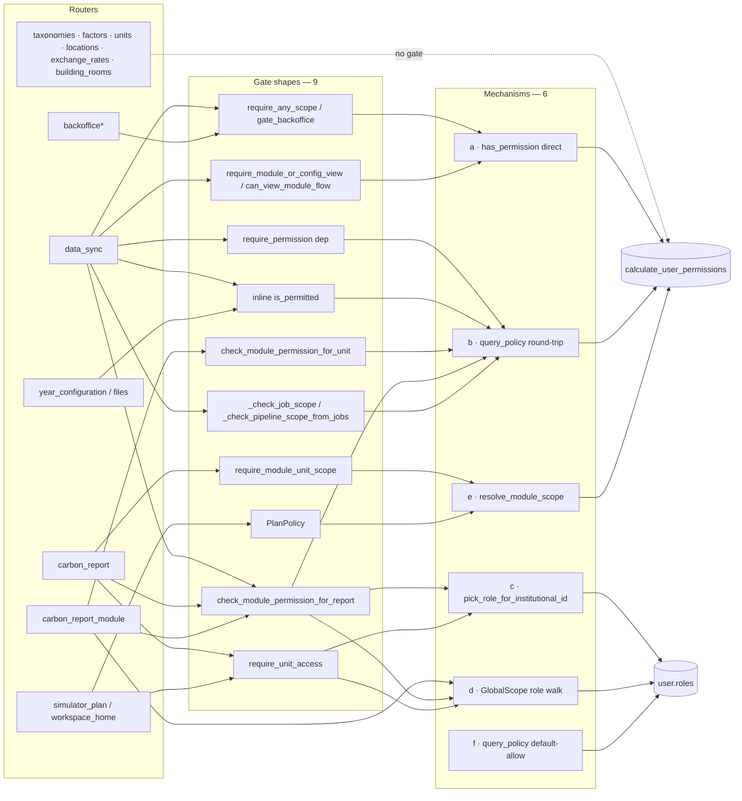

# 403 on `/sync/jobs/{id}/stream` for principals on their own `MODULE_UNIT_SPECIFIC` uploads

## Scope of this plan vs. the earlier #2654 fix

[`2654-csv-sync-connection-lost-toast.md`](./2654-csv-sync-connection-lost-toast.md)
(delivered 2026-09-03) fixed a different bug under the same issue: SSE
streams pinning a pooled connection. Shipped, not implicated here. The issue
title was later changed to the 403 problem; this plan covers that. The PR
closing #2654 should say which of the two it fixes.

Anna's "Explorateur import fails outright" comment is a third thing —
separate triage.

## Confirmed on dev (2026-09-16, principal test login, process-emissions CSV)

Two requests fire on upload from `ModuleTable.vue`:

- `GET /api/v1/sync/pipelines/5d46952b-…/stream` → **200**; streams
  `csv_ingest` (job 412) → `emission_recalc` (413) → `aggregation` (414)
  → `stream_closed`. Opened by `composables/usePipelineStream.ts:219`.
- `GET /api/v1/sync/jobs/412/stream` → **403**, body exactly
  `{"detail":"Permission denied"}`. Opened by
  `ModuleTable.vue:740` → `stores/backofficeDataManagement.ts:489`
  `subscribeToJobUpdates`.

The 403 body is `job_stream_by_id`'s #1764 fallback (`data_sync.py:1318-1326`):
`_institutional_id_for_job(job 412)` returned `None`, so the endpoint demanded
`backoffice.configuration:view`, which a principal never holds. The pipeline
stream passing proves Layer 1 (`can_view_module_flow`) is fine — this is
Layer 2 failing to resolve a unit for a job that plainly has one.

## Root cause

`_institutional_id_for_job` (`data_sync.py:221`) reads
`DataIngestionJob.entity_id` (FK → `carbon_report_modules.id`, nullable,
`models/data_ingestion.py:157`). **Nothing writes that column.** Verified:

- `base_provider.py::create_job` (`:188`) is the only `create_job` in
  `app/services/data_ingestion/` (no subclass overrides). Its
  `DataIngestionJob(...)` constructor (`:230-242`) omits `entity_id`.
- Every other `entity_id=` in `app/` is an `AuditDocument` parameter on a
  different model (`auth.py`, `connectors.py`, `data_entry_service.py`,
  `year_configuration.py`, and `base_provider.py:261` — the audit row's
  subject id, not the job FK).
- The column and its reader were added in the same commit (`206d9f487`,
  "fix(310): … tenant scope"). The writer was never added.

`entity_type` is decided by whether `config["carbon_report_module_id"]` is
set (`data_sync.py:842-846`) — so a principal's module-page upload and a
backoffice unit-targeted dispatch both produce `MODULE_UNIT_SPECIFIC` rows
with `entity_id = NULL`. The unit _is_ known at creation time; it sits in
`meta.config.carbon_report_module_id` (which `_pinned_module_id` and
`_crm_id_from_meta` already read). Two consequences:

1. **The shared per-job gate has been dead since May.** `_check_job_scope`
   (`:272-281`) returns early when the resolver yields `None` — for every
   job. `get_pipeline_jobs`, `abort_pipeline`, `cancel_job`, `recover_job`,
   `list_pipelines`, both streams: none has ever enforced unit ownership.
   Any `modules.*.sync` holder can read/abort/recover any unit's pipeline.
2. **The #1764 fallback fires on the wrong population.** It was written for
   genuinely unscoped jobs (`MODULE_PER_YEAR`, whose raw `meta` shouldn't
   leak). With the resolver always `None`, it fires on _every_ job, i.e.
   also on a principal's own upload — the reported 403. `pipeline_stream_by_id`
   has no such fallback (by design — it never ships `meta`), hence 200.

`_check_pipeline_scope_from_jobs` (`:290`) additionally anchors on the
latest `aggregation` job, which is created `MODULE_PER_YEAR` with no
`config` (`chain_job` default, `_chain.py:205`; call site
`emission_recalculation_tasks.py:638`). Even with `entity_id` populated, a
unit-scoped pipeline loses its scope the moment it fans out. Same class of
bug: scope derived at read time from whichever row happens to be picked.

## Why the regression matrix didn't catch it

Every test on this path mocks the seam that broke:

- **No test calls the real `create_job()` with a `carbon_report_module_id`
  and asserts `entity_id`.** `grep create_job backend/tests` → only
  `test_base_provider.py` (file-move helpers) and an audit-snapshot test.
- `test_sync_pipeline_stream_endpoint_pg.py:388-431`
  `test_cross_tenant_pipeline_returns_403` — its docstring: _"We seed a
  `MODULE_PER_YEAR` job for convenience and monkeypatch
  `_institutional_id_for_job` to return a fake institutional_id — that
  simulates the `MODULE_UNIT_SPECIFIC` code path without having to seed the
  full Unit/CarbonReport/CRM tree."_ It patches out the exact function whose
  real return value is the bug.
- `test_unit_gating_e2e.py:436-440`
  `test_job_stream_accepts_scoped_principal_without_backoffice` — requests
  `/jobs/1/stream`; job 1 does not exist in that DB. `job_stream_by_id`
  only gates inside `if existing is not None:`, so the check is skipped and
  the stream opens on a "Job not found" event. Passes vacuously. The line
  above the assert: `# TODO: need to test scoped principal to be sure`.
- `test_data_sync_job_stream_scope.py` (#1764's regression test)
  hard-codes `MODULE_PER_YEAR, entity_id=None` and, per its docstring,
  defers `MODULE_UNIT_SPECIFIC` to `test_unit_gating_e2e.py` — which
  (above) doesn't have it either. Each file assumed the other did.
- `docs/src/backend/10-INTEGRATION-TESTING.md` §"Two-Layer Permission Scope
  Model" _documents_ the monkeypatch as the recommended Layer-2 test
  pattern ("mock `_institutional_id_for_job` to return a unit ID, then mock
  `check_module_permission` to raise"). The gap is institutionalised.

Pattern: the suite proves "given a resolved unit, the gate decides
correctly" and never "a real job resolves a unit". The mock sits on the
join between data and decision; a bug in the data side is invisible by
construction. Same shape as the #1764 plan's claim that `ModuleTable.vue`
was "already correctly gated today" — asserted from reading the gate, not
from running the data through it.

## Authorization path inventory (backend, 2026-09-16)

Six distinct mechanisms answer "may user U do action A on unit Y":

| #   | Mechanism                                                                                                              | Where                                                                                                                               |
| --- | ---------------------------------------------------------------------------------------------------------------------- | ----------------------------------------------------------------------------------------------------------------------------------- |
| a   | `has_permission(perms, path, action, institutional_id=)` direct                                                        | `gate_backoffice`, `can_view_module_flow`, inline `files.py:347`, inline `data_sync.py:1318`                                        |
| b   | `query_policy("authz/permission/check")` → rebuild `Role`s from dict → `calculate_user_permissions` → `has_permission` | `is_permitted`, `require_permission`, `check_module_permission*`, `get_module_permission_decision`                                  |
| c   | `pick_role_for_institutional_id(user.roles, iid)` role walk                                                            | `require_unit_access` (carbon_report ×11, unit_results ×3, workspace_home, unit_service), `has_global_or_principal_access_for_unit` |
| d   | `any(isinstance(r.on, GlobalScope))` role walk                                                                         | `policy.py:525,551`, `carbon_report_module.py:659`, `_evaluate_data_filter_policy`                                                  |
| e   | `resolve_module_scope` breadth (`global/unit/own`)                                                                     | `require_module_unit_scope`, `PlanPolicy`                                                                                           |
| f   | `query_policy` **default-allow** for unknown policy names (`policy.py:333-340`)                                        | `unit_service.py:65` `query_policy("unit:query", …)`                                                                                |

(a) and (b) reach the same `has_permission`; (b) adds a dict round-trip,
an unused fnmatch glob (every `is_permitted` caller passes the literal
`backoffice.configuration`), and cannot thread `institutional_id` except
via `get_module_permission_decision`. (c)/(d) bypass the permission dict
entirely and re-derive scope from roles — a second source of truth for the
same question.



Dead or misleading, found on the way:

- No callers: `check_permission`, `is_module_permitted`,
  `_check_pipeline_scope`, `check_resource_access`, `get_data_filters`.
- `_evaluate_resource_access_policy` denies everything; the doc
  (`06-PERMISSION-SYSTEM.md`) still presents it and `get_data_filters` as
  layers 2/3 of the model.
- `get_current_user_detached` does not exist (the 2654-connection plan says
  it does; `get_current_user` itself was made detached).
- `files.py:347` is a hand copy of `can_view_module_flow` with `edit`.
- Bare `Depends(get_current_user)` with no authz: taxonomies (3),
  factors (1), units (2), locations (2), exchange_rates (1),
  building_rooms (1), year_configuration GETs (3). Reference data, mostly
  fine — but it's a list nobody has reviewed as a list.
- `User.has_role` / `has_role_global`: defined, zero callers.

## Options

Ordered from smallest diff to real unification. They compose; the
recommendation is at the end.

### O1 — Fix the seam (this issue's PR)

1. `base_provider.py::create_job`: add
   `entity_id=job_config.get("carbon_report_module_id")` to the
   `DataIngestionJob(...)` constructor. The value is already in `config`
   at every `MODULE_UNIT_SPECIFIC` call site.
2. `_check_job_scope`: short-circuit on
   `is_permitted(user, "backoffice.configuration", action)` at the top —
   the same bypass `/dispatch` already has (`data_sync.py:763`). One key
   suffices: `backoffice.pipeline_operations` is superadmin-only
   (`user.py:316`) and superadmin always holds `configuration` (`:313`), so
   every route-level `pipeline_operations` caller also passes this. Without
   it, step 1 breaks the ops-console Recover button on unit-scoped jobs
   (`recover_job:2197` runs the scope check before the #2700 409).
3. `_check_pipeline_scope_from_jobs`: anchor on `jobs[0]` (root, lowest id —
   the only job whose scope `/dispatch` actually checked), not the latest
   `aggregation`.
4. `job_stream_by_id`: keep the #1764 fallback unchanged — with a working
   resolver it fires only on genuinely unscoped jobs, which is what it was
   written for. Add the same up-front 404 the pipeline stream has, so a
   missing job can no longer skip the gate (this is what let the vacuous
   e2e test pass).
5. Delete `_check_pipeline_scope` (no callers).

Tests, same PR:

- `create_job(config={"carbon_report_module_id": 123}, entity_type=MODULE_UNIT_SPECIFIC)`
  → row `entity_id == 123`. Would have failed every day since May.
- Replace the monkeypatch in `test_cross_tenant_pipeline_returns_403` with
  a seeded `Unit → CarbonReport → CarbonReportModule → job(entity_id)` tree
  (one fixture, reused below).
- `test_job_stream_accepts_scoped_principal_without_backoffice`: seed the
  job, assert 200 for same-unit principal, **403 for other-unit
  principal**, 200 for superadmin. Drop the TODO.
- Same three callers × `/pipelines/{id}/stream`, before and after fan-out
  (the after case is what step 3 protects).
- Remove the "mock `_institutional_id_for_job`" recipe from
  `10-INTEGRATION-TESTING.md`; replace with the seeded-tree fixture.

### O2 — Make the invariant structural

DB `CHECK (entity_type <> 'MODULE_UNIT_SPECIFIC' OR entity_id IS NOT NULL)`
on `data_ingestion_jobs`, `NOT VALID` as in `c1f2a3b4d5e6`: binds every
new write, no table scan, historical NULL rows left alone (finished jobs
nobody streams or recovers — decided 2026-09-17, no backfill). A nullable
FK nobody writes is the class of bug; the constraint makes it an insert-time
failure instead of a four-month silence. Small; pairs with O1.

### O3 — Delete the round-trip (mechanism b, f)

`is_permitted` / `require_permission` / `check_module_permission` /
`get_module_permission_decision` call `has_permission(user.calculate_permissions(), …)`
directly. Delete `query_policy`, `_evaluate_permission_policy`,
`_evaluate_resource_access_policy`, `get_permission_decision`,
`_build_permission_input`, `check_permission`, `is_module_permitted`,
`check_resource_access`, `get_data_filters`, the fnmatch glob. The
default-allow fallback disappears with `query_policy`; `unit_service.py:65`
gets an explicit gate (or none — it's `list_user_units`, already filtered
by membership). `user_service.py:356,428` keep their own role walk (that's
membership sync, not authz). Net: hundreds of lines gone, one fewer
mechanism, one latent default-allow closed, no behaviour change for any
route that passes today. Update `06-PERMISSION-SYSTEM.md` to stop
describing the three-layer OPA model.

### O4 — One resolver per resource, one gate (mechanisms c, d, e → a)

The actual unification. One decision function:

```python
def authorize_unit(
    user, *, action: str, institutional_id: str | None,
    module: str | None = None, min_breadth: Literal["own","unit"] = "own",
) -> None:  # raises 403
```

Backoffice bypass first (bare `backoffice.configuration`), then
`resolve_module_scope` on `modules.<module>/<iid>` (or, for module-less
unit access, any `*/<iid>[/own]` key — that is what `require_unit_access`'s
role walk means in permission terms), then breadth check. Every current
gate becomes _resolver → authorize_unit_:

| Today                                                               | Resolver keeps              | Gate becomes                            |
| ------------------------------------------------------------------- | --------------------------- | --------------------------------------- |
| `check_module_permission_for_unit`                                  | `db.get(Unit)`              | `authorize_unit(module=, iid=unit.iid)` |
| `check_module_permission_for_report`                                | report → project/unit rules | `authorize_unit(...)`                   |
| `_check_job_scope`                                                  | `_institutional_id_for_job` | `authorize_unit(module=, iid=)`         |
| `require_unit_access`                                               | —                           | `authorize_unit(module=None, iid=)`     |
| `has_global_or_principal_access_for_unit`                           | —                           | `authorize_unit(min_breadth="unit")`    |
| `require_module_unit_scope`                                         | —                           | `authorize_unit(min_breadth="unit")`    |
| `carbon_report_module.py:642-676` (three mechanisms in one handler) | —                           | one call                                |

Role walks (c, d) go away; `pick_role_for_institutional_id` survives only
in role-sync. `PlanPolicy` keeps its plan-specific rules but calls
`authorize_unit` for the unit half. Touches carbon_report ×11,
unit_results ×3, carbon_report_module ×13 — needs the maintainer, its own
issue, ships after O3.

### O5 — One permission matrix test, generated from the route table

Today authz tests are per-endpoint, per-PR, each with its own fixture and
its own mocking. Replace with one parametrised module:
`(persona × route × expected)` where persona ∈ {std-same-unit,
principal-same-unit, principal-other-unit, metier, superadmin, anonymous}
and route is every unit-scoped endpoint with a real seeded resource
(the O1 fixture). Runs over `TestClient`, patches only
`fire_and_forget`. Rule enforced by a conftest autouse fixture: any test
that `monkeypatch`es `_institutional_id_for_job`, `check_module_permission`,
`is_permitted`, or `has_permission` fails — resolvers and deciders are
never mocked, data is seeded. A new route is added to the table or CI
fails (a test that diffs `app.routes` against the table's coverage list,
with the bare-`get_current_user` reference routes on an explicit
allowlist). This is what turns "we didn't think to test that persona on
that route" into a compile error.

## Order and score

Score = (mechanisms removed + bug classes closed) − risk, each on a 0–3
scale, so a change that removes a lot for little risk ranks highest.
Effort is a size hint, not part of the score.

| Order | Option                         | Removes   | Closes                                                                            | Risk                                                                                                             | Score                                 | Effort             | Decision (2026-09-17)        |
| ----- | ------------------------------ | --------- | --------------------------------------------------------------------------------- | ---------------------------------------------------------------------------------------------------------------- | ------------------------------------- | ------------------ | ---------------------------- |
| 1     | O1 fix the seam                | —         | the dead gate, the wrong-population 403, the fan-out scope loss, the vacuous test | 1 (touches 4 endpoints, all behind existing gates)                                                               | **+2**                                | S                  | **this PR**, target `dev`    |
| 2     | O2 structural invariant        | —         | the "nullable FK nobody writes" class, for this table                             | 1 (migration with backfill; rows lacking a crm id in `meta` fail the migration loudly — pre-check SQL in the PR) | **+2**                                | S                  | **this PR**                  |
| 3     | O3 delete the round-trip       | b, f      | the default-allow fallback                                                        | 0 (same `has_permission` underneath; no route changes behaviour)                                                 | **+3**                                | M (deletion-heavy) | next, plan file only         |
| 4     | O4 one resolver, one gate      | c, d, e→a | "which of nine gates do I call" on every new route                                | 2 (carbon_report ×11, unit_results ×3, carbon_report_module ×13; membership semantics re-expressed in keys)      | **+1** now, **+3** once O3 has landed | L                  | own issue, maintainer review |
| 5     | O5 generated permission matrix | —         | "we didn't test that persona on that route", permanently                          | 1 (CI-only; the route-coverage diff will flag the bare-`get_current_user` list on day one)                       | **+2** alone, **+3** after O4         | M                  | same PR as O4                |

O3 before O4 because O4 is written against `has_permission` directly; doing
O4 first would mean rewriting each gate twice. O5 is cheap only once every
gate is `resolver → authorize_unit`, so it rides with O4.

Branch: `dev` (decided 2026-09-17), draft PR first.

## Safari red SSE rows

Client-side cancellation, not a backend error — posted on #2654
(https://github.com/EPFL-ENAC/co2-calculator/issues/2654#issuecomment-5701411421).
